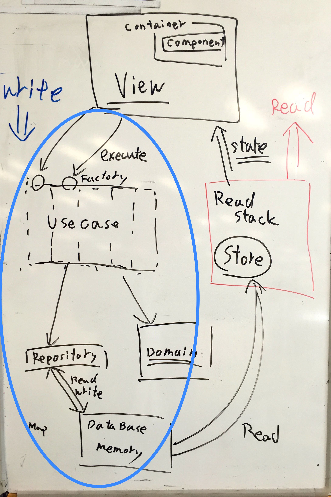
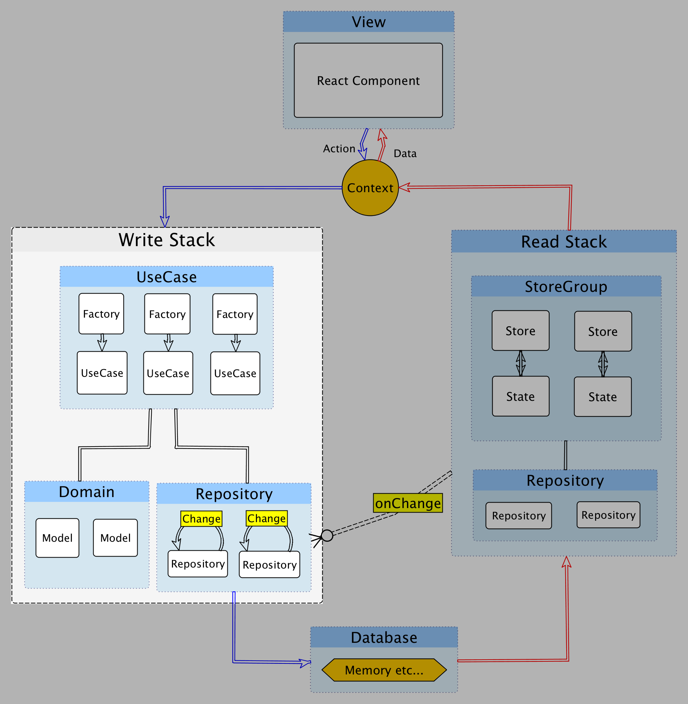
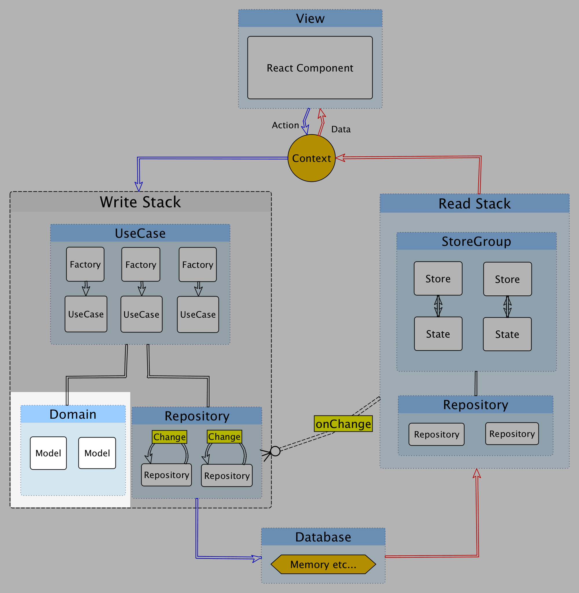

autoscale: true

# Almin.js | JavaScriptアーキテクチャ

-----

# 自己紹介


- Name : **azu**
- Twitter : @[azu_re](https://twitter.com/azu_re)
- Website: [Web scratch], [JSer.info]

[Web scratch]: http://efcl.info/ "Web scratch"
[JSer.info]: http://jser.info/ "JSer.info"

-----

# 中規模以上のJavaScript

- 設計が必要になる
- 正しい設計はない [Bikeshed.js](http://connpass.com/event/29019/ "Bikeshed.js") :bike:
	- 人、目的、何を作るかによってアーキテクチャは異なる
- 前回の続き?
	- [How to work as a Team](http://azu.github.io/slide/2016/reject-sushi/how-to-work-team.html "How to work as a Team")
	- [Read/Write Stack | JavaScriptアーキテクチャ](http://azu.github.io/slide/2016/bikeshedjs/javascript-read-write-stack.html "Read/Write Stack | JavaScriptアーキテクチャ")


-----


# 用語


------


-----

# 設計の目的

- 中規模以上のウェブアプリ
	- SPAというよりは、画面が複雑なElectronアプリのようなイメージ
- スケーラブル
	- 人、機能追加、柔軟性、独立性
- 見た目が複雑ではないアーキテクチャ
	- 書き方が特殊ではなく見て分かるもの

-----

# 設計の目的

- テストが自然に書ける
	- パーツごとに無理なく依存を切り離せる
- 新しい機能を追加するときにどこに何があるかが分かる
- ドメインモデルを持てるようにする
	- わかりやすいモデルがありビジネスロジックを持つ


-----

# 設計の目的

- Fluxにおける「ドメインロジックをどこに実装するか」へのパス
	- Flux特にReduxはCQRS+ES(イベントソーシング)に近い
	- 全てがイベントである。ロジックをどこに書けばいいのかをちゃんと導いてくれない気がする
	- Reducerを書いていると型が欲しくなる(不安になる)
- MV*からCQRS+ESへ一気にスキップしてしまった気がするので、ドメインモデルについてもう一度考えられるようにしたい


----

## Greg Young 

> The last problem Young mentions is the lack of Process managers. 
> -- [Event Sourced Systems is an Anti-Pattern](http://www.infoq.com/news/2016/04/event-sourcing-anti-pattern "Event Sourced Systems is an Anti-Pattern")

^The single biggest bad thing that Young has seen during the last ten years is the common anti-pattern of building a whole system based on Event sourcing. 
^ 優れたProcess Managerが必要。Akkaで作ったらしい

-----

# 要求にもとづいてアーキテクチャを作成する

> 要求にもとづいて作業をしていないアーキテクトは、  
> 実際上「大仕掛なハッキング」をしているだけです。
> -- [オブジェクト開発の神髄](http://bpstore.nikkeibp.co.jp/item/books/P82370.html)


-----

# [Almin.js](https://github.com/almin/almin "almin/almin")


-----

# 実装例

- [almin/example at master · almin/almin](https://github.com/almin/almin/tree/master/example)
- [azu/presentation-annotator: viewing presentation and annotate.](https://github.com/azu/presentation-annotator)

-----

# このスライドの目的

- [Almin.js](https://github.com/almin/almin "Almin.js")を作るまでに考えた設計の概念的な話
	- 理想的な形をクライアントサイドで動く現実の形に落とす話
	- サーバサイドのアーキテクチャをそのままクライアントサイドに持ってくる際に直面する問題
- コードの解説ではないです


-----


# 考えるポイント

- クライアントサイドで問題点となるのはオブジェクトの永続化
	- シングルトンがでてくる問題
- Write StackとRead Stackを隔離する
	- データの流れがシンプルになる
- 結果統合性のみでは解決しない物がクライアントサイドにある
	- CQRS + Event Sourcing

----

# 全体像(Simple版)




----

# 全体像(Simple版)


## 画像は概念イメージで、データや処理の流れを表すものではありません
### あえて表現するなら説明の流れにすぎません

-----


## 登場人物

- View(React Component)
- Write Stack
	- UseCase
	- Domain
	- Repository :arrow_left: 同一かも
- Read Stack
	- Store
	- Repository :arrow_right: 同一かも


----

# View

-----

## View


- Reactを使う 以上
- React ComponentとCSSの設計も色々ある
	- コンポーネントなCSS
	- SUIT CSS
	- コンポーネントの分類と命名規則
	- 長いので省略


-----

# Write Stack 

-----
# Write Stack



-----


# UseCase

-----

## UseCase


- ViewからUseCaseを発行(ActionCreatorと類似) [^図]
- ドメインをの振るまいの流れを記述する
- トランザクションスクリプト的にもできる(アプリケーション層)
- UseCaseと対になるFactoryを持ってる
	- Factoryはテストのため(コンストラクタによる依存解決)
	- Decoratorがあると、DIできるのでFactoryはいらない

[^図]: 概念にすぎず、データや処理の流れを表すものではありません


-----

## トランザクションスクリプトとドメインモデル


via [ドメイン層に最適なアーキテクチャを考える](http://www.itmedia.co.jp/im/articles/0702/21/news110_4.html "保守性・拡張性に優れたシステムを作る（8）：ドメイン層に最適なアーキテクチャを考える (4/4) - ITmedia エンタープライズ") 元はPoEAA

-----

> トランザクションスクリプトで始めた場合は、ドメインモデルの方向へためらわずにリファクタリングしてほしい   (中略)
> これらの3つのパターンは相互に排他的な選択肢ではない。実際にドメインロジックの一部にトランザクションスクリプトを使用し、それ以外にテーブルモジュールまたはドメインモデルを使用することは珍しくない。[^PoEAA, p33]

-----

## UseCaseの例

- Repositoryから`TodoList` Entityのインスタンスを取り出す
- `TodoList`に`TodoItem`を追加する。(TodoListの中身が変更される)
- Repositoryに`TodoList`を保存する

もしくは

- UseCaseからイベントをDispatchする(後述)

-----

```js
import {UseCase} from "almin";
import todoListRepository from "../infra/TodoRepository"
export class AddTodoItemFactory {
    static create() { // 依存解決してUseCaseを作るだけ
        return new AddTodoItemUseCase({ todoListRepository });
    }
}
export class AddTodoItemUseCase extends UseCase {
    constructor({todoListRepository}) {
        super();
        this.todoListRepository = todoListRepository;
    }
    execute(title) {
        const todoList = this.todoListRepository.lastUsed();
        todoList.addItem(title);
        this.todoListRepository.save(todoList);
    }
}
```

----

# Domain Model

----

## Domain Model



- 作ろうとしてるものを表現するオブジェクト[^図]
- モデルクラス
- ここでは、データと**振る舞い**を持ったクラス
- できるだけPOJO(Plain Old JavaScript)である
- [いまさらきけない「ドメインモデル」と「トランザクションスクリプト」](http://d.hatena.ne.jp/higayasuo/20080519/1211183826 "いまさらきけない「ドメインモデル」と「トランザクションスクリプト」")

[^図]: 概念にすぎず、データや処理の流れを表すものではありません


----

## モデルとは…


via [.NETのエンタープライズアプリケーションアーキテクチャ](http://ec.nikkeibp.co.jp/item/books/P98480.html ".NETのエンタープライズアプリケーションアーキテクチャ　第2版")

----

## :memo: 言葉を定義するのも設計

-----

# Repository

-----

# Repository


- ドメインモデルのインタンスを永続化するレイヤー [^図]
	- Repositoryパターン
- シングルトン！！！
- `find(id)`/`save(model)`/`delete(model)` などAPIからはコレクションっぽい
	- JavaScriptの場合はメモリ(ただのMap)として保持(localStorageとかでもいい)

[^図]: 概念にすぎず、データや処理の流れを表すものではありません


-----

# Repositoryの永続化問題


- クライアントサイドJavaScriptでは永続化が難しい
- どこでインスタンス化するの?問題
	- それへの現実解としてシングルトンが出てくる
- 依存関係逆転の原則(DIP)
- UseCaseのコンストラクタに引数(依存)としてrepositoryを渡す
	- Factoryはそのための存在


-----

# 依存関係逆転の原則(DIP)


[Scalaで学ぶヘキサゴナルアーキテクチャ実践入門 // Speaker Deck](https://speakerdeck.com/kimutyam/scaladexue-buhekisagonaruakitekutiyashi-jian-ru-men "Scalaで学ぶヘキサゴナルアーキテクチャ実践入門 // Speaker Deck")

-----

```js
import {UseCase} from "almin";
// シングルトン
import todoListRepository from "../infra/TodoRepository"
export class AddTodoItemFactory {
    static create() { 
	    // シングルトンをコンストラクタの引数へ
        return new AddTodoItemUseCase({ todoListRepository });
    }
}
// テストする際は直接`UseCase`クラスを使う
export class AddTodoItemUseCase extends UseCase {
    constructor({todoListRepository}) {
        super();
        this.todoListRepository = todoListRepository;
    }
    execute() {
		this.todoListRepository.find(...)
    }
}
```

-----

# 依存関係逆転の原則(DIP)

- 反則っぽく見える
- ドメインがリポジトリに依存しなくて良い
- ドメインがちゃんと永続化できる
	- シングルトンのリポジトリは常に存在するから
- テスト時はUseCaseのコンストラクタにDIすることでテストもできる


-----

## Implementation Note :memo:


- Domain layerにドメインの名前を使ったRepositoryの抽象I/F
- Infraにその抽象の実装を書くパターン
- JavaScriptに抽象がないので、DomainにRepositoryを作るのは手間だけに見える

-----


# :memo: 設計の進め方

- 理想のAPIを擬似コードで書くのはあくまで参考にすぎない
- クライアントサイドでは永続化の問題が付きまとう
	- サーバならどっかにプロセス立てて、プロセス同士で通信みたいなことができる
- 実際にデータの流れと状態の持ち方を**コードとして**書いてみて、設計することが重要

-----

> 処理の流れではなく、
> データの流れを定義 
> -- http://www.slideshare.net/MasashiSakurai/javascript-js-53219222

-----

# DataBase

-----

# DataBase


- ただの`Map`オブジェクト [^図]
- Repositoryをできるだけシンプルに保つため、データベースもシンプルに
	- `key` : `value` だと簡単で良い
- `localStorage`とかに入れても良い
- 変更されたら変更したことを通知する(実際はrepositoryが投げてる)
	- `emit("Changed")`

[^図]: データベースは一つとは限らないしやっぱり概念

-----

# Read Stack

-----

# Read Stack?

-----


-----

# Write(Command)とRead(Query)

- CQRS (Command Query Responsibility Segregation)
- ざっくり: WriteとReadを層として分けて責務を分離する
- 一方通行のデータフロー
- FluxとかReduxでやっていることと同じ

-----


-----

# Read Stack


- Readはデータベースが読み込んでView用のデータを作って渡すだけ[^図]
- 読み取り専用(保存したデータの変更はしない)ので色々簡略化できる
- 縦に別れたので、テスト依存関係が簡略化できる！

[^図]: やっぱりただの概念で、依存のフローという話ではない

----

## Read Stack


- Repository
	- Write Stackと同じものを参照するでも良い
- Read Model
	- Writeのドメインから振るまいを消したモデルを作ってもよい
	- ドメインモデル貧血症にわざとしても良い = Viewのためのモデルなので
- Store
	- FluxのStoreと同じだけど、Read Stackでは一番重要


[^図]: ご自由に考えて

----

# Store


- StoreはStateを持つオブジェクト[^図]
- StateをUIに渡してUIはそれを使って更新する(Context経由)
- StoreはStateが更新された事をUIに伝える(Context経由)

[^図]: Storeは入れ物、Stateは中身という考え方

----

# クライアントサイドで多発する問題:warning:

-----
# クライアントサイドで多発する問題

- 現在のアーキテクチャでは、永続化したデータしか使えない
- クライアントサイドではStateを直に更新して、UIにすぐ反映されて欲しいことがある
	- ローディング、モーダル、アニメーション
	- 「ほんのいっとき」が許されないケースはクライアントサイドにはある
	- コンポーネントに閉じ込めるというのあり
- そのため縦(Read/Writeの層)じゃなくて、横のルールも必要

----


via [.NETのエンタープライズアプリケーションアーキテクチャ　第2版](http://ec.nikkeibp.co.jp/item/books/P98480.html ".NETのエンタープライズアプリケーションアーキテクチャ　第2版") p299


-----

# UseCase -> Store


- UseCaseからdispatchしたイベントが、Storeに届く横のルート
	- 抜け穴感があるので慎重に取り扱いたい
- FluxやReduxはこのルートが基本的な流れ
	- 図の上半分がよく見る流れ

-----

# Storeの構造化 :construction:

- Storeをまとめる`StoreGroup`という概念を追加した
	- 一つのアプリはStoreはたくさん存在する
	- Storeが同期的に一斉にemitChangeすると、何回もUIが更新されてしまう
	- StoreGroupは同時に発生したemitChangeを一つにまとめる
		- Promiseや`requestAnimationFrame`などで間引く
		- イベントを間引く役 = UI層に近い


-----

## Storeの構造化

- Storeはstateを持っている 
	- `getState(): State` を返す
- Stateが更新されるパターンは2つある
	- UseCase -> Store への直接(Fluxルート)
	- Repositoryが更新 -> Storeが検知(永続化ルート)


-----

# そもそも構造化ってなに?

-----

# :memo: 構造化の考え方

-----

# ものごとを構造化するための方法はたくさんある
## [^今日からはじめる情報設計, p131]


[^今日からはじめる情報設計, p131]: [今日からはじめる情報設計](http://www.bnn.co.jp/dl/mess/ "今日からはじめる情報設計")

----

# 分類法(タクソノミー)

- 分類法(タクソノミー) は構造化の手法
- 分類法を組み合わせて形状を作る
	- UIに反映する形となったもの。 e.g.) ページ、Repositoryとか
- 曖昧な分類と正確な分類はそれぞれメリット、デメリットがある
	- 曖昧さは明確性を犠牲にし、正確性は柔軟性を犠牲にする
- ファセット = 主キーで分類する

-----

## 分類の結果


- 分類法は
	- 並列的構造
	- 階層的構造
- どちらかになる [^p143]

[^p143]: [今日からはじめる情報設計](http://www.bnn.co.jp/dl/mess/ "今日からはじめる情報設計")


-----

## Storeの構造化

- 並列的構造
	- ReduxのReducerパターンなど
- 階層的構造
	- ドメインモデルの構造をそのままStateとして返すパターンなど

-----

## Storeの構造化

- どちらのパターンでもStateが更新されなかったら、前回のStateの参照をそのまま使い回す
- Viewの最適化したデータを返すためのStoreとStateなので妥協しては行けないのはここだけ
	- Reactの[shouldComponentUpdate](https://facebook.github.io/react/docs/component-specs.html "shouldComponentUpdate")でShalloEqual比較して再描画も省略できる
	- e.g.) [azu.github.io/svg-feeling/](http://azu.github.io/svg-feeling/)


-----

## コンポーネント設計の心得


> shouldComponentUpdate を信じて細分化すること
> -- http://s.aho.mu/160405-node_school/#45


-----

## 実装したもの

- [Almin.js](https://github.com/almin/almin "Almin.js")
	- このスライドで書いた内容大体そのまま実装
	- [Counter Example](https://github.com/almin/almin/tree/master/docs/counter "Counter Example")
	- [TodoMVC](https://github.com/almin/almin/tree/master/example/todomvc "TodoMVC")


-----

# まとめ

- Fluxと呼ばれてるものが、CQRSとどのような点で同じで異なるのかを示した
- イベントソーシングは抜いてCQRSについて考えAlminを実装した
- ドメイン/ビジネスロジックをちゃんと考えて実装できるような状況を作った

-----

# まとめ

- クライアントサイド/フロントエンドとサーバサイド/バックエンドでは、必ずしもベストなアーキテクチャが一致する訳ではない
- イベント駆動が根付いてるJavaScriptにおいて、CQRS+ESは一つの到達点かもしれないが次は考えないといけない
- 次を考えられるような状態をつくるために、色々設計して考えないと行けない

-----

# まとめ

- JavaScriptにおいてCQRS + ESを管理するには優れたProcess Managerが不十分
	- DOMという副作用の塊との戦い方も色々必要
- それがRedux-Sagaのようなfork + Generatorなのか、RxJSのようなStreamなのかはまだわからない

## Write Code Thinking :)


-----


## 参考書籍

- [今日からはじめる情報設計](http://www.bnn.co.jp/dl/mess/ "今日からはじめる情報設計")
- [オブジェクト開発の神髄](http://bpstore.nikkeibp.co.jp/item/books/P82370.html "オブジェクト開発の神髄")
- [.NETのエンタープライズアプリケーションアーキテクチャ　第2版](http://ec.nikkeibp.co.jp/item/books/P98480.html ".NETのエンタープライズアプリケーションアーキテクチャ　第2版")

----

## 参考

- CQRS + ES
	- [CQRS+ESをAkka Persistenceを使って実装してみる。](http://www.slideshare.net/MatsushitaSatoshi/cqrsesakka-persistence)
	- [最新DDDアーキテクチャとAkkaでの実装ヒントについて // Speaker Deck](https://speakerdeck.com/j5ik2o/zui-xin-dddakitekutiyatoakkadefalseshi-zhuang-hintonituite)
- DDD クリーンアーキテクチャ
	- [DDD + Clean Architecture + UCDOM Essence版 // Speaker Deck](https://speakerdeck.com/yoskhdia/ddd-plus-clean-architecture-plus-ucdom-essenceban)
	- [Scalaで学ぶヘキサゴナルアーキテクチャ実践入門 // Speaker Deck](https://speakerdeck.com/kimutyam/scaladexue-buhekisagonaruakitekutiyashi-jian-ru-men)
- [レイヤー設計とか、オブジェクト指向とか、DDDとか、その辺 - まっつんの日記](http://mattun.hatenablog.com/entry/2014/07/19/135320)

----
## 参考 

- [[ Android ] – これからの「設計」の話をしよう – NET BIZ DIV. TECH BLOG](https://tech.recruit-mp.co.jp/mobile/android-architecture/)
- [CQRSの小さな演習(1) 現実の問題 - 考える場所](http://blog.fukuchiharuki.me/entry/2016/02/20/173233)

----

## 参考 MVVM

- [MVVMパターンとは？](http://www.slideboom.com/presentations/381148)
- [塹壕よりLivetとMVVM](http://www.slideshare.net/Posaune/livetmvvm)
- [MVVMのModelにまつわる誤解 - the sea of fertility](http://ugaya40.hateblo.jp/entry/model-mistake)
- [MVVMパターンの常識 ― 「M」「V」「VM」の役割とは？ － ＠IT](http://www.atmarkit.co.jp/fdotnet/chushin/greatblogentry_02/greatblogentry_02_01.html)
- [開発者が知っておくべき、6つのUIアーキテクチャ・パターン － ＠IT](http://www.atmarkit.co.jp/fdotnet/chushin/greatblogentry_10/greatblogentry_10_01.html)


----

# FAQ

## CQRとCQRSの違い

- CQRSはCQRの発展形
- CQRはRead/Writeの層に分けただけ
- CQRSは一貫性を結果整合性であることを許容してる
- CQRSはRead/WriteでDBを持っていい or ReadはView向けの非正規化したデータを扱っていい という理解
- [最新DDDアーキテクチャとAkkaでの実装ヒントについて // Speaker Deck](https://speakerdeck.com/j5ik2o/zui-xin-dddakitekutiyatoakkadefalseshi-zhuang-hintonituite "最新DDDアーキテクチャとAkkaでの実装ヒントについて // Speaker Deck")