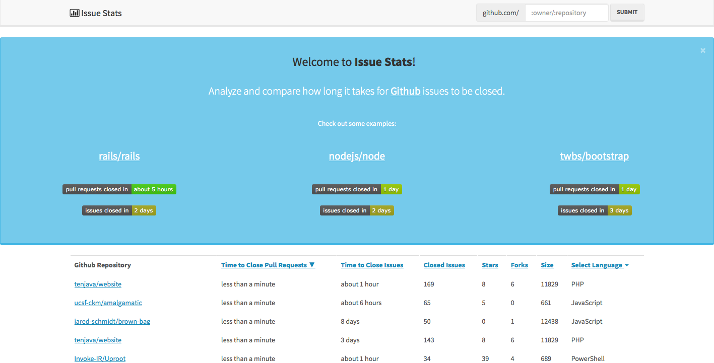

# JavaScript情報ってなんだっけ?


-----

# 情報とは

> 『知る』ということの実体化。われわれが、あるものについて『知る』ということは、何かしらを得たこと、何かを頭の中に取り込んだことである。その『何かしら』を、われわれは情報と呼ぶのである
> -- [高橋秀俊](https://ja.wikipedia.org/wiki/%E9%AB%98%E6%A9%8B%E7%A7%80%E4%BF%8A "高橋秀俊")

^ よく情報科学とか見かけるよう情報の定義について。
データと情報は違うものです。
データは記号などの集合で、それを人間が解釈したものが情報であるという話です。

----

# 何で情報が欲しいの?

- 新しい技術が面白そうだから
- 開発で楽をしたいから
- 話題だから
- **選択肢を持ちたいから**(今日はココ中心)

-----


# アウトライン

- JavaScriptの情報って何さ
- 入門、ライブラリ、ツール、フレームワーク
- JavaScriptの範囲も広くなってきた
- 情報が錯綜してきた
	- 古いもの、新しすぎるもの、類似するものが色々
- そうした中でまとめようとする動き
	- Weeklyとか

-----

# JavaScript情報の変化


-----

# 2011年 - [世界のJavaScript情報を読もう](http://www.slideshare.net/efcl/javascript-6580879 "世界のJavaScript情報を読もう")

  - 古いものと最近のものが混ざって見つけにくい

-----

# 2012年 - [世界のJavaScriptを読もう @ 2012](https://azu.github.io/slide/offline_study/javascript_world.html#slide1 "世界のJavaScriptを読もう @ 2012")

- 古いものと最近のものがまざってる
- 最近のものを整理するWeekly、ニュースサイトが増えた

----

## [Meta Weekly](http://azu.github.io/Meta-Weekly/ "Meta Weekly")


-----

# 2014年 - [世界のJavaScriptを読もう @ 2014](https://azu.github.io/slide/jser200/javascript-2014.html "世界のJavaScriptを読もう @ 2014")

- 急速にライブラリの数が増えてきた
- ユーザーがライブラリの選択で悩むようになってきた
	- 現在に対する選択肢の増加


-----

# [ライブラリの数の推移](http://www.modulecounts.com/)


-----

# 2015年 - 去年

- 古いものと最近のものがまざってる
- 現在に対する候補が多い
- 不確実な新しすぎるものがまじっている
- ブラウザの情報が整理された

-----

## 不確実な新しすぎるもの

- まだ仕様が安定していないもの
	- 試験的実装、Web Component、ES.next Proposal
- 安定していない仕様に乗っかるライブラリ
	- AngularJS2
- Transpilerを前提とした書き方をするもの
	- Redux

-----

## 不確実な新しすぎるもの

- [Babel](https://babeljs.io/ "Babel")などのTranspilerなどにより未来の仕様が身近になった
- 参照する仕様が全てStableではないという問題が実感出来るようになった
	- [ECMAScript Proposal](https://github.com/tc39/ecma262)の機能が将来全て使えるわけではない
	- [cssnext](http://cssnext.io/ "cssnext")にある機能が将来全て使えるわけではない

-----

## ブラウザの情報が整理された


- [azu/browser-javascript-resource](https://github.com/azu/browser-javascript-resource "azu/browser-javascript-resource")
	- 全てのブラウザでステータスページが用意された！
	- ブラウザがそれぞれの機能がどういう実装ステータスなのか

-----

# 変わらない所

- 過去と現在の混在
	- 検索して出てきたものが必ずしも最新ではない
	- ライブラリ、ツール、言語、仕様…
- 最近だとES5とES6の混在など


-----

# 増えた悩み

- 選択肢の多さ
	- 単純にモジュールが増えている
- 競争の活発化
	- トレンドという名のオピニオン
- 未来の選択肢
	- 現在と未来の混在が起きるようになった

-----

# [Fit] 選択肢が多い != 選択肢を持つ

------

# 選択肢を持つ

> 何かしらを得たこと、何かを頭の中に取り込んだことである。その『何かしら』を、われわれは情報と呼ぶのである

- (ライブラリ)選択肢自体は勝手に増えていく
- 場合に応じて選べる選択肢を持つことが大事
- **選ぶ**は人によって基準が違うけどプロダクションでの利用するなど
- そのために情報が欲しい


------

# 悩みはどうやって解消するか

- 情報の掛け算が大事
- 一つの情報で全てを判断しない

------

# ひとつづつ整理していく

------

# ライブラリ & ブラウザ & 仕様


-------


-----

# ライブラリ & ブラウザ & 仕様

- それぞれは独立してる訳ではない
- 仕様が変わればブラウザの実装も変わる
- ブラウザの実装が変わればライブラリも変わる
- ライブラリ/ブラウザ/仕様が変わればコードも変わる

-----

# もっと細かく見る

- "ライブラリ"、"仕様"と一言にいっても人より認識が違う
- そもそもの目的: 選べる選択肢を持つ
- まずは選ぶべきではない選択肢と選んでいい選択肢を区別する

-----

# 選ぶべきではない選択肢と選んでいい選択肢

- プロダクションで安定してないものは除外してみる
- Stable or Unstableという見極めができるとよさそう
- **リリース方法**からStableなのかUnstableの情報が分かる


-----

# リリース方法からStableの判定

-----

# 仕様に関する悩み

## 未来の選択肢が増えた

-----

# 仕様のリリースプロセス

-----

# 仕様 - ECMAScript

- 大きく分類
- Stable - ECMAScript 20XX
	- ES6、ES2016... 年1リリース
- Unstable - Proposal
	- 仕様のProposal、ドラフト

-----

# 仕様 - Proposal

- ES 2016からは機能毎のProposal
	- [ES.nextと策定プロセス | ECMAScriptとは何か？](http://azu.github.io/slide-what-is-ecmascript/slide/10.html "ES.nextと策定プロセス | ECMAScriptとは何か？")
- Proposalには5段階のStageがある
- Stage 4以外は基本的にUnstableと考える

-----

# 仕様 - Stage

- Stage 0 Strawman - アイデア
- Stage 0.5 :rocket: - Championが付きアイデア
- Stage 1 Proposal - 提案
- Stage 2 Draft - ドラフト
- Stage 3 Candidate- 仕様書と同じ形式
- Stage 4 Finished - 策定完了 => 仕様書へマージ

-----

## Stage 0.5 :rocket:

- ([公式用語](https://tc39.github.io/process-document/)ではない)
- [Stage 0 Proposals](https://github.com/tc39/ecma262/blob/master/stage0.md "Stage 0 Proposals")にはChampionが付いてるかどうかの違いがある
- Champion :rocket: : 仕様を最後まで進めるTC39のメンバー
- 例) BabelはChampion :rocket:ついてないStage 0は実装しない
	- [New plugin for pipeline operator proposal #3159](https://github.com/babel/babel/pull/3159#issuecomment-164370243 "New plugin for pipeline operator proposal #3159")


------


## 仕様策定の悩み

- ECMAScriptは委員会制
- 仕様策定はフィードバックを大事にしてる
- 実装者によるフィードバック、Babelなどを使ったユーザのフィードバック

> KS: stages are meant to signal churn risk


------

# 未来の悩みを現在に持ってきた

- Babelなどによって仕様が動くものとなった
- その代わり、未来の悩みが現在にもやってきた
- StableとUnstableの切り分けは重要

^ BabelなどのTranspilerによって、普通の開発者が遠く未来だと思っていた仕様が実際に動くものとして見えるようになった。
その代わりとして未来の悩むべきことも現在に持ってきてしまうケースが出てきてしまった。
ここをちゃんと切り分けることは重要で、そのために仕様のStableとUnstableはしっかり見分ける必要があると思います。
Transpilerを使ってフィードバックをしやすくなったのは重要ですが、投資という風に考えるのが無難でしょう。

------

## 仕様のまとめ

- 仕様書に載ったものがStable
- それ以外はUnstable
	- Stage 4は例外としても良い

------

# ブラウザに関する悩み

## 過去と現在の混在
## 未来の選択肢が増えた

------

# ブラウザのリリース

-----

# ブラウザ

- 現代のブラウザが多く分けて3段階の実装
- ブラウザのβ版(β、開発者版、Canary、Nightly)
- ブラウザのStableでフラグ付き実装
- ブラウザのStableでデフォルト有効

-----
# ブラウザのリリースサイクル

- Rapid Release
- [Evergreen Browsers](http://eisenbergeffect.bluespire.com/evergreen-browsers/ "Evergreen Browsers")
- [世界のJavaScriptを読もう @ 2014](https://azu.github.io/slide/jser200/javascript-2014.html "世界のJavaScriptを読もう @ 2014")を見て

-----


# ブラウザと仕様

- ブラウザは仕様を試験的に実装する
- 実装したフィードバックを仕様にする

-----

# ライブラリに関する悩み

## 過去と現在の混在
## 選択肢の多さ
## 未来の選択肢
## etc...

-----

# ライブラリのリリース

-----
# ライブラリ

- 多種多様 = 選択肢の多さ
- ライブラリのリリース方法は様々
- コミュニティの問題

-----

## ライブラリのバージョン種類

- ライブラリのリリースはSemver(例外あり)
- β
- α
- RC
- Stable

-----

### ライブラリのリリースバージョン

ライブラリバージョンの安定度かけ算(風味)

> α * 0.1 + β * 0.3 + RC * Math.random() + (Version - 1)

```js
var α = 0;
var β = 0;
var RC = 1;
var Version = 1;
α * 0.1 + β * 0.3 + RC * Math.random() + (Version - 1)
```


-----

## ライブラリのリリースの問題

- ライブラリのコミュニティによって方針は様々
	- [われわれは、いかにして変更点を追うか](https://azu.github.io/slide/cto/changelog.html "われわれは、いかにして変更点を追うか")
- リリースされたものだけを見ても安定なのかどうかが分かりにくい
	- 毎回素振りする? [JavaScriptのトレンドを素振りして確認する方法 - Qiita](http://qiita.com/azu/items/bacd146ed2e26980b9b0 "JavaScriptのトレンドを素振りして確認する方法 - Qiita")
- 小さなライブラリは別としてフレームワークと呼ばれるものは気をつける
- コミュニティを見ていく必要がある

-----

## コミュニティ?

- Issue/PRのハンドリング
- リリースプロセス

-----

# [Pulse](https://help.github.com/articles/about-pulse/ "Pulse")


-----

# [Issue Stats](http://issuestats.com/ "Issue Stats")




-----