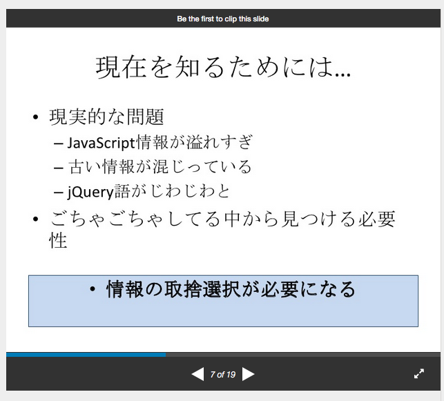
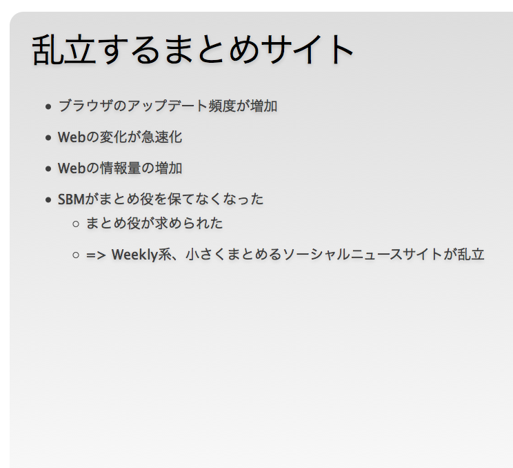
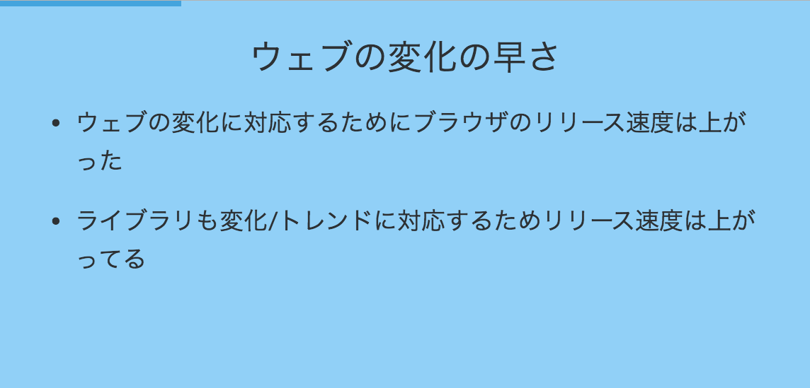
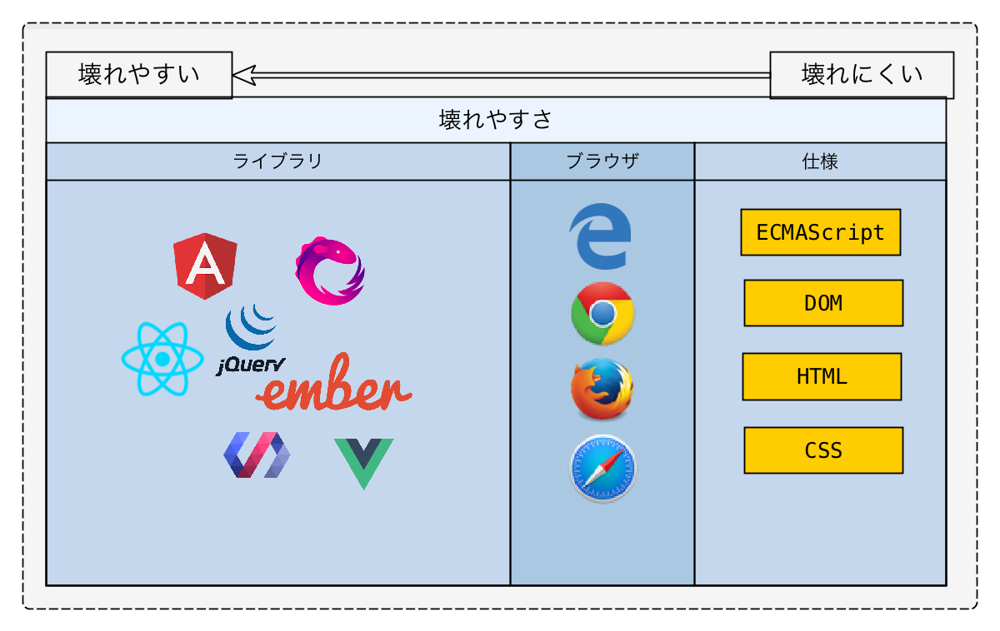

autoscale: true

# JavaScript情報ってなんだっけ?

----

# 「情報」って何?

----

# 「情報」って何?

> 『知る』ということの実体化。われわれが、あるものについて『知る』ということは、何かしらを得たこと、何かを頭の中に取り込んだことである。その『何かしら』を、われわれは情報と呼ぶのである
> -- [高橋秀俊](https://ja.wikipedia.org/wiki/%E9%AB%98%E6%A9%8B%E7%A7%80%E4%BF%8A "高橋秀俊")

-----

# なんで情報が欲しいの?

----

# [fit] 何で情報が欲しいの?

- 新しい技術が面白そうだから
- 開発で楽をしたいから
- 話題だから
- **選択肢を持ちたいから** :anchor:

-----

# 情報って既に沢山あるのでは?

-----

# データ != 情報

^ データと情報は異なるもの。

-----

# 情報が整理されないと何が問題なってくるのか

## 少し過去を振り返る

-----

# 2011年 

> [世界のJavaScript情報を読もう](http://www.slideshare.net/efcl/javascript-6580879 "世界のJavaScript情報を読もう")

  - 古いものと最近のものが混ざって見つけにくい

-----

# 2012年

> [世界のJavaScriptを読もう @ 2012](http://azu.github.io/slide/offline_study/javascript_world.html#slide1 "世界のJavaScriptを読もう @ 2012")

- 古いものと最近のものがまざってる
- 最近のものを整理するWeekly、ニュースサイトが増えた

----

## [Meta Weekly](http://azu.github.io/Meta-Weekly/ "Meta Weekly")

-----

# 2014年

> [世界のJavaScriptを読もう @ 2014](http://azu.github.io/slide/jser200/javascript-2014.html "世界のJavaScriptを読もう @ 2014")

- 急速にライブラリの数が増えてきた
- ユーザーがライブラリの選択で悩むようになってきた
	- 現在に対する選択肢の増加

^ ブラウザのRapid Releaseが一般的となり、それに伴いウェブ全体が早くなった。
ライブラリなどもそれを追従するようにリリース速度が加速した

-----

# [ライブラリの数の推移](http://www.modulecounts.com/)

-----

^ 2014年にはGemを上回り他の言語含めて一番モジュールが多くなりました。

-----

# そもそも何でこんなにライブラリって多いの?

-----

# 言語自体が持つ機能が少ないから

- 標準ライブラリがない
	- Node.jsもコアAPIは少ない
- UIKitのようなUIデザインの元が薄い
- 小さなライブラリを組み合わせて使うのを良しとしてる
- etc...

----

# 2015年 - 去年

- 古いものと最近のものがまざってる
- 現在に対する候補が多い
- 未来に関する悩みが増えた :star:
- ブラウザの情報が整理された

-----

# 未来に関する悩みって?

----

# 未来に関する悩み?

- 不確実な新しすぎるものが増えた
- Transpilerによって未来の仕様が身近になった

例えば、将来

- [ECMAScript Proposal](https://github.com/tc39/ecma262)の機能が全て使えるわけではない
- [cssnext](http://cssnext.io/ "cssnext")にある機能が全て使えるわけではない

^ - まだ仕様が安定していないもの
- 安定していない仕様に乗っかるライブラリ
- Transpilerを前提とした書き方をするもの

----

# 未来の悩みって今悩まなくてもいいのでは?

----

# 未来と現在の混同

- BabelがES6の仕様だと思ってる人がいる
- AngularJSやReduxのように不確定な仕様を推奨するものがある
- :rocket: 安定した仕様とそうでないものを見分ける必要がある

-----

# 安定した/してない仕様の見分け方は?

-----

# 仕様の策定プロセスを知ろう

-----

# 仕様 - ECMAScript

- 大きく分類
- **Stable** - ECMAScript 20XX
	- ES6、ES2016... 1年ごとリリース
- **Unstable** - Proposal
	- 仕様のProposal、ドラフト

-----

# 仕様 - Proposal

- ES 2016からは機能毎のProposal
	- [ES.nextと策定プロセス | ECMAScriptとは何か？](http://azu.github.io/slide-what-is-ecmascript/slide/10.html "ES.nextと策定プロセス | ECMAScriptとは何か？")
- Proposalには5段階のStageがある
- Stage 4以外は基本的にUnstableと考える

-----

# 仕様 - Stage

- Stage 0 Strawman - アイデア
- Stage 0.5 :rocket: - Championが付きアイデア
- Stage 1 Proposal - 提案
- Stage 2 Draft - ドラフト
- Stage 3 Candidate- 仕様書と同じ形式
- Stage 4 Finished - 策定完了 => 仕様書へマージ

-----

## Stage 0.5 :rocket:

- ([公式用語](https://tc39.github.io/process-document/)ではない)
- [Stage 0 Proposals](https://github.com/tc39/ecma262/blob/master/stage0.md "Stage 0 Proposals")にはChampionが付いてるかどうかの違いがある
- Champion :rocket: : 仕様を最後まで進めるTC39のメンバー
- 例) BabelはChampion :rocket:ついてないStage 0は実装しない
	- [New plugin for pipeline operator proposal #3159](https://github.com/babel/babel/pull/3159#issuecomment-164370243 "New plugin for pipeline operator proposal #3159")

-----

# 仕様の策定プロセスまとめ

- ECMAScriptはProposalを見れば安定したものなのか分かる
	- [tc39/ecma262](https://github.com/tc39/ecma262 "tc39/ecma262")
- まだProposalなもの = 安定してない
- 仕様に入ったもの = 安定してる

-----

# 仕様っていつブラウザでいつ使えるの?

-----

# ステータスページを見よう

----

# ステータスページ

- [azu/browser-javascript-resource](https://github.com/azu/browser-javascript-resource "azu/browser-javascript-resource")
	- 主要なブラウザ(エンジン)のステータスページが用意された！
- [status.modern.IE](https://status.modern.ie/)
- [Firefox Platform Status](https://platatus.herokuapp.com/ "Firefox Platform Status")
- [Chromium Dashboard](https://www.chromestatus.com/features "Chromium Dashboard")
- [WebKit Web Platform Status](http://www.webkit.org/status.html "WebKit Web Platform Status")

----

# [Browser Platform Status Tracker](http://platformstatustracker.azurewebsites.net/ "Browser Platform Status Tracker")

----

# 話を戻して :back:

----

# (ライブラリ)選択肢が多いことはいいことなのでは?

----

# 基本はいいこと

- 選択肢が多い != 選択肢を持てる
- 状況に応じて選択できないと意味ない

----

# ライブラリはどうやって選択するの?

------

# ここで必要になるのが情報なのでは

------

------

# ライブラリ/ツールの選択は難しい

- ライブラリの種類にもよる
	- JavaScriptが扱えることが増えた分色々なコミュニティがある
	- 例えばフロントエンド、音声、サーバ、自然言語系(NLP) etc..
- そのため仕様のようにプロセスが一意ではない
- ライブラリごとのコミュニティがある

------

# ライブラリ/ツールの選択は難しい

- 自分なりの基準を設けて、複数の情報から選ぶしかない
- 少なくても死にそうなものは避けたい :skull:
- 後は状況に応じて選べるようにしよう

-----

# ライブラリの生死ってどうやって見るの?

------

# PULSE :heart:

------

# ライブラリのPluse

- ライブラリがアクティブにメンテナンスされているか?
- 小さなライブラリはAPIがフリーズしてることがあるので例外
	- 小さなライブラリとは自分で書き直せるなという規模
- 大きなライブラリ/フレームワークはアクティブなのかは重要
	- 特にエコシステムを持つものは重要 :recycle:

------

# [GitHub Pulse](https://help.github.com/articles/about-pulse/ "Pulse")

^GitHub公式の1日/3日/1周間/1ヶ月でのオーバービュー

-----

# [Issue Stats](http://issuestats.com/ "Issue Stats")

^ リポジトリのIssueやPRが平均どれくらいで処理されているかを見られるサービス。

------
# Contributor(s) :warning:

------

# Contributor(s) :warning:

- 現在がアクティブでもContributorが1人(本人のみ)というケース
- コミットが止まる => プロジェクトが止まる
- 単一障害点(SPOF)

-----

# れい

- Babel
	- https://medium.com/@sebmck/2015-in-review-51ac7035e272
- C3
	- https://github.com/masayuki0812/c3/issues/1440
- そのプロジェクトがContributeしやすくできてるかが大事

^ Babelは最近sebmckのコミットはかなり少なくなったけど、ちゃんと他のアクティブなコントリビューターが活動してる。それでも普通のプロジェクトよりかなり早い。
C3はメインのコミッターがいなくなってて、もう一人の管理権限持ってる人が管理できないスピードでIssueができてる。
C3にはプラグインのような仕組みがないため、コアに対して要望のIssueができてしまい捌けなくなってしまうため、そういうの解消するためにプラグインシステムは必要という話をしていた。

------

# 他に基準はどういうものがあるの?

-----

# FILE

- [Semantic Versioning](http://semver.org/ "Semantic Versioning")
- CONTRIBUTING.md
	- ガイドラインがあるか
- CODE_OF_CONDUCT.md
	- ポリティカル・コレクトネス問題
- ORGANIZATION
	- リリースを出来る人がいるかどうか

^ [Ruby - Contributor Code of Conductのメモ - Qiita](http://qiita.com/azu/items/1bc6dff4fa349f58855f "Ruby - Contributor Code of Conductのメモ - Qiita")
Triage Issueをしてコントリビュートしやすくしているかとか、
ORGANIZATIONの問題はパッケージ管理(npm)側にも問題があるので、まだまだ。

-----

# 全てをカバーするライブラリはない

------

# じゃあ結局どうやって選択すればいいの?

------

# 一つの情報でダメなら複数の情報で

----

# 結局、詳しい人に聞けばいいのでは?

-----

# 正解

## 誰が何に興味を持っているかはそういう意味でも大事

----

# 選択できても1年後には変わるんでしょ?

-----

# はい

## 一度選んで終わりではないはずです

----

# まとめ

- データが多いと選択は難しくなる
- 情報にも種類があるのでちゃんと区別を付ける
	- StableとUnstableからはじめてみる
- ライブラリの選択は難しい
	- コミュニティの問題も関連する
- 一つの情報ではなく複数の情報から判断しよう

-----

# 終わり
