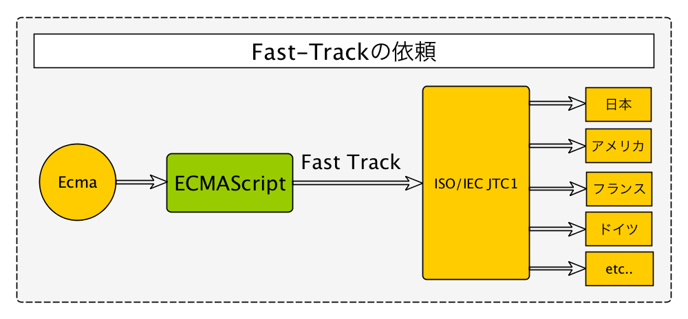
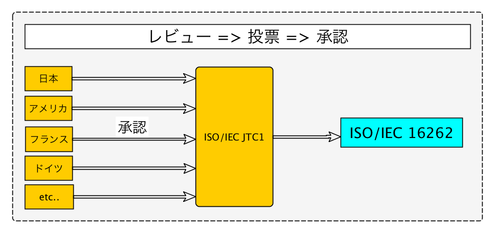

autoscale: true

# SC22 ECMAScript Ad hoc委員会

-----

# 自己紹介

- Name : **azu**
- Twitter : @[azu_re](https://twitter.com/azu_re)
- Website: [Web scratch], [JSer.info]

[Web scratch]: http://efcl.info/ "Web scratch"
[JSer.info]: http://jser.info/ "JSer.info"

------

-----

# 国際標準

WTO/TBT協定

> 国家規格(法規)には、既に存在する国際標準を使うことを推奨する

WTO/GP協定

> 政府およびその関連機関が調達する物品の)性能に関する技術仕様については、既にそれが存在する場合、国際標準に基づいていなければならない

----

# 国際標準とは?

> WTOの協定で求められている「国際標準」とは、何なのでしょうか。実は、何も定義されていません。ISO(国際標準化機構)、IEC(国際電気標準会議)、およびITU(国際電気通信連合)の3つの国際組織が制定するものは、とりあえず「国際標準」と言ってよいであろうと、世界的に考えられています
> -- [標準化について | IPSJ/ITSCJ](https://www.itscj.ipsj.or.jp/hyojunka/hyojunka_01.html "標準化について | IPSJ/ITSCJ")

----

# ECMAScriptと国際標準(ES5までの話)

- Ecma InternationalがECMAScriptを標準化
- その後、同じものをISO/IEC JTC 1からもISO/IEC 16262として標準化
- ISO標準化のプロセスとして[迅速手続（Fast-track procedure）制度](https://www.jisc.go.jp/international/iso-prcs.html "迅速手続（Fast-track procedure）制度")を利用

-----

# [ISO/IEC JTC 1](https://ja.wikipedia.org/wiki/ISO/IEC_JTC_1 "ISO/IEC JTC 1")

> ISO/IEC JTC 1とは、国際標準化機構 (ISO) と国際電気標準会議 (IEC) の第一合同技術委員会

分野毎にSubcommittee (SC) に分かれている。

----

# SC22 ECMAScript Ad hoc委員会

- Subcommittee (SC)の一つとしてSC22がある
- SC22: "プログラム言語、その環境及びシステムソフトウェアインタフェース"を扱う
- 国際のJTC 1/SC 22には、ECMAScript Subcommitteeはない
- 国内のSC22に独自のアドホックな委員会としてECMAScript Ad hocがある

----

# [迅速手続(Fast-track procedure)制度](https://www.jisc.go.jp/international/iso-prcs.html "迅速手続（Fast-track procedure）制度")

- 既存の仕様をISO標準化するプロセス
	- 例: ECMAScript 5をISO/IEC 16262:2011としてISO標準化
- ざっくりとした流れ
- 既存の仕様 -> ISO/IEC JTC1のメンバー(National Body=国ごと)に意見を求める -> National Bodyが投票 -> 賛成されたならISO標準化
- 少なくても6ヶ月はかかる

----

# ざっくりFast-track図解

-----

----

# Fast-track レビュー

- EcmaからECMAScriptのFast-track手続きの依頼
- National Body(国)ごとに仕様を技術的レビューして意見を出す
- ここがSC22 ECMAScript Ad hoc委員会のメインタスク
- レビューを元に仕様へ賛成反対を投票する(1国1票)

-----

-----

# 投票後

- 投票結果によりその仕様がISO標準化される
- ECMAScript5ならISO/IEC 16262:2011としてISO標準化されるという形

-----

# もっと詳しく

- [OSSコミュニティの“中の人”（4）：できないことは全部やる。できる依頼は断る――竹迫良範氏インタビュー【後編】 (1/2) - ＠IT](http://www.atmarkit.co.jp/ait/articles/1210/23/news153.html)
- [Devsumi2010 Ecmascript5 (ISO/IEC JTC1/SC22)](http://www.slideshare.net/takesako/devsumi2010-ecmascript5-isoiec-jtc1sc22)
- [Explanation of the ISO “Fast-Track” process - Brian Jones: Office Solutions - Site Home - MSDN Blogs](http://blogs.msdn.com/b/brian_jones/archive/2007/01/29/explanation-of-the-iso-fast-track-process.aspx "Explanation of the ISO “Fast-Track” process - Brian Jones: Office Solutions - Site Home - MSDN Blogs")

-----

# 何してるの?

## ECMAScript Ad hocの話。他の委員会は分からない

------

# 仕様書のレビューとフィードバック

> 日本の専門委員会としてECMAScriptに対して、こうするべきとかここ直したほうがいいなどの意見を提出するのが目的

- 仕様書をレビュー
- 間違い、おかしな点を報告

------

## 主な活動

- 集まってミーティング(合計三回)
- メーリングリストで情報共有

------

# 一回目 - 2015年6月

- ECMAScript仕様書の担当箇所を決めた
- 章毎に分けて決めた
- 自分は25-26章のGenerator、Promise、Reflectionあたりの担当

------

# 二回目 - 2015年10月

- 担当した箇所について気になった点を話し合い

例)

> 20.3.1.1 Time Values and Time Range
> うるう年を考慮してないからapproximately 285,616 yearsとなってしまってる

------

## 指摘例

> [3 Normative references](http://www.ecma-international.org/ecma-262/6.0/#sec-normative-references "3 Normative references")
> If the adopted ISO/IEC 10646-1 subset is not otherwise specified, it is presumed to be the Unicode set, collection 10646

- "collection 10646"って何?
- "collection 308"のtypo?
- [JP22: maybe typo? by YosAwed · Pull Request #90 · tc39/ecma262](https://github.com/tc39/ecma262/pull/90 "JP22: maybe typo? by YosAwed · Pull Request #90 · tc39/ecma262")

-----

## ISO標準化の道先

- EcmaとしてISO標準化していくかがまだ未定
	- ES2016から策定プロセスを変えたため
	- 毎年リリース予定なのに、ISO標準はそれ追従できるの?みたいな話

-------
## GitHub Issue

- 本来(Fast-Track)は、意見をまとめて提出する
- まだFast-Track依頼がEcmaからきてない
- 個人個人で直接、[Issues · tc39/ecma262](https://github.com/tc39/ecma262/issues "Issues · tc39/ecma262")に指摘のIssueを立てた

-------

# 三回目 - 2016年1月

- まだEcmaとしてISO標準化どうするか未定
- TC39としては1年毎にECMAScriptをリリースという方針は決まってる
	- いわゆるECMAScriptの仕様
	- [Introduction | ECMAScriptとは何か？](http://azu.github.io/slide-what-is-ecmascript/ "Introduction | ECMAScriptとは何か？")
- ISO標準化はそのペースだとどうやるの?という議論中

------

## プロセスの変化?

-----

## 従来のプロセス(Fast-track)

- Fast-Trackでのプロセスは基本国レベル
- 各国の委員会からの報告には何らかの形でレスポンス返すのが普通
	- 国レベルのコミュニケーションという扱いなので

-----
## 現状

- (そもそもFast-trackがきてないので)
- [Issues · tc39/ecma262](https://github.com/tc39/ecma262/issues "Issues · tc39/ecma262")
- GitHubにIssueを個人的に立てて報告
- typoなどEditorialな軽い修正は反映しやすい
- 面倒な話は、普通のGitHubと同じく放置されてしまうことがある

-----

# オープンソースと国際標準化

- オープンソースな仕様の開発とそれを国際標準とするケース
	- ECMAScriptはGitHub上で普通に開発されてる
- オープンソースと国際標準を両立する手法が確率されているわけではない
- 事例が少なくてよくわからない
- ECMAScriptで上手くいくと他にもケースは増えるかもしれない

------

# まとめ

- 今まではFast-trackでECMAScriptをISO標準化していた
- ECMAScript自体の策定プロセス自体が加速した
- ISO標準化のようなプロセスが重たいものは、今後どうなるかが議論中
- 標準化プロセスも変化してきている

-----

# 感想

- Takesakoさんに誘われてSC22 ECMAScript Ad hoc委員会に参加
- 仕様(ECMAScriptではなくもっと大きな括りの仕様)のあり方について詳しい人の話を聞けて面白い
- ウェブでよく参照するデファクト標準(W3CとかECMAScriptとか)とまた違い、国際標準には国際標準で色々流れがあるんだなーと思った