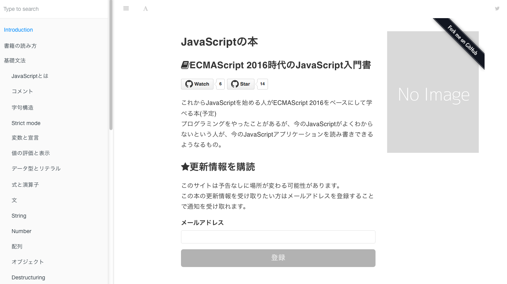
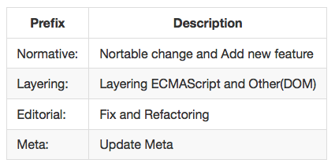
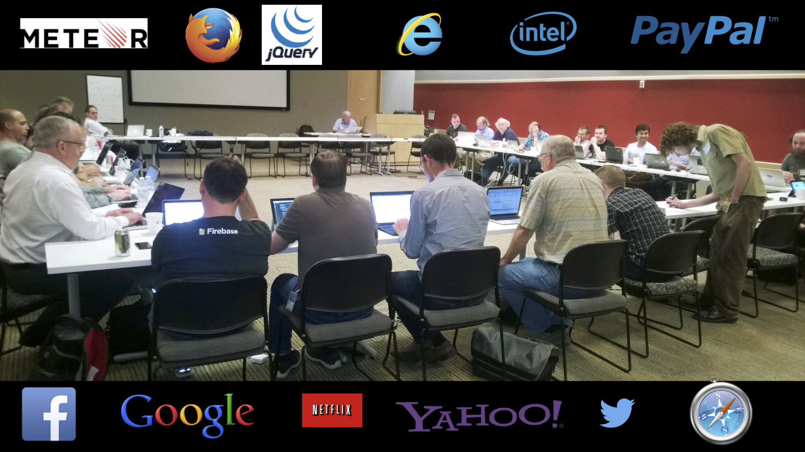

 autoscale: true

# ECMAScript as a Living Standard

-----

# 自己紹介


- Name : **azu**
- Twitter : @[azu_re](https://twitter.com/azu_re)
- Website: [Web scratch], [JSer.info]

[Web scratch]: http://efcl.info/ "Web scratch"
[JSer.info]: http://jser.info/ "JSer.info"

----

# 伝えたいこと

- ECMAScriptの仕様策定は特別なプロセスではない
- そこへ参加する/見ていくのはむずかしいものではない[^x]

[^x]: 標準委員会に参加しないとできないことはあるが、何もできないわけではない

----

# 伝えたいこと

- ECMAScriptの仕様策定はただの大きな(GitHub)プロジェクト
- 普通のプロジェクトと大きな違いはない [^y]
- フォーマルに物事が進む分 普通より分かりやすい
- どのように進めれば物事が進むかのパターンを学べる

[^y]: Ecmaへの仕様提出などは特殊だけど、それ以外は大きく変わらない

-----

# ES2016 リリース :tada:

-----

# その前にES2015では何があったんだっけ?


-----


-----


-----


-----

# 一番大きな変化


- ES2015からは1年毎のリリースサイクルに変更される
- ES2015はその早いリリースサイクルを適応できるだけの基盤
	- だからまだまだ足りない機能はある
- リリースサイクルと共に仕様策定のプロセスも変更された
	- 早いサイクルと開発者/実装者からのフィードバックを得るためのプロセスへ


-----


> It’s the foundation for the next 10-20 years of JavaScript evolution
> -- Allen Wirfs-Brock

-----

> ECMAScript as a Living Standard

----

# Living Standard

- ECMAScriptもLiving Standardへ
- [tc39.github.io/ecma262/](https://tc39.github.io/ecma262/)では常に最新の仕様が公開されている
- ES2015, 2016は1年毎のスナップショット

-----


-----

# Living Writing :book:

-----

# ES2015以降のJavaScript入門本

-  [github.com/asciidwango/js-primer](https://github.com/asciidwango/js-primer "asciidwango/js-primer: JavaScriptの本")
- ES2015以降ベースのJavaScript入門本をオープンソースで書いてる
- 仕様書はLiving Standard
- 書籍がスナップショットだけでは追いつけない
- 書籍もLivingに更新できる仕組みを作る必要がある
	- 出版は予定しているが開発中の段階から公開します

----

## for

- プログラミングをやったことがある
- 今のJavaScriptがよくわからないという人向け
- 今のJavaScriptアプリケーションを読み書きできるようなるもの
- ミーティングノートも公開している
- [js-primer/meetings at master · asciidwango/js-primer](https://github.com/asciidwango/js-primer/tree/master/meetings "js-primer/meetings at master · asciidwango/js-primer")

----




----

## 続きはGitHubで

### https://github.com/asciidwango/js-primer

- 興味ある人はWatchしておいてください


- リリースだけを知りたい人は、フォームからメールアドレスを登録しておくと通知される予定です


-----

# [ECMAScript 2015 - 2016 diff points](https://gist.github.com/azu/3dc9295e97aee9a2706068caf65f0348 "ECMAScript 2015 - 2016 diff points")


-----

## Move to GitHub

- [tc39/ecma262: Status, process, and documents for ECMA262](https://github.com/tc39/ecma262 "tc39/ecma262: Status, process, and documents for ECMA262")
- GitHubで仕様書、Issue、Pull Requestで開発されるようになった


------

## Wordから[Ecmarkup](https://bterlson.github.io/ecmarkup/ "Ecmarkup")へ変更


-----


-----


-----


## Wordから[Ecmarkup](https://bterlson.github.io/ecmarkup/ "Ecmarkup")へ変更


- ECMAScriptの仕様を書くためのCustom Element + [Ecmarkdown](https://github.com/domenic/ecmarkdown "Ecmarkdown")
	- アルゴリズムのステップをMarkdown風に書ける
- これによりクロスリファレンスリンクが充実し読みやすくなった
	- リンクをクリックすれば宣言元へ飛べる

-----

## Layering: Unhandled Rejection

- [Unhandled Rejection Tracking Browser Events](https://github.com/domenic/unhandled-rejections-browser-spec "Unhandled Rejection Tracking Browser Events")
- 実行環境が`rejectionHandled` / `onrejectionhandled`イベントを実装できるためのHookポイントの追加
	- [Promise Error Handling](https://azu.github.io/slide/error-handling/promise-error-handling.html)
	- [Tracking unhandled rejected Promises](http://www.2ality.com/2016/04/unhandled-rejections.html)

-----

## [fit] Normative: Remove `[[Construct]]` from generators

```js
function * G() { construtor(){} }
new G(); // throw error
```

- Generatorは`new`できなくなった
	- `constructor`が`g.next()`されるまで呼ばれないという混乱を生む挙動になっていたため
	- [実例とともに学ぶECMAScript 2015 〜Generator〜 – NET BIZ DIV. TECH BLOG](https://tech.recruit-mp.co.jp/front-end/post-10358/ "実例とともに学ぶECMAScript 2015 〜Generator〜 – NET BIZ DIV. TECH BLOG")


-----

## Normative: Add `Array.prototype.includes` and `TypedArray.prototype.includes`


- ES2015で入らなかったのは`contains`がBreak the webであったため
- [tc39/Array.prototype.includes: Spec, tests, reference implementation, and docs for ESnext-track Array.prototype.includes](https://github.com/tc39/Array.prototype.includes#why-includes-instead-of-has)
- [Introducing Break the Web: Array extra methods case // Speaker Deck](https://speakerdeck.com/constellation/introducing-break-the-web-array-extra-methods-case)

-----


## Normative: Add `**` exponentiation operator

- べき乗演算子

```js
// 2の3乗算
2 ** 3 == Math.pow(2, 3);
```

-----

## Normative: Require Unicode 8

- `U+180E`がホワイトスペースではなくなった
	- [Unicode 5.2.0](http://okwave.jp/qa/q6085442.html)では空白(Zs)の定義に`\u180E`が含まれていた

```js
eval("1\u180E===1"); // throw exception in ES2016
// SyntaxError: illegal character in ES2016
// `true` in ES2015
```

- [[ES2016] Require Unicode 8.0.0 · Pull Request #300 · tc39/ecma262 | ECMAScript Daily](https://ecmascript-daily.github.io/2016/03/28/es2016-require-unicode-8-0-0-by-littledan-pull-request-300-tc39-ecma262 "[ES2016] Require Unicode 8.0.0 · Pull Request #300 · tc39/ecma262 | ECMAScript Daily")

-----

## Normative: Remove Proxy `enumerate` trap and `Reflect.enumerate`


- `Reflect.enumerate`が実装上の複雑さなどの問題から削除された
- [Normative: Remove [[Enumerate]] and associated reflective capabilities by bterlson · Pull Request #367 · tc39/ecma262](https://github.com/tc39/ecma262/pull/367 "Normative: Remove [[Enumerate]] and associated reflective capabilities by bterlson · Pull Request #367 · tc39/ecma262")
- [Why Remove Proxy [[Enumerate]] and Reflect.enumerate? | ECMAScript Daily](https://ecmascript-daily.github.io/2016/02/10/why-remove-enumerate-and-reflect-enumerate "Why Remove Proxy [[Enumerate]] and Reflect.enumerate? | ECMAScript Daily")

----

# リリースノートはどこに?

-----

## リリースノート


- [Releases · tc39/ecma262](https://github.com/tc39/ecma262/releases "Releases · tc39/ecma262")
- GitHub Releaseにリリースノートがある
- リリースノートには変更内容が書かれている

-----

## 変更内容の種類

- Normative
	- 新しい機能の追加、仕様の変更など
- Editorial
	- 記述の修正、リファクタリング
- Layering
	- ECMAScriptと連携するHTML仕様向けの機能追加、修正など

-----


## 変更内容の種類はどこから?

- [tc39/ecma262](https://github.com/tc39/ecma262/commits/master "tc39/ecma262")はコミットメッセージの規則を持っている [^1]



[^1]: https://ecmascript-daily.github.io/ecmascript/2016/06/25/ecma262-commit-message-conventions

<!--
| Prefix     | Description                         |
|------------|-------------------------------------|
| Normative: | Nortable change and Add new feature |
| Layering:  | Layering ECMAScript and Other(DOM)  |
| Editorial: | Fix and Refactoring                 |
| Meta:      | Meta                                |
-->

-----


## コミットメッセージ規則の利点

- コミットメッセージの規則を持つことで検索が簡単になる

```sh
$ git clone https://github.com/tc39/ecma262.git
$ cd ecma262
$ git log --grep "Normative:" es2016-draft-1...es2016-draft-20160215
```

-----

# そもそも誰が仕様決めているの?

-----


# [TC39](http://www.ecma-international.org/memento/TC39.htm "TC39")




-----

## TC39とは

- ECMAScriptを策定してる専門委員会
	- 言語仕様は法的な問題などに対処するため標準委員会で管理することが多い
- 重要な変更はTC39の中でConsensusを取ってから仕様へ反映
	- 2ヶ月に1度の[ミーティング](https://github.com/rwaldron/tc39-notes)で合意を取る

-----

# Editor


- Brian Terlson @ Microsoft
- [@bterlson](https://twitter.com/bterlson "@bterlson")
- ES2016〜仕様書のEditor

-----

# Need Consensus :tophat:

- 挙動を変更するものはConsensusが必要
	- 既存ウェブサイトに影響を与えるものはかなり難しい
	- [Chrome Platform Status](https://www.chromestatus.com/metrics/feature/popularity "Chrome Platform Status")や[API usage on the web platform](https://developer.microsoft.com/en-us/microsoft-edge/platform/usage/ "API usage on the web platform - Microsoft Edge Development")など実測値が参考に使われる
- 挙動を変更しないものは、その場でPull Requestがマージされる

-----

# 新しい機能 - Proposal

- 全く新しい機能も基本的には合意を得られないと追加されない
- ES2016からは機能ごとのProposalを出す
- つまり、機能ごとに仕様を決めていき毎年リリースする
- ProposalにはStage 0〜4の**5段階**のラベルがあり、Stage 4になったら仕様へマージされる [^2]
	- こちらも2ヶ月に1度のミーティングでStageが変動する

[^2]: [The TC39 Process](https://tc39.github.io/process-document/ "The TC39 Process")

-----

## 5段階のStage

- 0. Strawman - アイデア
- 1. Proposal - 提案
- 2. Draft    - ドラフト
- 3. Candidate- 仕様書と同じ形式(実装のフィードバック期間)
- 4. Finished - 実装が2つ、test262にテスト => 策定完了
	- 次の年のECMAScript 201＊にマージされる

-----

# Proposalってどういうものがあるの?


-----

# Proposalの一覧

## [tc39/proposals: Tracking ECMAScript Proposals](https://github.com/tc39/proposals "tc39/proposals: Tracking ECMAScript Proposals")

-----

## [Async Functions](https://github.com/tc39/ecmascript-asyncawait "Async Functions")


- **Stage3**: 2つ目の実装が出たらStage4へ

```js

async function gets(aURL, bURL) {
  const contentA = await getURLAsync(aURL);
  const contentB = await getURLAsync(bURL);
  console.log(contentA, contentB);
}
```

-----

## [Function.prototype.toString revision](https://tc39.github.io/Function-prototype-toString-revision/ "Function.prototype.toString revision")


-----


-----

## [Function.prototype.toString revision](https://tc39.github.io/Function-prototype-toString-revision/ "Function.prototype.toString revision")

- Stage 3
- `func.toString()`が返す文字列を規定 [^3]
- ネイティブな関数は ` [native function] ` を返すという事を規定

```js
class { /* body */ }
A.toString();
/*
class { /* body */ }
*/
```

[^3]: https://github.com/tc39/test262/pull/553

-----

# なぜ機能ごとの策定プロセスを取るのか?

- 1年毎にリリースするため、リリース速度をあげる目的
- できるだけ小さな単位で仕様を決めていくため
- 機能毎という小さなProposalをベースにすることで、細かくリリースできる
- 他の言語やフレームワークも似たような事をやっている
	- [Python](https://www.python.org/dev/peps/ "Python")、[Swift](https://github.com/apple/swift-evolution "Swift")、[Rust](https://github.com/rust-lang/rfcs "Rust")、[Ember](https://github.com/emberjs/rfcs "Ember")


-----

# Avoid bikeshed


-----


> [プログラミング言語標準化の
> パターンランゲージ](http://wirfs-brock.com/allen/files/papers/standpats-asianplop2016.pdf) [^4]
> -- Allen Wirfs-Brock(ES2015 Editor) 

[^4]: :memo: [プログラミング言語標準化のパターン](https://gist.github.com/azu/47082cbcaf7cc7b2b2f2075afad1b025 "プログラミング言語標準化のパターン")

-----

# "maximally minimal"

- 言語デザインは複雑になるほどConsensusを取るのが難しくなる
- "maximally minimal"とは反対意見がある原因やそう思える部分を最大限取り除いた最小のものを仕様にするという手法


----

# "maximally minimal" classes

- ES6での`class`の事例
- [strawman\:maximally_minimal_classes [ES Wiki]](http://wiki.ecmascript.org/doku.php?id=strawman:maximally_minimal_classes "strawman:maximally_minimal_classes [ES Wiki]")
-  全体として必要という合意があるにもかかわらず、詳細の同意が得られず進まない問題へのパターン
- 全体として合意できる最大限最小のものをES6 Classesとした
- 類似: Less is more

----

# なぜ策定プロセスが公開されているのか?

-----

# プロセスの透明性

- [tc39/tc39-notes](https://github.com/tc39/tc39-notes/ "tc39/tc39-notes")にミーティングノートが公開されている
- どのような議論が行われ、どのような意思決定がされたのか
	- なぜ、このProposalは必要なのか
	- なぜ、このProposalはStage Xなのか
	- なぜ、このProposalは廃止されたのか

-----

## 一般のライブラリでも同じ

- React: [React Core Meeting Notes](https://github.com/reactjs/core-notes "React Core Meeting Notes")
- Ember.js: [Meeting minutes from the Ember.js core teams](https://github.com/emberjs/core-notes "emberjs/core-notes: Meeting minutes from the Ember.js core teams")
- Node.js: [Technical Steering Committee meeting](https://nodejs.org/en/foundation/tsc/minutes/ "Technical Steering Committee meetings | Node.js")
- jQuery: [jQuery Core Team | jQuery Meetings](https://meetings.jquery.org/category/core/ "jQuery Core Team | jQuery Meetings")

^ 今書いてるJavaScriptの本もミーティングノートを公開しています。

-----

# 開発者がプロセスに参加する

- (広い意味での)開発者にとって公開されたプロセスは有益
- ECMAScriptはStage 3で2つのブラウザへの実装が必要
	- ブラウザはフラグ付きで実装できる
	- 開発者はフラグをオンにして試せる
- Babelのようなツールでもっと前に試せる

-----

# ブラウザとフラグ

- 全てのブラウザはフラグ管理して実装する
- WebKitもprefixではなくフラグで管理する宣言をした
	- [Feature Policy | WebKit](https://webkit.org/feature-policy/ "Feature Policy | WebKit")
- β/Nightly版を使えば簡単に利用できる
	- [Chrome Canary](https://www.google.co.jp/chrome/browser/canary.html)
	- [Firefox Developer Edition](https://www.mozilla.org/ja/firefox/developer/)
	- [Safari Technology Preview](https://developer.apple.com/safari/technology-preview/)

-----

# フィードバック

- 仕様があっても実装されなければ意味がない
- 実装されても使われなければ意味がない
- 使う側もプロセスの理解とフィードバックが重要
- フィードバックをまともに得ずに進んだものは壊れた歴史
	- [ES4で消えた2年半](https://gist.github.com/azu/47082cbcaf7cc7b2b2f2075afad1b025)

-----

# フィードバックの方法

- 仕様なら
	- ProposalリポジトリへIssueを立てる
	- [ES Discuss](https://esdiscuss.org/ "ES Discuss")に投げる
- 実装なら
	- [各ブラウザ/実装](https://github.com/azu/browser-javascript-resource)のIssueへ
- 何がわからないのかわからないなら
	- [jQuery Standards Group](https://github.com/jquery-foundation/standards "jQuery Standards Group")
	- [WICG](https://discourse.wicg.io/ "WICG")

------

# どこから情報を得るか


------

# 情報源

- リリースノート
	- [Releases · tc39/ecma262](https://github.com/tc39/ecma262/releases "Releases · tc39/ecma262")
- ミーティングノート
	- [tc39/tc39-notes](https://github.com/tc39/tc39-notes/ "tc39/tc39-notes")
- ロードマップ/Proposal
	- [tc39/proposals](https://github.com/tc39/proposals "tc39/proposals")


-----

# 情報源

- Issue
	- [Issues · tc39/ecma262](https://github.com/tc39/ecma262/issues "Issues · tc39/ecma262") and Proposal's issue
- メーリングリスト/質問
	- [ES Discuss](https://esdiscuss.org/ "ES Discuss")
- テスト
	- [tc39/test262](https://github.com/tc39/test262 "tc39/test262")
- 実装
	- 各ブラウザ、[anba/es6draft](https://github.com/anba/es6draft "anba/es6draft")

-----

# [ECMAScript Daily](https://ecmascript-daily.github.io/ "ECMAScript Daily")

- ECMAScriptについてニュースサイト
- [JSer.info](http://jser.info/ "JSer.info")のECMAScript版

------

# 情報源を見てみると

- GitHubにリポジトリがあって、IssueやPull Requestでやり取りしていて、リリースノートがGitHub Releaseにあって、議論の結果が残っていて、未確定なロードマップみたいなものがあって、実装やテストがある
- 各実装がGitHubの該当Issueへリンクを貼り[クロスリファレンス](http://jser.info/2016/05/23/msedgees6-modulesjquery-30-rcgoogle-io/)になっている
- 普通のGitHubプロジェクトと大差ないのでは :question:

------

## ECMAScriptを大きな<br>GitHubプロジェクトとして見る

------


# ECMAScriptがやっていること

- :heavy_check_mark: 更新内容は普段からコミットの段階で整理しておく
	- コミットメッセージの規約を設けるなどして、整理しておく
- :memo: リリースノートはGitHub Releaseで公開している
	- リリースノートはアクセスしやすい/更新が分かりやすい場所へ

------

# ECMAScriptがやっていること

- :thought_balloon: 複雑な設計問題に対してはパターンを使う
	- "maximally minimal"は意思決定のデットロックを壊すツール
- :tophat: Consensusが必要なものはミーティングで意思決定をする
	- 慎重な意思決定が必要な部分は時間を取ってミーティングを行う
- :pencil2: ミーティングの内容は透明性のために公開している
	- 話し合った過程や内容を公開することで、部外者の"なぜ?"を解決できるようにする


-----

# ECMAScriptがやっていること

- :pushpin: ProposalにはStage Xというラベリングをしている
	- Proposalの現在のステータスが分かるようにラベリングしている
- :clock12: Stage 3では開発者からフィードバックを得る方法/期間を提供している
	- 仕様確定前に十分なフィードバックを得る方法や期間を開発者に提供する

-----


# 6行まとめ

- :heavy_check_mark: 更新内容は普段からコミットの段階で整理しておく
- :memo: リリースノートはGitHub Releaseで公開している
- :thought_balloon: 複雑な設計問題に対してはパターンを使う
- :tophat: 慎重な意思決定が必要な部分は時間を取ってミーティングを行う
- :pencil2: ミーティングの内容は透明性のために公開している
- :pushpin: Proposalの現在のステータスが分かるようにラベリングしている
- :clock12: 仕様として確定する前に開発者からフィードバックを得る方法/期間を提供している

-----

# 1行まとめ

## 大きなGitHubプロジェクトとそんなに変わらない

-----

# おわり


-----

# 参考

- [V8 JavaScript Engine: ES6, ES7, and beyond](http://v8project.blogspot.jp/2016/04/es6-es7-and-beyond.html)
- [Previewing ES6 Modules and more from ES2015, ES2016 and beyond | Microsoft Edge Dev Blog](https://blogs.windows.com/msedgedev/2016/05/17/es6-modules-and-beyond/)
- [azu/browser-javascript-resource: Browser JavaScript Resource.](https://github.com/azu/browser-javascript-resource)
- [ECMAScript 6 compatibility table](http://kangax.github.io/compat-table/es6/)
- [APIデザインの極意 Java/NetBeansアーキテクト探究ノート - インプレスブックス](http://book.impress.co.jp/books/1113101014 "APIデザインの極意 Java/NetBeansアーキテクト探究ノート - インプレスブックス")

-----

# 引用

- p4 [ES6 in Practice](http://www.slideshare.net/teppeis/es6-in-practice "ES6 in Practice")
- [ECMAScript 2015: What Took It So Long?](http://wirfs-brock.com/allen/talks/viewsource-es2015.pdf  "viewsource-es2015.pdf")