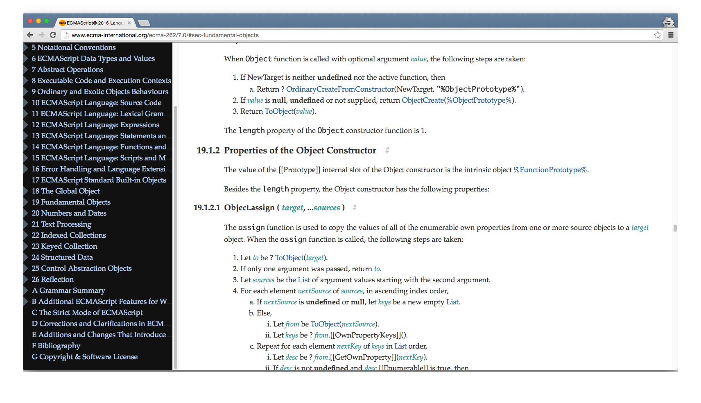

# ECMAScript

-----

# 自己紹介


- Name : **azu**
- Twitter : @[azu_re](https://twitter.com/azu_re)
- Website: [Web scratch], [JSer.info]

[Web scratch]: http://efcl.info/ "Web scratch"
[JSer.info]: http://jser.info/ "JSer.info"

----


# 伝えたいこと

- ものごとをクリアにする！
- ただのいろんな人が関わってるGitHubプロジェクトだよ
	- よくできたコミュニケーションのルール
	- [standpats-asianplop2016.pdf](http://wirfs-brock.com/allen/files/papers/standpats-asianplop2016.pdf "standpats-asianplop2016.pdf")
- ECMAScript仕様の更新の追い方と大きなプロジェクトの運用方法について学びましょう


-----

# ES2016 リリース :tada:

----

# そもそもES2015ってどんなんだっけ?


- [asciidwango/js-primer: JavaScriptの本](https://github.com/asciidwango/js-primer "asciidwango/js-primer: JavaScriptの本")
- ES2015以降をベースにしたJavaScript入門本を書いてる


----

# [ECMAScript 2015 - 2016 diff points](https://gist.github.com/azu/3dc9295e97aee9a2706068caf65f0348 "ECMAScript 2015 - 2016 diff points")


-----

## Move to GitHub

- [tc39/ecma262: Status, process, and documents for ECMA262](https://github.com/tc39/ecma262 "tc39/ecma262: Status, process, and documents for ECMA262")
- GitHubで仕様書、Issue、Pull Requestで開発されるようになった


------

## Wordから[Ecmarkup](https://bterlson.github.io/ecmarkup/ "Ecmarkup")へ変更


-----


-----




-----


## Wordから[Ecmarkup](https://bterlson.github.io/ecmarkup/ "Ecmarkup")へ変更


- ECMAScriptの仕様を書くためのCustom Element + [Ecmarkdown](https://github.com/domenic/ecmarkdown "Ecmarkdown")
	- アルゴリズムのステップをMarkdown風に書ける
- これによりクロスリファレンスリンクが充実し読みやすくなった
	- リンクをクリックすれば宣言元へ飛べる

-----

## Layering: Unhandled Rejection

- [Unhandled Rejection Tracking Browser Events](https://github.com/domenic/unhandled-rejections-browser-spec "Unhandled Rejection Tracking Browser Events")
- 実行環境が`rejectionHandled` / `onrejectionhandled`イベントを実装できるためのHookポイントの追加
	- [Promise Error Handling](http://azu.github.io/slide/error-handling/promise-error-handling.html)
	- [Tracking unhandled rejected Promises](http://www.2ality.com/2016/04/unhandled-rejections.html)

-----

## [fit] Normative: Remove `[[Construct]]` from generators

```js
function * G() { construtor(){} }
new G(); // throw error
```

- Generatorは`new`できなくなった
	- `constructor`が`g.next()`されるまで呼ばれないという混乱を生む挙動になっていたため
	- [実例とともに学ぶECMAScript 2015 〜Generator〜 – NET BIZ DIV. TECH BLOG](https://tech.recruit-mp.co.jp/front-end/post-10358/ "実例とともに学ぶECMAScript 2015 〜Generator〜 – NET BIZ DIV. TECH BLOG")


-----

## Normative: Add `Array.prototype.includes` and `TypedArray.prototype.includes`


- ES2015で入らなかったのは`contains`がBreak the webであったため
- [tc39/Array.prototype.includes: Spec, tests, reference implementation, and docs for ESnext-track Array.prototype.includes](https://github.com/tc39/Array.prototype.includes#why-includes-instead-of-has)
- [Introducing Break the Web: Array extra methods case // Speaker Deck](https://speakerdeck.com/constellation/introducing-break-the-web-array-extra-methods-case)

-----


## Normative: Add `**` exponentiation operator

- べき乗演算子

```js
// 2の3乗算
2 ** 3 == Math.pow(2, 3);
```

-----

## Normative: Require Unicode 8

- `U+180E`がホワイトスペースではなくなった
	- [Unicode 5.2.0](http://okwave.jp/qa/q6085442.html)では空白(Zs)の定義に`\u180E`が含まれていた

```js
eval("1\u180E===1"); // throw exception in ES2016
// SyntaxError: illegal character in ES2016
// `true` in ES2015
```

- [[ES2016] Require Unicode 8.0.0 · Pull Request #300 · tc39/ecma262 | ECMAScript Daily](https://ecmascript-daily.github.io/2016/03/28/es2016-require-unicode-8-0-0-by-littledan-pull-request-300-tc39-ecma262 "[ES2016] Require Unicode 8.0.0 · Pull Request #300 · tc39/ecma262 | ECMAScript Daily")

-----

## Normative: Remove Proxy `enumerate` trap and `Reflect.enumerate`


- `Reflect.enumerate`が実装上の複雑さなどの問題から削除された
- [Normative: Remove [[Enumerate]] and associated reflective capabilities by bterlson · Pull Request #367 · tc39/ecma262](https://github.com/tc39/ecma262/pull/367 "Normative: Remove [[Enumerate]] and associated reflective capabilities by bterlson · Pull Request #367 · tc39/ecma262")
- [Why Remove Proxy [[Enumerate]] and Reflect.enumerate? | ECMAScript Daily](https://ecmascript-daily.github.io/2016/02/10/why-remove-enumerate-and-reflect-enumerate "Why Remove Proxy [[Enumerate]] and Reflect.enumerate? | ECMAScript Daily")

----

# リリースノートはどこに?

-----

## リリースノート


- [Releases · tc39/ecma262](https://github.com/tc39/ecma262/releases "Releases · tc39/ecma262")
- GitHub Releaseにリリースノートがある
- リリースノートには変更内容が書かれている

-----

## 変更内容の種類

- Normative
	- 新しい機能の追加、仕様の変更など
- Editorial
	- 記述の修正、リファクタリング
- Layering
	- ECMAScriptと連携するHTML仕様向けの機能追加、修正など

-----


## 変更内容はどこから? => コミットから

- [tc39/ecma262](https://github.com/tc39/ecma262/commits/master "tc39/ecma262")はコミットメッセージ規則を持っている [^1]


[^1]: https://ecmascript-daily.github.io/ecmascript/2016/06/25/ecma262-commit-message-conventions

<!--
| Prefix     | Description                         |
|------------|-------------------------------------|
| Normative: | Nortable change and Add new feature |
| Layering:  | Layering ECMAScript and Other(DOM)  |
| Editorial: | Fix and Refactoring                 |
| Meta:      | Meta                                |
-->

-----


## コミットメッセージ規則の利点

- コミットメッセージの規則を持つことで検索が簡単になる

```sh
$ git clone https://github.com/tc39/ecma262.git
$ cd ecma262
$ git log --grep "Normative:" es2016-draft-1...es2016-draft-20160215
```

-----

# そもそも誰が仕様書いているの?

-----


# [TC39](http://www.ecma-international.org/memento/TC39.htm "TC39")


-----

## TC39とは

- ECMAScriptを策定してる専門委員会
	- 言語仕様は法的な問題などに対処するため標準委員会で管理することが多い
- 重要な変更はTC39の中でConsensusを取ってから仕様へ反映
	- 2ヶ月に1度の[ミーティング](https://github.com/rwaldron/tc39-notes)で合意を取る

-----
# Need Consensus :tophat:

- 挙動を変更するものはConsensusが必要
	- 既存ウェブサイトに影響を与えるものはかなり難しい
	- [Chrome Platform Status](https://www.chromestatus.com/metrics/feature/popularity "Chrome Platform Status")や[API usage on the web platform](https://developer.microsoft.com/en-us/microsoft-edge/platform/usage/ "API usage on the web platform - Microsoft Edge Development")など実測値が参考に使われる
- 挙動を変更しないものは、その場でPull Requestがマージされる

-----

# 新しい機能 - Proposal

- 全く新しい機能も基本的には合意を得られないと追加されない
- ES2016からは機能ごとのProposalを出す
- つまり、機能ごとに仕様を決めていき毎年リリースする
- ProposalにはStage 0〜4の**5段階**のラベルがあり、Stage 4になったら仕様へマージされる [^2]
	- こちらも2ヶ月に1度のミーティングでStageが変動する

[^2]: [The TC39 Process](https://tc39.github.io/process-document/ "The TC39 Process")

-----

## 5段階のStage

- 0. Strawman - アイデア
- 1. Proposal - 提案
- 2. Draft    - ドラフト
- 3. Candidate- 仕様書と同じ形式、実装が2つ
- 4. Finished - 策定完了
	- 次の年のECMAScript 201＊にマージされる

-----

# Proposalってどういうものがあるの?


-----

# Proposalの一覧

## [tc39/proposals: Tracking ECMAScript Proposals](https://github.com/tc39/proposals "tc39/proposals: Tracking ECMAScript Proposals")

-----

## [Async Functions](https://github.com/tc39/ecmascript-asyncawait "Async Functions")


- **Stage3**: 2つ目の実装が出たらStage4へ

```js

async function gets(aURL, bURL) {
  const contentA = await getURLAsync(aURL);
  const contentB = await getURLAsync(bURL);
  console.log(contentA, contentB);
}
```

-----

## [Function.prototype.toString revision](https://tc39.github.io/Function-prototype-toString-revision/ "Function.prototype.toString revision")


-----


-----

## [Function.prototype.toString revision](https://tc39.github.io/Function-prototype-toString-revision/ "Function.prototype.toString revision")

- Stage 3
- `func.toString()`が返す文字列を規定 [^3]
- ネイティブな関数は ` [native function] ` を返すという事を規定

```js
class { /* body */ }
A.toString();
/*
class { /* body */ }
*/
```

[^3]: https://github.com/tc39/test262/pull/553

-----

# なぜ機能ごとの策定プロセスを取るのか?

- 1年毎にリリースするため、リリース速度をあげる目的
- 機能毎という小さなProposalをベースとした方が、細かくリリースできる


-----
# 言語標準化のパターンランゲージ

- [Programming Language Standardization: Patterns for Participation](http://wirfs-brock.com/allen/files/papers/standpats-asianplop2016.pdf) by Allen Wirfs-Brock(ES6のEditor) [^4]

> "maximally minimal"

- 言語デザインは複雑になるほどConsensusを取るのが難しくなる
- "maximally minimal"とは反対意見がある原因やそう思える部分を最大限取り除いた最小のものを仕様にするという手法


[^4]: :memo: [プログラミング言語標準化のパターン](https://gist.github.com/azu/47082cbcaf7cc7b2b2f2075afad1b025 "プログラミング言語標準化のパターン")

----

# "maximally minimal" classes

- ES6での`class`の事例
- [strawman\:maximally_minimal_classes [ES Wiki]](http://wiki.ecmascript.org/doku.php?id=strawman:maximally_minimal_classes "strawman:maximally_minimal_classes [ES Wiki]")
-  全体として必要という合意があるにもかかわらず、詳細の同意が得られず進まなくない問題へのパターン
- 全体として合意できる最大限最小のものをES6 Classesとした
- 類似: Less is more

----

# なぜ策定プロセスが公開されているのか?

----

# 開発者がプロセスに参加するため

- 透明性の確保
- Stage 3でブラウザの実装が必要
- ユーザーはそこで試せる
- さらにbabelのようなツールでもっと前に試せる


-----

# これは一般のライブラリでも同じ

- React: [React Core Meeting Notes](https://github.com/reactjs/core-notes "React Core Meeting Notes")
- Ember.js: [Meeting minutes from the Ember.js core teams](https://github.com/emberjs/core-notes "emberjs/core-notes: Meeting minutes from the Ember.js core teams")
- Node.js: [Technical Steering Committee meeting](https://nodejs.org/en/foundation/tsc/minutes/ "Technical Steering Committee meetings | Node.js")
- jQuery: [jQuery Core Team | jQuery Meetings](https://meetings.jquery.org/category/core/ "jQuery Core Team | jQuery Meetings")

-----

# なんとしてでもフィードバックが欲しい

- 仕様があっても実装されなければ意味がない
- 結局使うのは開発者
- 開発者が使わなければ、その仕様が実装されていても意味がない
- ES4で消えた2年半の事例


-----


# 実装と利用

- ブラウザで実装されるときはフラグ付き
- Safariもフラグ付きで実装するようになると宣言した
- 今後はフラグを外して試せるようになる

-----

# ECMAScriptと環境

- スクリプトの実行停止
- un moduleの話など
- 実行環境に依存する議論が増えた
- より低レベルなAPIが表面として出てきたため
- また実装における互換性の向上

-----

# ECMAScriptはベース

- ものごとを考えるときにベースとなるものが存在すると、色々と捗る
- ECMAScriptは明確なプロセスがあり、明確な目的がある仕様
- ブラウザはこれを無視できないので、考える時の基準としていける

-----

# 全体を眺めることで知ることができること

------

# まとめ


- ECMAScriptを大きなGitHubプロジェクトとして捉える
- リリースノートは普段からコミットの段階で整理しておく
- リリースノートはGitHub Releaseに書く
- 大きな仕様ではなく小さな仕様
	- "maximally minimal"は意思決定のデットロックを壊すためのツール
- 慎重な意思決定が必要な部分はF2Fなミーティングで決める
- ミーティングの内容は透明性のために公開する
- 仕様が確定する前に実装、開発者からフィードバックを得る方法/期間を提供する


------