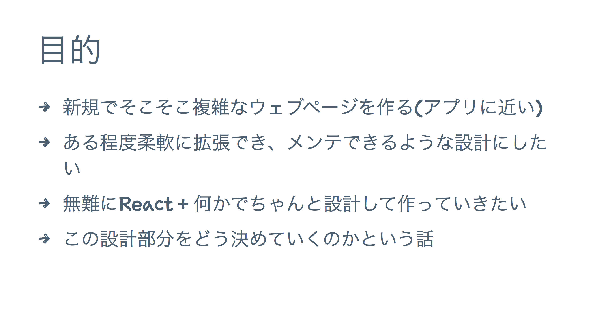
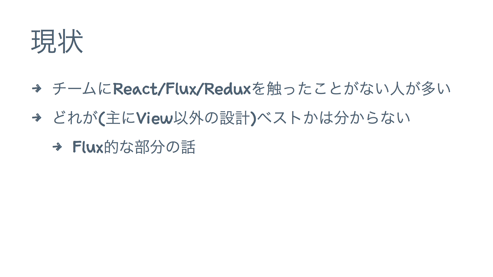
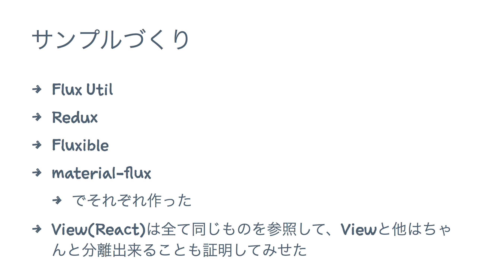
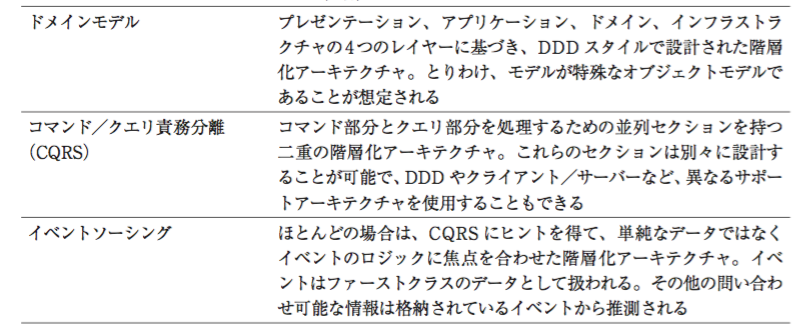
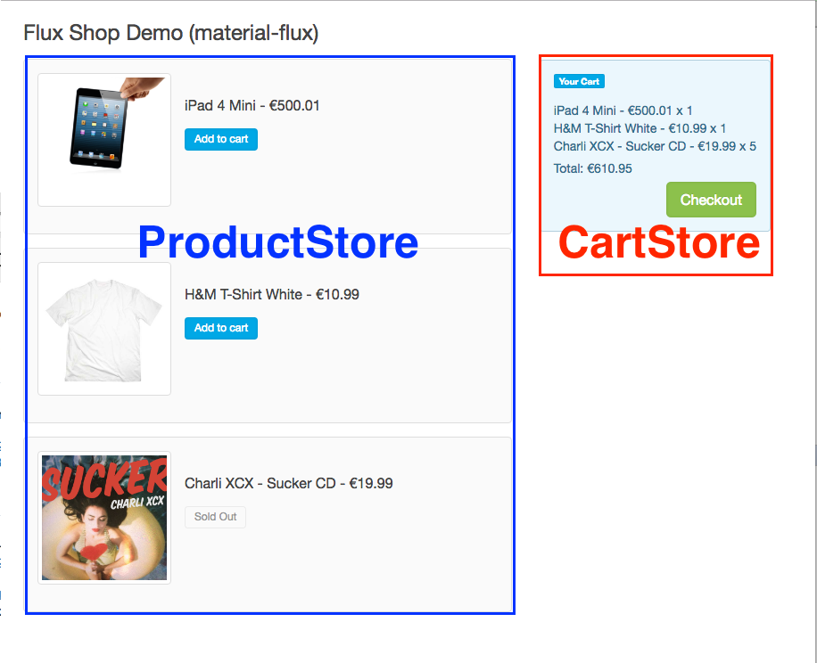
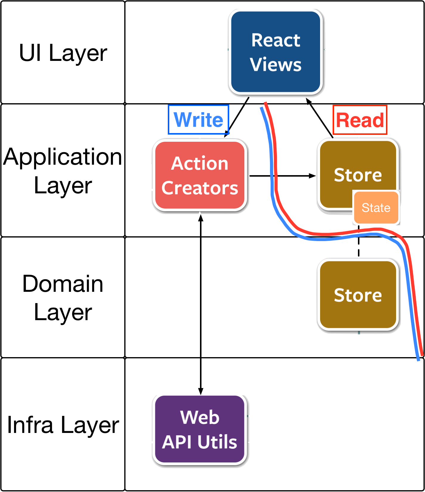
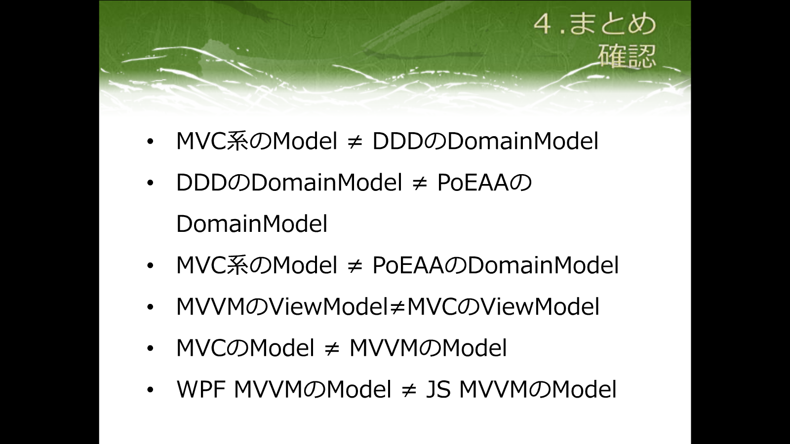

autoscale: true
theme: Plain Jane,5

# 複雑なJavaScriptアプリケーションを考えながら作る話

----

# 自己紹介


- Name : **azu**
- Twitter : @[azu_re](https://twitter.com/azu_re)
- Website: [Web scratch], [JSer.info]

[Web scratch]: http://efcl.info/ "Web scratch"
[JSer.info]: http://jser.info/ "JSer.info"

-----

# [#jsprimer](https://github.com/asciidwango/js-primer)を書いています

## JavaScript入門書に興味ある人はウォッチ :star:


----

# :warning: 注意 :warning:

- 作成するアプリケーションによって必要な構造は異なります
- 今回の話はある程度の規模で複雑性を持つクライアントサイド
	- ライブラリ抜きで数万LOC >=
- 長期的にメンテンナンスや変更が発生するアプリケーション
- サーバサイドレンダリングはしないクライアントアプリケーション

-----
# 3行でOK

- 複雑なJavaScriptアプリケーションを作るにあたり[ドメインモデルをどう実装するか悩んだ](http://azu.github.io/slide/2016/reject-sushi/how-to-work-team.html)
- [色々](http://azu.github.io/slide/2016/make-arch/js-css-architecture.html)と[試行錯誤](http://azu.github.io/slide/2016/bikeshedjs/javascript-read-write-stack.html "Read/Write Stack | JavaScriptアーキテクチャ")した[結果](http://azu.github.io/slide/2016/child_process_sushi/almin-javascript-architecture.html)として[Almin.js](https://github.com/almin/almin "Almin.js")を作った
- 半年ぐらい議論しながら[開発してできたガイドライン](https://github.com/azu/large-scale-javascript/tree/master/docs)、[React Component実装ガイド](https://github.com/azu/large-scale-javascript/tree/master/docs/component.md)、[CSSの実装ガイド](https://github.com/azu/large-scale-javascript/tree/master/docs/css.md)とかの[参考資料](https://github.com/azu/large-scale-javascript/blob/master/refs.md)はここに置いてある
	- [github.com/azu/large-scale-javascript](https://github.com/azu/large-scale-javascript)


-----

# 対象

- Flux(util)やReduxを使って何か作った事がある人
- Flux実装を書いたことがある人

-----

# 目的

- 難しいものを簡単には作れない
- 難しいものは考えて作るしかない
- 考えて作っていくためには、議論できる言語化されたコードが必要
- また、構造化することでメンテナンス性を高める
- ルールは明確に、でも最初から明確なワケではない
- どうやってそれらを行っていったかについて

-----

# 構造化の目的

- 長期的に動くものを書くため
- 属人性が高くならないように、議論して開発できる構造が必要
- 最初から完成している設計はない
	- 立ち上げ時は方向性を決めてコアドメインを作る
	- [20151110 ドメイン駆動設計によるサービス開発](http://www.slideshare.net/maoohnishi3/20151110-54980095 "20151110 ドメイン駆動設計によるサービス開発")
- ドメインモデルも時間で変化する、そのため考え続けないといけない

------

# [Flux](http://facebook.github.io/flux/ "Flux")

## /flˈʌks/


-----


-----


## [azu.github.io/slide/react-meetup/flux.html](http://azu.github.io/slide/react-meetup/flux.html "10分で実装するFlux")

----

# Fluxのデータフローはわかった

- でも、ドメイン、ロジックはどこに書くの?
- ドメインモデルはどこにいるのか?
	- ここでいうドメインモデルはデータと振る舞いを持ったモデル
- ActionCreator or Store?
- StoreはViewに対するStateを管理する場所にも見える
	  - Reduxの中にも明確な答えがあるわけではない

-----

# Fluxの中でのロジック

> Stores contain the application state and logic.
> -- [Flux | Application Architecture for Building User Interfaces](https://facebook.github.io/flux/docs/overview.html "Flux | Application Architecture for Building User Interfaces")

Storeはデータとロジックを持つ


-----


## 一旦ここまでの話をチームで考えてみる

----

# [How to work as a Team](http://azu.github.io/slide/2016/reject-sushi/how-to-work-team.html "How to work as a Team") @ 2016/02/23 [#reject_sushi](http://efcl.info/2016/02/23/reject-sushi/)

----



----



----




----


-----

## ここまで

- Fluxは一方通行のデータフローを定めているのは分かった
- 「ActionはUseCaseと呼んだ方が直感的だなー」
- Storeの役割が直感的ではないという意見
  - 「StoreはただのStateを持つObservableな箱とした方が分かりやすい」
- 「Actionを受け取りStoreで処理するときにドメインはどこに書くのか不安になる」

-----


# 少しFluxの見方を変える

-----

# ドメインモデル



-----

# ドメインモデルをなぜ作りたいの?

- UIじゃなくてコードを読んで挙動がわかるようにするため
- レイヤーを分けて実装するためのパターンでしかない
- それぞれを適切に分解し、適切な注意を払って実装したいだけ
	- ロジックはロジックに集中しよう
	- 永続化やキャッシュは別レイヤーで考えられるように分けよう 等
- そのユースケースに出てくる用語をドメインの振る舞いとして書くため
	- `user.buy(productItem)`


-----

# Fluxをドメインモデルに置き直してみる


- View(プレゼンテーション層)
- ActionCreator(アプリケーション層)
- Store(アプリケーション層)
- Store？？？(ドメイン層)
- Web API(インフラストラクチャ層)

-----

# Fluxとドメインモデル

- Fluxでは明確なDomain Layerがない
- Storeがアプリケーションのドメイン、状態(State)を[合わせ持つ](https://facebook.github.io/flux/docs/overview.html)
- ActionCreatorがInfraを使うので、永続化の問題をどうするか別途考える必要がある
	- WebSocketで繋ぐAPIとかを考えると分かりやすい


-----

# Fluxのいいところ(確認)

- データフローが一方通行になる
	- それによりデータの流れが追いやすい
	- 複雑さが減りバグを減らしやすい構造

^ コード量は増えるけど、複雑さは減るのでバグも少なくなるはず。

----
# Fluxの曖昧なところ

- Domain Layerが曖昧
- Storeがシステムの状態とViewの状態とロジックを含んでいる
- Fluxのまま構造化をするなら、Storeの中で構造化が必要
- Storeを構造化する例: [FluxとDDDの統合方法 - かとじゅんの技術日誌](http://blog.j5ik2o.me/entry/2016/09/09/200643 "FluxとDDDの統合方法 - かとじゅんの技術日誌")


----

# Storeの役割

- FluxのStoreは2つの側面を持っている
	- Actionを受け取りデータを更新(**Write**)
	- Viewの要求に対してデータを返す(**Read**)
- せっかく一方通行なのに、Storeがやることが2つある
- この2つを出来る限り切り離したい

-----

# ショッピングカート
## Storeが曖昧な例
## [voronianski/flux-comparison](https://github.com/voronianski/flux-comparison "voronianski/flux-comparison")


-----

# ショッピングカート


- ショッピングカートはStoreの2つの役割を見るいい例
- 商品の在庫とカートの中身を同時に扱わないと行けない問題を含んでいる


-----
# ショッピングカートのStore




- ProductStore
	- アイテム
	- 在庫数
- CartStore
	- カートのアイテム × 数
	- 合計金額


-----
# 前提の話

- 前提
	- Viewにロジックは書かない
	- CartStoreからカートのStateを取れる、ProductStoreからは商品のStateが取れる(StoreはViewへのマッピングもしてる)
	- 在庫がない場合はカートに入れることはできない(Sold Out)

-----

# 依存の問題

- CartStoreにアイテムを追加するときに、ProductStoreに在庫があるかを確認しないといけない
- CartStoreはProductStoreに依存している


----

# 依存の問題

- Storeを完全に独立したものとして実装してしまうと問題が起きる
- "カートにアイテムを入れる"というAction
	- ProductStoreから在庫を減らす
	- CartStoreにアイテムを追加する
- Product -> Cartの順番で行わないと在庫がないのにカートにアイテムが入るなどの問題を起こしがち


----

# 問題の解決方法

- Redux
	- Storeは1つ = [Single source of truth](https://en.wikipedia.org/wiki/Single_source_of_truth "Single source of truth")
	- 1つなので、CartはProductを知っている
- Facebook/flux
	- `waitFor` - dispatchされたActionの処理順を明示する
- 他: [voronianski/flux-comparison](https://github.com/voronianski/flux-comparison "voronianski/flux-comparison")

-----

# 複雑な問題の一端

- 次の2つをことを1つのモデル(Storeのこと)で行っているのが複雑な原因
	- **N**: **Actionを受け取りデータを更新(Write)**
	- **M**: **Viewの要求に対してデータを返す(Read)**
- 1つモデルで2つの事をやると複雑さは**掛け算**となる
	- 複雑さが **N × M** になる
- それぞれに1つづつのモデルを用意すれば複雑さは**足し算**になる
	- 複雑さが **N + M** になる(代わりにモデルは2つになる)

-----

# 複雑さの掛け算(N × M)をなくしたい

- Storeにデータを書き込むときに次の2つ(WriteとRead)を同時に考えてしまってる
	- 受け取ったActionをどうStoreで処理するか(ビジネスロジック)
	- View(Component)向けにどういう形のオブジェクトを返すか
- この2つを同時ではなく、一旦分けて考えられる状況を作ろう
	- => **CQRS**という考え方

-----

# CQRS(コマンドクエリ責務分離)

-----


^ 左側のDomain Modelは今まで見てきた内容。
データフローは一方通行であるけど、**Actionを受け取りデータを更新(Write)**と**Viewの要求に対してデータを返す(Read)**が一つの層として存在していました。
^ 一方、右側のCQRSは、層が縦にも分かれています。
これは**Actionを受け取りデータを更新(Write)**と**Viewの要求に対してデータを返す(Read)**が別の層として分離されることを意味しています。
^ CQRSとはコマンドがWrite、クエリがReadという分離をする原則のこと

-----

# CQRS(コマンドクエリ責務分離)

- Command Query Responsibility Segregation
- 構造をコマンド(**Write**)とクエリ(**Read**)で縦に割る
	- Actionを受け取りデータを更新(**Write**)
	- Viewの要求に対してデータを返す(**Read**)
- クエリ(**Read**)は読み取りのみなので**Write**よりは単純
- 詳しくは[.NETのエンタープライズアプリケーションアーキテクチャ](http://ec.nikkeibp.co.jp/item/books/P98480.html ".NETのエンタープライズアプリケーションアーキテクチャ　第2版")

----

# FluxのWriteとRead

- Storeの中で構造化するため上手く割り切れない
- Action(Command)がStoreに書き込む
- ViewがStoreからState(Query)を読み取る
- => Storeの役割を変えないとやりにくい



-----

# やっと本題

-----

# [Almin.js](https://github.com/almin/almin "almin/almin")


-----

# ここからの話

- [Almin.js](https://github.com/almin/almin "Almin.js")を作るまでに考えた設計の概念的な話
	- 理想的な形をクライアントサイドで動く現実の形に落とす話
- コードの解説ではないです
	- ドキュメントを見て
	- [https://almin.js.org](https://almin.js.org/)

-----


# 考えるポイント

- Write StackとRead Stackを分離 = CQRS
	- Write × Readの複雑さを掛け算ではなく足し算にする
  - **Write × Read** => **Write + Read** へ [^注]
- ドメインモデルを扱える構造を作る
- クライアントサイドで問題点となるのはオブジェクトの永続化
	- シングルトンがでてくる問題

[^注]: Write と Readが共に複雑でなければ、掛け算の方が簡単なのは自明です


^ N と Mが小さければ、掛け算の方が簡単なのは自明です。
N + M にするということは、値が小さい間はボイラープレート的なコード量が増えるので、その分手間がかかります。

----


# 全体像(Simple版)


## 画像は概念イメージ

-----


## 登場人物


- View(React Component)
- Write Stack
	- UseCase
	- Domain
	- Repository :arrow_left: 同一かも
- Read Stack
	- Store
	- Repository :arrow_right: 同一かも


----

# Alminが提供してるのこれだけ


- いわゆるFluxライブラリと対して変わらない
- しかしこの構造を強く意識作り、ドキュメント
- ここからの話はあくまでパターンにすぎないので、ライブラリに依存した何かではないはず

----

# View

-----

## View


- Reactを使う
- PostCSS使ってる
- 以上

-----

# Write Stack(コマンド)

-----
# Write Stack


-----

> **Start from the Use Cases**
> The best place to start when trying to understand a new domain is by mapping out use cases.
> -- [Patterns, Principles, and Practices of Domain-Driven Design](http://www.wrox.com/WileyCDA/WroxTitle/Patterns-Principles-and-Practices-of-Domain-Driven-Design.productCd-1118714709.html "Patterns, Principles, and Practices of Domain-Driven Design")


^ ドメインはアプリケーション毎に複雑さがあり、ドメインを理解するにはどういうユースケースがあるかを考える所から始めるのが良いという話

-----


# UseCase

## アクターがシステムに対して何をしたいかを書く場所

-----

## UseCase


- ViewからUseCaseを発行(ActionCreatorと類似)
- ドメインを使った**処理の流れ**を記述する
- ここに処理の内容を全部書くとトランザクションスクリプト
- UseCaseと対になるFactoryを持ってる
	- Factoryはテストのため(コンストラクタによる依存解決)

-----

## UseCaseの例

「TodoListに新しいTodoを追加する」というユースケース

- `TodoRepository`から`TodoList`のインスタンスを取り出す
- `TodoList`に作った`TodoItem`を追加する
- `TodoRepository`に`TodoList`を保存する

-----

## AlminのUseCase

```js
import {UseCase} from "almin";
export class AddTodoItemUseCase extends UseCase {
    execute(title) {
        // ユースケースの内容を書く
        // TodoListにTodoItemを追加するというロジック
        // ここに全部書いちゃうとトランザクションスクリプトっぽい
    }
}
```

----

# Domain Model

----

## Domain Model


- 作ろうとしてるものを表現するオブジェクト[^図]
- モデルクラス
- ここでは、データと**振る舞い**を持ったクラス
- できるだけPOJO(Plain Old JavaScript Object)である

[^図]: 概念にすぎず、データや処理の流れを表すものではありません


----

## モデルとは…


via [.NETのエンタープライズアプリケーションアーキテクチャ](http://ec.nikkeibp.co.jp/item/books/P98480.html ".NETのエンタープライズアプリケーションアーキテクチャ　第2版")

^ モデルは人やアーキテクチャによって多重定義された用語です。
ここでは、データと**振る舞い**を持ったクラスのことをモデルと呼んでいます。

-----



^モデルとはー何か。分からない。
ここではデータと振る舞いを持ったクラスのことを言っています。

-----

# モデルの例: Todo

- `TodoList`: TodoItemを管理する
- `TodoItem`: TodoItemのオブジェクト

> TodoList に TodoItem を追加する

```js
function addNewTodo(title){
    // TODO: 毎回TodoListを作ってるのはおかしいけど…
    const todoList = new TodoList();
    const todoItem = new TodoItem({title});
    todoList.addItem(todoItem);
}
```

-----

# TODOを追加するUseCaseをモデルを使って書く

```js
import {UseCase} from "almin";
export class AddTodoItemUseCase extends UseCase {
    execute(title) {
        const todoList = new TodoList();
        const todoItem = new TodoItem({title});
        todoList.addItem(todoItem);
    }
}
```


-----

# モデルの永続化

- モデルをPOJOで書けることは分かる
- モデルはどこでだれが永続化するの?
  - どこでインスタンス化して、どうやってインスタンス化したものを再度取り出すのか
- => **Repository**が永続化を考える層
- モデルは自身の永続化の方法をしらない(関心がない)

^ ここでいう永続化とは簡単に言えば、どこでインスタンス化して、どうやってインスタンスを取り出すかという技術的な問題についてです

-----

# Repository

-----


## Repositoryとは :memo:

ここでは、ドメインモデルの永続化に対処する概念/実装のこと


-----

# Repository


- ドメインモデルのインタンスを永続化する場所 [^図r]
	- Repositoryパターン
- Repository自体はシングルトン！でインスタンス化する
- `findById(id)`/`save(model)`/`delete(model)` などのAPIを持つケースが多い


[^図r]: 概念にすぎず、データや処理の流れを表すものではありません

-----

# Repositoryの保存先?

-----

# Database


- Repositoryの保存先は実装毎に違う
- メモリ上でいいならただの`Map`オブジェクトでいい
	- localStorageとかIndexedDBなど色々
- AlminのサンプルだとDatabaseが変更の検知はRepositoryでやったり

-----


```js
import {UseCase} from "almin";
export class AddTodoItemUseCase extends UseCase {
    constructor({todoListRepository}) {
        super();
            this.todoListRepository = todoListRepository;
        }
        execute(title) {
            // RepositoryからTodoListのインスタンスを取得
            const todoList = this.todoListRepository.findById(todoListId);
            const todoItem = new TodoItem({title});
            todoList.addItem(todoItem);
            // RepositoryにTodoListを保存する
            this.todoListRepository.save(todoList);
    }
}
```

-----

# Repository自体のインスタンス化の問題


- クライアントサイドJavaScriptでは永続化が難しい
- どこでインスタンス化するの?問題
	- それへの現実解としてシングルトンが出てくる
- DomainはRepositoryに依存してはいけない
- => **依存関係逆転の原則(DIP)**

-----

# 依存関係逆転の原則(DIP)

> 上位のモジュールは下位のモジュールに依存してはならない。どちらのモジュールも「抽象」に依存すべきである。
> 「抽象」は実装の詳細に依存してはならない。実装の詳細が「抽象」に依存すべきである。
> -- [依存関係逆転の原則（DIP） - Strategic Choice](http://d.hatena.ne.jp/asakichy/20090128/1233144989 "依存関係逆転の原則（DIP） - Strategic Choice")
> DIP:the Dependency Inversion Principle

-----


-----


```js
import {UseCase} from "almin";
// シングルトンを渡すだけのFactoryクラス
import todoListRepository from "../infra/TodoRepository"
export class AddTodoItemUseCaseFactory {
    static create() {
        return new AddTodoItemUseCase({ todoListRepository });
    }
}
// テストする際は直接`UseCase`クラスを使う
export class AddTodoItemUseCase extends UseCase {
    constructor({ todoListRepository }) {
        super();
        this.todoListRepository = todoListRepository;
    }
    execute({ title }) {
        // ... ユースケースの内容
    }
}
```

-----

# 依存関係逆転の原則(DIP)

- Factoryが依存をUseCaseへ渡す
- UseCaseやドメインがリポジトリに依存しなくて良い
- ドメインがちゃんと永続化できる
	- シングルトンのリポジトリは常に存在するから
- テスト時はUseCaseのコンストラクタにDIすることでテストもできる


-----


# Read Stack(クエリ)

-----


-----

# Write(Command)とRead(Query)の復習

- CQRS (Command Query Responsibility Segregation)
- ざっくり: WriteとReadを層として分けて責務を分離する
- 一方通行のデータフロー
	- UseCaseでドメインを使ってデータ更新(**Write**)
	- Viewの要求に対してデータを返す(**Read**)

-----

# Read Stack


- ReadはRepository経由でデータを読み込んでView用のデータを作って渡すだけ[^図]
- 読み取り専用(保存したデータの変更はしない)ので色々簡略化できる
- 縦に別れたので、テスト依存関係が簡略化できる！

[^図]: やっぱりただの概念で、依存のフローという話ではない

^ 例えば、StateのテストはReducerと同じような入力に対してどういうStateが作成できるかをテストするだけ。
StoreのテストはRepositoryを渡して、どういうStateを返してくるなどをチェックするだけ。
基本的に外から依存を差し込めるのでテストがしやすい。

----


- Repository
	- Write Stackと同じものを参照するでも良い
- State(Read Modelとか言われる)
	- Writeのドメインから振るまいを消したモデルを作ってもよい
	- ドメインモデル貧血症にわざとしても良い = Viewのためのモデルなので
- Store
	- 実装はFluxのStoreと同じ
	- Stateを格納してる入れ物という感じ


[^図]: ご自由に考えて

----

# Store


- StoreはStateを持つオブジェクト[^図]
- StateをUIに渡してUIはそれを使って更新する
- StoreはStateが更新された事をUIに伝える

[^図]: Storeは入れ物、Stateは中身という考え方

----

# :warning: クライアントサイドの問題 :warning:

### 永続化するパターン
View -> UseCase -> Domain -> Repository -> State -> View -> ...

### Stateを直接更新するパターン
View -> UseCase -> State -> View -> ...


-----
# クライアントサイドで多い問題

- UseCase -> Repositoryを経由したStore/Stateの更新までの流れ
- クライアントサイドではStateを直に更新して、UIにすぐ反映されて欲しいことがある
	- 1F以内にアクションがViewに反映されて欲しいケース
	- ローディング、モーダル、アニメーション、停止ボタン
	- 「ほんのいっとき」が許されないケースはクライアントサイドにはある
	- コンポーネントに閉じ込めるというのあり
- そのため縦(Read/Writeの層)じゃなくて、横のルールも必要

----


via [.NETのエンタープライズアプリケーションアーキテクチャ　第2版](http://ec.nikkeibp.co.jp/item/books/P98480.html ".NETのエンタープライズアプリケーションアーキテクチャ　第2版") p299


^ CQRSは結果統合性とした方が扱いやすい構造。
.NETの本には「ほんのいっときが古いデータが表示されるのは許容されるでしょ」とあるが、クライアントサイドでは先ほど言ったようにすぐに更新されて欲しいパターンがある。

-----

# UseCase -> Store


- UseCaseからdispatchしたイベントが、Storeに届く横のルート
	- 抜け穴感があるので慎重に取り扱いたい
- FluxやReduxはこのルートが基本的な流れ

-----

# [Single source of truth](https://en.wikipedia.org/wiki/Single_source_of_truth "Single source of truth")

- Alminでも基本的には[Single source of truth](https://en.wikipedia.org/wiki/Single_source_of_truth "Single source of truth")
- Storeをまとめる`StoreGroup`という概念を持ってる
	- 一つのアプリはStoreはたくさん存在する
	- Storeが同期的に一斉にemitChangeすると、何回もUIが更新されてしまう
	- StoreGroupは同時に発生したemitChangeを一つにまとめる
		- `requestAnimationFrame`などで間引く or UseCaseの実行が終わったら確認する
		- イベントを間引く役 = UI層に近い

-----

## 実装したもの

- [Almin.js](https://github.com/almin/almin "Almin.js") = almin.js.org :link:
	- このスライドで書いた内容大体そのまま実装
	- [Counter](https://github.com/almin/almin/tree/master/docs/counter "Counter Example")
	- [TodoMVC](https://github.com/almin/almin/tree/master/example/todomvc "TodoMVC")
	- [Shopping Cart](https://github.com/almin/almin/tree/master/example/shopping-cart "almin/example/shopping-cart at master · almin/almin")

-----

# まとめ

- Fluxと呼ばれてるものが、CQRSとどのような点で同じで異なるのかを示した
- イベントソーシングは抜いてCQRSについて考えAlminを実装した
- ドメイン/ビジネスロジックをちゃんと考えて実装できるような状況を作った
	- コアドメインについてはちゃんと考えて、相談しながら作らないできない

-----

# まとめ

- アプリケーションの種類毎に適当なアーキテクチャは異なる
	- アーキテクチャが良くできていても、ステートフルなDOMという巨大なモデルとの戦いは存在する
	- Reactでは吸収できない状態はある `<audio>`とか`<video>`とか`<canvas>`
- 万能なアーキテクチャは存在しない

-----

# まとめ

- 今回はイベントソーシングではなくステートソーシング
	- 複雑なものをイベントソーシングで上手くやるイメージがまだない
	- Entity自体はImmutableで実装した方が良い(Readでのモデルの共有とか考えるなら尚更)

-----

# まとめのまとめ


- 半年間この考えをベースを実践してみての知見まとめ
- [azu/large-scale-javascript: 複雑なJavaScriptアプリケーションを作るために考えること](https://github.com/azu/large-scale-javascript "azu/large-scale-javascript: 複雑なJavaScriptアプリケーションを作るために考えること")
	- コーディングガイドライン
	- 考え方
	- 参考資料などのまとめ


-----

## Write Code Thinking :)

-----


## 時系列

- [10分で実装するFlux](http://azu.github.io/slide/react-meetup/flux.html)
- [How to work as a Team](http://azu.github.io/slide/2016/reject-sushi/how-to-work-team.html)
- [JavaScriptのアーキテクチャ](http://azu.github.io/slide/2016/make-arch/js-css-architecture.html)
- [Read/Write Stack | JavaScriptアーキテクチャ](http://azu.github.io/slide/2016/bikeshedjs/javascript-read-write-stack.html)
- [Almin.js | JavaScriptアーキテクチャ](http://azu.github.io/slide/2016/child_process_sushi/almin-javascript-architecture.html)

-----

## 実装

- [Introduction · Almin.js](https://almin.js.org/ "Introduction · Almin.js")
	- CQRSなどを考えて作ったライブラリ
- [almin/example/shopping-cart at master · almin/almin](https://github.com/almin/almin/tree/master/example/shopping-cart "almin/example/shopping-cart at master · almin/almin")
	- ショッピングカートをAlminで実装したもの
- [azu/presentation-annotator](https://github.com/azu/presentation-annotator "azu/presentation-annotator")
	- 実践的に考えて実装したもの
