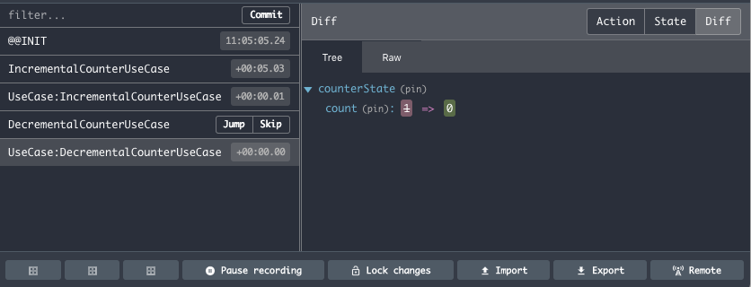

autoscale: true

# The Concept of Almin


----

## [Almin](https://github.com/almin/almin "Almin") is a State management library for JavaScript


----

## Almin features


- Scalable
	- Medium-small(1,000LOC) – Large(100,000LOC)
- Testable
	- Implement UseCase/Store/Domain as component
- Debuggable
	- Logger/DevTools/Performance monitoring
- Layered Architecture
	- DDD/CQRS

----


> Different team structures imply different architectural decisions.
> -- Clean Architecture Robert C. Martin


----

## The Concept of Almin

- Write **Your domain** in **Your code**
- Split up **Read stack** and **Write stack**
- **Unidirectional** data flow
- Prefer **Readable code** to **Writable code**
- **Monitor everything**

-----

## Write **Your domain** in **Your code**

- You can control domain layer
	- You can write **your domain** mode with **Pure JavaScript**
	- You domain **not need** to subclass of Almin things
- Almin support application layer
	- Application layer use your domain model
- If you drop to use almin, **not need to rewrite** your domain

-----

### Example: UseCase

Almin provice `UseCase` class that is a pert of application layer


```js
import { UseCase } from "almin";
import yourDomain from "./your-domain";
export ApplicationUseCase extends UseCase {
	execute(){
		// Application Layer use your domain
		yourDomain.doSomething();
	}
}
```


-----

## Split up **Read stack** and **Write stack**

- In Flux/Redux
	- **Store** has **Application logic/state**(M) and **View state**(N)
	- The Complexity: **N × M** (multiplication)
- In Almin
	- **Domain** has **Application logic/state**(M) – Write state
	- **Store** has **View state**(N) - Read state
	- The Complexity: **N + M** (addition)

> Related topic: Command Query Responsibility Segregation(CQRS)

-----

### Example: Repository

- Almin help to support **Repository** pattern
	- You can save your domain(application state) into the repository
- **Store** read **application state** from the **repository**
- **Store** convert the **application state** to **view state**

> Realted topic: Model View ViewModel(MVVM), ViewModel


-----

## **Unidirectional** data flow

> View -> UseCase -> Store ... -> View -> UseCase -> Store

- **UseCase** only report **success or failure** that is **Promise<void>**
- **UseCase** can write to **Store**, But can not read from Store
- **Store** does't know any **UseCase**
- **View** can not write state to **Store** directly
- **View** can execute any **UseCase**
- **View** can observe the change of **Store**


Related topic: Flux

-----


----

## Prefer **Readable code** to **Writable code**

- Almin prefer **Explicit**/**Readable** code to **Implicit**/**Writable** code
- Almin support **TypeScript** language and Almin is **type-safe**
- Pros
	- No magic code
	- Just write and Just work
- Cons
	- Redundancy

-----

##  **Monitor everything**

- You can observe [life-cyle events](https://almin.js.org/docs/tips/usecase-lifecycle.html) of almin
- [logging](https://github.com/almin/almin/tree/master/packages/almin-logger) events that are changing of state etc..
- Integrate almin into [DevTools](https://github.com/almin/almin-devtools "almin-devtools")
- [Profiling performance](https://almin.js.org/docs/tips/performance-profile.html) of almin with other library
- [Illustrate](https://github.com/almin/almin-usecase-map-generator) your UseCase diagram


----


 

-----

#  Conclusion 

- :package: Repo: [almin/almin](https://github.com/almin/almin "almin/almin")
- :memo: Document: [https://almin.js.org](https://almin.js.org "Almin documentation")
- :scroll: Examples: [almin/examples](https://github.com/almin/almin/tree/master/examples "almin/examples")
- :link: Work with [React](https://reactjs.org/), [Vue](http://vuejs.org/) etc...


-----

# [fit] [Almin](https://github.com/almin/almin "Almin") is for thinking code