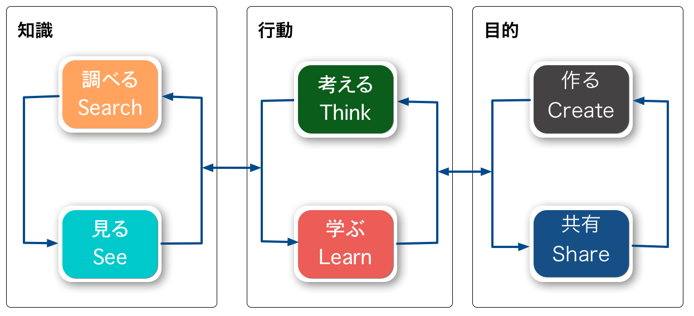
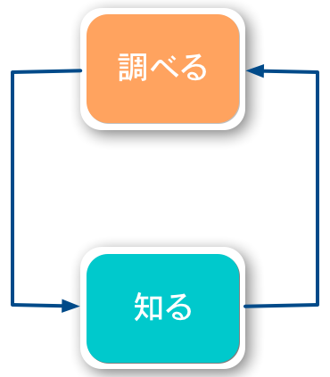
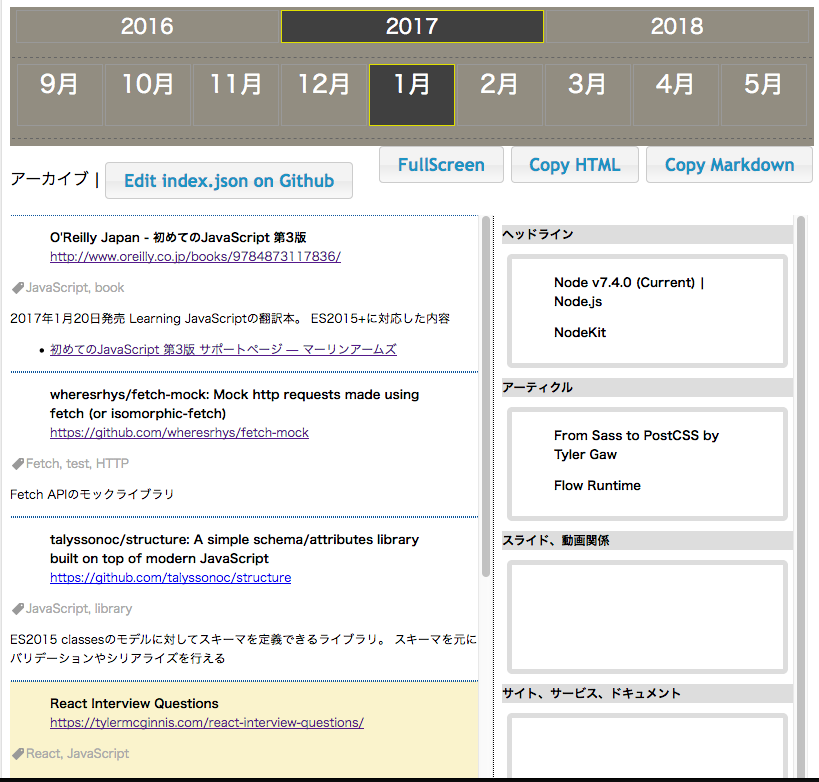
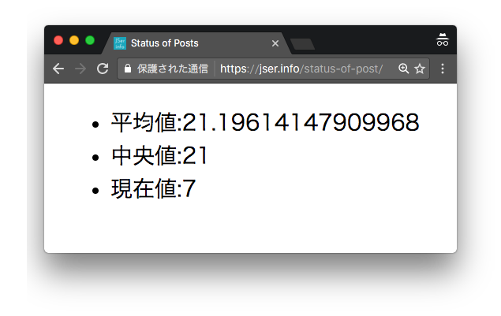
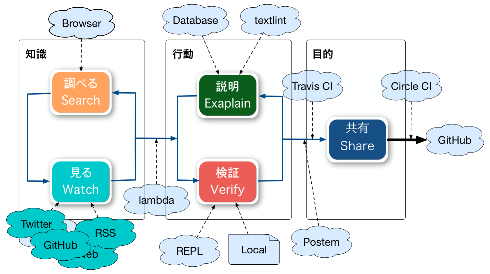

autoscale: true
theme: Plain Jane,5

# JSer.infoの作り方

----

# はじめに

- このスライドには再現性がありません
- 技術的な面白さはありません
- 各自、適当に見てね

----

# テーマ

- 見る(Watch)
- 調べる(Search)
- 学ぶ(Learn)
- 考える(Think)
- 作る(Create)
- 共有(Share)

----



----

# 目的

- **知識**を元に**行動**することで**目的**を達成する
- 大体のものごとは同じようなフローを辿る
- JSer.infoにおける、このフローの詳細を見ていく話

----

# JSer.infoの例

-----

## JSer.infoの目的

> なぜこのようなサイトを始めたのかというと、現在のインターネットは
> JavaScriptの情報が溢れていて自分の周りだけの情報で全てだと錯覚してしまうほど情報量だと思います
> そのようなキャパシティをオーバーしてしまう状況はあまり好ましくないため、ある程度の内容に絞った情報を提供する場所が必要ではないかと考えました。
> 幸いにも私は情報を集めることが好きなので、そのような人間が少し整理した情報を提供することでより良い流れが作れるのではないかと思っています。

> 改めて、このサイトは言語問わないJavaScriptの情報を紹介するサイトです。しかし、真の目的はJavaScriptの情報を”紹介”ではなく”知ってもらう”事にあるため、継続的な活動が必要となるでしょう。

---

# JSer.infoのゴール

- JSer.infoのゴール = 方向
- 「JavaScriptに興味がある人にもっとJSを知ってもらう」
- 「JavaScriptの情報を整理して伝える」
- 「JavaScriptの現状を正確に伝える」
- 「更新コストを小さくして、継続できる形を作る」

----

# JSer.infoのワークフロー


----

## 目的を満たすために

- JavaScriptの情報を整理して正確に伝えるために
- 誇張や誤った情報は避ける必要がある(Verify)
- また伝えるには言葉(文字)を使うので、人によって言葉の捉え方は色々(Explain)
- 人にとって「良い」という言葉の意味すら異なる

----

# 具体的にどう行動するか

----

# 見る(Watch)、調べる(Search)



- どのプログラミング言語でも大体同じやり方が通じ
- どちらも"情報収集"
- 調べるは能動的、見るは受動的な情報収集
- [情報化社会を この先生きのこるためには / Layzie@Frontrend in Kanazawa // Speaker Deck](https://speakerdeck.com/layzie/layzie-at-frontrend-in-kanazawa "情報化社会を この先生きのこるためには / Layzie@Frontrend in Kanazawa // Speaker Deck")

----

# 見る(Watch)

- JSer.infoでは、とにかく情報を見る/気づくことが重要
- 気づくために色々なアンテナを貼る
- 「見る」で重要なのは、自分が見る所に集約すること
  - 見ない所に集めても結局見ない
- @azu がもっと見るのはRSSリーダーとTwitter

----

## GitHubを見る


- GitHubは開発の基盤なので重要
- JSer.infoでも紹介数は年々増えている
- 新しいライブラリ、ドキュメント、リリース情報など
- Issue/Pull Request
- ECMAScriptの仕様策定の議論など

-----

## GitHubを見る


- しかし、GitHubのタイムライン(通知)は破綻してる
- そのため色々なツールやアプリなどを書いてる
- [GitHubでライブラリのリリースを見ていくためのツールや方法 | Web Scratch](http://efcl.info/2014/07/30/find-github-release/)
- [Githubのタイムラインや通知を見るアプリをnode-webkitで作った | Web Scratch](http://efcl.info/2014/0430/res3872/)

----

## GitHub

- リポジトリをWatch :watch:
  - アクティブに興味があるリポジトリをWatch
- リポジトリをStar :star:
  - 特に意味なくStarする
  - [starWatchker](https://starWatchker.so/ "starWatchker")で補足
- リポジトリのリリースをRSSで購読
  - Feedlyに溜め込む => IFTTT -> Twitterへ投げる

-----

## GitHubをTwitterで見る


- [AWS lambdaでGitHubのアクティビティをTwitterで読む用に投稿する | Web Scratch](http://efcl.info/2016/06/09/github-to-twitter-lambda/ "AWS lambdaでGitHubのアクティビティをTwitterで読む用に投稿する | Web Scratch")
- BotでGitHubの[Notification](https://github.com/notifications)(Watch)、[アクティビティ](https://github.com/)を流す
- 結果、Twitterで次の情報が見れる
  - Watch/アクティビティ(フォロワーが何をStarしたとか)/リポジトリのリリース情報

----

## 見逃したくない情報は何重にも出す :warning:

- RSSリーダーでキャッチする
- リポジトリのリリース情報はRSSにもTwitterにも流す
- あとで読むはPocketに入れる
  - [Pocket Expose](https://expocket.herokuapp.com/ "Pocket Expose")でPocketの中身がRSSで流れる
- それでもタブに溜め込みがち
  - [jser/ping](https://github.com/jser/ping "jser/ping")へ投げる
  - 該当のIssueはメールとRSSリーダーに通知される(流れにくい)

----

## RSSリーダー

- [LDR](http://reader.livedoor.com/reader/)を使ってる
- 現在の購読フィード数は 3212
- 購読するフィードを気にせず増やしていく
- 更新されなくなるフィードも多いため、結果的に帳尻は合う

----

# 「知る」まとめ

- 人によってやり方は様々
  - 自分が最も見る所に集約するのが簡単
- 情報は少なくても、多くても混乱する
  - 自分のニーズにあったやり方を設計することが一番
- [JavaScript情報ってなんだっけ?](http://azu.github.io/slide/2016/jser5years/javascript-information.html "JavaScript情報ってなんだっけ?")に書いた
- JSer.infoの目的の一つは多すぎる情報を整理することにある

----

# 調べる(Search)

-----

# 調べる(Search)

- 調べるは能動的な行動
- とりあえずググる
- とりあえずGitHub検索する
- とりあえずTwitter検索する
- とりあえず専門サイトを探す

----

## Google検索


- 英語、英単語で検索
- 日付を絞って検索
- URLを検索
- [Fix Google Search Options](https://greasyfork.org/ja/scripts/9230-fix-google-search-options "Fix Google Search Options")
- [情報化社会を この先生きのこるためには / Layzie@Frontrend in Kanazawa // Speaker Deck](https://speakerdeck.com/layzie/layzie-at-frontrend-in-kanazawa "情報化社会を この先生きのこるためには / Layzie@Frontrend in Kanazawa // Speaker Deck")

----

## GitHub検索

- GitHubの検索オプションは充実
- 検索方法も充実
  - リポジトリ/コミット/ソースコード/Issue/PR
- [githubのissue, pull request 検索オプションをハックしてチートシート作った](https://engineer.blog.lancers.jp/2016/12/github_search_query_hack/ "githubのissue, pull request 検索オプションをハックしてチートシート作った")

----

## 関連を検索する

- URLで検索するというのは結構大事
  - 関連する/参照している情報にたどり着きやすい
- あるもの見つけて利用している「単語」を見つけてもう一度検索
  - 検索できる語彙をふやせる

----

## 例) 関連を検索

1. テキストがポジティブ or ネガティブかを判定したい
2. `感情 判定` で検索
	- [ネガポジ判定を行うGem作ってみた - Qiita](http://qiita.com/moroku0519/items/e6352d31311418f38227 "ネガポジ判定を行うGem作ってみた - Qiita")を見つける
	- [単語感情極性対応表](http://www.lr.pi.titech.ac.jp/~takamura/pndic_ja.html "単語感情極性対応表")の辞書の存在を知る
3. URLでググる
  - [類似研究](http://www.cl.ecei.tohoku.ac.jp/index.php?Open%20Resources%2FJapanese%20Sentiment%20Polarity%20Dictionary)を見つける
- `感情極性` というキーワードがあるらしい
- ちょっと辞書が古そう(2005年 ~ 2008年)
- Word2Vecとか関係あるのでは(既存の知識から)
	- [最近の研究](http://repo.lib.hosei.ac.jp/bitstream/10114/12427/1/14R4103%E5%B8%82%E5%B7%9D%E7%A5%90%E5%A4%AA.pd)でも同様の辞書が採用されてた
- 現役っぽいことがわかった

----

## 相対は関連を検索して知る

- 見つけたものが古いものなのか(もっと新しいものがあるか)を知りたい場合
- "<見つけたもの> compare related alternative migrate move to insteadof"とかで検索する
- GitHubで検索するのが簡単な方法([コミットメッセージも検索](https://github.com/blog/2299-search-commit-messages)できる)
- 作る側も古いものを参照(リンク)していることは多い
- なぜなら
  - 古いものとくらべて作ったものがどう違うのかをREADMEに書いている
  - 比較を書くことで、作ったものにどういうメリットがあるかを明示したいから

----

# 専門の検索エンジンを知ると便利

- 単純な発見はGitHubとかGoogleで十分
- 比較やメタ情報を扱う場合は専門のサイトが強い
  - [Libraries.io](https://github.com/librariesio)
  - [npm trends](http://www.npmtrends.com/)
- どうやって専門のサイトを見つけるか?
  - GitHubで[awesome](https://github.com/sindresorhus/awesome "awesome") listから見つける
  - 昔ながらのディレクトリ検索 や 人に聞くのが有効な手段

----

# 知る -> 行動

^ いくら知識と知っていても行動しなれば意味がありません。

----

# :memo: 人は知りすぎていると動けなくなる

> 実際に行うことよりも、知り続けることを優先すると、ある時点から混乱が増してきます。
> -- [今日からはじめる情報設計](https://www.amazon.co.jp/dp/4802510012/ "今日からはじめる情報設計")

- 「知り続ける」だけだと、次の行動に手間を取るようになってしまう
  - 行動(変化)は今の知識を過去に追いやる行為であるため
- 類語: 選択肢が多すぎると、結局何も選べない [^p88]
- Input/Outputのバランス大事

^ 「なぜ」「なにを」「どうやって」は相互に関係しています。
そのため、「どうやって」である選択肢だけを知っていても、それは行動に移しにくいものとなっています。
その前に、なぜ -> なにを 考える必要があります。
あまりにも選択肢が多く進めなくなるときは、方向を決めて小さく進めることが大事
関連: [プログラミング言語標準化のパターン](https://gist.github.com/azu/47082cbcaf7cc7b2b2f2075afad1b025 "プログラミング言語標準化のパターン")


[^p88]: [今日からはじめる情報設計](https://www.amazon.co.jp/dp/4802510012/ "今日からはじめる情報設計") p88

----

# 行動


^ JSer.infoにおける行動として、検証とその説明をすることがメインとなっています。

-----

# 検証する(Verify)

- 「正しく」説明するには「検証」する必要がある
  - 紹介するものに誇張表現が含まれているかもしれない
- なぜ高速なのか、どういう仕組みなのか、どのような議論が行われたのかなど


-----


> The Mechanism is not the Mental Model
> -- [Dave Herman]


^ 直感と仕組みは必ずしも一致しない

-----


# なぜ検証する必要があるのか

- 必ずしも直感は正しくない
	- 規模が大きくなるほど、直感は正しくなくなる
- 作者により説明(主張)が正しいとは限らない
- 例) 「jQuery互換のAPI」と書かれている
  - 検証するとjQueryのテストを通るわけではなかった
  - 正しくは「jQueryのようなAPI」

-----

# どうやって検証するのか

- ソースコードやIssueを読む
  - テストやサンプルコードを読む/動かす
- 実際に動かしてみると分かることもある
	  - [JavaScriptのトレンドを素振りして確認する方法 - Qiita](http://qiita.com/azu/items/bacd146ed2e26980b9b0 "JavaScriptのトレンドを素振りして確認する方法 - Qiita")
- パフォーマンス系は数値のマジックが多いので、必ずチェック
	  - 検証すると多くのは特定のエッジケースにおいての改善

----

# ソースコードをCloneして動かすSnippet

```zsh
ghq get "https://github.com/jser/jser.info.git" --update
ghq look "https://github.com/jser/jser.info.git"
yarn --pure-lockfile # no-lock file
```


- [motemen/ghq](https://github.com/motemen/ghq)を使ってclone
- [Yarn](https://yarnpkg.com/ "Yarn")使ってインストール[^shell]
- これで大体のプロジェクトは動く

[^shell]: [ghq+ghs](https://gist.github.com/azu/d526e212ca764b3dd029 "ghq+ghs")のzsh

-----

# すべては検証できない

- 時間的な制約、コスト的な問題がある
- 不確実性が含まれるならJSer.infoにおいてはスルーする
  - JSer.infoの目的に反してしまうため諦める
- 諦めて後回しにしておくことで誰かが解決してくれるかもしれない
	  - 苦痛を感じるならやるべきではない

-----


-----

# 説明する(Explain)


- 検証した結果を踏まえて「説明」する
  - タグ、説明、関連記事を[postem](https://github.com/azu/postem "postem")で書いて投稿
  - [jser/jser.info](https://github.com/jser/jser.info "jser/jser.info")にpushされる
- 「説明」には「言葉」を使うけど…
  - 「言葉」は人によって認識が異なる

----

## 言葉は意図

- 言葉とは意図を表明するもの
- JSer.infoにおいては次の意図を持たせる言葉を優先する
  - 「整理」「正確」「現状」「関連性」「客観的」
- 逆を言えば使わない言葉を決める
  - 実際に使わない言葉の方が役立つ(機械的に落とせるため)

----

## JSer.infoで使わない言葉

紹介するサイトもこの方針に則るものを紹介する

- 煽りすぎている言葉
- 貶める言葉
- 批判する言葉
- 主張が強すぎる言葉
- 決めつける言葉

----

## JSer.infoで具体的に使いたくない言葉

- is Dead
- 最強
- 熱い
- 常識
- 知らなそう
- これだけ知って(おけ|れば)
- これがベスト/最も優れた

----

## :memo: Note: Actual case

> We apologize to everyone we upset with the JSAwards idea. It was a poor idea and has ended. Let's promote new stuff and ideas instead! ❤️🎉
> -- [twitter.com/JavaScriptDaily](https://twitter.com/JavaScriptDaily/status/807338775009431558)

- [JSAwards](http://jsawards.org/)(JavaScript Weekly主催)が中止された問題
- [Awards in Open Source – Medium](https://medium.com/@thejameskyle/awards-in-open-source-35d21fc38f29#.cxdx9dh4k)

^ Best of Someoneを投票で決めるものであったけど、
ノミネートされている人は自己推薦ではなく基本他薦であるため、
ノミネートされることを望まない人も含んでいた。
そのため、いくつかネガティブな反応があり、結果を公開後にすぐキャンセルされた。

----

## JSer.infoで使う言葉

- 代替え方法/手段/ライブラリ
- 特徴
- 目的
- と比較して
- 良いところ/良くないところ
- 可能
- 現状/ステータス/開発中

----

## CODE OF CONDUCT

- CODE OF CONDUCTはその場所をどう扱ってほしいかの表明
  - 利用者に強制力はない
  - しかし、ヒントとして表明は出せる
  - 関連: [契約プログラミング](https://ja.wikipedia.org/wiki/%E5%A5%91%E7%B4%84%E3%83%97%E3%83%AD%E3%82%B0%E3%83%A9%E3%83%9F%E3%83%B3%E3%82%B0 "契約プログラミング")
- [jser.info/CODE_OF_CONDUCT.md](https://github.com/jser/jser.info/blob/gh-pages/CODE_OF_CONDUCT.md "jser.info/CODE_OF_CONDUCT.md")
  - [Contributor Covenant: A Code of Conduct for Open Source Projects](http://contributor-covenant.org/ "Contributor Covenant: A Code of Conduct for Open Source Projects")も基本的にそういう意図を表明しているもの

----

## このイベントのCODE OF CONDUCT

- 公平な心をもって参加しましょう
- あるものを貶すような発言はぐっと抑えましょう
- 写真の撮影/アップロードなどは写ってる人に許可を貰ってから行いましょう

:arrow_heading_up: 上記に反しないような主張や議論は歓迎


----


# 「言葉」の難しさ

- 言及は正しく事を行なっても正しくは伝わないことがある
	- 正しいこと != 正しく伝える
- 正しく伝えることのほうが大事
	- 障壁を下げるには機械的なチェックの方がいい

----

# 「言葉」の難しさ

> 人手による文書のレビューはコードのレビュー以上に人間関係を悪くしてしまう恐れがあります。これに対して、自動検査ツールで結果を返すのは人ではなくツールですので執筆者は嫌がらせを疑う必要はありません。
> -- http://qiita.com/takahi-i/items/a8b994ef17fd66fe6237


----

# 「説明」のまとめ

- [ ] TODO


----

# 共有(Share)

- 一定数記事が溜まったら共有する


----

# 共有(Share)



1. [JSer.infoのアーカイブ](https://jser.info/jser.info/ "JSer.infoのアーカイブ")から記事を選ぶ
2. [jser/jser.github.io](https://github.com/jser/jser.github.io "jser/jser.github.io")に記事を書く
  - Jekyllで動いてるので、Markdownを追加してヘッドラインを書く
3. 記事が公開される

----

# ---- ここまで ------

## これを繰り返せば JSer.info の完成

----

# 継続性

- JSer.infoの目標 :triangular_flag_on_post:
  - 「更新コストを小さくして、継続できる形を作る」

-----

# ゴール(Goal)



- 継続的に行動するには、ゴールはできるだけ短く連続的に設定する
  - 「JSer.infoは１週間に1度ぐらい投稿する」というのがゴール
- ゴールと進捗は同じぐらい大事な指標
- [jser.info/status-of-post/](https://jser.info/status-of-post/)で現在の進捗を見られる

----

# 短く連続性のあるゴール

- 一度に遠くのゴールを目指すより、短い目標をちょっとづつクリアした方が継続する


----

# 長すぎるゴールの問題

- 解決するのが難しい
- どれくらいの期間で終わるのか予想しにくい
  - 直感的な見積もりは大体間違ってる

-----

## 不確実性のコーン [^見]


[^見]: [ソフトウェア見積り　人月の暗黙知を解き明かす](https://www.amazon.co.jp/dp/B00KR96M6K/ "ソフトウェア見積り　人月の暗黙知を解き明かす")

-----

# 直感と予想は一致しない

- 長期的なものを直感で予想するのは難しい
- 短い反復の方が、予想と実際の結果のバラつきは小さくなる
  - 計画実行の不確実性が減る
- 一度上手くいかなくても、失敗の誤差も小さいため取り戻しやすい

----

# 再開のコスト

- 人は一度やめると再開するコストが大きい
  - 上手く達成できなかったタイミングで停止してしまうことが多い
- 継続的にやるなら、完全な停止は避けるような作りにしたほうがいい
- 小さくコミットして小さく続ける

----


----

# 共有の位置づけ


- 情報収集は元からの趣味
- 共有をするのはおまけ
- JSer.infoの更新(共有)を停止しても、情報収集自体は継続される
  - 完全に停止はしないので、再開はしやすい

----

# イテレーションのコスト


- 無コストではないけど、そのコストは小さくするように努力する
- ワークフローはできるだけ一方通行で完了するようにする
  - Unidirection workflow
- [textlint](https://github.com/textlint/textlint "textlint")、CI、bot、API、投稿アプリ
  - その場その場で投稿の処理を行い、一つ一つのコストを小さくする

----



----

# まとめ

- その場における知識はそこまで重要じゃない
- 自分の動けるスコープを決めて動くことが大事
- JSer.infoは1週間で小さな目標を達成出来るように動かしてる
  - 1つずつの紹介はもっと小さな単位で回すようにしてる

----

# あなたもJSer.infoをつくってみませんか?

- [jser/ping](https://github.com/jser/ping "jser/ping: Ping! your issue")にURLを紹介する
- [jser/report](https://github.com/jser/report/issues "jser/report")にアイデアを提案する
- [jser/jser.info - Gitter](https://gitter.im/jser/jser.info "jser/jser.info - Gitter")で議論をする

----

# 参考 1


- [JSer.info 1年を迎えて](http://azu.github.io/slide/offline_study/jser_info.html#slide1)
- [世界のJavaScriptを読もう @ 2012](http://azu.github.io/slide/offline_study/javascript_world.html#slide1)
- [The Mechanism is not the Mental Model](https://thefeedbackloop.xyz/the-mechanism-is-not-the-mental-model/ "The Mechanism is not the Mental Model")
- [プログラミング言語標準化のパターン](https://gist.github.com/azu/47082cbcaf7cc7b2b2f2075afad1b025 "プログラミング言語標準化のパターン")
- [今日からはじめる情報設計](https://www.amazon.co.jp/dp/4802510012/ "今日からはじめる情報設計")
- [ソフトウェア見積り　人月の暗黙知を解き明かす](https://www.amazon.co.jp/dp/B00KR96M6K/ "ソフトウェア見積り　人月の暗黙知を解き明かす")


------

# 参考 2

- [textlint - pluggable linting tool for text and markdown](https://textlint.github.io/ "textlint - pluggable linting tool for text and markdown")
- [行動規範マナー動画 in ScalaMatsuri 2016 - YouTube](https://www.youtube.com/watch?v=lIfOQNTWdxI "行動規範マナー動画 in ScalaMatsuri 2016 - YouTube")
- [Open Resources/Japanese Sentiment Polarity Dictionary - 東北大学 乾・岡﨑研究室 / Communication Science Lab, Tohoku University](http://www.cl.ecei.tohoku.ac.jp/index.php?Open%20Resources%2FJapanese%20Sentiment%20Polarity%20Dictionary "Open Resources/Japanese Sentiment Polarity Dictionary - 東北大学 乾・岡﨑研究室 / Communication Science Lab, Tohoku University")
