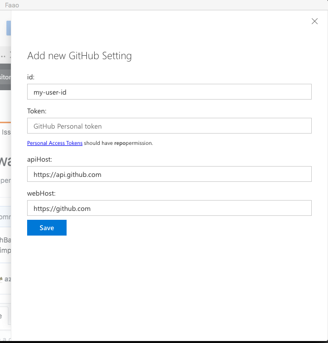

autoscale: true

# Faao

## GitHub Issue Client

----

# 過去に作ったやつ

- [azu/GithubReader: Github Notifications Client for OS X](https://github.com/azu/GithubReader "azu/GithubReader: Github Notifications Client for OS X")
- [azu/github-reader: [node-webkit] GitHub client app - Viewer for Notifications and News Feed.](https://github.com/azu/github-reader "azu/github-reader: [node-webkit] GitHub client app - Viewer for Notifications and News Feed.")
- [azu/github-issue-teev: [NW.js] GitHub Issue Manager(Viewer)](https://github.com/azu/github-issue-teev "azu/github-issue-teev: [NW.js] GitHub Issue Manager(Viewer)")

-----


-----


-----

# [Faao](https://github.com/azu/faao)

-----


-----

# Faao - Feature

- Support Modern browser/mobile/Electron(recommenced)
- Support GitHub.com and GitHub Enterprise(GHE)
- Search Issue/Pull Request
      - [Search Syntax](https://help.github.com/articles/search-syntax/ "Search Syntax") is same with GitHub Search
- Mixed the result of search
      - e.g.) You can see the results of [Created](https://github.com/issues), [assigned](https://github.com/issues/assigned), [mentioned](https://github.com/issues/mentioned) as a single result
      - e.g.) You can see the results of `repo:azu/todo` on `github.com` and `repo:azu-ghe/todo` on GHE as a single result
- Support GitHub User Activity
- Quick to create issue
- Import/Export profile data

-----

# 目的

- OOSでGitHub Issueをちゃんと扱うものがない
- 技術的目的
    - Almin + TypeScript + DDDである程度の規模のアプリケーションを作りたかった

-----

# 規模感(2017-07-03現在)

```
✈ cloc src
       212 text files.
       208 unique files.
         4 files ignored.

github.com/AlDanial/cloc v 1.72  T=1.31 s (159.3 files/s, 12962.9 lines/s)
-------------------------------------------------------------------------------
Language                     files          blank        comment           code
-------------------------------------------------------------------------------
TypeScript                     165            859            478           8487
JSON                             7              1              0           6189
CSS                             34            120             60            728
Markdown                         2              3              0              6
-------------------------------------------------------------------------------
SUM:                           208            983            538          15410
-------------------------------------------------------------------------------
````

----

# 作戦

- 「ちゃんと考えてちゃんとやる」
- 技術的ショーケースとしての意味合いを持つ
    - ちゃんとモデリングする
    - ちゃんとテストを書く
    - ちゃんとドキュメントを作る

----

# DDD

## ちゃんとモデリング[^モデル]をやる

[^モデル]: ここでいうモデルはEntityとかValue Objectを含めたドメイン上のモデルクラス

----

# クライアントサイドDDD

- [faao/domain.md at master · azu/faao](https://github.com/azu/faao/blob/master/docs/domain.md "faao/domain.md at master · azu/faao")
- ドメインモデルの寿命が長い
    - 特にこういうクライアントアプリはずっと立ち上げっぱなし
- サーバ側の概念とクライアント側の概念は一致しないことがある
    - サーバ(GitHub)的にアカウントに対してGitHub APIのトークンが複数紐づく
    - クライアントからはTokenがあり、そのTokenに紐づくアカウントがいるように見える
      - Tokenがなければアカウントは分からない、アカウントだけ分かってもトークンがないと何もできない


----

## モデリング

- AppUser: アプリケーションのユーザー
- GitHubSetting: TokenやAPI hostなどを含んだセッション情報
- GitHubUser: GitHubのAPIを叩いた結果取得できるGitHubユーザー情報

多くの処理(ユースケース)は

> **AppUser**が**GitHubSetting**を使って 〜〜 する

のようになることが分かってくる

----

## 遠回りのモデリング

- 実際モデリングをしっかりやると進みが遅く感じる
    - 一つのモデルが大きくなりすぎないように気を配ったり
- 遠回りしてよかった場合もある
    - 安易なUI起因の値がドメインに流れてくるのを防げる

-----

## 遠回りの例


- GitHubSetting(Account)にアイコン画像を設定したいというIssue
- 安直にやるなら `GitHubSetting` へ `avatarImageURL` などを追加すれば終わり


```ts
interface GitHubSetting {
      id: Identifier<GitHubSetting>;
      token: string;
      apiHost: string;
      webHost: string;
      // ADD?
      avatarImageURL?: string;
}
```

----

## 遠回りの例 -> GitHubUser


- 後回しにしていて、GitHubUserの[Activity](https://github.com/azu/faao/issues/53 "Activity")を表示したいと思った
- このときに、`GitHubUser`というモデルが必要で、`avatarImageURL`はこの`GitHubUser`の`profile`に属するデータであると分かった
- 結果的に`GitHubSetting`に追加されたのは`GitHubUser`へのRelationship Id

```ts
interface GitHubSetting {
      id: Identifier<GitHubSetting>;
      token: string;
      apiHost: string;
      webHost: string;
      // Relationship
      gitHubUserId?: Identifier<GitHubUser>;
}
```

^ <http://www.nomnoml.com.s3-website-eu-west-1.amazonaws.com/#view/%0A%23direction%3A right%0A%23spacing%3A 50%0A%23padding%3A 20%0A[GitHubSetting|%0A [id]%0A [token]%0A [apiHost]%0A [gitHubUserId%3F] %0A]%0A[GitHubSetting] --> [GitHubUser]%0A[GitHubUser|%0A%09[id]%0A [profile| %0A %09[avatarImageURL]%0A ]%0A %0A]%0A>

----

# 遠回りのモデリング



- `GitHubSetting`と`GitHubUser`は想定するライフサイクルが異なった
- `GitHubSetting`で入力されたTokenを使って、`/user` APIを叩いて`GitHubUser`を作る
- 異なるライフサイクルを一つのモデルにまとめると破綻する未来が見えていた

----

# ドメインモデル -> 永続化

---


# Hard repository

----

# このアプリの永続化してる部分

----


----

# 永続化

- 検索履歴
- 検索クエリ
- 設定
- アクティビティ
- etc....
- 大体のモデルが永続化可能な形になってる

----

## [fit] 永続化はRepositoryの仕事だけど


- モデルのシリアライズ/デシリアライズの定義をするのは誰?
- `static fromJSON`と`toJSON`という安易な実装をモデルに生やしてる
- もっといい方法が欲しい(Decoratorはパス)

----

# [fit] ドメインモデルは永続化(技術的制約)を知らずに済むか

[Patterns, Principles, and Practices of Domain-Driven Design](https://www.amazon.com/dp/1118714709/ "Patterns, Principles, and Practices of Domain-Driven Design")より

- 妥協なしで行う
    - NHibernate[^読]やEntity Frameworkなどのデータモデルとのマッピングできるものを使う
    - モデルをそのままJSONなどにシリアライズして保存できるデータストアを使う
- 妥協ありで行う
    - リポジトリからデータを引くときに、Entityに対して外から値を指しながら復元させる
    - Mementoパターン - Entityのスナップショットとデータモデルをマッピング(今これ)

[^読]: えぬはいばーねいと

-----


^ マッピングできるタイプ

-----


^ JSONをそのまま保存できるもの + 妥協あり(ドメインが知っている)

-----


^ Mementoパターンでのスナップショット

----

# 妥協あり/なしの永続化

- ドメインは軽く永続化されることを意識する必要はある
- constructorでincrement idをしていると不整合を生むので駄目
	- constructorでちゃんと`{ id }` なども受け取れるようにする
	- モデルの初期化は面倒になっていくのでFactoryが初期化を担当する


```js
// 駄目なケース
let id = 0;
class User {
   constructor(){
      this.id = id++
   }
}
```


----
# スナップショットからの復元


- 今採用してるパターン
- 妥協ありパターンの一種である[TypeScript: Working with JSON · Choly's Blog](http://choly.ca/post/typescript-json/ "TypeScript: Working with JSON · Choly&#39;s Blog")(Entityに対して外から値を指しながら復元させる)に比べると少し安全で何とか手で書いていけるレベル
- しかしスナップショットが現在のモデルと一致してるとは限らない
- スナップショットのバージョニングなどが必要となっていく
	- フレームワークになってないとそろそろ面倒

----

# Repository

- インメモリで終わる or データが常にサーバにある場合のRepositoryは単純なMap
- モデルの永続化を考えだしたときに大変になるのは、Repository
- モデルも永続化は全く意識はしてない場合、後から概念/構造に変更が出て大変となる
	- 影響度: 概念 > 構造 > 実装...
- ついでに永続化するとIndexedDBなどを使うの非同期処理がやってくる
	- [Faaoの実装](https://github.com/azu/faao/tree/master/src/infra/repository)では初期化と保存のみを非同期にして、Readは同期にした
	- Readを非同期にするとStoreも非同期にする必要がでてきて面倒そうだった

----

# UseCase

----

# UseCase

- アプリケーションのドメインを使った、やりたいことの流れを書くところ
- このアプリのユースケースは
	- GitHub APIを使ってSearch
	- GitHubSettingの作成、保存 などなど
- ユースケースの再利用性
	- 基本的にはしない、拡張ユースケースは使う
	- [UseCaseの再利用性 - yoskhdia’s diary](http://yoskhdia.hatenablog.com/entry/2016/10/18/152624 "UseCaseの再利用性 - yoskhdia’s diary")

----

# ユースケース図

----

# Living Documentation


-----

# Almin

-----

# TypeScript

-----

# Jest

- expect
- assert
- mock

-----

# Work on everything

-----

- Browser
- Mobile
- Electron

-----

# GitHub API

- octokat

-----

# GraphQL

- events?

-----

# GitHub API trap

------

# Philosophy

-----

# Debuggablity

- Repository
- Store/State
- View

-----

# Hard testing


------

- PPPDDD
- Living Documentation
