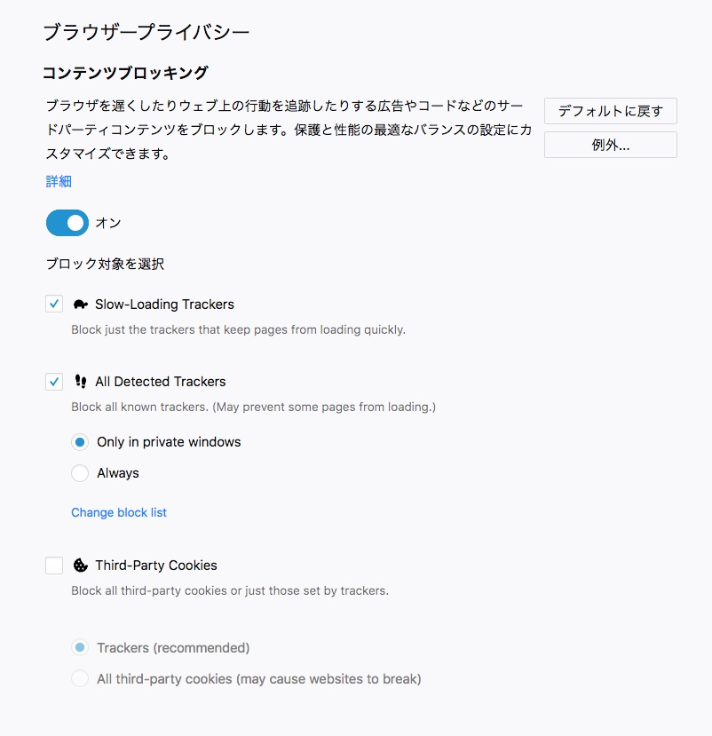
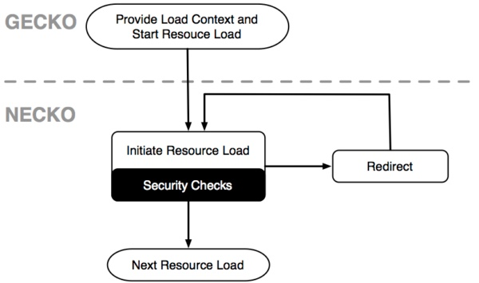

autoscale: true

# Firefoxのトラッキングブロックについて

----

# 自己紹介


- Name : **azu**
- Twitter : @[azu_re](https://twitter.com/azu_re)
- Website: [Web scratch], [JSer.info]

[Web scratch]: http://efcl.info/ "Web scratch"
[JSer.info]: http://jser.info/ "JSer.info"

----
# Firefoxのトラッキングブロックについて

- 今日の情報は2018-09-10書かれたものです。
- 最新の内容は以下を参照してください
- [Mozilla Security Blog](https://blog.mozilla.org/security/ "Mozilla Security Blog")
- [Security/Tracking protection - MozillaWiki](https://wiki.mozilla.org/Security/Tracking_protection#Tracking_annotations "Security/Tracking protection - MozillaWiki")


----


# Anti-tracking

- FirefoxがAnti-trackingな実装を始めた
- 将来的にデフォルトでトラッカーをブロックしたいという方針を掲げた
- [Changing Our Approach to Anti-tracking - Future Releases](https://blog.mozilla.org/futurereleases/2018/08/30/changing-our-approach-to-anti-tracking/)

----

# Anti-tracking

- Improve page load performance
  - [SHIELD Studies](https://support.mozilla.org/en-US/kb/shield)の一環として[FastBlock](https://bugzilla.mozilla.org/show_bug.cgi?id=FastBlock)をテストする
- Remove Cross-site tracking
  - トラッキングクッキー
  - localStorageへのアクセスを防止する

----

# Why

- [Why we need better tracking protection | Mozilla Security Blog](https://blog.mozilla.org/security/2018/09/05/why-we-need-better-tracking-protection/)
- 人々はウェブ上でトラッキングによってデータ収集されるの対して不快感がある
- Opt-inのDNTはサイトが無視するため不十分
  - [Hulu has joined this list of major platforms that ignore Do Not Track requests - Marketing Land](https://marketingland.com/hulu-joined-list-major-platforms-ignore-not-track-requests-185610)
- また過去の研究から
  - DNTを理解している人は少ない
  - デフォルト設定を変更する人は少ない
- トラッキングの高度化
  - クッキー以外の方法でもトラッキングがおこなわれるようになった
  - evercookie、cookie syncingなど
- => ユーザーが選択ではなく、デフォルト値を変更することにした

---

# 仮説と目的

- [FastBlock - PHD - Google ドキュメント](https://docs.google.com/document/d/1LQdOFIZeoiD38NNMxvpm32bX6Urnv0KbEsGfgAuw5L8/edit)
- TB(Tracking Block)についての仮説
  - TBはFirefoxの"Speed"にプラスの影響を与える可能性がある
  - TBはページロードのパフォーマンスを改善する可能性がある
  - TBはページの破損(breakage)といった悪影響を及ぼさないだろう
- まとめ: Improve speed without breakage

---

# Slow Tracking Script

- ウェブサイトの合計ロード時間の55.4%がサードパーティトラッカーによって行われている
  - (合計なので、表示にかかるロード時間が50%という意味ではなくその後なども含んでいる)
  - [Ghostery Tracker Tax Report Shows How Fast the Web Could Be | Digital Trends](https://www.digitaltrends.com/computing/ghostery-web-tracker-study/)
  - 今は更に増えてる [The Tracker Tax - Ghostery](https://www.ghostery.com/lp/trackertax/) 
- Fast Blockは遅い(5秒以上ロードにかかる)トラッキングスクリプトをブロックする

---

# Firefox Nightly



- [x] Fast Block
- ルールベースのブロッキング(disconnectの2種類のルール)
  - [x] Private mode
  - [ ] デフォルト
- [ ] サードパーティトラッキングCookieのブロック

----

## ファーストパーティCookie(Same-site cookie)

- 見ているドメインと同じドメインに紐づくもの

## サードパーティCookie

- 見ているドメインとは異なるドメインに紐づくもの

----

## トラッキング

> トラッキング (行動追跡) は一般的に、ユーザーの複数のサイトにまたがる閲覧データを収集することを指します。
> -- https://support.mozilla.org/ja/kb/tracking-protection

- ただし動作については未定義
- Firefoxではサードパーティ + リストに入っているものをトラッキングスクリプトとして扱う
- [Disconnect](https://disconnect.me/)をベースにした[トラッキングリスト](https://github.com/mozilla-services/shavar-prod-lists)を利用する

----

## トラッカー

トラッキングをするもの

----

# Firefoxの実装

----


# Necko

> Necko is a network library that provides a platform-independent API for several layers of networking, ranging from transport to presentation layers
> -- [Necko - Mozilla | MDN](https://developer.mozilla.org/en-US/docs/Mozilla/Projects/Necko)

-----

# Necko

- FirefoxのネットワークにおけるセキュリティチェックはNecko(`network`)で行われる
  - [【翻訳】コンテンツセキュリティのデフォルト適用技術 - Mozilla Security Blog 日本語版](https://mozsec-jp.hatenablog.jp/entry/2016/12/10/183822 "【翻訳】コンテンツセキュリティのデフォルト適用技術 - Mozilla Security Blog 日本語版")
  - [Enforcing Content Security By Default within Web Browsers](https://blog.mozilla.org/security/files/2016/11/5589a101.pdf "5589a101.pdf - 5589a101.pdf")
- [Gecko](https://developer.mozilla.org/ja/docs/Mozilla/Gecko)はレンダリング/レイアウトエンジン

----



----

# "トラッキング"の判定

- Firefoxにおける"トラッキング"スクリプトとは何かを実装から見ていく
  - コンテンツブロックで"トラッカー"をブロックするとあるが、何をブロックするのかは載ってない
- [Security/Safe Browsing - MozillaWiki](https://wiki.mozilla.org/Security/Safe_Browsing)
  - Safe Browsingなどを扱うURLClassifierあたりで実装されている
- ソースコードは<https://dxr.mozilla.org>や[mozilla/gecko-dev](https://github.com/mozilla)を見る
    - `git clone --depth 1 https://github.com/mozilla/gecko-dev.git`
    - [Nightly を使ってコントリビュートする - 開発ツール | MDN](https://developer.mozilla.org/ja/docs/Tools/Contributing/Contribute_on_nightly)

---


- [TrackingURICallback::OnClassifyComplete](https://dxr.mozilla.org/mozilla-central/source/netwerk/base/nsChannelClassifier.cpp?q=TrackingURICallback%3A%3AOnClassifyComplete&redirect_type=single#987)
  - チェックを開始する
  - トラッキングテーブルにマッチするURLなら`TrackingURICallback::OnBlacklistResult`へ

```
    if ((shouldEnableTrackingProtection && inTrackingTable) ||
        (shouldEnableTrackingAnnotation && inAnnotationTable)) {
      // Valid blacklist result, need to check the whitelist(s) next
      return OnBlacklistResult(NS_ERROR_MAYBE_TRACKING_URI, inTrackingTable,
                               inAnnotationTable);
    }
```

----

- `TrackingURICallback::OnBlacklistResult`
  - blacklistにマッチしたら
  - このうちwhitelistにマッチしない => tracking
    - 次の2種類のURLがtrackingになっている
    - `NS_ERROR_TRACKING_ANNOTATION_URI`
    - `NS_ERROR_TRACKING_URI` 

----

:memo: trackingの違い

- `NS_ERROR_TRACKING_URI` テーブルに入ってる純粋なトラッカー
- `NS_ERROR_TRACKING_ANNOTATION_URI` テーブル外のトラッカー

```cpp
  // The lookup failed to match at least one of the active whitelists
  // (tracking protection takes precedence over tracking annotations)
  return OnWhitelistResult(isTracker ? NS_ERROR_TRACKING_URI :
                           NS_ERROR_TRACKING_ANNOTATION_URI);
```

-----

- TrackingURICallback::OnTrackerFound
  - https://developer.mozilla.org/en-US/docs/Mozilla/Tech/XPCOM/Reference/Interface/mozIThirdPartyUtil で3rd party判定
- HttpBaseChannel::SetIsTrackingResource
  
```cpp

void
HttpBaseChannel::SetIsTrackingResource(bool aIsThirdParty)
{
  LOG(("HttpBaseChannel::SetIsTrackingResource thirdparty=%d %p",
       static_cast<int>(aIsThirdParty), this));

  if (aIsThirdParty) {
    MOZ_ASSERT(!mIsFirstPartyTrackingResource);
    mIsThirdPartyTrackingResource = true;
  } else {
    MOZ_ASSERT(!mIsThirdPartyTrackingResource);
    mIsFirstPartyTrackingResource = true;
  }

  if (mLoadInfo) {
    MOZ_ALWAYS_SUCCEEDS(mLoadInfo->SetIsTracker(true));
  }
}
```

----

# トラッキング is

- TrackingResource は `(third party or first party) and リストマッチ` したもの

```cpp
NS_IMETHODIMP
HttpBaseChannel::GetIsTrackingResource(bool* aIsTrackingResource)
{
  MOZ_ASSERT(!(mIsFirstPartyTrackingResource && mIsThirdPartyTrackingResource));
  *aIsTrackingResource =
    mIsThirdPartyTrackingResource || mIsFirstPartyTrackingResource;
  return NS_OK;
}
```

----

## サードパーティかどうか

- [ThirdPartyUtil::IsThirdPartyInternal](https://dxr.mozilla.org/mozilla-central/source/dom/base/ThirdPartyUtil.cpp#46)
- BaseDomain同士を一致するか比較するだけ
    - `"www.bbc.co.uk"` のBaseDomainは `"bbc.co.uk"`
    - ドメイン名 + [public suffix](https://publicsuffix.org/)のこと
- 例) 
    - a.example.com === b.example.com // 同じベースドメイン
    - a.example.com !== c.ex.com      // 異なるベースドメイン = aから見てcはサードパーティ

----

```cpp
nsresult
ThirdPartyUtil::IsThirdPartyInternal(const nsCString& aFirstDomain,
                                     nsIURI* aSecondURI,
                                     bool* aResult)
{
  if (!aSecondURI) {
    return NS_ERROR_INVALID_ARG;
  }

  // Get the base domain for aSecondURI.
  nsCString secondDomain;
  nsresult rv = GetBaseDomain(aSecondURI, secondDomain);
  LOG(("ThirdPartyUtil::IsThirdPartyInternal %s =? %s", aFirstDomain.get(), secondDomain.get()));
  if (NS_FAILED(rv))
    return rv;

  // Check strict equality.
  *aResult = aFirstDomain != secondDomain;
  return NS_OK;
}
```

----

## そのほかのトラッキングスクリプトに対する変更

- [Security/Tracking protection - MozillaWiki](https://wiki.mozilla.org/Security/Tracking_protection#Tracking_annotations)
  - トラッキングスクリプトのload priorityの低下
    - トラッキングスクリプトからのリクエストも対象: `fetch`やXHRが見てる
  - トラッキングスクリプトのリクエストをスロットリング
  - トラッキングスクリプトを"tailling"
    - [Firefox 57 delays requests to tracking domains - mayhemer's blog](https://www.janbambas.cz/firefox-57-delays-requests-tracking-domains/)
  - FastBlock: 遅いトラッキングスクリプトのリクスエストをキャンセル

----

## ITPとStorage Access API

- Safari ITP
  - [ITPの仕様と挙動について、あまり知られていないことを簡単に整理する – マーケティングメトリックス研究所/MARKETING METRICS Lab.](https://www.mm-lab.jp/report/itp_specification_and_behavior/)
  - [ITP 2.0の機能の検証 - NO AD NO LIFE](http://inchom.hatenadiary.jp/entry/2018/06/17/012526)

----

## Storage Access API

> Summary: Storage Access API is used to grant first-party storage access to
third-party embedded content under some browser controlled conditions.

- [Proposal: Storage Access API · Issue #3338 · whatwg/html](https://github.com/whatwg/html/issues/3338)
  - Safari: 実装済み
  - Firefox : [Intent to Implement: Storage Access API - Google グループ](https://groups.google.com/forum/#!msg/mozilla.dev.platform/l8bV4RFgAc4/MKl9jbJpBQAJ)
  - iframeでのクロスドメインからCookieやStorageのアクセスを制限する
  - Youtubeの埋め込み、SNSボタンの埋め込みによるトラッキングの防止
    - YoutubeはR18の反映などをするためにCookieを使う => UIが変わる
  - embed iframe -> 埋め込みサイトに許可を得ないでトラッキングできる -> 問題(いいねボタン問題)
  - embed iframe + postmessage -> 埋め込みサイトにも連携が必要 -> まああり

----

## Sandbox iframe vs. SOP

- Opt-inでSame Origin Policy(SOP)のドメインを拡張する提案
- <https://twitter.com/johnwilander/status/1038556125073879040>
- [Single Trust and Same-Origin Policy v2 from John Wilander on 2017-03-24 (public-webappsec@w3.org from March 2017)](https://lists.w3.org/Archives/Public/public-webappsec/2017Mar/0034.html)