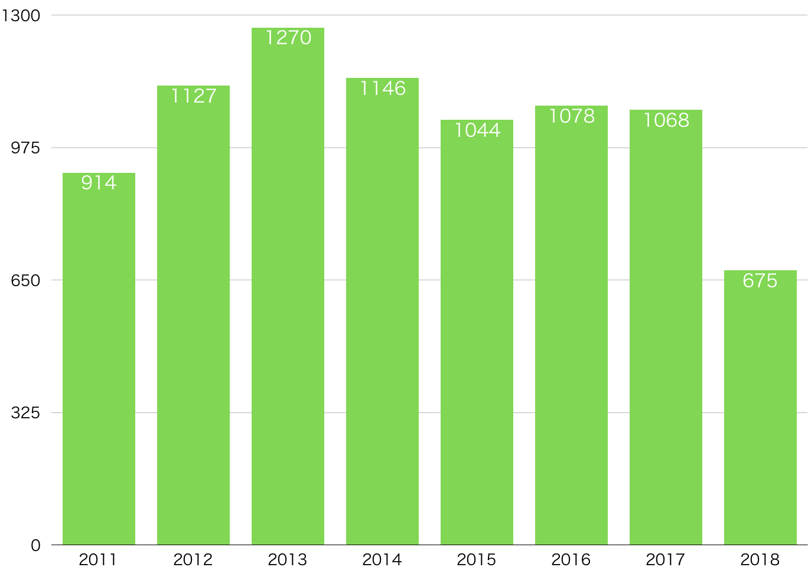
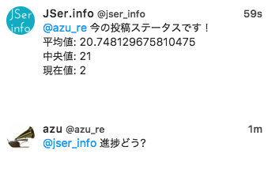
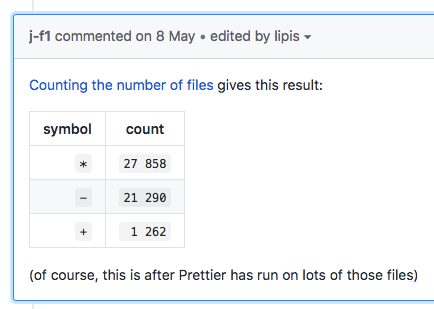
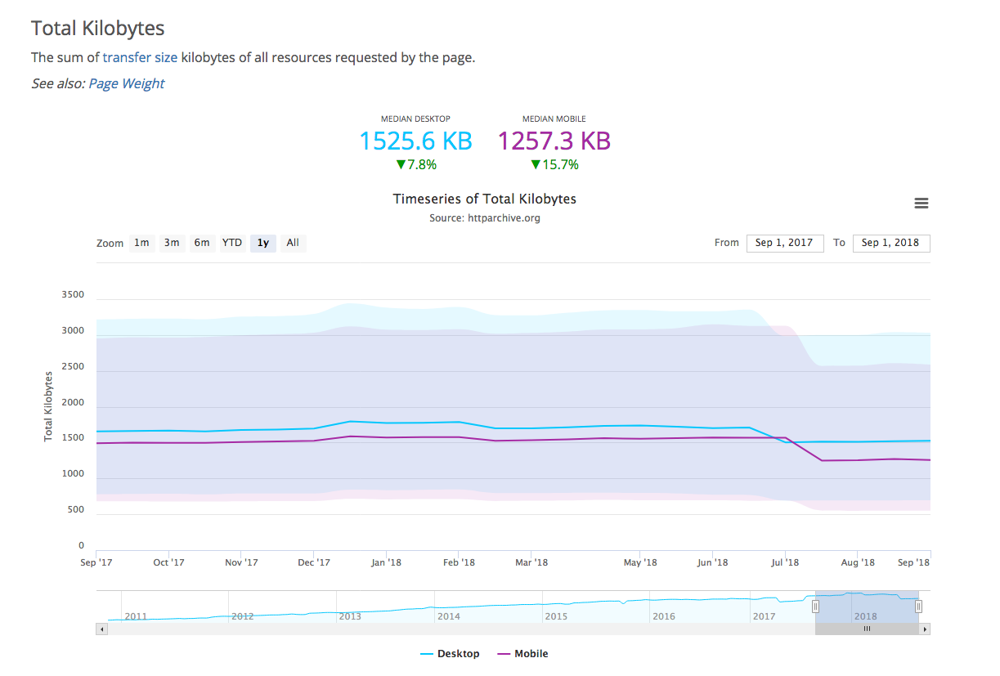
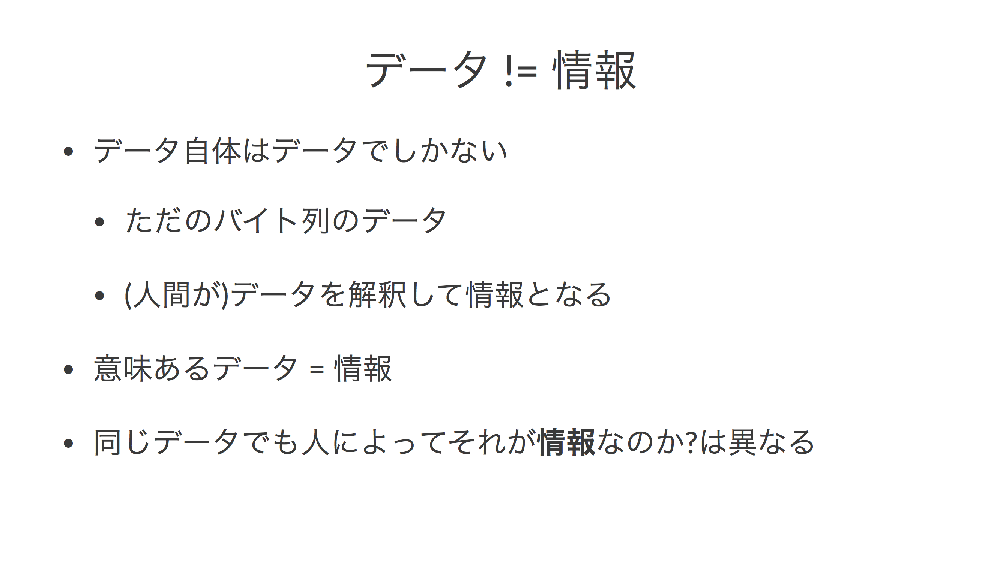
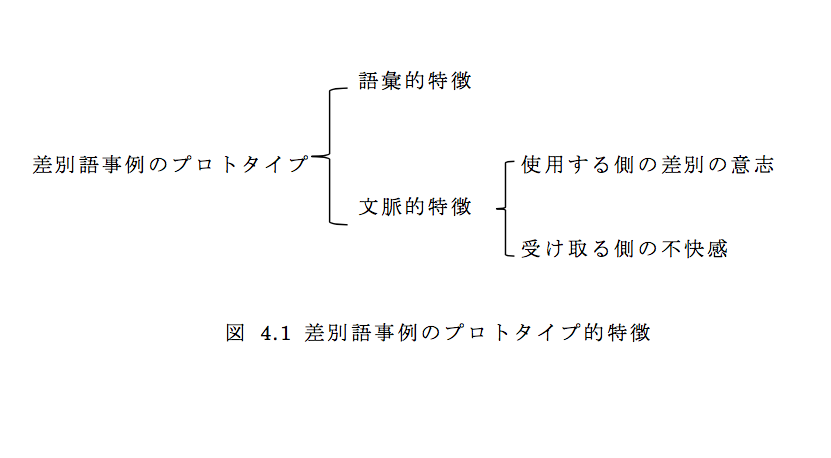

autoscale: true

# JSer.info 400回記念イベント

----

# 自己紹介


- Name : **azu**
- Twitter : @[azu_re](https://twitter.com/azu_re)
- Website: [Web scratch], [JSer.info]

[Web scratch]: http://efcl.info/ "Web scratch"
[JSer.info]: http://jser.info/ "JSer.info"

-----

## JSer.infoとは

- 2011年1月15日から週一で更新しているJavaScript情報サイト

----

### 紹介アイテム数



^ 一日数千ぐらいの記事を見ていて、
^ 一週間で平均20.74コの記事をあつめています。
^ それを401週間がつづけていて、これまでの紹介したものは8322コになります。

----

### 投稿記事数


^ 年間の投稿記事数は大体52-53コでした
^ 1年が365日なので大体7でわった数字が平均の投稿数です。

----

### 投稿記事の合計


^ 投稿記事数は大体同じペースで進んでいるので、
^ 先週(2018-09-11)で400回目の投稿になりました

----

# 400 🎉

^ 無事400回を迎えることができました

----

# JSer.infoの更新

- 以前書いたワークフローが続いてる
- 週一の更新が8年弱続いている
- [JSer.infoの作り方](http://azu.github.io/slide/2017/jser_info/how_to_make_jser_info.html "JSer.infoの作り方")
- [JSer.infoを開始してから7年が経ちました - JSer.info](https://jser.info/2018/01/15/jser-info-7years/ "JSer.infoを開始してから7年が経ちました - JSer.info")

----


----

# 変更点

- Twitter Bot
- 記事ドラフトの自動作成
- タイトルの自動化

-----

## [Twitter Bot](https://github.com/jser/twitter-bot)



- 進捗を教えてくれる
- PRを出してくれる
- 基本的にPCで編集は行うけど、閲覧はモバイルで行うために作った

----

## 記事ドラフトの自動作成


- 紹介候補のアイテムを追加するたびに記事のドラフトを更新
- 記事アイテムは、過去データを使って学習してカテゴリ分類する
    - [@jser/classifier-item-category](https://github.com/jser/dataset/tree/master/packages/%40jser/classifier-item-category)
- 記事の作成はタイトルとヘッドラインの説明を書くだけ

----

## タイトルからslugを作成


- [probot-jser-info](https://github.com/jser/probot-jser-info)によって、記事のタイトルとURL(slug)が自動的に同期する
    - [probot](https://github.com/probot/probot)を使ったbot
    - GitHubのイベントに応じた反応をするフレームワークみたいなもの
- コミットする時に記事っぽいファイルなら、ファイル名を自動的に変更する機能を実装した

----

# JSer.infoの投稿時の手動部分

- タイトルを決める
- タグを決める
- ヘッドラインを書く
- 残りの部分はGitHubのUIでそのまま書いてる
    - ヘッドラインを書くときは[withExEditor](https://github.com/asamuzaK/withExEditor)でエディタを使う

----

# JSer.infoのデータ・セット

- 8322コのアイテム(タイトル、URL、説明、タグ、関連URL)、JSer.infoの記事が401コある
- [@jser/stat](https://github.com/jser/dataset/tree/master/packages/@jser/stat)を使うと扱いが楽
- [jser/dataset: JSer.infoのデータセットや処理ライブラリ](https://github.com/jser/dataset)
- [JSer.infoのデータセットと統計前処理ライブラリを公開しました | Web Scratch](https://efcl.info/2018/05/15/jser-dataset/)

----

```js
import { JSerStat } from "@jser/stat";
import { fetchItems, fetchPosts } from "@jser/data-fetcher";
(async () => {
    const [items, posts] = Promise.all([fetchItems(), fetchPosts()]);
    const stat = new JSerStat(items, posts);
    const firstWeek = stat.findJSerWeek(1);
    // JSer.infoの1回目の記事
    const firstItem = firstWeek.items[0];
    // JSer.infoで最初のアイテム
})();
```

----

# Tryしたがうまくいかなかったもの

----

# Podcast

----

# [jser/podcast: JSer.info podcast creator](https://github.com/jser/podcast)

- 記事から自動生成できるPodcastシステム
- 記事をアイテムごとに分解
- アイテムをSSMLに変換
- SSMLを[Amazon Polly](https://docs.aws.amazon.com/polly/latest/dg/supported-ssml.html)に投げてmp3を生成
- アイテムのmp3を結合して記事のmp3を作成する

^ 失敗例1: Podcast
^ カタカナ英語の問題とシステムが微妙に複雜だったので中断した

----

# AMP Story

----

# AMP Story


- [AMP Story](https://www.ampproject.org/stories/)に対応している
- https://jser.info/2018/xxx
- -> https://jser.info/**ampstory**/2018/xxx
- AMPはOptionalではなくデフォルトになるため相性がいまいち悪い
    - `link`を設定するとAMPを優先してしまう

^ 失敗例2: AMP Story
^ AMP StoryをOptionalなページとして扱おうとすると難しかった
^ AMPと本文が一致してないと怒られてしまう

----

# いろいろ失敗してる

- いろいろやっていろいろ失敗もしてる
- いまも日本語で書けるechojsみたいなのが欲しいとか考えている
- フロントエンドランチの補助とかslack連携とかなんかやったほうがいいのかとか考える
- これもJSer.infoの目的を果たすため

----

# JSer.infoの目的

> このサイトは言語問わないJavaScriptの情報を紹介するサイトです。しかし、真の目的はJavaScriptの情報を”紹介”ではなく”知ってもらう”事にあるため、継続的な活動が必要となるでしょう。
> -- [JSer.infoについて - JSer.info](https://jser.info/about/)

^ JSer.infoの目的は情報を紹介するのではなく、知ってもらうことにあります。
^ なので、情報を知るのにJSer.infoを経由する必要はありません。
^ 一方で、世の中にはさまざまなデータが溢れているので、そのまま見るのは膨大でエネルギーが必要です。

----

# We continue to improve ⬆️

----

# 今日のイベントの話

-----


# このイベントの趣旨

- データは十分にある
- 一方で自分で探すと集まるデータは偏りやすい
- いろいろな角度の情報を好み、情報の確度を上げる
  - 多すぎる情報の扱いは現代の課題
- いろいろな情報は議論で効率よく得られる
- なので議論しよう

-----

# テーマ

## 「憶測しないで議論しよう」

^ 今日のテーマは「憶測しないで議論しよう」しようです。
^ このスライドは技術的な内容でもないのでふーんで思いながら聞いてください。

----

# 議論しやすくするための補助

- イベントの議事録
    - イベントの議事録はリアルタイムで書かれています
- 質問ボード
    - 発表に関する質問はリアルタイムで書けます

----

# 議事録

## [https://bit.ly/jser400-paper](https://bit.ly/jser400-paper)

----

## 議事録: Dropbox Paper


## [https://bit.ly/jser400-paper](https://bit.ly/jser400-paper)

- このイベントはDropbox Paperで議事録が公開されています
- 書紀枠の方によってリアルタイムにメモが書かれていきます
- Thanks to [@lequinharay](https://twitter.com/lequinharay), [@448jp](https://twitter.com/448jp), and [@suzuki](https://twitter.com/suzuki)

----

## 議事録: 注意


## [https://bit.ly/jser400-paper](https://bit.ly/jser400-paper)

- ログイン済みは”ドキュメントを開く”をクリックすると開ける
    - メールアドレスがツールバーに表示される
- ログインしていない場合もドキュメントは閲覧できる
    - メールアドレスを出したくない人はPrivate Windowで閲覧すればOK

----

# 質問ボード

## [https://sli.do/#jser400](https://sli.do/#jser400)

----

## 質問: sli.do

> [https://sli.do/#jser400](https://sli.do/#jser400)

- sli.doに質問ボードが用意されています
- 発表中に疑問に思ったことをできるだけ詳しく書き込む
    - 議事録も参考にしましょう
    - 質問時間を多めにとってあります
- Thanks to [@takanoripe](https://twitter.com/takanoripe)

----


# テーマ

## 「憶測しないで議論しよう」

----

# どのようなときに憶測で話すか?

- 未知の分野
- 興味がない分野
- 印象
- 過去のイメージを引きずっている場合
- 漠然とした憶測
- データがない
- 判断材料がない

-----

## :memo: 憶測と推測

- 「推測」 – ある根拠（理由やデータ）をもとにものごとを考えること
- 「憶測」 – 根拠（理由やデータ）なしにものごとを考えること

----

# なぜ「憶測」する?

- すべてのことを知っている人はいない
- データがない分野は推測するか憶測する
- or 人に聞く

----

# すべてのことを知っている人はいない

- [Do you know MDN APIs?](https://mdn-browser-compat-data-learning-level.netlify.com/)
    - <https://mdn-browser-compat-data-learning-level.netlify.com/>
    - MDNに載っているすべての`standard_track`なAPIをYES/NOで答えるクイズアプリ
- API、CSS、CSS、HTML、HTTP、JavaScript、MathML、SVG、WebDriver、WebExt、XPath...

----


----

## 結果


- 適当にやって 5347/8502(63%) だった
    - (WebPlatform) API、MathML、SVGとかは知らないものが多かった
- 数時間かかるのでやらないほうがいい

----

# 個人の知識には限界がある

----

# 今のウェブにはデータが溢れている

- データは根拠を構成する一部
- 根拠 = 理由 + データ
- データを活用すると建設的な議論がしやすい

----

# データ

- [Google BigQuery の一般公開データセット](https://cloud.google.com/bigquery/public-data/?hl=ja)

----

## GitHub



- [GitHub データ](https://cloud.google.com/bigquery/public-data/github?hl=ja)
    - [GH Archive](https://www.gharchive.org/)
- BigQueryでGitHubのデータを検索できる
    - Prettierのデフォルト設定を決めるのに参考にされていた
    - [Markdown Unordered List Item Symbol · Issue #4251 · prettier/prettier](https://github.com/prettier/prettier/issues/4251)
 
----

## Chrome UX Report

- [Chrome User Experience Report  |  Tools for Web Developers  |  Google Developers](https://developers.google.com/web/tools/chrome-user-experience-report/)
- Chromeで集めたRUMなデータをBigQueryで引ける
- First Paint、First Contentful Paint、DOMContentLoaded、Connection Type、Device Type、Countryなど

----

## [HTTP Archive](https://httparchive.org/)



- [非営利組織のHTTP Archiveの一部](https://blog.archive.org/2011/06/15/http-archive-joins-with-internet-archive/)
- Chrome User Experience Reportと[Alexa](https://www.alexa.com/topsites)から得た100万+サイトを対象にクロールしたデータ
- [WebPagetest](https://webpagetest.org/)を使ったパフォーマンス関係のデータを取得できる(CrUXよりだいぶ詳細)
- BigQueryを使った検索もできる
- データを可視化した[ State of the Web ](https://httparchive.org/reports/state-of-the-web)も公開されている

----

## [HTTP Archive](https://httparchive.org/)


- [WebPagetestの結果](https://github.com/WPO-Foundation/wptagent/issues/86)には[Wappalyzer](https://www.wappalyzer.com/)を使ったフレームワーク判定を含むようになった
- フレームワークごとに分けてページ情報などを検索できる
    - [Loading Speed across JS Frameworks - Analysis - Discuss - HTTP Archive](https://discuss.httparchive.org/t/loading-speed-across-js-frameworks/1479)

---

## Browser Compatiblity Data

- [Chrome Platform Status](https://www.chromestatus.com)
- [WebKit Feature Status](https://webkit.org/status/)
- [Firefox Platform Status](https://platform-status.mozilla.org/)
- [Microsoft Edge web platform features status](https://developer.microsoft.com/en-us/microsoft-edge/platform/status/)
- [mdn/browser-compat-data](https://github.com/mdn)
    - MDNのAPIの互換テーブル表で使われてるデータ

----

## Webのデータ

- [Firefox Public Data Report](https://data.firefox.com/)
- [Let's Encrypt Stats - Let's Encrypt - Free SSL/TLS Certificates](https://letsencrypt.org/stats/ "Let's Encrypt Stats - Let's Encrypt - Free SSL/TLS Certificates")
- [インターネットの観測情報 | Akamai](https://www.akamai.com/jp/ja/solutions/intelligent-platform/visualizing-akamai/internet-observatory/)

----

## データは完全ではない

- データは完全ではないことも多いので検証も必要
- 偏ったデータ
- 因子が足りていないデータ
- 人によって読み方違うデータ
    - データ ≠ 情報
    - 情報は主観的なデータ

----



> [JavaScript情報ってなんだっけ?](http://azu.github.io/slide/2016/jser5years/javascript-information.html)

----

## 議論が難しくなるケース

- データ自体が間違っているケース
- 一部の角度のみのデータを見ているケース
- 価値観や感情を根拠にしているケース

----

## 価値観や感情のケース

- Pythonのケース
    - [Issue 34605: Avoid master/slave terminology - Python tracker](https://bugs.python.org/issue34605)
- Reactのケース
    - [The use of "blacklist" is offensive! · Issue #13604 · facebook/react](https://github.com/facebook/react/issues/13604)
- Lernaのケース
    - [❌(REVERTED): Add text to MIT License banning ICE collaborators by jamiebuilds · Pull Request #1616 · lerna/lerna](https://github.com/lerna/lerna/pull/1616)

----

## 「差別」の難しさ

- 差別語には単語そのものと文脈からくる区別がある
- 特に文脈の解釈は個々の価値観によって行われるため議論が難航しやすい
- 参考: [日本語における差別語概念の変遷　―1960年代以降の差別語問題から考える― ](https://tohoku.repo.nii.ac.jp/?action=pages_view_main&active_action=repository_view_main_item_detail&item_id=99498&item_no=1&page_id=33&block_id=38)



----

## 例: blacklist

- ブラックリストの語源は差別とは異なるもの
- それを差別と感じるかどうかは個々の解釈が含まれる

> ＊　＊　＊
> イングランド王チャールズ2世が、清教徒革命で父王チャールズ1世に死刑を宣告した58人の裁判官のリストを亡命中に作成したことが「ブラックリスト（黒い名簿）」の起源であるという
> -- [ブラックリスト - Wikipedia](https://ja.wikipedia.org/wiki/%E3%83%96%E3%83%A9%E3%83%83%E3%82%AF%E3%83%AA%E3%82%B9%E3%83%88)

----

## 感情に感情で返す問題

- 感情で返すと話はすすみにくい
    - 「こうしたほうがいい」に対して「私はこれが嫌いです」と答えてしまう
- 感情の議論はZero Sumな結果になりやすい
    - YES or NOの結果なってしまう
    - それ以外にあるかもしれない最適な別の解を見逃してしまう

----

# RustConf 2018


- [RustConf 2018 - Opening Keynote](https://www.youtube.com/watch?v=J9OFQm8Qf1I)でのOpennessについての話
    - 参考: [aturon.log: listening and trust, part 1 · Aaron Turon](http://aturon.github.io/2018/05/25/listening-part-1/)
- コミュニティにはPluralism(多様性)とPositive Sumが重要という話

---

# Zero Sum と Positive Sum

- どうしても感情の議論はZero Sumの結果を目指してしまう
    - たとえば「Angularはここが面白い」に対して「私はAngularが嫌いなので興味がないです」で終わってしまう
    - Win-Loseな関係
- このイベントで目指す議論はPositive Sumな結果
    - たとえばVueの話を聞いて、AngularやReactでも似たような話があるので、互いの違いを教え合ったり、こういう手法はどうですかという話ができる
    - これは互いに知らなかったことを知ることができるためPositive Sum
    - Win-Winな関係

---

# 議論は勝ち負けではなく

- 最適な解決方法を目指す流れのこと
- ここでは結論がでなくても理解が深まればそれでいい
- 主張をちゃんと聞いてから反応を返す(途中で遮らない)
- 主張には根拠(理由とデータ)を示すとより論理的に議論できる
- 価値観の議論は難しい ->  ゼロサムよりもポジティブサムをめざして議論することを心がける

----

# JSer.info 400回記念イベントの目標

- 今日のイベントが目指すのはPositive Sum
- なにか得るものがあれば良い
- まあ難しいことはあまり考えずに楽しみましょう🙌


----

# Thanks