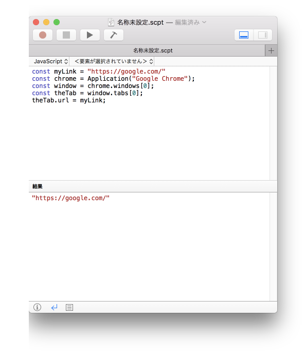
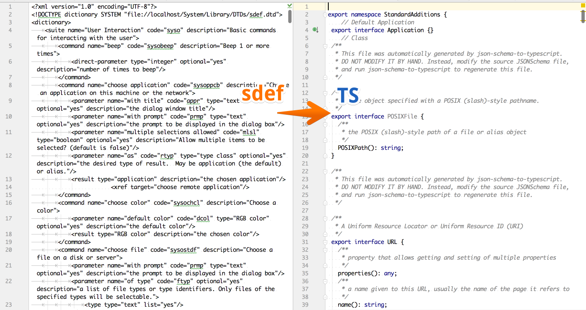

autoscale: true


# JXA for TypeScript/Node.js


----


# JXA(JavaScript for Automation)

- AppleScriptのJavaScript版(WebKit)
- macOSにはビルトインされているので何もしなくても使える
  - `osascript`という実行エンジンがある
- [Home · JXA-Cookbook/JXA-Cookbook Wiki](https://github.com/JXA-Cookbook/JXA-Cookbook/wiki "Home · JXA-Cookbook/JXA-Cookbook Wiki")
- [jxa@apple-dev.groups.io | Wiki](https://apple-dev.groups.io/g/jxa/wiki/JXA-Resources "jxa@apple-dev.groups.io | Wiki")


----


# JXAの問題


- クラッシュする
- リファレンスがまともにない
- 実行環境がまともではない – 落ちまくる
- エディタ環境もまともになり
- デバッグが難しい
- macOSのみ対応


-----


# JXAのいいところ


- (JXA)スクリプトファイルでmacOSの自動化ができる
- Objective-Cと同等の表現ができる
- mac向けにネイティブアプリはなんか操作できる
- mac向けのアプリでは一部便利な関数が用意されている


-----


# JXAのできること


- Automatorでできること全部
- アプリへのキー入力、開く閉じるなどの操作
  - ラベルを見つけて操作など無理やりなんとかできる
- 対応アプリはアプリから情報を取得できる
  - omnifocusはTodoデータをデータベースから引っ張れるとか
- ダイアログとかでインタラクティブなものを簡単につくれる
  - しょぼいGUIアプリみたいのが作りやすい


----


# JXAの用途


- アプリ作るほどじゃないけど自動化したいときに使う
  - シェルスクリプトのアプリ向け処理みたいな感じで使う
- macOSネイティブなので、Alfredなど対応アプリも多い
  -  `osascript` コマンドで実行できるのでシェル叩けるならどこからでも
  - メニューバーからも実行できるようにもなってる
  - [AppleScriptをメニューバーから実行するための設定](https://rcmdnk.com/blog/2015/07/26/computer-mac/)


-----


# スクリプト言語としてのJXA


- JavaScriptエンジンはmacOsに依存(WebKit/JavaScriptCore)

- 癖のあるJavaScriptフレームワーク上のJavaScriptという印象

  - プロパティがgetterじゃなくて `name()` のような関数呼び出し

- AppleScriptより扱いやすい

  - 非英語圏の人間にとってはAppleScriptの構文が難しすぎる
  - Objective-Cよりはるかに英語的な構文

  

----


## AppleScriptでChromeでGoogleを開く

```
set myLink to "https://google.com/"
tell application "Google Chrome"
	tell its window 1
		set theTabs to count of tabs
		set URL of tab 1 to myLink
	end tell
end tell
```


-----

## JXAでChromeでGoogleを開く

```js
const myLink = "https://google.com/"
const chrome = Application("Google Chrome");
const window = chrome.windows[0];
const theTab = window.tabs[0];
theTab.url = myLink;
```


----


# Apple想定の使い方





- スクリプトエディタ
  - エディタ かつ 実行環境


------


# Apple想定の使い方 - リファレンス


- スクリプトエディタから"用語説明"でインストールしてるアプリのリファレンスが見られる

* [鳶嶋工房 / AppleScript / 入門 / 用語説明の読み方(命令編)](http://tonbi.jp/AppleScript/Introduction/04/column.html "鳶嶋工房 / AppleScript / 入門 / 用語説明の読み方(命令編)")
* [鳶嶋工房 / AppleScript / 入門 / 用語説明の読み方(オブジェクト編)](http://tonbi.jp/AppleScript/Introduction/05/column.html "鳶嶋工房 / AppleScript / 入門 / 用語説明の読み方(オブジェクト編)")
* [鳶嶋工房 / AppleScript / 入門 / 用語説明の読み方(値編)](http://tonbi.jp/AppleScript/Introduction/06/column.html "鳶嶋工房 / AppleScript / 入門 / 用語説明の読み方(値編)")


-----


----


# JXAのデバッグ


- Safariを開く
- JXAで`debugger;`をいれて実行する
- Safariでデバッグできる
- コンソールが使えるのでREPLライク

```
debugger;
```

- [JavaScriptによるMacの自動操作入門の情報まとめ | 大石制作ブログ](http://blog.s0014.com/posts/2016-08-04-osxjs1/)


-----


# JXAの問題


- リファレンスが読めない
  - リファレンスに載ってないものが多すぎる
- まともなエディタ環境がない
  - コードの補完が効く環境がないに等しい
- デバッグが難しすぎる
  - 落ちる、クラッシュ、リファレンスない
- Node.jsでできるところはNode.jsでやりたい
  - `path`とか文字列処理とか、JXAはライブラリの仕組みはあるけどnpmは使えない


-----


# リファレンス


- リファレンス自体の読み方が難しい
  - `Tab`というクラスは定義されているが、`Tab`を得る方法が載ってない…
  - すべてのプロパティやコマンドなどが載っているわけじゃない(自動生成されているレベル)
- リファレンスは`.sdef`という複雑なXMLで書かれている
  - クラスの定義、enumの定義、定数、interfaceなどやたら高度な定義ができるXML


----


# リファレンスから型定義を生成する


- TypeScriptの型定義ファイルがあれば今どきのエディタは補完が効く
- リファレンス(`.sdef`)はある種の型定義XMLに見えた
- パースしてXMLから`.d.ts`を作ればいい
-  作った: =>  [@jxa/sdef-to-dts](https://github.com/JXA-userland/JXA/tree/master/packages/@jxa/sdef-to-dts)


----





----


# JXAの型定義ファイルを使ってコード補完する


- macOSに入ってるアプリなどのリファレンスからTypeScriptの型定義を生成
  - [@jxa/types](https://github.com/JXA-userland/JXA/tree/master/packages/@jxa/types)と[@jxa/global-type](https://github.com/JXA-userland/JXA/tree/master/packages/@jxa/global-type)
- [@jxa/global-type](https://github.com/JXA-userland/JXA/tree/master/packages/@jxa/global-type)は`global`にJXAのグローバルオブジェクトの定義を追加するモジュール
- 読み込めば、ざっくりとした補完 + 型チェックが効くようになる
  - リファレンス自体に載ってないものが多いため`any`で逃げている…

```typescript
import "@jxa/global-type";
// your JXA application
var userName = Application("System Events").currentUser().name();
```


-----


^ VSCodeやWebStormなどではある程度まともになる


-----


# JXAのデバッグ


- `console.log`するとスクリプトエディタが落ちる
- SafariにつないでもSafariごと落ちる
- CLIのREPLから叩くと落ちても安全
- 公式のREPLが `osascript` にビルトインされている


**REPLを起動する**

```
$ osascript -il JavaScript
```


----


# JXAの自作REPL


- `osascript` にREPLがあるのをしらなくてNode.jsで動くREPLを書いた
- `const repl = require('repl');`
  - [REPL | Node.js v10.5.0 Documentation](https://nodejs.org/api/repl.html)
- 作ったREPL:  [@jxa/repl](https://github.com/JXA-userland/JXA/tree/master/packages/@jxa/repl)


```shell
$ npx @jxa/repl
> Application("System Events").currentUser().name();
'azu'
```


----


# JXAのデバッグ


- JXAはとにかくデバッグしにくい
- JXAで書かなければ解決する
- JXAがいらない部分はNode.jsで書こう
- => Node.jsの中でJXAを実行すればいい


----


# JXA in Node.js


- [@jxa/run](https://github.com/JXA-userland/JXA/tree/master/packages/@jxa/run)
  -  Node.jsからJXAを実行して結果を取得するモジュール

* 先駆者
  * [sindresorhus/run-jxa: Run JXA code and get the result](https://github.com/sindresorhus/run-jxa "sindresorhus/run-jxa: Run JXA code and get the result")
  * [wtfaremyinitials/osa2: Interact with Apple's Open Scripting Architecture in node.js](https://github.com/wtfaremyinitials/osa2 "wtfaremyinitials/osa2: Interact with Apple's Open Scripting Architecture in node.js")


-----


# [`@jxa/run`](https://github.com/JXA-userland/JXA/tree/master/packages/@jxa/run)


```ts
import "@jxa/global-type";
import { run } from "@jxa/run";
export const currentUserName = () => {
    // このコールバック関数内はJXAとしてosascriptで実行される
    return run(() => {
        const sys = Application("System Events");
        return sys.currentUser().name();
    });
};

// メインとかは普通にNode.js
export const example = async () => {
    const userName = await currentUserName();
    return `User: ${userName}`;
};
```


-----


# JXA in Node.js


- JXAが最小限になる
  - 最小限のJXAは書かないといけないのは同じだけど…
- メインがNode.jsになってデバッグしやすい
- npmを簡単に組み合わせることができてエコシステムが拡張できる
- JXAで書いたものをモジュール化できる(npmで配れる)
  - つかえるのはmacOSだけなのは同じだけど


-----


```ts
export type ModifierOption = {
    shift?: boolean;
    control?: boolean;
    option?: boolean;
    command?: boolean;
};
function createModifier(modifierOption: ModifierOption) {
    const modifiers = [];
    if (modifierOption.shift)
        modifiers.push("shift down");
    if (modifierOption.command)
        modifiers.push("command down");
    if (modifierOption.control)
        modifiers.push("control down");
    if (modifierOption.option)
        modifiers.push("option down");
    return modifiers;
}
// キーストロークを送信する関数 from JXA in Node.js
export function sendKeyStroke(key: string, modifierOption: ModifierOption) {
    const modifiers = createModifier(modifierOption);
    return run((key, modifiers) => {
        const SystemEvents = Application("System Events");
        SystemEvents.keystroke(key, { using: modifiers });
    }, key, modifiers);
}

```


-----


# ユースケース


- Firefoxで開発者ツールを開いた状態でのスクリーンショットを撮って保存する
  - Seleniumだと開発者ツールを開けない?
  - [screenshot-dev-tools.ts](https://github.com/asciidwango/js-primer/blob/master/tools/applescript/src/screenshot-dev-tools.ts)


-----


# まとめ


- JXA in Node.jsをやるためにいろいろ書いた
- [JXA-userland/JXA](https://github.com/JXA-userland/JXA)のmonorepoで公開

- Integration JXA with [TypeScript](https://www.typescriptlang.org/index.html)
- Run JXA from [Node.js](https://nodejs.org/)
    - See [@jxa/run](./packages/@jxa/run) and [@jxa/repl](./packages/@jxa/repl)
- Support Auto complete for editor/IDE via [TypeScript](https://www.typescriptlang.org/index.html) definition file(`.d.ts`)
    - See [@jxa/types](./packages/@jxa/types) and [@jxa/global-type](./packages/@jxa/global-type)


----


# 似た概念


- [NILScript](http://lukewarm.s151.xrea.com/nilscript.html)
  - WindowsでSpiderMonkeyを使ったもの
  - とても良くできていて便利だった