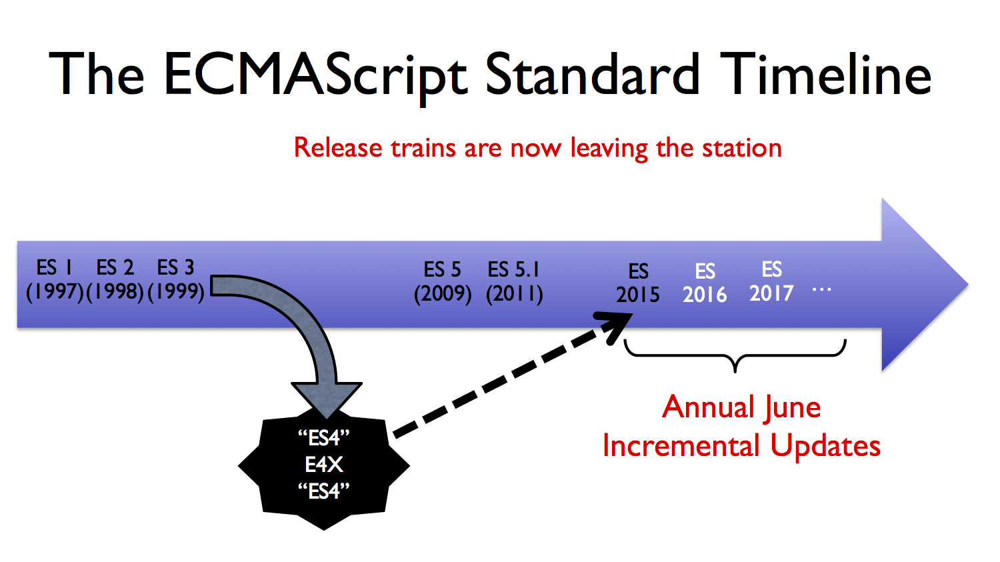
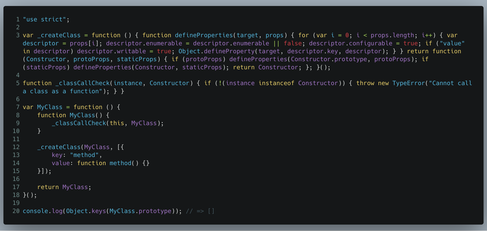
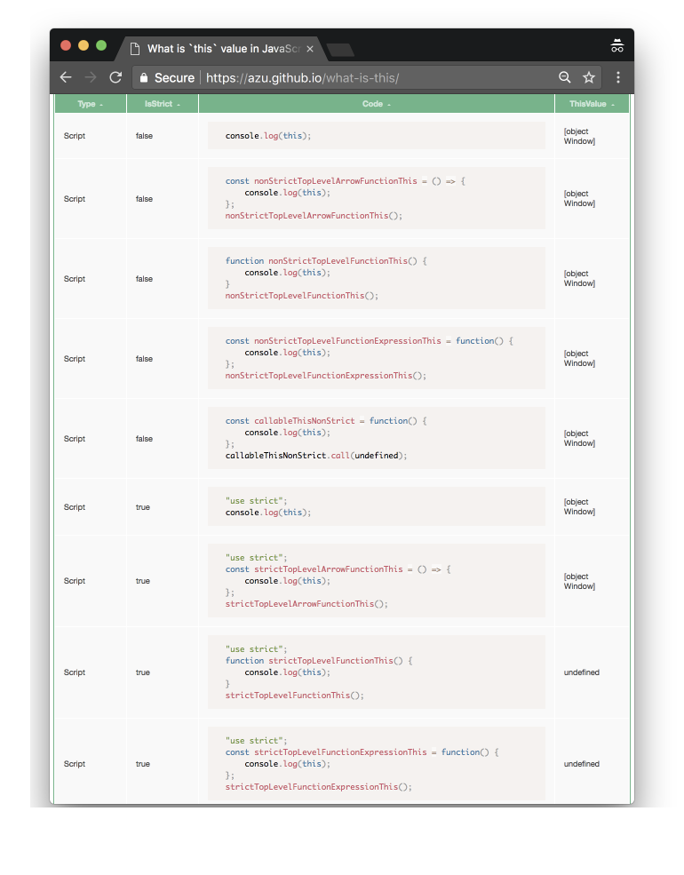
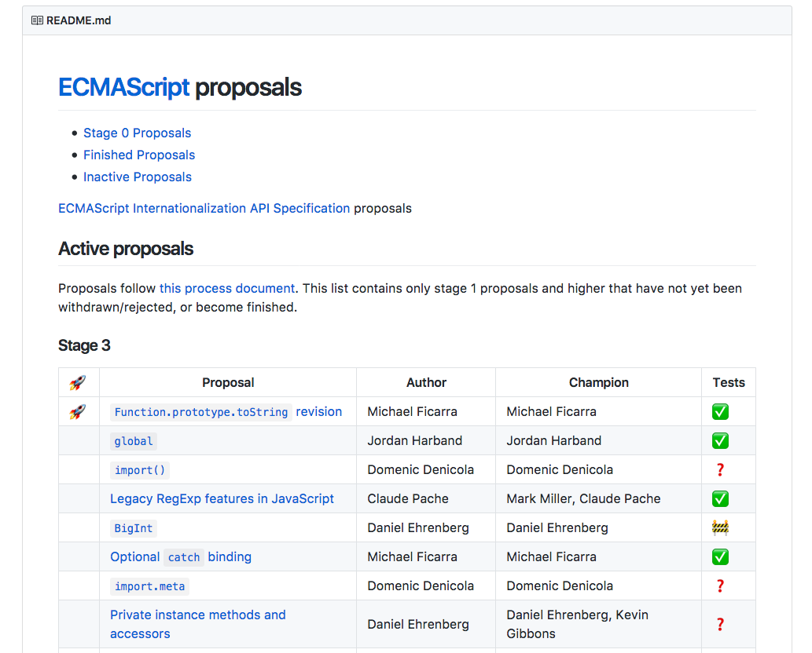
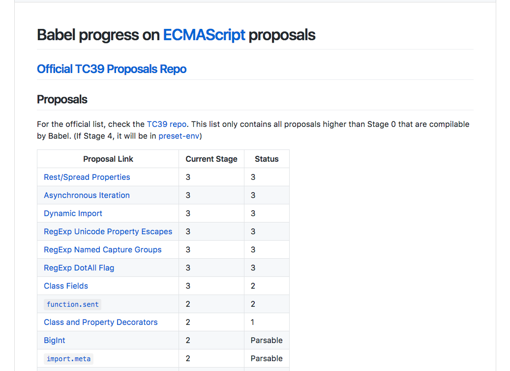
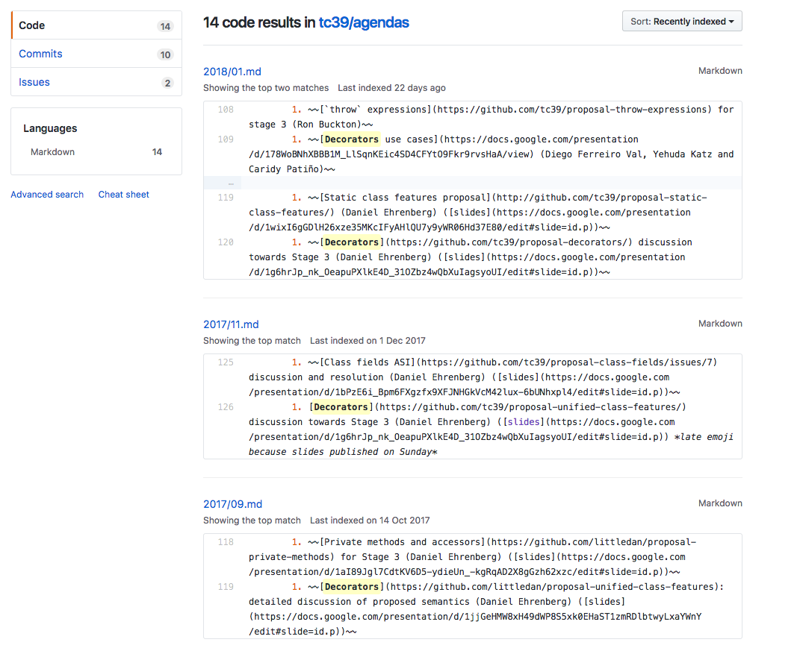
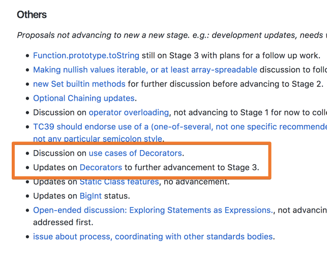
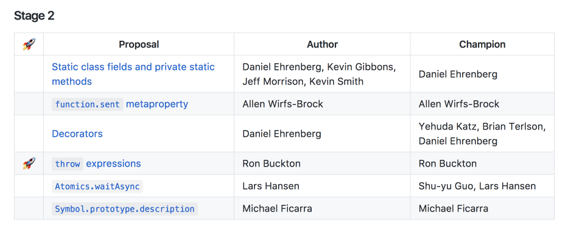

autoscale: true

# ECMAScriptの使い方

-----

# 自己紹介


- Name : **azu**
- Twitter : @[azu_re](https://twitter.com/azu_re)
- Website: [Web scratch], [JSer.info]
-  :zap: [ECMAScript Daily](https://ecmascript-daily.github.io/ "ECMAScript Daily")

[Web scratch]: http://efcl.info/ "Web scratch"
[JSer.info]: http://jser.info/ "JSer.info"

----

# アジェンダ

- ECMAScriptとは何か
- ECMAScriptの使い方の事例
	- 自律的にECMAScriptについての情報を検索できるようになる

-----


# 以前の話したもの

- [ECMAScript as a Living Standard](http://azu.github.io/slide/2016/node-es/ecmascript.html "ECMAScript as a Living Standard")
- ECMAScriptは毎年更新されるし、最新版はGitHubで毎日更新されてる
- Living Standardになってるよ

という話

-----


# ECMAScriptとは

- ECMAScriptは[Ecma International][]という団体によって標準化されている仕様
- Ecma内のTC39という技術委員会によって、どのような機能を仕様へ入れるかを議論、決定
- TC39はMicroSoft、Mozilla、Google、AppleといったブラウザベンダーやECMAScriptに関心のある企業などによって構成


-----

# ECMAScriptのバージョン


| バージョン | 日付       |
| -------- | --------  |
| 1        | 1997年6月  |
| 2        | 1998年6月  |
| 3        | 1999年12月 |
| 4        | 策定されずに破棄(ES4) |
| 5        | 2009年12月 |
| 5.1      | 2011年6月  |
| 2015     | 2015年6月  |
| 2016     | 2016年6月  |
| 2017     | 2017年6月  |

-----

# ECMAScriptのバージョンの歴史


- ES5.1からES2015がでるまで4年もかかってる
- ES2015以降は毎年リリースされている


-----




-----

# 仕様策定のプロセスの変化


- ES2015以前
	- すべての仕様の合意がとれてから一括リリース
- ES2016以降
	- 合意がとれた仕様から順次リリース
- ECMAScriptを毎年リリースするために策定プロセスを変更


----

## ES2016以降の仕様策定プロセス

- 仕様に追加する機能（API、構文など）をそれぞれ個別の**プロポーザル**（提案書）として進める
- 現在策定中のプロポーザルは![GitHUb][github] [tc39/proposals][]にて公開
- 各プロポーザルは責任者である**チャンピオン**と**ステージ**（Stage）と呼ばれる`0`から`4`の5段階の状態をもつ
	- チャンピオンが責任持ってプロポーザルを進める

----

## プロポーザルのステージ

| ステージ | 名前      | ステージの概要                                               |
| :------: | --------- | ------------------------------------------------------------ |
|    0     | Strawman  | アイデアの段階                                               |
|    1     | Proposal  | 機能提案の段階                                               |
|    2     | Draft     | 機能の仕様書ドラフトを作成した段階                           |
|    3     | Candidate | 仕様としては完成しており、ブラウザの実装やフィードバックを求める段階 |
|    4     | Finished  | 仕様策定が完了し、2つ以上の実装が存在している。[テスト](https://github.com/tc39/test262 "tc39/test262")がある。<br />正式にECMAScriptにマージできる段階 |


-----

## プロポーザルのステージの進み方

- 2ヶ月に1度行われるTC39のミーティングでプロポーザルのステージを更新
- ミーティングの議事録は![GitHUb][github] [tc39/tc39-notes][]で公開
- 毎年のECMAScriptをリリースするタイミング(6月)で、Stage 4のプロポーザルをマージ
- `ECMAScript 20XX`としてリリース


-----

## なぜ仕様策定プロセスが変わったのか

- ES2015以前: すべての仕様の合意が取れてからリリース
- ES2016以降: 合意が取れた仕様からリリース
- 変更理由: ECMAScriptのリリースに長い歳月がかかり言語の進化が停滞した
- 歴史的失敗: ES4では多くの変更を入れることを試みたが、TC39内でも意見が分かれ最終的に合意できなかった
	- これにより言語の発展が数年間停滞した[^1]

[^1]: [Programming Language Standardization: Patterns for Participation](http://wirfs-brock.com/allen/files/papers/standpats-asianplop2016.pdf)を参照

-----

## 仕様策定プロセス変更の影響

- ECMAScriptに入れようとする機能（プロポーザル）の形も変化した
	- 最大限最小(maximally minimal)のプロポーザル
	- 最初からすべて入れることは無理なので、最小限の形から入れる提案が増えた[^2]
- すべてのプロポーザルが入るわけではない
	- 代替のプロポーザルや後方互換性、ユースケースの問題で取り下げたプロポーザルも多い
- これはモジュール化されたプロポーザルは交換可能な事を表してる

[^2]: クラス、mixinなどがこのようなmaximally minimalで進んでいる


-----

## プロポーザルをエミュレート

- Stage 4に「2つ以上の実装が存在している」という必須要件がある
- 正式なECMAScriptになる前にはブラウザには実装される[^flag]
- TranspilerやPolyfillを使ってエミュレートできる
- Transpiler: 新しい構文を既存の機能で再現できるようにソースコードを変換するツール
	- TypeScript、Babelなど
- Polyfill: プロポーザルで追加された新しいメソッドや関数などを実装を提供するライブラリ
	- core-js、babel-polyfillなど


[^flag]: 多くはフラグ付き実装。一度Stableに入れると外せなくなるため。Stage 4の要件はあえて曖昧性を持たせている


-----

## :warning: TranspilerやPolyfillの注意 :warning:

- TranspilerやPolyfillはあくまで既存の機能で新しい機能を再現を試みているだけ
- 原理的に全く新しい機能は既存の機能では再現できない
	- コストの問題で再現してないこともある
- TranspilerやPolyfillをそのプロポーザルを学ぶために使うべきではない
- 先行して試せるようになったというのが大きい、プロポーザルへのフィードバックができる


-----

## Living StandardとなるECMAScript

- ECMAScriptの仕様書のドラフトはGitHub上の[tc39/ecma262][]で管理されている
- 本当の意味での最新のECMAScript仕様は<https://tc39.github.io/ecma262/>
- バージョン番号を付けずに、常に最新版を公開する仕様のことを**Living Standard**と呼ぶ
- 加えて、ECMAScript 2017のようにバージョン番号をつけたものも公開
  - バージョン付きECMAScriptは、スナップショットのようなもの 

-----


# [fit] 仕様や策定プロセスを知る意味


----


# 仕様や策定プロセスを知る意味

- 言語を学ぶため
- 言語が進化しているため
- 情報の正しい状態を調べるため

-----


## 言語を学ぶため

- JavaScriptという言語そのものを学ぶため
- 言語の詳細を知りたい場合にはECMAScriptという仕様を参照する
- JavaScriptにおいては言語機能に関しては[MDN Web Docs][]などで大抵は十分

-----

### 言語が進化しているため

- 言語が進化しているのは何かの問題を解決するため
- ECMAScriptはLiving Standardであり、言語仕様に新しい機能や修正などが日々行われている
	- ECMAScriptは後方互換性を尊重するため、今学んでいることが無駄になるわけではない
- この仕様はどのような経緯で入ったのかを調べる手段として策定プロセスを知る
	- 特にES2015以降はGitHubに殆どの情報があるので探しやすい

-----

### 情報の正しい状態を調べるため

- JavaScriptは幅広く使われている言語であるため、世の中には膨大な情報がある
- 検索して見つかる情報には正しいものや間違ったものが混在する
	- [JSer.info](https://jser.info/ "JSer.info")はこの問題を解決するために作った
- 検索できる情報と比較: 仕様やプロポーザルに関する情報は状態が明確
	- 仕様は安定。プロポーザルはステージという明示された状態があり、ステージ4未満の場合はまだ安定してない
- 問題を見つけた際に該当する仕様やプロポーザルなどよりオリジンに近いものを調べる手段を知る

^ これはECMAScriptにかぎらず、ウェブやブラウザに関する情報に関してはほぼおなじことがいえます。
ブラウザ関してはHTML、DOM API、CSS、IEFTなどもオープンな仕様とそれぞれ策定プロセスが存在しています。
これは今風の書き方といった煽りを避けるために必要な考え方。
先ほども書いたように新しい構文や機能が増えるのは何か問題があって解決したいから。
言語レベルで解決する必要ないなら言語に載せることはないし、何事もバランスが大事になる


-----


# 具体例 

-----

# :beginner: 実装が仕様に準拠しているかを調べたい

## この挙動って仕様なの?というのをすべてのJavaScriptエンジンで比較する

-----

## `eshost`

- [GoogleChromeLabs/jsvu: JavaScript (engine) Version Updater](https://github.com/GoogleChromeLabs/jsvu)
	- 主要なJavaScriptエンジンをまとめてインストール
	- macOSならChakraを含めてほぼ対応できる
- [bterlson/eshost-cli: Run ECMAScript code uniformly across any ECMAScript host](https://github.com/bterlson/eshost-cli)
	- 指定したJavaScriptエンジンでコードを実行できる


----

## `eshost` の実行例


```
$ eshost -e 'new RegExp("\n").toString()'
#### Chakra
/\n/

#### SpiderMonkey
/\n/

#### JavaScriptCore
/\n/

#### V8
/
/
```


----

# :beginner: ECMAScriptの仕様を読む


----

## 例: BabelとTypeScriptのクラス

BabelとTypeScriptでES5相当への変換と実行結果が異なる


----

## Babel(preset-envのデフォルト)



----


## TypeScript(target:es5)


----


## 例: BabelとTypeScriptのメソッドの列挙

- Babelはメソッド（プロパティ）は列挙されないので `[]` 
- TypeSdriptはメソッド（プロパティ）が列挙されるので `["method"]`
- どっちが正しいのかを仕様を調べてみる
	- ＊ネイティブで実行するのが最速の調べ方だけど、まあたまにバグってるので…

----

## 仕様の調べ方

- 理由がなければ最新版を使う <https://tc39.github.io/ecma262/>
- `class`構文のメソッド定義の仕方を調べたい

大きな流れ

1. `class` というSyntaxの定義を探す
2. `class`のRuntime Semantics(Syntaxにはそれぞれ実行時に何をするかという定義がある)
3. Runtime Semanticsでそれぞれの `method(){}` がどのように定義されているかを見ていく
4. 今回は列挙されているかなので `enumerable` を調べる


----


----

## 仕様を読んだまとめ

- [動画](https://youtu.be/xT8GupiJIio)で紹介したように仕様では`enumerable`を`false`にしてメソッドを定義している
- Babelは仕様に準拠するたびにdefinePropertyで列挙しないように(`enumerable`を`false`)定義してる
- TypeScriptは単純にプロトタイプオブジェクトのメソッドを追加してるだけなので列挙される
	- 単純なプロパティ定義は`enumerable`を`true`で定義される
	- `Object.keys`で列挙されるのはその違い
- [Method class enumerable · Issue #15038 · Microsoft/TypeScript](https://github.com/Microsoft/TypeScript/issues/15038 "Method class enumerable · Issue #15038 · Microsoft/TypeScript")


----

## 補助資料

- [How to Read the ECMAScript Specification](https://timothygu.me/es-howto/ "How to Read the ECMAScript Specification")
	- ECMAScriptの読み方について解説してる
	- `[[内部プロパティ]]`やAbstract Operator、Runtime semanticsなど仕様書に出てくる記号や読み方を解説してる
- [anba/es6draft: ECMAScript 2015 (ECMA-262 6th Edition) compiler and runtime](https://github.com/anba/es6draft "anba/es6draft: ECMAScript 2015 (ECMA-262 6th Edition) compiler and runtime")
	- ECMAScriptのJava実装
	- リファレンス実装的に仕様書と対応したアルゴリズムステップで実装されているので読みやすい
	- [ClassDefinitionEvaluation](https://github.com/anba/es6draft/blob/7e196e8a1482384ca83946998f5fbd22068b47c6/src/main/java/com/github/anba/es6draft/compiler/DefaultCodeGenerator.java#L1609-L1825 "ClassDefinitionEvaluation")の実装もそのままある


----


# 例: [js-primer](https://github.com/asciidwango/js-primer "js-primer")の場合

----

## [js-primer](https://github.com/asciidwango/js-primer "js-primer")とは


- ES21015以降を基本としたJavaScriptの入門書
- Living StandardであるECMAScriptに追従するように書いてる
- [github.com/asciidwango/js-primer](https://github.com/asciidwango/js-primer)
- 興味ある人はWatchしておいてください


----

# 例: [js-primer](https://github.com/asciidwango/js-primer "js-primer")の場合

- 迷った場合はECMAScriptを参照する
- 用語、表現、動作の説明など


----

## 例1: [関数とthis](https://asciidwango.github.io/js-primer/basic/function-this/ "関数とthis · JavaScriptの入門書 #jsprimer")の表現 – Arrow Function

> `function`キーワードで定義した関数は呼び出し時に、ベースオブジェクトが暗黙的な引数のように`this`の値として渡されます。  
一方、Arrow Functionの関数は呼び出し時に`this`を受け取らないため、定義時のArrow Functionにおける`this`の参照先が静的に決定されます。  
> -- [関数とthis · JavaScriptの入門書 #jsprimer](https://asciidwango.github.io/js-primer/basic/function-this/ "関数とthis · JavaScriptの入門書 #jsprimer")

----
## 例1: [関数とthis](https://asciidwango.github.io/js-primer/basic/function-this/ "関数とthis · JavaScriptの入門書 #jsprimer")の表現 – Arrow Function

- 「Arrow Functionは`this`をbindする」という説明だと仕様に即していないため避けた
- 仕様ではArrowFunctionは`[[ThisValue]]`を持たないLexicalEnvironmentという定義
	- つまり原理的に`this`そのものを持っていない
- Arrow Functionは`this`の値を受け取らないから`this`の値が静的に決まるという話にした
	- 詳細は[ECMAScript 2015以降のJavaScriptの`this`を理解する | Web Scratch](http://efcl.info/2018/01/04/what-is-this/ "ECMAScript 2015以降のJavaScriptの`this`を理解する | Web Scratch")


----


## 例2: [関数とthis](https://asciidwango.github.io/js-primer/basic/function-this/ "関数とthis · JavaScriptの入門書 #jsprimer")の表現 – `this`の値

----

## 例2: [関数とthis](https://asciidwango.github.io/js-primer/basic/function-this/ "関数とthis · JavaScriptの入門書 #jsprimer")の表現 – `this`の値

- `this`の解説をするためにあらゆる場所の`this`の挙動を調べていた
- 次の"Module"の挙動がブラウザによって違った
	- V8は`Window`、 その他は`undefined`

```html
<script type="module">
const fn = () => this;
console.log(fn());
</script>
````


-----


## 例2: [関数とthis](https://asciidwango.github.io/js-primer/basic/function-this/ "関数とthis · JavaScriptの入門書 #jsprimer")の表現 – `this`の値

- Arrow Functionにおける`this`は外側のスコープの`this`を参照する
- トップレベルの`this`とトップレベルのArrow Functionにおける`this`は同じ
	- 以下のコードは全ブラウザ同じ挙動だった


```html
<script type="module">
    const fn = () => this;
    console.log(fn() === this); // => true
</script>
````


----

## 例2: [関数とthis](https://asciidwango.github.io/js-primer/basic/function-this/ "関数とthis · JavaScriptの入門書 #jsprimer")の表現 – `this`の値の仕様

- トップレベルの`this`の値は実行コンテキストによって違う
- 実行コンテキストは"Script"と"Module"(いわゆるES moduleのコンテキスト)
- 仕様では"Module"コンテキストのトップレベル`this`は常に`undefined`
	- [ES6 moduleのtop levelにある`this`の値は何になるのか?](http://efcl.info/2015/05/06/this-is-es6-module/ "ES6 moduleのtop levelにある`this`の値は何になるのか? | Web Scratch")
- つまりはChrome/V8のバグ :bug:


-----


## 例2: [関数とthis](https://asciidwango.github.io/js-primer/basic/function-this/ "関数とthis · JavaScriptの入門書 #jsprimer")の表現 – `this`の値



- `this`のテーブル: [azu.github.io/what-is-this](https://azu.github.io/what-is-this/)
- :bug: 報告: [791334 - `this` in top level Arrow Function in Module Context should be `undefined` - chromium - Monorail](https://bugs.chromium.org/p/chromium/issues/detail?id=791334 "791334 - `this` in top level Arrow Function in Module Context should be `undefined` - chromium - Monorail")
- Chrome 65で直る


-----


# :beginner: プロポーザルのステータスを知りたい

## このプロポーザルの今のステータスは?

----

# [tc39/proposals: Tracking ECMAScript Proposals](https://github.com/tc39/proposals "tc39/proposals: Tracking ECMAScript Proposals")



----

# [babel/proposals: ✍️ Tracking the status of Babel's implementation of TC39 proposals](https://github.com/babel/proposals "babel/proposals: ✍️ Tracking the status of Babel&#39;s implementation of TC39 proposals")

- Babelの実装との対応表



----

# このプロポーザルって進んでるの?

- ECMAScriptのプロポーザルにはそれぞれチャンピオンがいる
- チャンピオンがステージを進めたい :rocket: という意志が必要
	- プロポーザルは勝手には進まない
- 何が課題で止まっているかプロポーザルリポジトリのIssueかミーティングノートを見る

----


# 例: [tc39/proposal-global](https://github.com/tc39/proposal-global "tc39/proposal-global")

## `global`でグローバルオブジェクトを取得するプロポーザル

----

# 例: [tc39/proposal-global](https://github.com/tc39/proposal-global "tc39/proposal-global")

- 2018年2月の段階ではStage 3で止まっている
- 理由はREADMEに書いてある
- [global breaks flickr.com · Issue #20 · tc39/proposal-global](https://github.com/tc39/proposal-global/issues/20 "global breaks flickr.com · Issue #20 · tc39/proposal-global")では`global`という名前によって壊れるサイトがいる問題がありこれを理由に止まっている

> however, due to [web compatibility concerns](https://github.com/tc39/proposal-global/issues/20), it is on hold pending a new global identifier name.
 
----

## Tips :star:

- プロポーザルはそれぞれGitHubリポジトリを持っている
- プロポーザルのIssueには課題が書かれている
- ウェブ互換性の問題については基本的にメトリクスデータを元に話を進める
	- 壊れるウェブサイトはn%あるか
	- [Chrome Platform Status](https://www.chromestatus.com/metrics/feature/popularity "Chrome Platform Status")、[Microsoft Edge Platform Data](https://developer.microsoft.com/en-us/microsoft-edge/platform/data/ "Microsoft Edge Platform Data - Microsoft Edge Development")、[Firefox Data](https://blog.mozilla.org/data/ "Firefox Data")


----


# 例: [tc39/proposal-decorators](https://github.com/tc39/proposal-decorators "tc39/proposal-decorators")

## @デコレーター

----


# 例: [tc39/proposal-decorators](https://github.com/tc39/proposal-decorators "tc39/proposal-decorators")

- 2018年2月の段階ではStage 2
- [ECMAScript proposal updates @ 2016-07 | ECMAScript Daily](https://ecmascript-daily.github.io/2016/07/30/last-minutes-proposals-changes "ECMAScript proposal updates @ 2016-07 | ECMAScript Daily")によると2016年からずっとStage 2のまま
- 何が原因で進んでないのかを調べる
- => TC39のミーティングでどのような議論が行われてるのかを調べる
- => 何が課題となっているかが話し合われているはず

----


# 例: [tc39/proposal-decorators](https://github.com/tc39/proposal-decorators "tc39/proposal-decorators") Stage 2

- [tc39/agendas](https://github.com/tc39/agendas "tc39/agendas")（議事録のアジェンダ）を"[Decorators](https://github.com/tc39/agendas/search?o=desc&q=Decorators&s=indexed&type=&utf8=%E2%9C%93 "Search · Decorators")"で検索
- 定期的に議論されているので何か課題があり進んでいない
	- Stage 3に進むには仕様としてひとまず完成した状態が求められる
- アジェンダと同じ月のミーティングノートを見る
	- [2018-01/summary.md](https://github.com/rwaldron/tc39-notes/blob/master/es8/2018-01/summary.md "2018-01/summary.md") サマリを見るのが簡単




----





----

# 例: [tc39/proposal-decorators](https://github.com/tc39/proposal-decorators "tc39/proposal-decorators") Stage 3に向けて


- [13.v.c Decorators: towards Stage 3](https://github.com/rwaldron/tc39-notes/blob/master/es8/2018-01/jan-25.md#13vc-decorators-towards-stage-3 "13.v.c Decorators: towards Stage 3")という議論が2018年1月に行われている
- [Decorators: Towards Stage 3 - Google スライド](https://docs.google.com/presentation/d/1g6hrJp_nk_OeapuPXlkE4D_31OZbz4wQbXuIagsyoUI/edit#slide=id.p "Decorators: Towards Stage 3 - Google スライド")
	- Stage 3に向けて何をサポートし、何をサポートしないかをはっきりさせる
	- 他のクラスのプロポーザル(hard private)との協調性についての課題があり調整している
	- 実装者、テスト作成者、ライブラリ作者に対しても意見を求めてる
	- 次のミーティング(3月)までにステークホルダーにアプローチする


----

## Tips :star:

- Stage 1はまでアイデアや実験なのでプロポーザル間でも重複する
- Stage 2+あたりからプロポーザル間での協調的な仕様を検討する[^note]
- Decoratorはclass field、privateなど色々関係する
- 最近のDecoratorの変更は他のプロポーザルとの協調性やDecoratorが目指す範囲を確定する作業
	- 今まで雰囲気で動いてた部分を明示的に例外を投げるようにするなど


[^note]: [Revisiting mixins-vs-protocols proposal](https://github.com/rwaldron/tc39-notes/blob/master/es8/2018-01/jan-24.md#revisiting-mixins-vs-protocols-proposal "Revisiting mixins-vs-protocols proposal")を参照

----

:rocket: はプロポーザルのStageをChampionが進める意志がある状態か(参考程度)
まだそのStageで議論するべき課題があるかどうかを示している



----

# :beginner: プロポーザルのステータスの変化を知りたい

## プロポーザルのステータスの変更のタイミングを知りたい。通知欲しい

-----

## プロポーザルのステータスの変化を知りたい

- [ECMAScript Daily](https://ecmascript-daily.github.io/ "ECMAScript Daily")
	- ECMAScript関係のニュースブログ(@azu)
- [EcmaScript.in | Stay updated about EcmaScript proposal changes](http://ecmascript.in/ "EcmaScript.in | Stay updated about EcmaScript proposal changes")
	- プロポーザルのStage変化の通知メール
- [2ality – JavaScript and more](http://2ality.com/index.html "2ality – JavaScript and more")
	- プロポーザルの解説
- [bevacqua/prop-tc39: Scraping microservice for TC39 proposals 😸](https://github.com/bevacqua/prop-tc39 "bevacqua/prop-tc39: Scraping microservice for TC39 proposals 😸")
	- API


----


## 今日話したこと　

- [ECMAScript · JavaScriptの入門書 #jsprimer](https://asciidwango.github.io/js-primer/basic/ecmascript/ "ECMAScript · JavaScriptの入門書 #jsprimer")
	- js-primerに文章版があるよ
- [@EcmascriptDaily](https://twitter.com/ecmascriptdaily "@EcmascriptDaily")をフォローしておけばとりあえず流れてくる
- ECMAScriptのプロポーザルは[tc39/tc39-notes][]、[tc39/proposals][]、各リポジトリを見れば殆どの情報があるよ
	- 必要になったときに自分で探してみてください

-----

# まとめ

- :boom: JavaScript is ECMAScript、Browser、Node.js、WebAssembly、WebGL、WebRTC... 
- :beginner: すべてのことを知る必要はなく、すべてを知っている人もいない
- :mag: 知りたいと思ったときに調べる方法を持っていることが大切
- :alien: なにごとも突然に新しい概念は増えない – 過程がある
- :star2: 日々変化するソフトウェアにおいては、自身に適切な調べ方をもつ


----

# 宿題 :house:

- ES2018で何が入るかを[tc39/proposals][]から探してみよう
	- Hint: ES2018入るのはStage 4(Finished Proposals)
- 気になっているプロポーザルのリポジトリをWatchしよう
	- Hint: プロポーザルの一覧は[tc39/proposals][]を見る
- ミーティングのサマリを読んでみよう
	- [2018-01/summary.md](https://github.com/rwaldron/tc39-notes/blob/master/es8/2018-01/summary.md "2018-01/summary.md")から読めます


[Ecma International]: http://www.ecma-international.org/  "Ecma International"
[Standard ECMA-262]: https://www.ecma-international.org/publications/standards/Ecma-262.htm "Standard ECMA-262"
[tc39/proposals]: https://github.com/tc39/proposals  "tc39/proposals: Tracking ECMAScript Proposals"
[tc39/ecma262]: https://github.com/tc39/ecma262  "tc39/ecma262: Status, process, and documents for ECMA262"
[tc39/tc39-notes]: https://github.com/tc39/tc39-notes  "tc39/tc39-notes: TC39 Meeting Notes"
[Babel]: https://babeljs.io/  "Babel · The compiler for writing next generation JavaScript"
[TypeScript]: https://www.typescriptlang.org/  "TypeScript - JavaScript that scales."
[core-js]: https://github.com/zloirock/core-js  "zloirock/core-js: Standard Library"
[polyfill.io]: https://polyfill.io/v2/docs/  "Polyfill service"
[MDN Web Docs]: https://developer.mozilla.org/ja/  "MDN Web Docs"

[ie]: icons/internet-explorer_512x512.png "Internet Explorer"
[firefox]: icons/firefox_512x512.png "Firefox"
[chrome]: icons/chrome_512x512.png "Google Chrome"
[chromium]: icons/chromium_512x512.png "Chromium"
[opera]: icons/opera_512x512.png "Opera"
[webkit]: icons/webkit_512x512.png "Webkit"
[github]: icons/github.png "GitHub"
[twitter]: icons/twitter.png "Twitter"