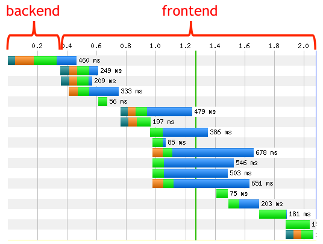
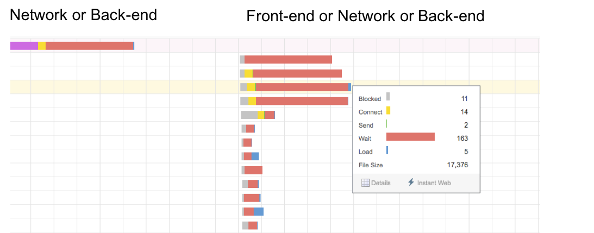
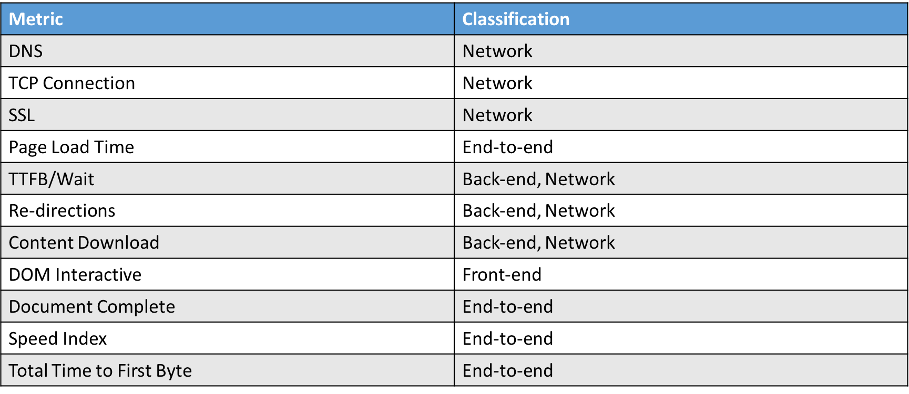
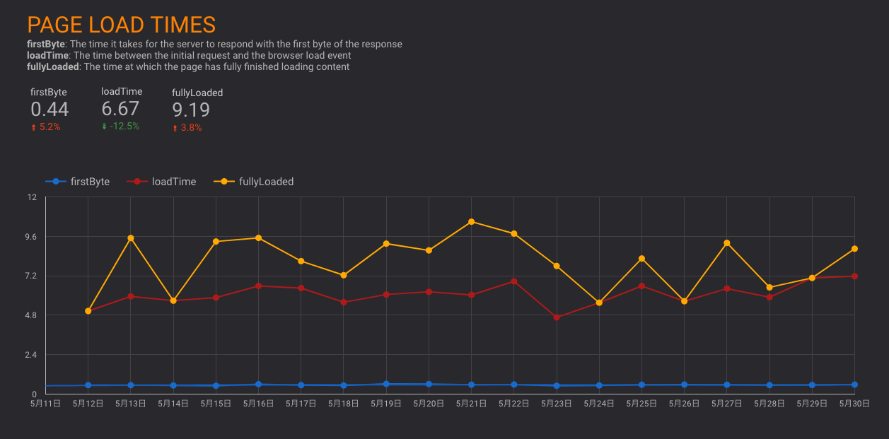
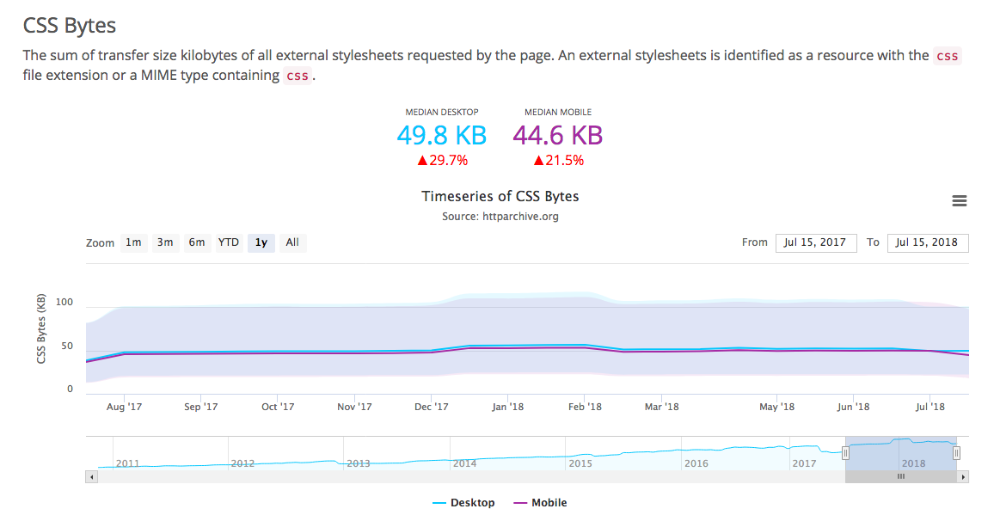
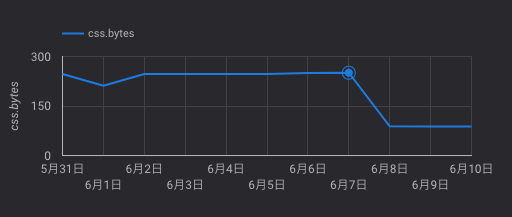
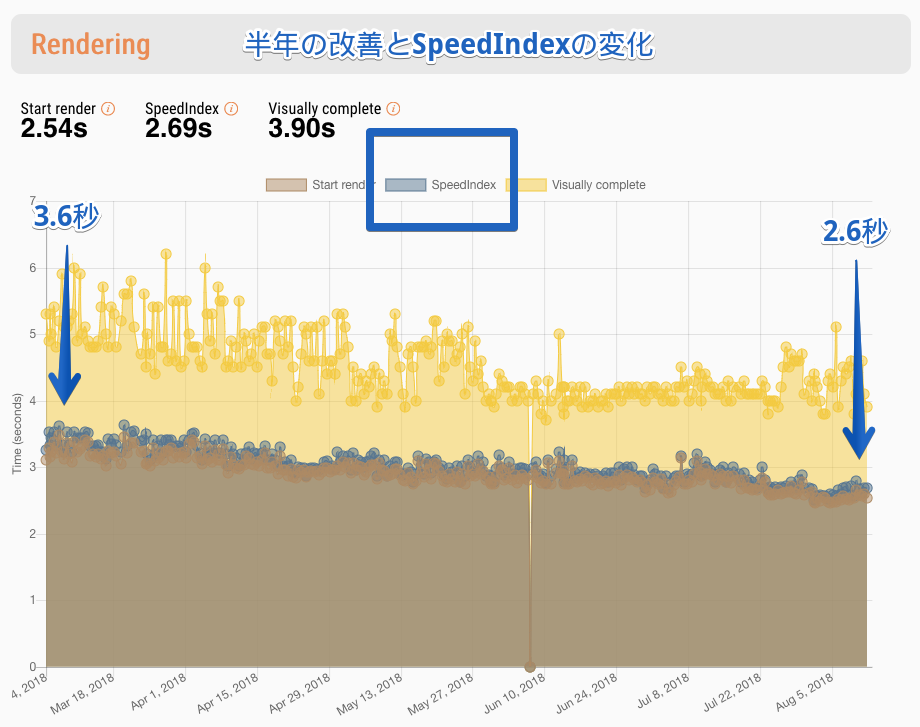

autoscale: true

# Webpagetestから始める継続的 パフォーマンス改善

----

# 自己紹介

- Name : **azu**
- Twitter : @[azu_re](https://twitter.com/azu_re)
- Website: [Web scratch], [JSer.info]

[Web scratch]: http://efcl.info/ "Web scratch"
[JSer.info]: http://jser.info/ "JSer.info"

---

## なぜ外部から計測するの？

- 手元のDevToolsで図ることもできる
  - しかしそれは**高性能な開発者端末**で**安定したネットワーク**での結果の1つに過ぎない
- 手元で図った結果より悪い結果となる人も多い
- 定性的な値じゃないので比較できない
- 継続的に改善するには比較できる値が必要 => パフォーマンス計測

---

## 改善には指標が必要

---

継続的な変化をするためには進化的ないといけない

それって

- モノリシックじゃない泥団子じゃない
- 小さく変化して、小さくデプロイできる
- 指標や方向を持って変化する
    - その変化は正しい変化であったかを確認するすべを持つ
    - それが今回の計測でもある

> -- [Building Evolutionary Architectures](http://shop.oreilly.com/product/0636920080237.do)([進化的アーキテクチャ](https://www.oreilly.co.jp/books/9784873118567/))

----

## システムはバランス

- フロントが遅いかバックエンドが遅いかネットワークが遅いか
- 結局はバランスの問題になる
- システムはそれぞれのコンポーネントの足し算じゃなくて、相互作用で成り立っている
  - フロントが遅いのを直せば、バックエンドへアクセスが増え負荷がかかるといったように
- それぞれをちゃんと計測しておいて、(あらゆる)修正ごとに何が変化したのを見られるような状態が正常

----

# 極端な例

> CDNのエッジサーバ上で動的にページを生成する仕組みを導入してフロント部分の高速化を行った所、今までTopページの速度が平均15秒ぐらいだったのが2〜3秒になって、その結果、アクセス数が殺到しちゃって、バックエンドのシステムが持たなくなっちゃった、なんてこともありました。その時は、バックエンドの修正コストが馬鹿にならなかったので、泣く泣く元に戻しましたけども（笑）。
>
> -- [UXとWebパフォーマンス、そののっぴきならない関係 – 竹洞陽一郎ロングインタビュー | HTML5Experts.jp](https://html5experts.jp/shumpei-shiraishi/11599/)

----

## 極端な例

- フロント側だけをいくら早くしてもバックエンド側が遅いとダメ(逆も同じ)
- しかし、バックエンドの役割のほとんどはリソース配信
  - フロント側の方がパフォーマンスに関わる要因が多い
  - 特にSPAなどのJavaScriptでUIを作るような仕組みとなっているサイトはフロント側の比率が高くなる傾向
- ウェブサイトのパフォーマンスの8-9割ぐらいはフロント側の処理の問題

-----

# ウェブサイトのパフォーマンスの8-9割ぐらいはフロント側の処理の問題

> 80-90% of the end-user response time is spent on the frontend. 
> Start there. [^note]
>
> -- [the Performance Golden Rule | High Performance Web Sites](http://www.stevesouders.com/blog/2012/02/10/the-performance-golden-rule/)

[^note]: この分類はフロントエンドがコントロールできる領域が80-90%という意味

-----

# ネットワーク/バックエンド/フロントエンド

> -- [Front-end vs Back-end vs Network Performance | Web Performance](http://blog.catchpoint.com/2016/11/03/naming-conventions/)

----

## 指標は目的で異なる

- ページの表示速度を改善したい(ページロード)
    - URLにアクセスしてからできるだけコンテンツを早く表示したい
    - URLにアクセスしてからできるだけ早くコンテンツを操作できるようにしたい
- 動作を高速にしたい(ランタイム)
    - 重たい操作があるのを軽くしたい
    - カクカクする
    - レスポンスのいい検索、メニューがすぐ切り替わる、ページ移動が早い
- 安定した動作をしてほしい
    - ストリーミング再生が安定して行える
    - いきなりクラッシュしないで
- モバイルでも動作が安定してほしい
    - ネットワーク帯域に気を配る

-----

- 今回の例
    - ページの表示速度を改善したい

## 目的で取る意味も異なる

- 速度改善したい(能動的)
  - 改善した結果を統計的に可視化したい
- パフォーマンス落としたくない(受動的)
  - 死活監視みたいなもの

-----

# 計測する指標

- FFFB
- LoadTim
- First Content Paint

----

## Onload is not 表示速度

----

# 合成モニタリングとリアルユーザーモニタリング

- 合成モニタリング(Synthetic Monitoring)
    - 計測用の仮想環境などから、同じ条件で定期的に繰り返し計測
    - 環境が同じ条件なら計測結果のゆらぎが少ない
- リアルユーザーモニタリング(RUM)
    - ユーザーがページを開いたときに記録を取ってログとして送る
    - ユーザー環境はバラバラなので計測結果のゆらぎは大きい
    - 一方でリアルなデータなので、KPIと値を組み合わせて分析といった用途に使える

----

# 表示速度と指標

- 表示速度を改善したいので、指標は合成モニタリングで集める
- 合成モニタリングなら同じ環境で継続的に計測できる
- => 値同士を比較して差分を見られる
- => 改善は相対で見たほうがわかりやすい(モニタリングなので通知とかできる)

----

# 合成モニタリングを行えるサービス

> Priceは2018年8月時の参考値、プランによりPriceは異なります。

- [WebPagetest](https://www.webpagetest.org/)(無料 - 制限200チェック/day)
    - OSSなのでSelf Hoistingもできる
- [SpeedCurve](https://speedcurve.com)(有料 - $20+/month)
- [Calibre](https://calibreapp.com/)(有料 – $29+/month)
- [New Relic Synthetics](https://newrelic.com/products/synthetics)(有料 – $69/month)
- [CatchPoint](https://www.catchpoint.com/)(有料 – $899/month)

----

## サービスによって計測できるものは違う

- サービスによって計測する対象、仕方が違うので比較はしにくい
- [WebPagetest](https://www.webpagetest.org/)は計測するだけで継続的に変化を見るダッシュボードはない
  - 計測したデータは1ヶ月だけ保持される
- [SpeedCurve](https://speedcurve.com)、[Calibre](https://calibreapp.com/)は計測 + ダッシュボード + 通知など
  - 計測は大体AWS EC2のリージョン/マシン
  - <https://www.webpagetest.org/getLocations.php?f=html&k=A>
  - <http://support.speedcurve.com/synthetic-settings/test-agent-locationsregions>
  - <https://calibreapp.com/docs/site/agent-locations>
- CatchPointはISPとかネットワークの経路も細かい = グローバルサービス向け
  - [Synthetic Monitoring を活用したグローバルサービスのネットワークレイテンシの測定と改善 - クックパッド開発者ブログ](https://techlife.cookpad.com/entry/2017/09/21/080000)

-----

# WebPagetest

- [WebPagetest](https://www.webpagetest.org/)自体にはダッシュボード(可視化やデータを保存する仕組みがあるわけない)
- gas-webpagetestで無料で結果をためて、Google DataStudioで可視化しよう

----

# 計測してどうする?

----

# 改善辺

----

# 改善するために計測する

- ただ単に計測したデータを貯めてるだけではしょぼい死活監視にしかならない
- 貯めたデータはパフォーマンス改善の指標に使える
- ダッシュボードから問題を見つけることは難しい
  - Lighthouseとかを使ったほうが具体的な指示がでる
  - その指示とデータを照らし合わせてみる
- 比較対象を増やすことが大事
  - 似た機能を持つサイトと比較してみる

## 具体的な例

- JSのmodule対応
- CSSのファイルサイズが極端に大きい
- 不要なものを読み込まない
- Lazy Load
    - Code Splitting
- preloadする

大体の改善はただの正常化である

------

## 何を改善するのかが難しい問題

- ダッシュボードで見られても何が問題がわからずに何もできない
  - Note: SpeedCurveはいろんなヒントを出してくれる
- 早くするのではなく遅くしないことの方が重要
  - ボトルネックを取り除いていく => パフォーマンス改善
  - と考えたほうが行動しやすい
- ボトルネックはいろいろなツールで見つけられる
  - [How To Think About Speed Tools  |  Web Fundamentals  |  Google Developers](https://developers.google.com/web/fundamentals/performance/speed-tools/)

------

## サイトA: 比較して問題を見つける例

- とりあえず計測してとりあえず可視化してみた
- ダッシュボードを見てもいまいち何が問題がわからない

----

----

----

-----

## サイトA: 何が問題化を比較して見つける

- 比較対象があると問題が見つけやすい

----

# Competitorと比較して計測

- WebPagetestでは、結果の`testId`同士を比較できる
- SpeedCurveでは、登録する時に"比較対象のURL"を入力する

-----

## サイトA: サイトを比較してみるとCSSのサイズに問題

下記はgzipしたCSSのファイルサイズ

- **サイトA: 230kb** – 明らかにでかい！
- サイトX: 20kb
- サイトY: 33kb
- サイトZ: 37kb

----

## 一般的なサイトと比較する

- [HTTP Archive](https://httparchive.org/)で[Page Weight](https://httparchive.org/reports/page-weight)で有名なサイトのHTML, CSS, JSなどのファイルサイズを調査
- CSSは**50Kb**弱が一般的なサイズ

-----

# サイトA: CSSの問題を分析する

- [TestMyCSS](http://www.testmycss.com/)というサービスではCSSに含まれるBase64のサイズやセレクタの複雑度、重複、空のルールなどを一覧できる
- サイトAのCSSはBase 64が**150kb**ぐらいあり異常に大きかった
- CSSにフォントがBase64化したものが含まれていた

----

## サイトA: CSSからフォントを取り除く 

- CSSからフォントを取り除いた: **230kb** -> **80kb**

---

# 一つの改善がパフォーマンスに与える影響は大きくない

- ページロードに関係する機能を一つだけ早くしても、全体への影響は小さい
- 継続的に計測し改善を続ける必要がある

----

## 例) サイトB: SpeedIndexを指標にちょっとづつ改善した例

- サイトA:  Reactで作られたサイト

- クライアントサイドレンダリングのみ
  - JavaScriptが実行されるまで真っ白なのでファイルサイズをへらすことが、そのまま表示速度へ影響

-----

## 改善項目

- Babel 7 -> ランタイムコストが小さくなる
- webpack 4 + "module"フィールドの対応 -> TreeShaking/Hoistingでサイズとランタイムコストの減少
  - `es-lodash`の対応 - Tree Shakingで最終的にはファイルサイズが小さくなる
- 初期表示に不要なコンポーネントを遅延ロード -> `import()`で動的にロードする
- React 16へのアップデート -> ファイルサイズの減少

----

----

----

## 劇的な変化を望む場合はアーキテクチャも変化を

- 劇的な変化を得るには全体的/根本的な変化が必要になる
- 泥団子にしているとアーキテクチャを変更することが難しくなる
  - システムに柔軟性がないとアーキテクチャを変更することができない

例) クライアントサイドレンダリング(CSR)だけだったのをサーバサイドレンダリング(SSR)もするように変更

- [インターネットテレビ局「AbemaTV」の表示速度が従来比3倍にアップ | 株式会社サイバーエージェント](https://www.cyberagent.co.jp/news/detail/id=21679)
- [AbemaTVはただのSSR じゃねぇんだよ - Speaker Deck](https://speakerdeck.com/ktknest/abematvhatadafalsessr-ziyaneendayo)

----

# CIで防ごう

- size-limit
- stagingでチェック

-----

# ブラウザとパフォーマンス

- WebKitはパフォーマンスリグレッションはrevertする
  - [Performance Testing | WebKit](https://webkit.org/performance/)
- JavaScriptエンジンのベンチマークを比較するサイトをMozillaが管理している
  - [ARE WE FAST YET?](https://arewefastyet.com/)

---

## FAQ

- Lighthouseとかではダメなの?
  - WebPagetestはLighthouseの結果も含んでいる
  - パフォーマンス改善に必要なのは連続的値
  - スコアじゃなくて時間を計測する(スコアはルールが変わることがある)

-----

## 参考

- [WebパフォーマンスとプロダクトKPIの相関を可視化する話](https://developers.cyberagent.co.jp/blog/archives/9540/)
- [Performance/WebPageTest - Wikitech](https://wikitech.wikimedia.org/wiki/Performance/WebPageTest)
- [Using WebPageTest - O'Reilly Media](http://shop.oreilly.com/product/0636920033592.do)
- [speedtracker/speedtracker: 📉 Visualisation layer and data store for SpeedTracker](https://github.com/speedtracker/speedtracker)
- [Webサイトパフォーマンス管理の基礎知識](https://www.slideshare.net/takehora/web-59093011)
- [Synthetic vs Real User Monitoring : What to use when? | Tezify Blog](https://www.tezify.com/post/synthetic_vs_rum/)
- [最近の Web パフォーマンス改善について知っておきたいコト -HTML5 Conference 2017- - YouTube](https://www.youtube.com/watch?v=gJvOWw-l-gc)