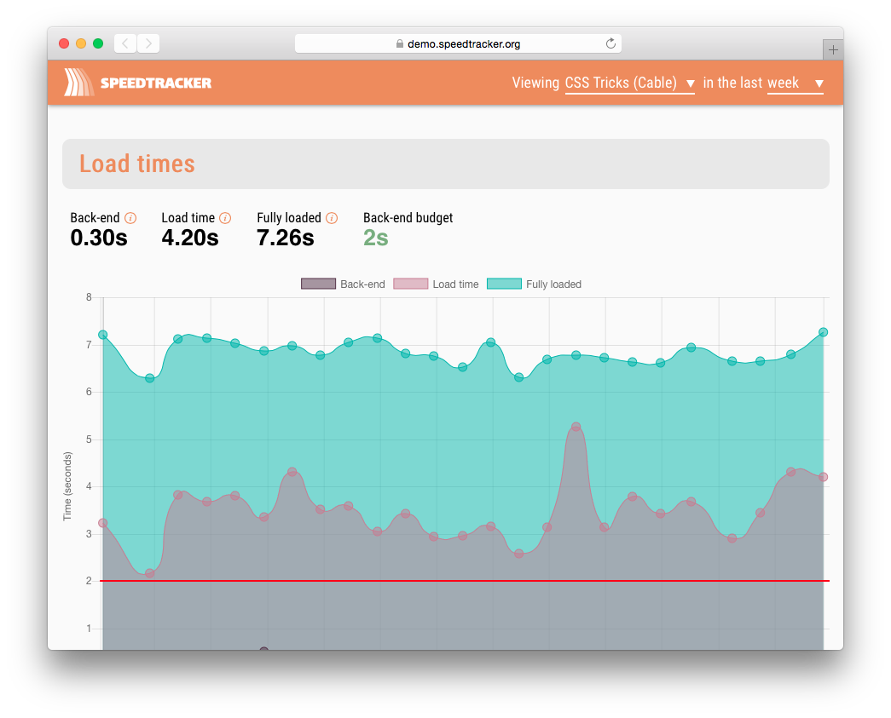
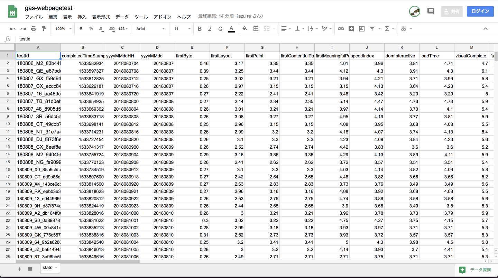
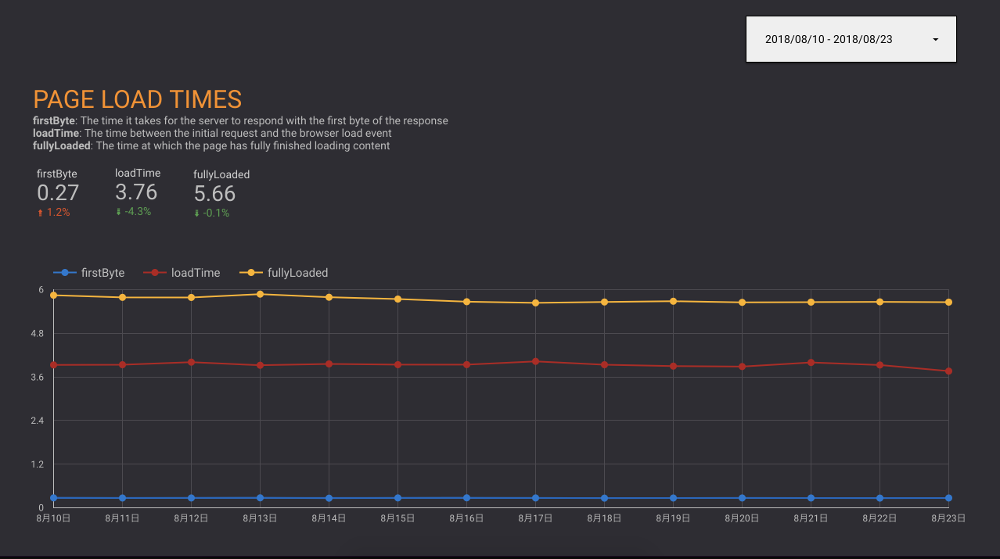
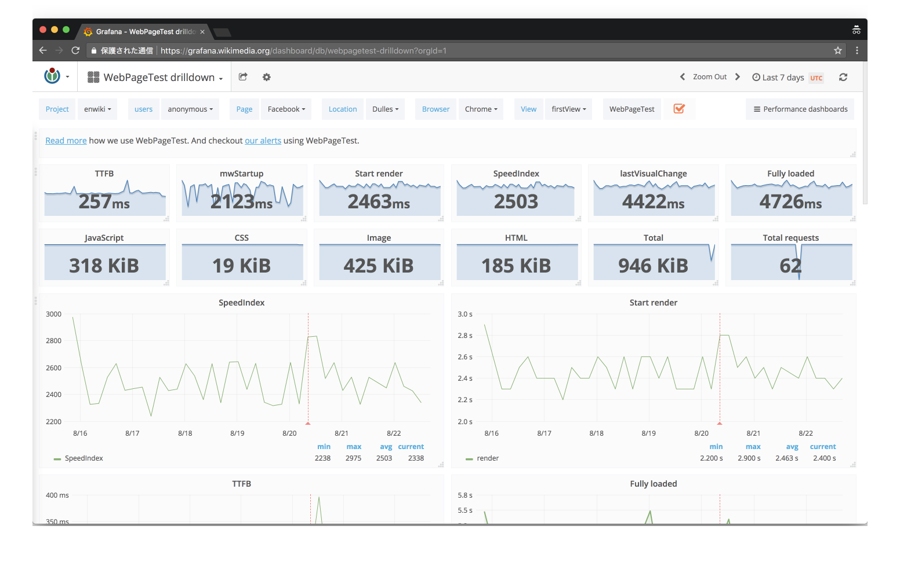
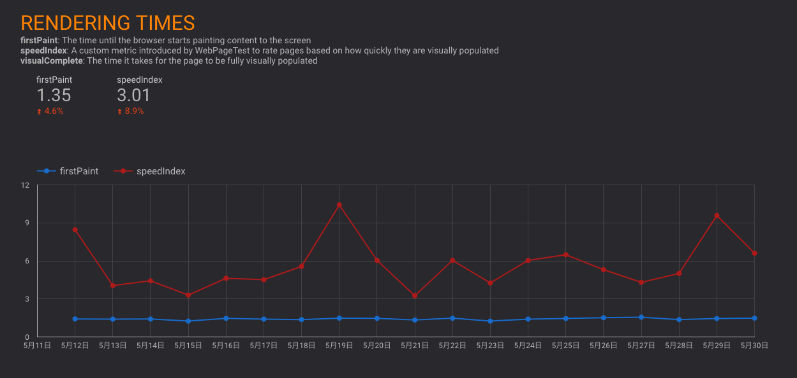
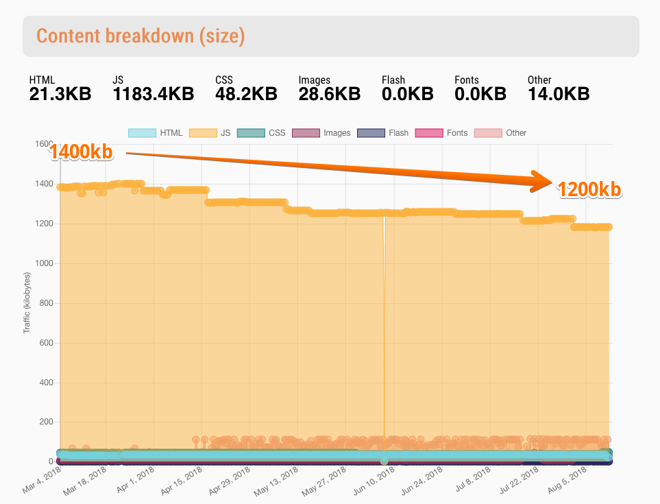

autoscale: true

# Webpagetestから始める継続的 パフォーマンス改善

## ページロードタイム編 :hourglass:

----

# 自己紹介

- Name : **azu**
- Twitter : @[azu_re](https://twitter.com/azu_re)
- Website: [Web scratch][], [JSer.info][]
- Create:  [textlint][], [Almin][]

[Web scratch]: http://efcl.info/ "Web scratch"
[JSer.info]: http://jser.info/ "JSer.info"
[textlint]: https://textlint.github.io/ "textlint"
[Almin]: https://almin.js.org/ "Almin"

---

# アジェンダ

- パフォーマンス改善は指標を決めて行わないと迷子になる
- パフォーマンス改善を行うには継続的な計測を行う
  - 今回はページロードについて、ランタイムは範囲外
- パフォーマンス改善のアプローチ
- 継続的なパフォーマンス計測とリグレッションの検知

^ 目的はパフォーマンス改善には計測が必要という事実を知ること

^ パフォーマンス計測は継続的に行う必要がある

^ パフォーマンス改善は何を目的、指標にして改善するかを決めないと迷子になる

^ 目的をもって継続的にパフォーマンス改善を行い、パフォーマンス計測を改善する

----

# 「パフォーマンス」の定義

- 今回は「ページロードタイム」についての「パフォーマンス」の話
  - 「ページロード」 = URLにアクセスしてページが表示されるまで
- 「ランタイム」の話ではありません
  - 「ランタイム」= ページ表示後のUI操作やアニメーションなど
- 「パフォーマンス」と言った場合は大体「ページロードタイムにおけるパフォーマンス」と解釈

-----

# 「ページロードのパフォーマンスが良い」の定義

- ページが表示されるまでに時間を早くするのが目的
- 真っ白のページじゃなくて意味あるコンテンツをユーザー(ブラウザ)に表示させるか
  - => 「ページロードのパフォーマンス」を良くする
  - 指標: First (Content/Meaningful) Paintの値を小さくする(lower is better)
- `onLoad` is not 表示速度
  - `onLoad`の速さは表示速度とは直接関係ない
  - 間接的には`onLoad`が早いのはいいことだけど、これが目的ではない

----

^ 目指すのはOptimizedな徐々にレンダリングされるサイト
^ できるだけ真っ白を避ける

----

## 継続的に改善するために、計測も継続的に行う

- 継続的にパフォーマンスを改善するには、パフォーマンス計測も継続的に
- パフォーマンスはいつのまにかリグレッションが起きやすい
- 人間は0.1秒の変化は勝手に補完するので変化に鈍感
- パフォーマンスを数値化して問題に気づけるようにする
- => 定期的に計測を行うためにも自動化が必要

----

## なぜ計測を自動化するの？

- 継続的に改善するには、**同じ条件で計測した比較できる値**が必要
  - 仮想環境で同じ条件を作って定期的に計測を行う
- 手元のDevToolsで図ることもできる
  - ただし、高性能な開発者端末での結果の1つに過ぎない
  - ただし、開発中に計測すると他の作業を並行するため結果が安定しない
  - 同じ条件で計測した値じゃないので比較しにくい

----

## 改善には指標が必要

- 改善する方向 = 指標がないと迷子になる
- アプリケーションにはパフォーマンスだけじゃなくて様々に要素が混在する
- 他の機能を改善したつもりがパフォーマンスが低下することもある

----

# ページロードに関する指標

- [User-centric Performance Metrics  |  Web Fundamentals  |  Google Developers](https://developers.google.com/web/fundamentals/performance/user-centric-performance-metrics)
- [Web クライアントサイドのパフォーマンスメトリクス — Speed Index、Paint Timing、TTI etc... ::ハブろぐ](https://havelog.ayumusato.com/develop/performance/e744-performance_metrics.html)

----

## ページロードに関する指標

- First Paint(FP)
  - 1pxでも描画されたまでにかかった時間
- First Contentful Paint(FCP)
  -　コンテンツっぽいなにかが描画されるまでにかかった時間
- First Meaningful Paint(FMP)
  - ユーザーにとって意味のあるものが描画されるまでにかかった時間
- Time to Interactive(TTI)
  - ユーザーの操作に反応できるまでにかかった時間
- [Speed Index](https://github.com/t32k/webpagetest-doc-ja/blob/master/using-webpagetest/metrics/speed-index/index.md)
  - ファーストビューが見えるまでにかかった時間(ブラウザ側のイベントじゃないけど広く使われてる)
- これらの値はパフォーマンス計測サービスで記録できる

----

## アプリケーションによって使うべき指標は異なる

- CSR(クライアントサイトレンダリング)とSSR（サーバサイドレンダリング）でも異なる場合がある
  - 動的な部分を計測したいのか、静的な部分を計測したいのか
- コンテンツによって**意味のある表示**(FMP)が本当に意味のあるものかは別
  - `performance.mark` APIを使ってプロダクトごとに指標をマーキングするのがベスト

----

# どうやって計測するか

## どうやって指標となる値を記録するか

----

# 合成モニタリングとリアルユーザーモニタリング

- 合成モニタリング(Synthetic Monitoring)
    - 計測用の仮想環境などから、同じ条件で定期的に繰り返し計測
    - 環境が同じ条件なら計測結果のゆらぎが少ない
- リアルユーザーモニタリング(RUM)
    - ユーザーがページを開いたときに記録を取ってログとして送る
    - ユーザー環境はバラバラなので計測結果のゆらぎは大きい
    - 一方でリアルなデータなので、KPIと値を組み合わせて分析といった用途に使える

----

# 表示速度と指標

- 表示速度を改善したいので、指標は合成モニタリングで集める
- 合成モニタリングなら同じ環境で継続的に計測できる
- => 値同士を比較して差分を見られる
- => パフォーマンスは相対で見たほうがわかりやすい

----

# 合成モニタリングを行えるサービス

> Priceは2018年8月時の参考値、プランによりPriceは異なります。

- [WebPagetest](https://www.webpagetest.org/)(無料 - 制限200チェック/day)
    - OSSなのでSelf Hoistingもできる
- [SpeedCurve](https://speedcurve.com)(有料 - $20+/month)
- [Calibre](https://calibreapp.com/)(有料 – $29+/month)
- [New Relic Synthetics](https://newrelic.com/products/synthetics)(有料 – $69/month)
- [CatchPoint](https://www.catchpoint.com/)(有料 – $899/month)

----

## サービスによって計測できるものは違う

- サービスによって計測する対象、仕方が違うので比較はしにくい
- Webpagetestなどのデータは丸め込まれたデータなので分析用途ではない(Real Dataとしては捉えない)
- スコアは人間にとってわかりやすい値であるだけど、実データとは異なる
- [WebPagetest](https://www.webpagetest.org/)は計測するだけで継続的に変化を見るダッシュボードはない
  - 計測したデータは1ヶ月だけ保持される
- [SpeedCurve](https://speedcurve.com)、[Calibre](https://calibreapp.com/)は計測 + ダッシュボード + 通知など
  - 計測は大体AWS EC2のリージョン/マシン
  - <https://www.webpagetest.org/getLocations.php?f=html&k=A>
  - <http://support.speedcurve.com/synthetic-settings/test-agent-locationsregions>
  - <https://calibreapp.com/docs/site/agent-locations>
- CatchPointはISPとかネットワーク周りが詳細にとれる
  - [Synthetic Monitoring を活用したグローバルサービスのネットワークレイテンシの測定と改善 - クックパッド開発者ブログ](https://techlife.cookpad.com/entry/2017/09/21/080000)
  - 統計的に扱いやすいデータが集めやすい

----

- システムは複合的なものなので、計測したもので分析できるとは限らない

> A system is never the sum of its parts. It is the product of the interactions of itsparts.
> -- Dr. Russel Ackof

-----

# WebPagetest

- [WebPagetest](https://www.webpagetest.org/)は一度計測してその結果を返すだけのサービス
- WebPagetest自体には定期的に計測したりそのデータをグループとして管理する仕組みはない
- 継続的に計測するには
  - 計測頻度やタイミングを管理
  - 計測結果を保存
  - 結果をグラフにして可視化できるダッシュボード
  - 結果をもとにアラートを行う

----

# [SpeedTracker](https://speedtracker.org/)

- WebPagetestで計測して、その結果をGitHubリポジトリに保存する
  - GitHubアカウントだけが必要
- 計測の柔軟性や計測回数は少ない(2回/1日)
  - 具体的には認証があるサイトなどは扱えない
- 個人で公開してるサイトを計測するにはお手軽

----

# [gas-webpagetest](https://github.com/uknmr/gas-webpagetest)

- WebPagetestで計測しその結果をGoogle SpreadSheetに記録する[Google Apps Scripts](https://developers.google.com/apps-script/)
  - [clasp](https://github.com/google/clasp) + [TypeScript](https://www.typescriptlang.org/)で書き直された
  - [Google Apps Scripts](https://developers.google.com/apps-script/)はCronや、Webサーバ、SpreadSheetの操作などいろいろできる
- コードで書かれてるのでWebPagetestでできる範囲のことは大抵できる

-----

## [gas-webpagetest](https://github.com/uknmr/gas-webpagetest) + [Google Data Studio](https://datastudio.google.com/)

- [Google Data Studio](https://datastudio.google.com)は任意のリソースをもとにしたダッシュボードを作れるサービス
  - Google SpreadSheet、MySQL、GitHubなど。
  - いわゆるBI(Business Intelligence)ツールで無料で利用できる
  - 最近複数のデータリソースを混ぜることもできるようになった
    - Google AnalyticsとSpreadSheetを一緒に扱える
- Spreadsheetに蓄積したデータのビジュアライズを[Google Data Studio](https://datastudio.google.com)で行う

----

# [SpeedCurve](https://speedcurve.com/)

- SpeedCurveの合成モニタリングはWebPagetestをベースにしている
  - [SpeedCurve | Synthetic: WebPageTest](https://speedcurve.com/features/synthetic/)でWebPagetest自体には計測の追跡や分析がないのでSpeedCurveが登場したという話が書かれている
  - WebPagetestのいいUIという感じの有償サービス
- RUMも計測できるサービスもやってる

----

## [Sitespeed.io](https://www.sitespeed.io/)

- 自前でSpeedCurveみたいなものを作るツールキット
  - Docker(Private HostingのWebPagetest含む) + AWSで運用
  - [Web Performance Dashboards with sitespeed.io](https://www.sitespeed.io/documentation/sitespeed.io/performance-dashboard/)
- WikiPedia(WikiMedia)の人が開発している
  - [Performance/WebPageTest - Wikitech](https://wikitech.wikimedia.org/wiki/Performance/WebPageTest)
  - <https://grafana.wikimedia.org/dashboard/db/webpagetest>

----

# 好きなものを使ってとりあえず計測を始める

- まずは計測を始めよう
  - [gas-webpagetest](https://github.com/uknmr/gas-webpagetest) + 好きなSaaSの2種類で計測を開始しよう
  - WebPageTestは無料で使えてすごい、有料の計測サービスも一緒に体験しよう(Trialがある)
- 1-2週間ぐらい計測をしながら現状を把握しよう
  - ブラウザの開発者ツールのパフォーマンス計測を自動化すると考えるならある程度でも形がでてくる
- 多くの計測データにはバイアスがかかっているので、分析には気をつけよう
  - パフォーマンスは様々な因子がでてくる総合的なもの
  - どんなに優れたモニタリングツールではすべての因子を見ることができない
  - スコアやグラフは丸められたデータであることは意識しよう
- パフォーマンス計測を継続することは偉いこと

----

# 計測してどうする?

----

# 改善する

----

# 改善するために計測する

- ただ単に計測したデータを貯めてるだけではしょぼい死活監視にしかならない
- 貯めたデータはパフォーマンス改善の指標に使える
- ダッシュボードから問題を見つけることは難しい
  - Lighthouseとかを使ったほうが具体的な指示がでる
  - その指示とデータを照らし合わせてみる
- 比較対象をもつことが大事
  - 似た機能を持つサイトと比較してみる

-----

# まずは大きな改善から始めよう

- 局所的な改善はページロードには小さな影響しかない
  - 遅いサイトは秒単位の遅い問題を持っている
  - まずは秒単位の問題を解決してから、ミリ秒単位の問題を解決していく
- ウェブページのロードはウォータフォール
  - 一つでも重たいものがあるとそこで詰まる = クリティカル
  - 重たいものを減らしていく = パフォーマンス改善
  - 既にあるものを早くするのではなく、ブロッカーを取り除く

----

# [クリティカルレンダリングパス](https://developers.google.com/web/fundamentals/performance/critical-rendering-path/?hl=ja)の改善

- ページロードから表示までの一連の流れ = [クリティカルレンダリングパス](https://developers.google.com/web/fundamentals/performance/critical-rendering-path/?hl=ja)
  - これを改善することがページロードタイムの改善につながる
- クリティカルパスの改善の考え方
  - ファイルサイズを小さくする
  - リクエスト数を減らす
  - 待機時間が長いリソース取得の改善

------

## 改善のパターン（読まなくていい）

- ファイルサイズを小さくする
  - [The Cost Of JavaScript In 2018 – Addy Osmani – Medium](https://medium.com/@addyosmani/the-cost-of-javascript-in-2018-7d8950fbb5d4)
  - ページロードに不要なリソースの分解、削除
- リクエスト数を減らす
  - [The Critical Request - Speaker Deck](https://speakerdeck.com/benschwarz/the-critical-request)
  - HTTP/2だと並列リクエストができるのでアプリケーション次第
  - リクエストごとに表示がプログレッシブに進むならキャッシュを考えて分けたほうがいい
  - 結局全部取ってからじゃないないと何もできないなら細かく刻む必要はあまりない
    - リソース間の依存関係を把握する必要があるということ
  - リソースの依存関係をみてボトルネックを発見し解決する
    - LightHouseの[クリティカルリクエストチェーン](https://developers.google.com/web/tools/lighthouse/audits/critical-request-chains?hl=ja)を減らす
- 待機時間が長いリソースの改善
  - リソースを返すのに時間がかかってる配信するサーバ側の問題
  - サードパーティスクリプトなど直接改善できないものは、遅延ロードさせるなどクリティカルパスから外す
  - [Resource Hints](https://www.w3.org/TR/resource-hints/)を使って先に読んでおく
- メインコンテンツに必要ないリソースは後で読む
  - サードパーティスクリプト
  - script async属性
  - lazy load

-----

## 改善のセオリー

- 大きなボトルネックのパフォーマンス改善にはある程度セオリーがある
  - HTTP/2みたいにセオリーが変わる場合もあるけど、その場合も継続的な計測が役立つ
- 読んで
  - [Make the Web Faster  |  Google Developers](https://developers.google.com/speed/)
  - [超速! Webページ速度改善ガイド (WEB+DB PRESS plus)](https://webperf.guide/)
  - [High Performance Browser Networking (O'Reilly)](https://hpbn.co/)
  - [Webフロントエンド ハイパフォーマンス チューニング｜技術評論社](http://gihyo.jp/book/2017/978-4-7741-8967-3)
  - [Performance Calendar](https://calendar.perfplanet.com)

----

## 何を改善するのかが難しい問題

- ダッシュボードを見ても何が問題がわからずに何もできない
  - Note: SpeedCurveはいろんなヒントを出してくれる
- 速くするのではなく遅くしないことの方が重要
  - ボトルネックを取り除いていく => パフォーマンス改善
  - と考えたほうが行動しやすい
- ボトルネックはいろいろなツールで見つけられる
  - [How To Think About Speed Tools  |  Web Fundamentals  |  Google Developers](https://developers.google.com/web/fundamentals/performance/speed-tools/)

------

# 改善していく例

----

## サイトA: 比較して問題を見つける例

- とりあえず計測してとりあえず可視化してみた
- ダッシュボードを見てもいまいち何が問題がわからない

----

----

----

-----

## サイトA: 何が問題化を比較して見つける

- 比較対象があると問題が見つけやすい

----

# Competitorと比較して計測

- WebPagetestでは、結果の`testId`同士を比較できる
- SpeedCurveでは、登録する時に"比較対象のURL"を入力する

-----

## サイトA: サイトを比較してみるとCSSのサイズに問題

下記はgzipしたCSSのファイルサイズ

- **サイトA: 230kb** – 明らかにでかい！
- サイトX: 20kb
- サイトY: 33kb
- サイトZ: 37kb

----

## 一般的なサイトと比較する

- [HTTP Archive](https://httparchive.org/)で[Page Weight](https://httparchive.org/reports/page-weight)で有名なサイトのHTML, CSS, JSなどのファイルサイズを調査
- CSSは**50Kb**弱が一般的なサイズ

-----

# サイトA: CSSの問題を分析する

- [TestMyCSS](http://www.testmycss.com/)というサービスではCSSに含まれるBase64のサイズやセレクタの複雑度、重複、空のルールなどを一覧できる
- サイトAのCSSはBase 64が**150kb**ぐらいあり異常に大きかった
- CSSにフォントがBase64化したものが含まれていた

----

## サイトA: CSSからフォントを取り除く 

- CSSからフォントを取り除いた: **230kb** -> **80kb**

---

# 一つの改善がパフォーマンスに与える影響は大きくない

- ページロードに関係する機能を一つだけ早くしても、全体への影響は小さい
- 継続的に計測し改善を続ける必要がある

----

## 例) サイトB: SpeedIndexを指標にちょっとづつ改善した

- サイトA:  Reactで作られたサイト
- クライアントサイドレンダリングのみ
  - JavaScriptが実行されるまで真っ白なのでファイルサイズをへらすことが、そのままページロードタイムへ影響
- どれだけ初期表示に必要なJavaScriptを小さくしていくか

-----

## 改善項目の一部

- Babel 7 -> ランタイムコストが小さくなる
- babel-plugin-external-helpers -> helper関数がまとまってファイルサイズが小さくなる
- webpack 4 + "module"フィールドの対応
  - TreeShaking/Scope Hoistingでサイズとランタイムコストの減少
  - `es-lodash`の対応 - Tree Shakingで最終的にはファイルサイズが小さくなる
- 初期表示に不要なコンポーネントをCode Splitting
  - `import()`で動的にロードすることで、初期表示のbundleファイルサイズが小さくなる
- React 16へのアップデート -> ファイルサイズの減少
- サードパーティのCSSやJSの非同期ロード -> 初期表示には不要なので画面に表示されたタイミングでロード

----

----

----

## 劇的な変化を望む場合はアーキテクチャも変化を

- 劇的な変化を得るには全体的/根本的な変化が必要になる

> 例) クライアントサイドレンダリング(CSR)だけだったのをサーバサイドレンダリング(SSR)もするように変更

- [インターネットテレビ局「AbemaTV」の表示速度が従来比3倍にアップ | 株式会社サイバーエージェント](https://www.cyberagent.co.jp/news/detail/id=21679)
- [AbemaTVはただのSSR じゃねぇんだよ - Speaker Deck](https://speakerdeck.com/ktknest/abematvhatadafalsessr-ziyaneendayo)

---

## アーキテクチャを変化できるような土壌を持つ

- 泥団子[^Big ball of mud]のアーキテクチャは変更することが難しい
  - 計測は続けつつも、まずは泥団子を解体して正常な形にする
  - 正常な形にしていくと大抵リソースの扱いも正常できるため、結果的にはパフォーマンスが改善される
- アーキテクチャについては以前書いた
  - [複雑なJavaScriptアプリケーションを考えながら作る話](http://azu.github.io/slide/2016/react-meetup/large-scale-javascript.html)

[^Big ball of mud]: 密結合でリファクタリングできないようなアーキテクチャの比喩。[大きな泥だんご](https://ja.wikipedia.org/wiki/%E5%A4%A7%E3%81%8D%E3%81%AA%E6%B3%A5%E3%81%A0%E3%82%93%E3%81%94)ともいわれる

---

# 改善したら確認する

- 改善をするリリースをしたら、計測を実行して確認するという習慣は重要
  - 習慣化する = リリースしたらslackに通知をするとか、
  - 数値を出して興味を引く
- パフォーマンスに興味を持たないと徐々に悪化しやすい
  - パフォーマンスに関心を持つチームは必然的にパフォーマンスを改善する傾向
  - パフォーマンスに関心を持たないチームはパフォーマンスのリグレッションを起こしやすい
- かっこいいダッシュボードはモチベーションの維持のためという側面もある

----

## リリースにラベルをつけてわかりやすく表示してる例

> [Optimized Server-Side Web Application In 2018](https://developers.cyberagent.co.jp/blog/archives/16818/)

^ アメーバニュースの改善結果のブログより引用

-----

# パフォーマンスのリグレッションを検知する

- 人間は慣れてしまうので0.1秒とかの変化には気づきにくい
- 新しい機能を追加したときにパフォーマンスがリグレッションを起こしてもすぐには体感できない
- 合成モニタリングでパフォーマンスリグレッションを検知する

----

# 例) サイトC: 新しい機能を追加したらサイズが増えた

----

## 新しい機能を追加したらサイズが増えた

- 新しい機能をリリースしたらjsのbundleサイズが200kbも増えた
  - 原因: ライブラリの依存してるライブラリがでかかった
- Wifiだとあまり違いを体感できないが、モバイルなどでは影響が大きい
  - 開発者の環境だと気づくのが難しい
- このようなリグレッションに気づくのにも継続的にパフォーマンス計測が必要

----

# パフォーマンスの予算を決めて維持する

- パフォーマンスの予算(Performance Budget)を決めてその水準を維持する
  - プロダクトごとに決める必要がある(アプリによって指標は異なるため)
  - 基準値を決めるには常時計測して現状を把握する必要がある
  - 少なくても1週間ぐらいは計測結果を貯めてから基準値を決める
  - 例) First Paintが2秒以内というPerformance Budgetを決める、そのしきい値を超えたらslackに通知する
  - [Monitor your performance budgets | SpeedCurve Support](http://support.speedcurve.com/get-the-most-out-of-speedcurve/monitor-your-performance-budgets)

----

# サイズの問題を予防する

- ライブラリを導入時にファイルサイズを気にする
  - npmなら[BundlePhobia](https://bundlephobia.com/)が便利
- bundleを分析するなら[webpack-bundle-analyzer](https://github.com/webpack-contrib/webpack-bundle-analyzer)など
  - webpackは[Build Analysis](https://survivejs.com/webpack/optimizing/build-analysis/)などを参照
- ビルド時に検知する
  - webpackの[performance.hints](https://webpack.js.org/configuration/performance/)オプション
  - [size-limit](https://github.com/ai/size-limit)でファイルサイズをCIで計測する

---

## 新しく作るときの予算

- [RAIL モデル](https://developers.google.com/web/fundamentals/performance/rail?hl=ja)
  - ページを使用する準備が整うまで 1,000 ミリ秒以内
- [Performance Budget Calculator](http://www.performancebudget.io/)
  - 期待するロード時間から許容できるHTML,JS,CSSなどのファイルサイズを計算してくれる
- が、現実的にRAILモデルなどは予算としては厳しいアプリケーションも多いので柔軟にやりましょう
  - [アーキテクチャ編: SSR と CDN ( Fastly ) とユーザー依存情報の分離（新規開発のメモ書きシリーズ4） ::ハブろぐ](https://havelog.ayumusato.com/develop/others/e751-scratch_memo_4.html)

^ このスライドも10分という予算で作り始めましたが、できたスライドのページ数が80ページぐらい超えてました
^ いらないものを削っていってもまだ50ページもあることから、パフォーマンス改善の難しさがわかりますね

---

# パフォーマンス

- パフォーマンスは相対的な指標を扱う
  - 年々ウェブのサイズは大きくなっている
  - [State of the Web](https://httparchive.org/reports/state-of-the-web)

---

# まとめ

- 改善するために計測していく
- 継続的に改善するためには指標をちゃんと持つ
- 速くするのではなく遅くしない
  - システム全体で見ればパフォーマンスは1因子でしかない
  - 問題を正常化していけば、パフォーマンスは改善していく(特にサイズ)
- 基準値(Performance Budget)を決めてそこより遅くならないことをベースにする
- 計測方法も徐々に改善していく

----

## 参考

- [thedaviddias/Front-End-Performance-Checklist: 🎮 The only Front-End Performance Checklist that runs faster than the others](https://github.com/thedaviddias/Front-End-Performance-Checklist)
- [超速！ Webページ速度改善ガイド ──使いやすさは「速さ」から始まる：書籍案内｜技術評論社](http://gihyo.jp/book/2017/978-4-7741-9400-4)
- [WebパフォーマンスとプロダクトKPIの相関を可視化する話](https://developers.cyberagent.co.jp/blog/archives/9540/)
- [Performance/WebPageTest - Wikitech](https://wikitech.wikimedia.org/wiki/Performance/WebPageTest)
- [Using WebPageTest - O'Reilly Media](http://shop.oreilly.com/product/0636920033592.do)
- [speedtracker/speedtracker: 📉 Visualisation layer and data store for SpeedTracker](https://github.com/speedtracker/speedtracker)
- [Webサイトパフォーマンス管理の基礎知識](https://www.slideshare.net/takehora/web-59093011)
- [Synthetic vs Real User Monitoring : What to use when? | Tezify Blog](https://www.tezify.com/post/synthetic_vs_rum/)
- [最近の Web パフォーマンス改善について知っておきたいコト -HTML5 Conference 2017- - YouTube](https://www.youtube.com/watch?v=gJvOWw-l-gc)
- [Web クライアントサイドのパフォーマンスメトリクス — Speed Index、Paint Timing、TTI etc... ::ハブろぐ](https://havelog.ayumusato.com/develop/performance/e744-performance_metrics.html)
- [日経電子版 サイト高速化とPWA対応 / nikkei-high-performance-pwa - Speaker Deck](https://speakerdeck.com/sisidovski/nikkei-high-performance-pwa)
- [Introducing a faster BBC News front page | Wildly Inaccurate](https://wildlyinaccurate.com/introducing-a-faster-bbc-news-front-page/)

----

## FAQ

- Lighthouseとかではダメなの?
  - WebPagetestはLighthouseの結果も含んでいる
  - パフォーマンス改善に必要なのは連続的値
  - スコアじゃなくて時間を計測する(スコアはルールが変わることがある)

-----

## 個人的なパフォーマンス計測のスタートポイント

- まずは計測を始めよう
  - [gas-webpagetest](https://github.com/uknmr/gas-webpagetest) + 好きなSaaSの2種類で計測を開始しよう
  - WebPageTestは無料で使えてすごい、有料の計測サービスも一緒に体験しよう(Trialがある)
- 1-2週間ぐらい計測をしながら現状を把握しよう
  - ブラウザの開発者ツールのパフォーマンス計測を自動化すると考えるならある程度でも形がでてくる
- 多くの計測データにはバイアスがかかっているので、分析には気をつけよう
  - パフォーマンスは様々な因子がでてくる総合的なもの
  - どんなに優れたモニタリングツールではすべての因子を見ることができない
  - スコアやグラフは丸められたデータであることは意識しよう
- パフォーマンス計測を継続することは偉いこと
  - その行為自体は否定はされるものではない
  - パフォーマンス計測自体も徐々に改善していけばいい

-----

## メモ

- CatchPointは明らかに他のサービスより広い範囲のデータを取っている
- その分明らかに値段も高めの設定になってる
- CDNがakamai中心だった時代が終わるように、モニタリングも多様化して変化していく
  - [国内CDNシェア(2018年4月) | J-Stream CDN情報サイト](https://tech.jstream.jp/blog/cdn/cdn_share_apl_2018/)
- 必要性に応じてモニタリングも変化していくと考えられる
  - まだまだ敷居の高さがある

----

## 使わなかったスライド

----

## ウェブアプリには様々な要素が混在する

- ウェブアプリのアーキテクチャはさまざまな要素からできてる
  - メンテナンス性、パフォーマンス、セキュリティ、スケーラビリティ、
- すべてを実現することはできない
- 例) 高パフォーマンスと高スケールの両方を実現することは簡単ではない
- そのようなアーキテクチャを決めるときにも指標をちゃんと数値として決める
- 指標や方向を持って変化して、それを確認するすべを持つ

> システムは決して部分の総和ではない。システムは部分の相互作用の成果だ。

> -- [Building Evolutionary Architectures](http://shop.oreilly.com/product/0636920080237.do)([進化的アーキテクチャ](https://www.oreilly.co.jp/books/9784873118567/))

----

## システムはバランス

- フロントが遅いかバックエンドが遅いかネットワークが遅いか
- 結局はバランスの問題になる
- システムはそれぞれのコンポーネントの足し算じゃなくて、相互作用で成り立っている
  - フロントが遅いのを直せば、バックエンドへアクセスが増え負荷がかかるといったように
- それぞれをちゃんと計測しておいて、(あらゆる)修正ごとに何が変化したのを見られるような状態が正常

----

## ページロードに関するパフォーマンスはフロントの裁量が大きい

- フロント側だけをいくら早くしてもバックエンド側が遅いとダメ(逆も同じ)
- しかし、バックエンドの役割のほとんどはリソース配信
- 特にSPAなどのJavaScriptでUIを作る場合はフロント側の比率が高くなる傾向

-----

# エンドユーザーに対するレスポンスタイムのうち80％〜90％はWebフロントエンドで発生する

> 80-90% of the end-user response time is spent on the frontend. 
> Start there. [^note]
>
> -- [the Performance Golden Rule | High Performance Web Sites](http://www.stevesouders.com/blog/2012/02/10/the-performance-golden-rule/)

[^note]: この分類はフロントエンドがコントロールできる領域が80-90%という意味で考えている

-----

# + ネットワーク

- フロントが8-9割は言い過ぎなので、
  もうすこし細かく見ると次の分類
  - フロントエンド
  - バックエンド 
  - **ネットワーク**

- [Front-end vs Back-end vs Network Performance | Web Performance](http://blog.catchpoint.com/2016/11/03/naming-conventions/)

-----

----

# フロントエンドのコントロール領域は広い

- Network
  - [Resource Hints](https://www.w3.org/TR/resource-hints/)での投機的取得
- Content Download
  - 不要なものを取捨選択、遅延ロード、Service Workerでのキャッシュ
- フロントエンドはどんなリソースを必要とするか知っていて、それをコントロールできる

- ページロードにおいてフロントエンドがコントロールできる領域が8割から9割と考える[^ex]

[^ex]: もちろんバックエンドやネットワークが絶望的に遅いとかだとこの比率は変わってしまう

-----

# パフォーマンス改善のセオリーも変わる

- パフォーマンス改善の"いい方法"というのもどんどん変わってる
  - パフォーマンス計測サービスも新しい機能が次々と増えている
  - [SpeedCurve](https://speedcurve.com)や[Calibre](https://calibreapp.com/)などは機能追従が早い
  - Chrome自体にも新しいメトリクスが増えている
- HTTP/1とHTTP/2でセオリーも違う

----

## 使うべき指標

- 静的なコンテンツならVisually Complete(すべての描画完了したタイミング)
- 使うべき指標を決めたらパフォーマンス予算を決めてそれを超えないようにする
- その予算を決めるためにも、ある程度の量(少なくても1週間分ぐらい)は計測して傾向を掴む必要がある

----

- ページの表示速度を改善したい(ページロード)
    - URLにアクセスしてからできるだけコンテンツを早く表示したい => First MeaningFul Paint
    - URLにアクセスしてからできるだけ早くコンテンツを操作できるようにしたい => TTI
- 動作を高速にしたい(ランタイム)
    - 重たい操作があるのを軽くしたい
    - レスポンスのいい検索、メニューがすぐ切り替わる、ページ移動が早い
- 安定した動作をしてほしい
    - ストリーミング再生が安定して行える -> Long Taskが発生してないか
    - いきなりクラッシュしないで
- モバイルでも動作が安定してほしい
    - ネットワーク帯域に気を配る -> ファイルサイズのコスト

----

# ブラウザとパフォーマンス

- ブラウザ自体のパフォーマンスについて
- WebKitはパフォーマンスリグレッションはrevertする
  - [Performance Testing | WebKit](https://webkit.org/performance/)
- JavaScriptエンジンのベンチマークを比較するサイトをMozillaが管理している
  - [ARE WE FAST YET?](https://arewefastyet.com/)
- パフォーマンスリグレッションはバグ扱い