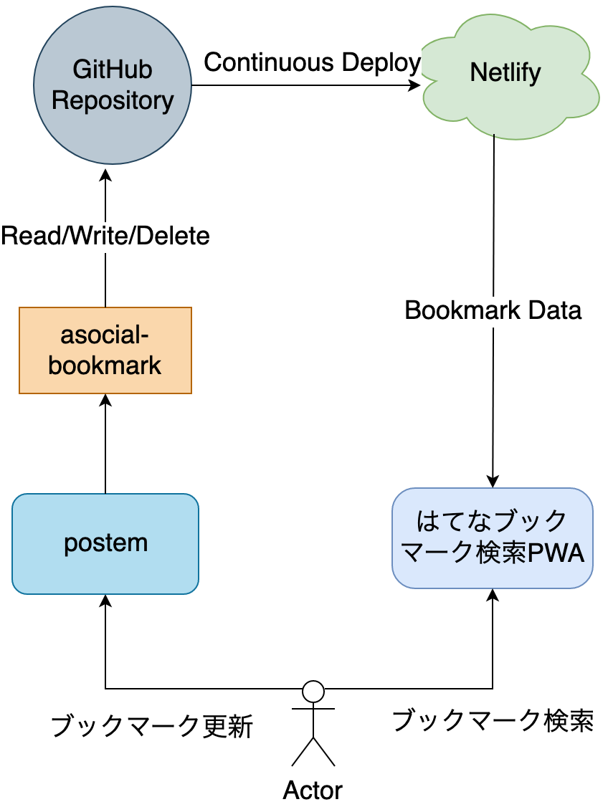
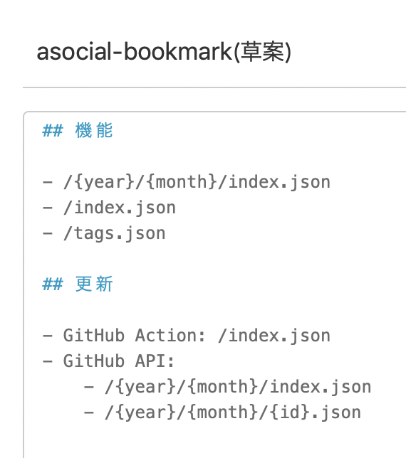
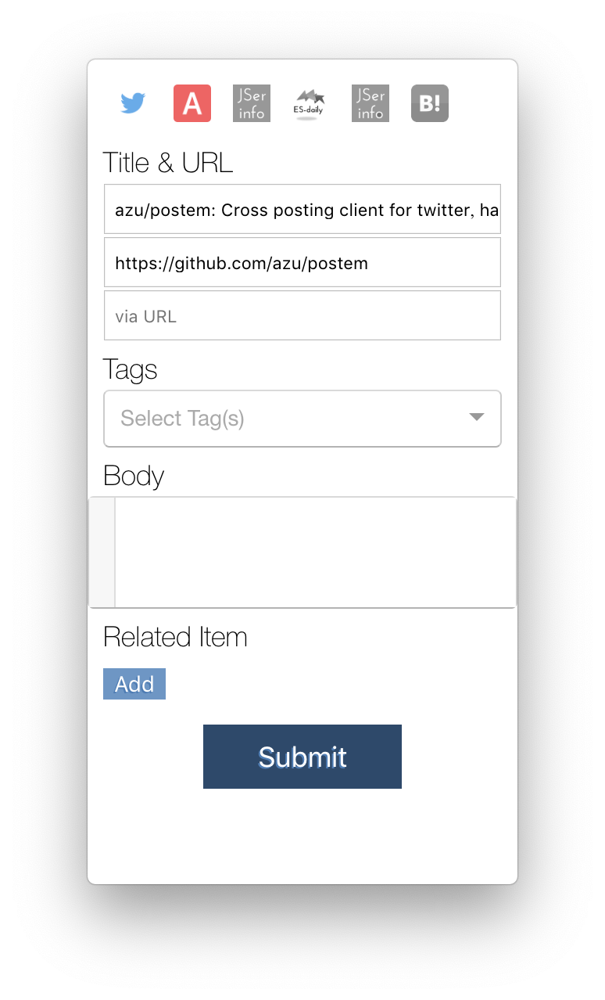
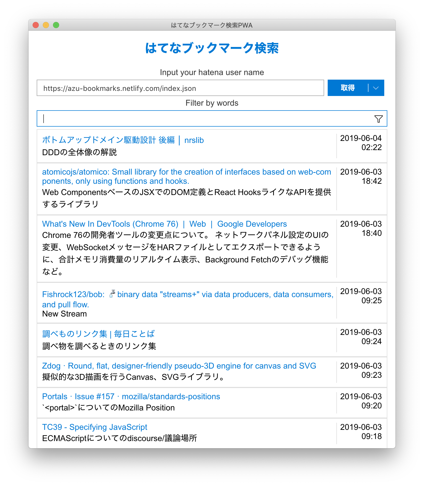

autoscale: true

# asocial-bookmark

## ブックマーク管理システムをとにかく動くアプリを早く安く作ろう

---

# asocial-bookmark

- <https://github.com/azu/asocial-bookmark>
- **モチベーション:** はてなブックマーク APIが壊れた => 困った
- 金曜にAPIが500 Internal Server Error返すという報告した
    - CloudFrontがエラーを返してるので何かを設定ミス?

---

```json
{
  body: '403 Forbidden Insufficient scope',
  headers: {
    'content-type': 'text/plain',
    'content-length': '32',
    connection: 'close',
    date: 'Fri, 31 May 2019 05:24:36 GMT',
    server: 'nginx',
    'set-cookie': [
      'b=$1$bTQbd484$ss/; expires=Thu, ' +
        '26-May-2039 05:24:36 GMT; domain=hatena.ne.jp; ' +
        'path=/'
    ],
    'x-dispatch': 'Boston::Web::Public::API::Legacy::Rest::My#tags',
    'x-varnish': '5020019',
    age: '0',
    via: '1.1 varnish-v4, 1.1 ' +
      'f5ea107910388dd712f11441721cd0ae.cloudfront.net ' +
      '(CloudFront)',
    'x-cache': 'Error from cloudfront',
    'x-amz-cf-id': 'hTBsI8X7-i6igkv8SvdaghasbJXXXXsh7YpqUXP7qNflVFQ=='
  },
  statusCode: 403
}
```

----

# asocial-bookmark

- 日曜の朝起きてもまだエラーおきてた
- => ブックマークできないのでブックマークサービス作る
- => 1日かけて作った

---

# asocial-bookmarkのコンセプト

- とにかく早く動かないとブラウザのタブが貯まるので早く作りたい
- [Pinboard](https://pinboard.in/)で良さそうと思ったけど、[Twitterアカウント](https://twitter.com/pinboard)が活発過ぎて不安になった
- とりあえず自分で動くものを作ってみよう
- 維持費がかかるのは維持できなくなるので、維持コストはできるだけ低く設定する
- => 実はブックマークって大体静的なデータでいいのでは

---

# asocial-bookmarkの全体像

---



- postemでブックマークを登録/更新
    - 削除は手動で！
- ブックマークデータはGitHubにコミットされる
- GitHubにコミットされるとNetlifyにデプロイされる
    - デプロイ時にビルドしたインデックスを作成する
- Netlifyからデータを取ってきて"はてなブックマーク検索PWA"で検索する

----

# asocial-bookmarkの全体像

- GitHub: データソース
- Netlify: CI/CD
- Client: postem(自作)
- Search: はてなブックマーク検索PWA(自作)

---

# 設計(作る前)



----

# 設計(作る前)

## データ構造だけしか書いてなかった

----

## 実装

- 慣れた道具を使う
- 雑な実装をしていいが、モジュールは必ず守る
    - 泥団子はリファクタリングができない
- 必要なものはどんどん流用する
    - 流用して節約した時間で品質をあげる
    - 質が悪くなる流用は避ける

----

## 技術選定

- 早く作る場合に冒険心を抑える
- 普段から素振りしているものを使う
    - [JavaScriptのトレンドを素振りして確認する方法 - Qiita](https://qiita.com/azu/items/bacd146ed2e26980b9b0)
    - [JavaScriptの素振りする技術](http://azu.github.io/slide/2015/year-end/javascript-swing.html)
- ボトムアップに必要なものを手を止めずに作っていく

----

## 今回作ったもの/いじったもの

- <https://github.com/azu/korefile>
- <https://github.com/azu/asocial-bookmark>
- <https://github.com/azu/postem>
- <https://github.com/azu/hatebupwa>

----

## 技術選定

- TypeScript
    - 型
- なんかブラウザでも動きそうなものは動くように書く
    - GitHubのAPIを叩くところはどっちでもいいはす

----

# [korefile](https://github.com/azu/korefile)

- GitHubまたはLocalに対してRead/Write/Deleteを行うライブラリ
    - Writeは <https://github.com/azu/git-commit-push-via-github-api> の流用
    - AWS LambdaからGitHubでGit APIを使ってコミットpushする
    - Deleteは <https://github.com/jser/probot-jser-info/> の流用
    - Pull Requestに来たファイルのファイル名を変更するProbot(ファイルを消すコードがある)
- Read/Write/Deleteをそれぞれ実装した
- GitHubを叩くテストはexample.tsを作って実際にリポジトリで読み書きするものを書いた

----

# [asocial-bookmark](https://github.com/azu/asocial-bookmark)

- [korefile](https://github.com/azu/korefile)を使ってGitHubリポジトリに対してブックマークデータを読み書きするライブラリ
    - ブックマークのデータ構造の定義を持っている
    - [korefile](https://github.com/azu/korefile)が動くだろうと信じて想像で書く
- テストは以下同文
    - テストはexample.tsを作って実際にリポジトリで読み書きするものを書いた

----

# Migration Hatebu to asocial-bookmark

- はてなブックマークのデータをasocial-bookmarkに移行する
- [korefile](https://github.com/azu/korefile)を作るときにfs adaptorを作っていた
    - GitHubを`fs`のように扱うというコンセプトだったので
- fsadaptorを使ってローカルのディレクトリに変換結果を作ってコミット！
    - Adaptorという抽象実装を変えるだけで読み書きの先を変更できた

----

## :memo: モジュールの意識

- モジュールを分けることを意識するということは、どこで面を切るかを想像して書くこと
- 泥団子はすべて捨てるしかなくなるので、ここだけはちゃんと意識する
- ずっとコード読んだり書いたりしてると、切るパターンは見えてくる
- Node.js、ブラウザどちらでも動くモジュールを書こうとするとこれは常に意識する

----

## :memo: ブラウザとNode.jsでのモジュールの境界


- ブラウザとNode.js
    - `fs` は一つの切れ目
        - `fs` に依存するところは外から差込可能なように作る　or
        - `fs` に依存するところはコアから切り離す
- そうしないとブラウザでは動かないモジュールができる
- 今回はfsをadaptorとして外から差し込めるようにした

----

# GitHubのブックマークデータをURLとして取得できるように

- [Netlify](https://www.netlify.com/)を使った
- デプロイ時にブックマークのインデックスデータ(全部を1つのJSONにしただけ！高速！)を作成
- Netlifyで配信すると自動的にCDNに乗るの
    - gh-pagesでも対しても問題ない(GitHub Actionを使えば大体手間は同じになる気がする)
    - 冒険より普段慣れているツールを使うことを優先
- ブックマークデータが `https://<your-domain>/index.json` で取得できるようになる

----

# [postem](https://github.com/azu/postem)



- pluginモデルではてなブックマークのプラグインがあった
- コピペしてURLを書き換えればほぼおわり
- ここでなんとなく投稿できるようになる
- 適当に投稿して試す
    - GitHubへポストするロジックは[asocial-bookmark](https://github.com/azu/asocial-bookmark)に実装してたので意外とすんなり通る

----

# [はてなブックマーク検索PWA](https://hatebupwa.netlify.com/)



- ブックマークは検索したい
- インクリメンタルサーチをしたい
- => 以前からはてブ向けのPWAを使って使ってた [モバイル/オフラインでも動作するはてなブックマーク検索のPWAを作った | Web Scratch](https://efcl.info/2018/04/16/hatebupwa/)
- これが[asocial-bookmark](https://github.com/azu/asocial-bookmark)にも対応すればいい

----

# [はてなブックマーク検索PWA](https://hatebupwa.netlify.com/)の[asocial-bookmark](https://github.com/azu/asocial-bookmark)の対応


- 10行ぐらいで完了！
- ユーザー名に`https://<your-bookmark>/index.json`のURLを入れるとそのまま取得するように変更した！
    - ウェブサービスではやっちゃダメだよ！(攻撃に使われることもあるので！)

---

# memo

- 普通のウェブサービスだと、任意のURLを読み込ませることができるといろいろリスクがある

```
<script src="https://example.com/secret.json">
```

- src先が利用できるかは関係なくブラウザはとりあえずロードするため、メモリ上にはデータが乗る(実行時にエラー)
- メモリにその(ログイン)ユーザーが読み込める秘密の情報を読み込ませる => Spectreでメモリにサイドチャネル攻撃して秘密の情報を取り出す

---

# memo: そもそも意味ないロードは弾きたい

- [Cross-Origin Read Blocking (CORB)](https://chromium.googlesource.com/chromium/src/+/master/services/network/cross_origin_read_blocking_explainer.md)という仕組みがあります
- `<script src="https://example.com/secret.json">` みたいな意味ないロードをそもそもブロックしてくれる
- CORBはサイドチャネル攻撃にとても有効
    - Chrome, Firefox, Safariが実装
    - <https://www.chromestatus.com/feature/5629709824032768>

---

# ブックマークシステムの完成

- [postem](https://github.com/azu/postem)でブックマークを投稿
- [GitHub](https://github.com)にブックマークデータをコミット
- [Netlify](https://www.netlify.com/)でブックマークのインデックスデータを配信
- [はてなブックマーク検索PWA](https://hatebupwa.netlify.com/)でブックマークを検索

---

# おわりに

- はてなブックマーク APIは月曜日に治りました！