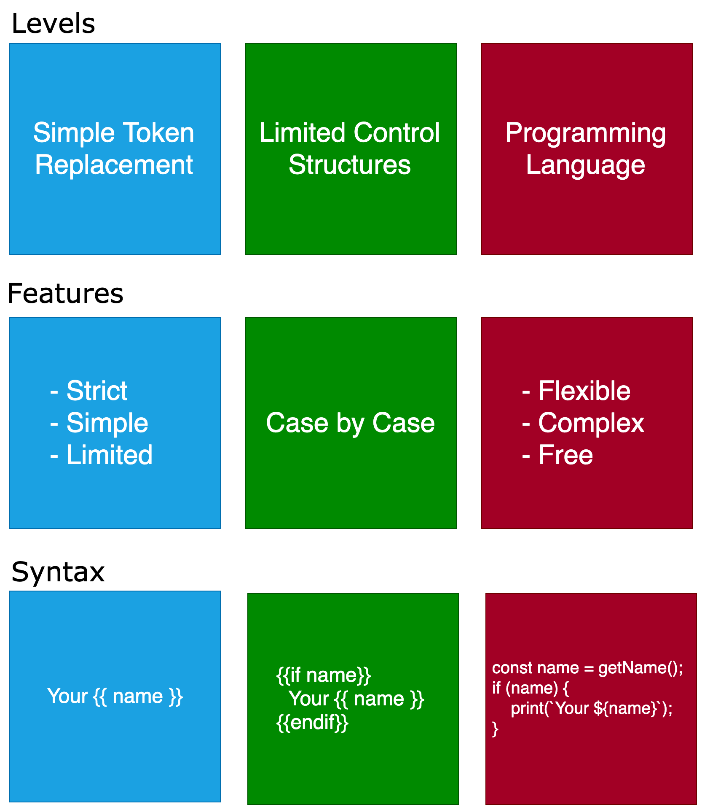
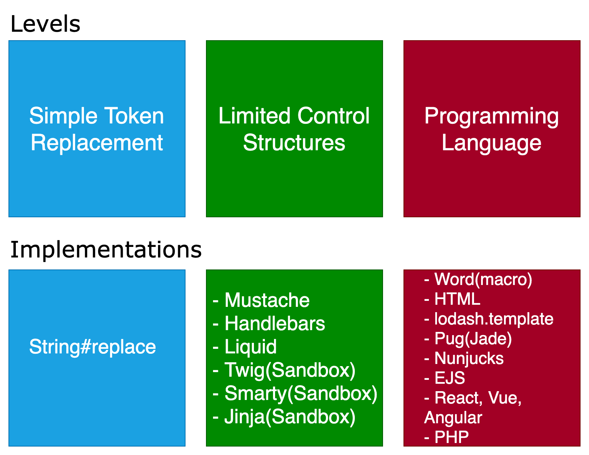
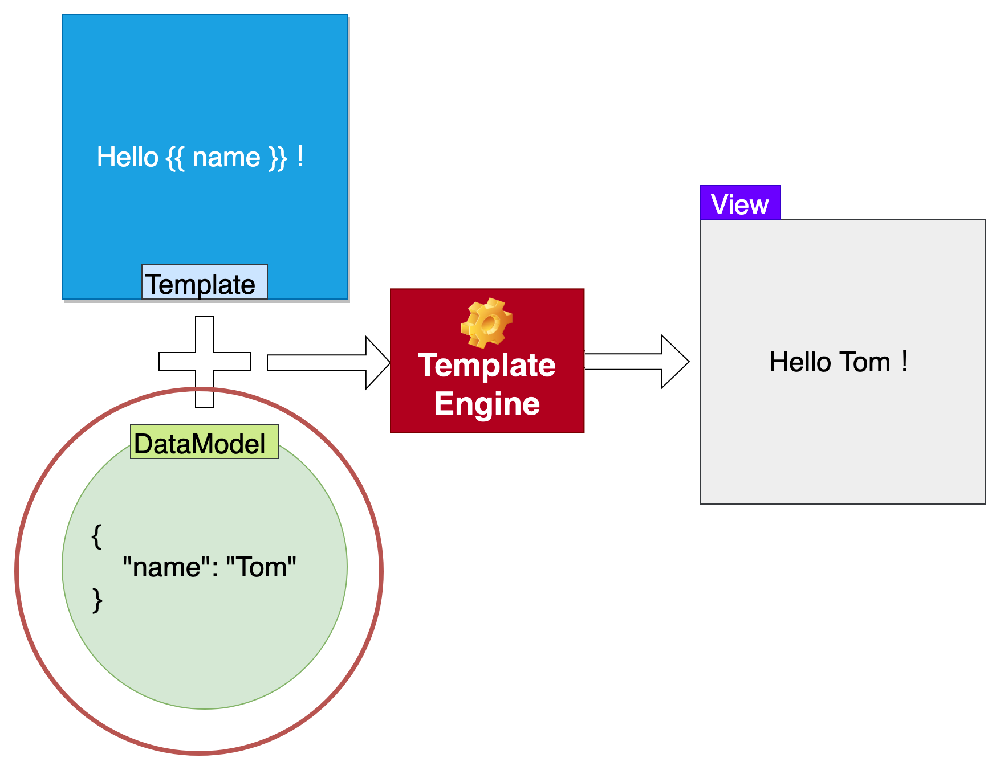
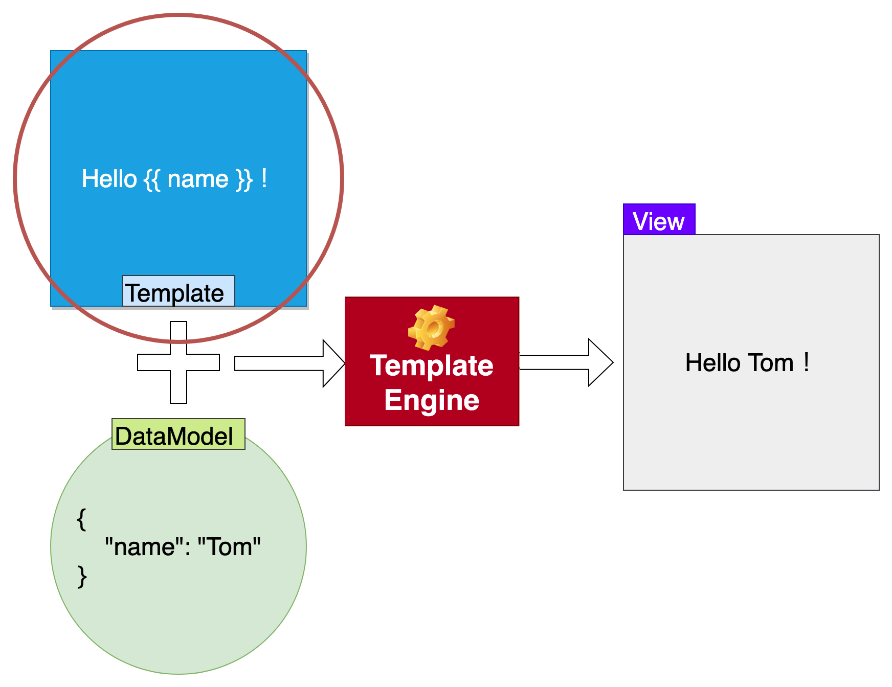
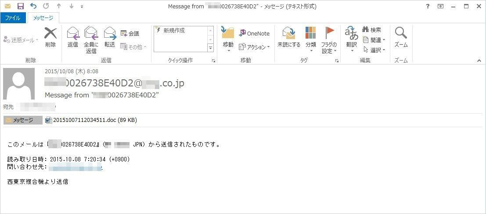
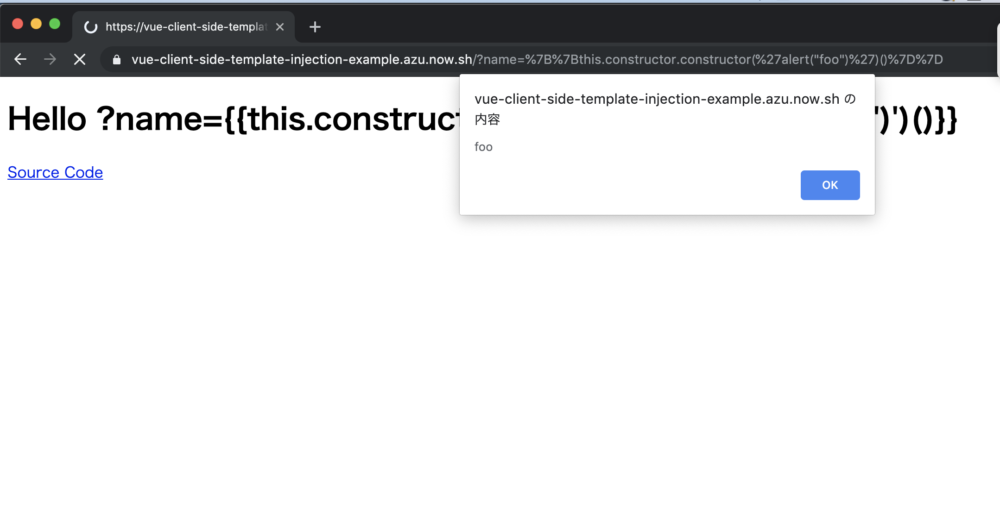
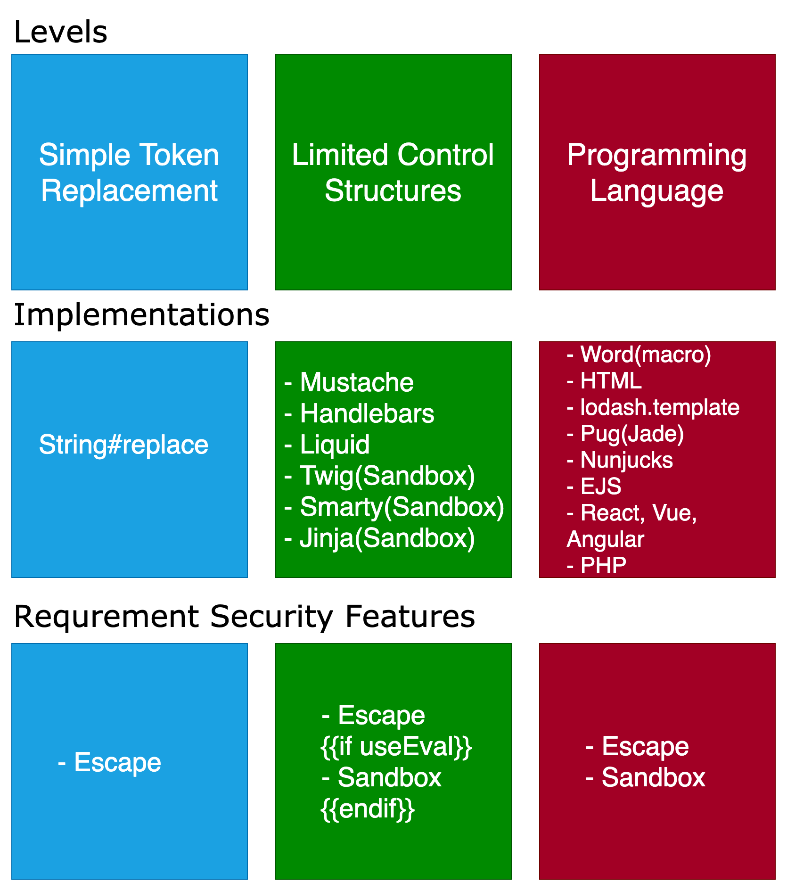

autoscale: true

# クライアントサイドからサーバサイドまで破壊するテンプレートエンジンを利用した攻撃と対策

## - 3つのテンプレート -

----

# 自己紹介


- Name : **azu**
- Twitter : @[azu_re](https://twitter.com/azu_re)
- Website: [Web scratch], [JSer.info]

[Web scratch]: http://efcl.info/ "Web scratch"
[JSer.info]: http://jser.info/ "JSer.info"

----


# アジェンダ

- テンプレートとは
- テンプレートの種類(レベル)
- テンプレートをコンパイルする場所と問題
- 信頼できない入力ソース: テンプレート or データモデル
- Programming Language Templateの危険性

-----

# 今日覚えること

- テンプレートエンジンには3つのレベルがある
- テンプレートエンジンのレベルとテンプレートをコンパイルする場所によって必要なセキュリティ対策は異なる
- テンプレートファイルはプログラムファイルである

-----

# DEMO: Server Side Template Injection

^ Server Side Template Injectionを使って、ローカルに立ち上げたサービスをブラウザから落とすデモ

-----

# テンプレートエンジン

- テンプレートとデータモデル(パラメータ)を組み合わせてViewを作る処理を行うものをテンプレートエンジンと呼ぶ
- テンプレートの種類が多いが、今回は[Web template system](https://en.wikipedia.org/wiki/Web_template_system)(HTML)を中心に扱う


----

# 3種類のテンプレートエンジン

- 表示とビジネスロジックを分けるのがテンプレートの目的
- テンプレートエンジンには3種類のレベル分けがあると考えられる
    - [Enforcing Strict Model-View Separation inTemplate Engines](https://www.cs.usfca.edu/~parrt/papers/mvc.templates.pdf) by [Terence Parr](https://en.wikipedia.org/wiki/Terence_Parr)[^1]
    - [Web Content Management - O'Reilly Media](http://shop.oreilly.com/product/0636920034186.do)


[^1]: [StringTemplate](https://www.stringtemplate.org/)や[ANTLR](https://github.com/antlr/antlr4)の作者。30年以上パースについての研究をしている

----

# 3種類(レベル)のテンプレートエンジン

- Simple Token Replacement
    - 単純な置換: `This is {{ name }}.` => `This is pen.`
- Limited Control Structures
    - if文やfor文など制御構文が付いたもの
- Programming Language
    - プログラミング言語みたいなもの

-----

# Simple Token Replacement


[.text: #FFFFFF]
[.header: #FFFFFF]
[.background-color: #1C8EDA]

-----

# Simple Token Replacement

- テンプレートとデータモデルが完全に分離されている状態
- 単純な文字列を置換をするだけのテンプレート
- 特定の用途にしか使えないように厳しく制限されている
- 任意のコードは実行できないように制限されている状態

[.text: #FFFFFF]
[.header: #FFFFFF]
[.background-color: #1C8EDA]

----


# Limited Control Structures

[.text: #FFFFFF]
[.header: #FFFFFF]
[.background-color: #107B02]

----

# Limited Control Structures

- テンプレートにも表示に関する制御構文を持つ
- if文やfor文などの制限されたコントールフロー(構造)をもつテンプレート
    - logic less templateとも呼ばれる(持っているのは表示に関するロジックのみであるため)
- 任意のコードは実行できないように制限されている状態
    - evalを全く使ってないもの or evalを使っていても実行できるものをホワイリスト制限

[.text: #FFFFFF]
[.header: #FFFFFF]
[.background-color: #107B02]


----

# Programming Language Template

[.text: #FFFFFF]
[.header: #FFFFFF]
[.background-color: #8F001C]

----

#  Programming Language Template

- テンプレートにはビジネスロジックが書ける
- チューリング完全な言語
- 何でもできる
- Evalを使っていてかつなにも制限していない

[.text: #FFFFFF]
[.header: #FFFFFF]
[.background-color: #8F001C]

-----

# テンプレートが言語になることもある

> I would argue that PHP is a templating syntax that grew into a programming language.
> -- [Web template system](https://en.wikipedia.org/wiki/Web_template_system)

- PHPは言語に進化したテンプレートエンジンとも考えられる

[.text: #FFFFFF]
[.header: #FFFFFF]
[.background-color: #8F001C]

-----



-----

# テンプレートと実装

- Simple Token Replacement
    - 単純な文字列置換
- Limited Control Structures
    - テンプレートエンジンっぽいテンプレートエンジン
    - HandlebarsやLiquidなど制限を意識して作られたもの
    - Sandboxモードが有効状態のSmartyやTwigなど(SandboxなしならProgramming Language)
- Programming Language
    - 柔軟なテンプレートエンジン、言語、UIフレームワーク
    - HTMLやPHP、各種UIフレームワークなど

----



----

# テンプレートのレベル

- ↑ほど厳密
- Simple Token Replace
    - replace関数など単純な置換に近いもの
- Limited control structures
    - Liquid, Handlebars, StringsTemplate
- Programming Language Template
    - Nunjucks, Lodash, template, Pug, React, Angular, Vue...
- ↓ほど柔軟

----

# テンプレートエンジンって言っても…

- 一言にテンプレートエンジンって言っても機能の幅が広い
- テンプレートエンジンのレベルごとにできることとできないことがある
- テンプレートエンジンのレベルごとにセキュリティの考え方も異なる
    - 攻撃するときにもできること、できないことが変わってくるため

----


----

# テンプレートをコンパイルする場所と入力ソース

----

# テンプレートをどこでコンパイルするか

コンテキスト: ウェブテンプレートなので、どこかでテンプレートをHTMLにコンパイルして、ブラウザでレンダリングするのは同じ

- ローカル
    - 手元でテンプレートをHTMLにコンパイルして、その結果を使う
    - 事前にコンパイルしてその結果を使うので、オフラインコンパイルやAOT(Ahead Of Time)コンパイルと呼ばれる
- ブラウザ
    - テンプレートとデータモデルを受け取りブラウザでコンパイルしてレンダリングする
    - クライアントサイドレンダリング
- サーバ
    - テンプレートとデータモデルを使ってサーバでコンパイルしたHTMLをレスポンスとして返す
    - サーバサイドレンダリング

----


^ 一番上は、ローカルでコンパイルして、pushして使う方法
^ 真ん中は、サーバなどからテンプレートとデータを取得して、ブラウザ上でコンパイルする方法
^ 一番下は、サーバでコンパイルして、HTMLをレスポンスとしてブラウザに返す方法

----

# [fit] 入力ソース x コンパイルする場所 x テンプレートのレベル = 安全性

----

# 入力ソース

- テンプレートエンジンは次の２つの入力から結果を出力する
    - View = テンプレート + データモデル
- 入力として テンプレートそのもの と データモデル(パラメータ) がある
    - ユーザー入力(つまり任意のもの)として受け取る入力ソースによって安全レベルは変わる


----


# 入力ソース: データモデル




----

# 入力ソース: データモデル

- ユーザー入力(信用できない)として**データモデル**を受け取るケース
    - **テンプレート**は信用できるという前提
- 多くのテンプレートエンジンはデータモデルを安全に扱う方法を持っている
    - 簡単に言えばHTMLタグにはならないようにエスケープする方法を持ってる
- そのため、データモデルに悪意あるものがあっても、結果のViewは安全を担保できる


----

# ユーザー入力としてデータモデルを受け取って、テンプレートをコンパイルするケース

|       | ローカル | ブラウザ | サーバ |
| ----------------------------- | -------- | -------- | ------ |
| Simple Token Replace          | ✔       | ✔       | ✔     |
| Limited control structures    | ✔       | ✔       | ✔     |
| Programming Language Template     | ✔       | ✔       | ✔     |

> ✔: エスケープすれば問題ない

----

# データモデルのエスケープ

Template:

```html
Hello {{ name }}!
```
DataModel:

```js
{
    "name": "<script>alert(1)</script>"
}
```
View(結果):

```html
Hello &lt;script&gt;alert(&#39;1&#39;)&lt;/script&gt;!
```

----

# テンプレートエンジンのエスケープ

- 多くのテンプレートエンジンはデータモデル(パラメータ)の展開はデフォルトで安全
    - `{{ name }}` で `name` にHTMLが入ってもエスケープして出力する
    - => データモデルにHTMLが入ってても、HTMLではなくただの文字列として扱われる
- 細かく言うと、パラメータが入る場所によってエスケープ方法は異なる
    - そのため、Contextual Escaping(href属性はjavascript:もエスケープするなど)をサポートしているかによって安全性に多少のブレがある

----

# 入力ソース: テンプレート



----

# 入力ソース: テンプレート

- 入力ソースがテンプレートそのもの場合
    - ユーザーにテンプレートの構文を書かせて、それを扱う場合
    - ブログのテーマなど
- テンプレートそのものが安全にコンパイルできるかが安全性に影響する

----

# ユーザー入力がテンプレート

|       | ローカル  | ブラウザ | サーバ    |
| ----------------------------- | -------- | -------- | ------ |
| Simple Token Replace          | Safe     | Safe     | Safe   |
| Limited control structures    | Safe     | Safe     | Safe   |
| Programming Language Template     | ⚠Danger   | ⚠Danger   | ⚠Danger |

-----

# ユーザー入力として受け取ったテンプレートをコンパイル

- テンプレートレベルがProgramming Language Templateは安全にコンパイルするのが難しい
    - 高度なテンプレートはプログラミング言語そのもの
    - コンパイル時に任意のコードが実行できてしまう => ⚠Danger

----

# Programming Language Templateをコンパイルする危険例: ローカル



- メールでマクロ付きのWordファイルを開いて、ローカルで任意のプログラムが実行されてしまうケース
    - マクロはプログラムそのもの
    - [偽装メールが再び拡散、不正マクロを仕込んだ添付ファイルでマルウエア感染：マクロウイルスの再来？ - ＠IT](https://www.atmarkit.co.jp/ait/articles/1510/28/news060.html)
- デフォルトではマクロは無効化されており、オプトインで有効化になっている
    - [Office ドキュメントのマクロを有効または無効にする - Office サポート](https://support.office.com/ja-jp/article/office-%E3%83%89%E3%82%AD%E3%83%A5%E3%83%A1%E3%83%B3%E3%83%88%E3%81%AE%E3%83%9E%E3%82%AF%E3%83%AD%E3%82%92%E6%9C%89%E5%8A%B9%E3%81%BE%E3%81%9F%E3%81%AF%E7%84%A1%E5%8A%B9%E3%81%AB%E3%81%99%E3%82%8B-12b036fd-d140-4e74-b45e-16fed1a7e5c6)

----

# Programming Language Templateをコンパイルする危険例: ブラウザ

- 意図的にサーバサイドでテンプレートを作成して、クライアントサイドでレンダリングするケースは多くない
    - 最初からサーバサイドでコンパイルしてHTMLを返せばいいだけであるため
- Vue.js や AngularJS(1.x) と 古典的なサーバサイドレンダリングの組み合わせでこの問題が発生しやすい
    - 一部だけサーバサイドでレンダリングして、クライアントサイドでレンダリング済みのHTMLを元にSPAするケース
- 検索ワード: *Client side Template Injection*

----

# Vue + Client Side Template Injection

- <https://vue-client-side-template-injection-example.azu.now.sh/?name=xxx>
- クエリの`name`をサーバサイドレンダリングして、クライアントサイドはVueでアプリを作るイメージ

----

```js
const express = require('express');
const escapeHTML = require('escape-html');
const app = express();
app.get('/', (req, res) => {
  res.set('Content-Type', 'text/html');
  const name = req.query.name
  res.status(200).send(`
  <div id="app">
    <h1>Hello ${escapeHTML(name)}</h1>
  </div>
  </footer>
  <script src="https://cdn.jsdelivr.net/npm/vue@2.5.13/dist/vue.js"></script>
  <script>
      new Vue({
        el: '#app'
      });
  </script>
`);
});
module.exports = app;
```

----

# Vue + Client Side Template Injection

- ユーザー入力(`?name`)HTMLエスケープはされているのでサーバサイドレンダリングとしては問題ない
    - <https://vue-client-side-template-injection-example.azu.now.sh/?name=%3Cscript%3Ealert(1)%3C/script%3E>
- サーバサイドがレンダリングした結果をVueがクライアントサイドレンダリングしている
    - <https://vue-client-side-template-injection-example.azu.now.sh/?name=%7B%7Bthis.constructor.constructor(%27alert(%22foo%22)%27)()%7D%7D>
    - Vueをmountするときにテンプレート構文` {{ expression }}` が入ってると、それをテンプレートとして評価してしまう！

----



>  <https://vue-client-side-template-injection-example.azu.now.sh/?name=%7B%7Bthis.constructor.constructor(%27alert(%22foo%22)%27)()%7D%7D>

----

# Client Side Template Injectionの原因

- `?name={{ this.constructor.constructor('alert(1)')() }}` のようにテンプレート構文を入れてる
- サーバサイドでレンダリングすると `{{`, `(`,  `)`, `}}` などはHTMLタグではないエスケープされない
    - 次のようなVueのテンプレートが生成され、Vueによってテンプレートとして評価され、任意のJavaScriptが実行される

```html
  <div id="app">
    <h1>Hello {{this.constructor.constructor(&#39;alert(&quot;foo&quot;)&#39;)()}}</h1>
  </div>
```

----

# Client Side Template Injectionの対処

- テンプレート と データモデル が混在してしまったのが原因
    - サーバサイドで意図せず ユーザー入力を元に テンプレートを作成してしまった
    - ユーザー入力は データモデル(パラメータ) として扱うように統一すればいい
- サーバでは初期Stateをデータモデルとしてクライアントに伝える
    - 要はJSONとしてHTMLに書き込み、クライアント側でテンプレートとデータモデルを使ってレンダリングする
    - [fix(server): separate initial state for vue by azu · Pull Request #1 · azu/vue-client-side-template-injection-example](https://github.com/azu/vue-client-side-template-injection-example/pull/1)

----


# Fix: Vue + Client Side Template Injection

```js
const express = require('express');
const app = express();
app.get('/', (req, res) => {
  res.set('Content-Type', 'text/html');
  const name = req.query.name
  res.status(200).send(`
  <div id="app">
    <h1>Hello {{name}}</h1>
  </div>
  <script src="https://cdn.jsdelivr.net/npm/vue@2.5.13/dist/vue.js"></script>
  <script>
    window.__INITIAL_STATE__ = ${JSON.stringify({ name })};
  </script>
  <script>
      new Vue({
        el: '#app',
        data: window.__INITIAL_STATE__ || {}
      });
  </script>
`);
});
module.exports = app;
```

----

# DEMOG: Client Side Template Injection

^ Vue + SSRのサイト上でClient Side Template Injectionを使ってXSSを行うデモ

----

# Programming Language Templateをコンパイルする危険例: サーバ

----

# Programming Language Templateをコンパイルする危険例: サーバ

- 一番ヤバい
- 信頼できないテンプレートをコンパイルするだけで、サーバで任意のコード実行(Remote Code Execution)ができてしまう
- 検索ワード: *Server side Template Injection*
    - [Server-Side Template Injection | Blog - PortSwigger](https://portswigger.net/blog/server-side-template-injection)
    - [Server-Side Template Injection - DARK MATTER](https://io.cyberdefense.jp/entry/2017/06/12/Server-Side_Template_Injection)

----

# lodash.template + Server Side Template Injection

- <https://server-side-lodash-template-injection.azu.now.sh/?name=xxx>
- クエリの`name`をサーバサイドレンダリングしてHTMLを返すシンプルなアプリ
    - テンプレートエンジンに`lodash.template`を使ってる

----

```js
const express = require('express');
const _ = require('lodash');
const escapeHTML = require('escape-html');
const app = express();
app.get('/', (req, res) => {
  res.set('Content-Type', 'text/html');
  const name = req.query.name
  // Create a template from user input
  const compiled = _.template("Hello " + escapeHTML(name) + ".");
  res.status(200).send(compiled());
});

module.exports = app;
```

----

# lodash.template + Server Side Template Injection

- 色々使い方がおかしい
- ユーザー入力からテンプレートを作成してしまってる
- lodash.templateは任意のJavaScriptコードを実行できる
    - Remote Code Executionが可能

----


> <https://server-side-lodash-template-injection.azu.now.sh/?name=${JSON.stringify(process.env)}>
> 注意: 今は修正されたものをデプロイしてあります

----

# lodash.template + Server Side Template Injection

- `_.template("Hello ${JSON.stringify(process.env)}.");`
    - `process.env` を返してくれる
- Fix: ユーザー入力からテンプレートを作成しない
    - [fix: fix server side template injection by azu · Pull Request #1 · azu/server-side-lodash-template-injection](https://github.com/azu/server-side-lodash-template-injection/pull/1)
    - テンプレートとデータモデルは分ける
    - ユーザー入力はデータモデル(パラメータ)に移動する

----

# FIX: lodash.template + Server Side Template Injection

```js
const express = require('express');
const _ = require('lodash');
const app = express();
app.get('/', (req, res) => {
  res.set('Content-Type', 'text/html');
  const name = req.query.name
  const compiled = _.template("Hello <%- name %>.");
  res.status(200).send(compiled({ name }));
});

module.exports = app;
```

----

# Server Side Template Injection

- ユーザー入力からテンプレートを作ってしまうと問題が起きる
    - SQL Injectionとよく似ている
    - 基本的な対策はユーザー入力をテンプレートにわたすときにプレースホルダーを使う！
- 事例: 有名なサイトでも結構やらかしている. $10,000 > ぐらいの報奨金がでる
    - [Yahoo! RCE via Spring Engine SSTI – ∞ Growing Web Security Blog](https://hawkinsecurity.com/2017/12/13/rce-via-spring-engine-ssti/)
    - [Artsploit: [demo.paypal.com] Node.js code injection (RCE)](https://artsploit.blogspot.com/2016/08/pprce2.html)
    - [#125980 uber.com may RCE by Flask Jinja2 Template Injection](https://hackerone.com/reports/125980)
    - [#423541 H1514 Server Side Template Injection in Return Magic email templates?](https://hackerone.com/reports/423541)

----

# Template Injection

- 多くのProgramming Language Templateの攻撃方法が確立されている
- [Tplmap](https://github.com/epinna/tplmap)などの検査ツールもある(テンプレート構文っぽい文字列をクエリに入れまくる)
- 参考: [DiogoMRSilva/websitesVulnerableToSSTI: Simple websites vulnerable to Server Side Template Injections(SSTI)](https://github.com/DiogoMRSilva/websitesVulnerableToSSTI)

----

[EJS](https://ejs.co/)

```
<%% global.process.mainModule.require('fs').readFileSync('/etc/passwd').toString() %%>
```

[Nunjucks](https://mozilla.github.io/nunjucks/)

```
{% global.process.mainModule.require('fs').readFileSync('/etc/passwd').toString() }
```

[Slim](http://slim-lang.com/)

```
#{ File.open('/etc/passwd').read %>}
```

[erb](https://ruby-doc.org/stdlib-2.6.2/libdoc/erb/rdoc/ERB.html)

```
<%= File.open('/etc/passwd').read %>
```

[Vue(SSR)](https://vuejs.org/)

```
{{ global.process.mainModule.require('fs').readFileSync('/etc/passwd').toString() }}
```

----

# User Defined Template と Server Side Template Injection

- ユーザーがテンプレートを書ける機能を提供している場合
    - ブログのテーマ機能
    - 管理画面でテンプレート構文自体を入力させているようなケース
- ユーザーに定義させるテンプレートをUser Defined Templateと呼ぶ
- 検索キーワード: *User Defined Template*

----

# User Defined Template と Server Side Template Injection

- User Defined Template が Programming Language Template ならアウト
    - ユーザーがサーバで任意のコード実行ができる
    - サーバ自体を乗っ取ることが可能
- テンプレートのレベルをちゃんと選択することが重要

----

# DEMO: User Defined Template と Server Side Template Injection

^ デモサイト上でブラウザからサーバで任意のコード実行を行って、`process.env`に含まれている秘密の情報を抜き取るデモ

----

# User Defined Template として書けるテンプレートの事例

- [Shopify](https://www.shopify.jp/): [Liquid](https://shopify.github.io/liquid/basics/introduction/)
    - [liquidjs](https://github.com/harttle/liquidjs): JS実装
- [Drupal](https://www.drupal.org/): [Twig](https://twig.symfony.com/doc/1.x/)
    - [Twig in Drupal 8 | Drupal 8 guide on Drupal.org](https://www.drupal.org/docs/8/theming/twig)
- どちらもLimited control structuresなテンプレート

----

# User Defined Template として書けるテンプレートで安全を保証する手法

- セキュリティレビュー
- ホワイトリストでの機能制限
- 隔離環境での実行

----

## セキュリティレビュー方式

- [Wordpress](https://wordpress.com/): テーマは独自のProgramming Language Template
    - テーマにPHPのコードも普通に書ける
    - [Theme Security | Theme Developer Handbook | WordPress Developer Resources](https://developer.wordpress.org/themes/theme-security/)
    - ホスティング版では、利用できるテーマが審査済みのサードパーティに限定される
    - [The WordPress.com Business Plan Now Supports Plugins and Third-Party Themes — The WordPress.com Blog](https://en.blog.wordpress.com/2017/08/07/wordpress-com-business-now-supports-plugins-and-third-party-themes/)
    - レビューによって安全を保証してる
- OSS版Wordpressにおいてはテーマのインストール = 任意のPHPプログラム実行

----

## ホワイトリスト/バリデーション方式

- 利用できる機能をホワイトリストで制限する
    - ブラックリストは抜け道が出やすいのでセキュリティでは避ける
- Twig、Smarty、[Jinja](https://jinja.readthedocs.io/en/2.10.x/sandbox/)のSandboxはこの方式
    - Sandboxと言うけど、実際にはホワイトリストでの機能制限 + アクセスエラー(実行させないようにしてる)
    - Programming Language TemplateからLimited control structuresにレベルダウン⬇


----

## ホワイトリスト/バリデーション方式の問題

- Validationによる制限はレベルを下げる道具
    - 全てを網羅してないとレベルを下げることができないため、結構難しい
    - 抜け穴一つでもあれば、レベルは下がらない = Programming Language Templateのまま
- バリデーションで後から制限より、最初からLimited control structuresを選ぶべき
    - 最初に適切なレベルを選択して、不必要にレベルを上げないようにする
- レベルを下げるのは、レベルを上げることよりも難しい
    - [生活水準](https://twitter.com/k2wanko/status/1158656749794054144)と同じ

----

## 隔離環境での実行

> Containers are not a sandbox
> -- [gVisor](https://github.com/google/gvisor)

- VM、Serverlessなど隔離した環境を用意しそこでテンプレートをコンパイルする
- 悪意あるテンプレートをコンパイルしてもできることを制限する
- オーバーヘッドがある

----

# 入力ソース: テンプレートのまとめ

|                               | ローカル  | ブラウザ | サーバ    |
| ----------------------------- | -------- | -------- | ------ |
| Simple Token Replace          | Safe     | Safe     | Safe   |
| Limited control structures    | Safe     | Safe     | Safe   |
| Programming Language Template     | ⚠Danger   | ⚠Danger   | ⚠Danger |

----



----

# Limited control structuresとProgramming Language Template

- Limited control structuresは機能として提供しやすい
- Programming Language Templateは機能として提供しにくい

----

# Limited control structuresとProgramming Language Templateの見分け方

- それがプログラムに見えるならプログラム
    - テンプレート内で言語のネイティブコードが呼べるならProgramming Language Template
    - `{{ new Date().getTime() }}`
    - Evalを使ってるならProgramming Language Templateになる可能性がある

----

# Limited control structuresとProgramming Language Templateの見分け方

- 細かいところまで見ないと区別はつきにくい
    -　実装に依存してしまう
- 検索キーワード
    - `{{テンプレート名}} Untrusted template`
    - `{{テンプレート名}} User Defeined template`

----

# 考え方: テンプレートと実行

- 自分のマシンでテンプレートをコンパイルして、その結果を提供するのはOK
    - デプロイ時にコンパイルしてから提供するのはOK
- 他人が書いたテンプレートを、自分のマシン/ブラウザ/サーバでコンパイルするのはNG
    - Programming Language Templateの場合は任意のコードが実行できる
    - ユーザー入力としてテンプレートを受け取ってコンパイルする時はプログラムを実行するのと同じ気持ち

----

# 考え方: ユーザー入力とテンプレート

- ユーザー入力は全てUntrustedなデータ
    - ユーザー入力からテンプレートは作成しない
    - ユーザー入力はデータモデル(パラメータ)として渡す
- テンプレート機能をユーザーに提供する場合
    - Programming Language Templateを避ける
    - ユーザーにプログラムを書かせない

[.text: #FFFFFF]
[.header: #FFFFFF]
[.background-color: #8F001C]

----

# 考え方: テンプレートと複雑性

- 厳密にデータとロジックを分離するのはセキュリティと同じ
- 無制限なテンプレートはテンプレートがデータモデルに影響を与えることができる
- 複雑な問題に対処するなら複雑な機能を持ったテンプレートが必要になる
- 逆に複雑ではない問題に対して複雑なテンプレートはオーバースペック

----

# まとめ

- テンプレートは3つのレベルがあると考えられる
- テンプレートのレベルとコンパイルする場所によって影響度は異なる
- ローカルコンパイルとサーバコンパイルを同じものとして扱わない
- レベルを下げるのは難しいため、必要なレベルのものを最初に選択する
- Untrustedなテンプレートをコンパイルするときには制限がある状態で行う
    - Sandbox、ホワイリスト、マニュアルレビュー
- テンプレートファイルはプログラムファイル

----


# Simple Token Replacement


[.text: #FFFFFF]
[.header: #FFFFFF]
[.background-color: #1C8EDA]

----

# Limited Control Structures

[.text: #FFFFFF]
[.header: #FFFFFF]
[.background-color: #107B02]

----

# Programming Language

[.text: #FFFFFF]
[.header: #FFFFFF]
[.background-color: #8F001C]

---

# より良いテンプレートライフを！


---

## 参考文献

- [Enforcing Strict Model-View Separation inTemplate Engines](https://www.cs.usfca.edu/~parrt/papers/mvc.templates.pdf)
- [Web Content Management - O'Reilly Media](http://shop.oreilly.com/product/0636920034186.do)
- [Client-side Template Injection - YouTube](https://www.youtube.com/watch?v=VDAAGm_HUQU)
- [JSMVCOMFG - To sternly look at JavaScript MVC and Templating Frameworks](https://www.slideshare.net/x00mario/jsmvcomfg-to-sternly-look-at-javascript-mvc-and-templating-frameworks)
- [PayloadsAllTheThings/Server Side Template Injection at master · swisskyrepo/PayloadsAllTheThings](https://github.com/swisskyrepo/PayloadsAllTheThings/tree/master/Server%20Side%20Template%20Injection)
- [Web template system - Wikipedia](https://en.wikipedia.org/wiki/Web_template_system)
