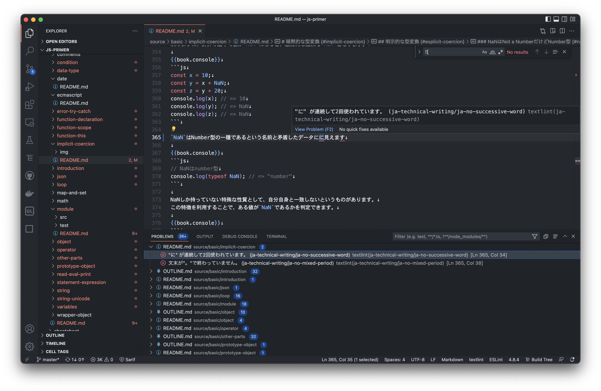
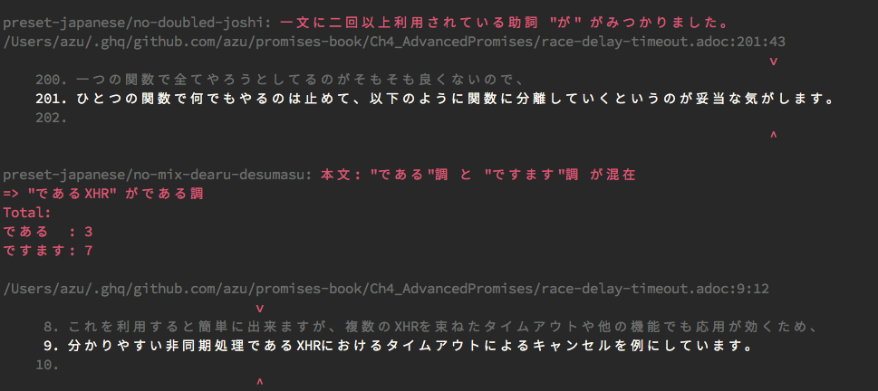
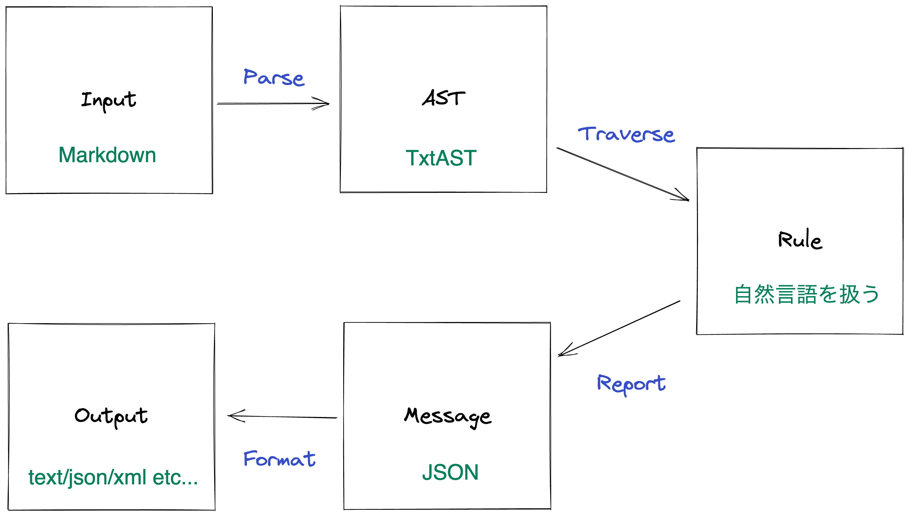
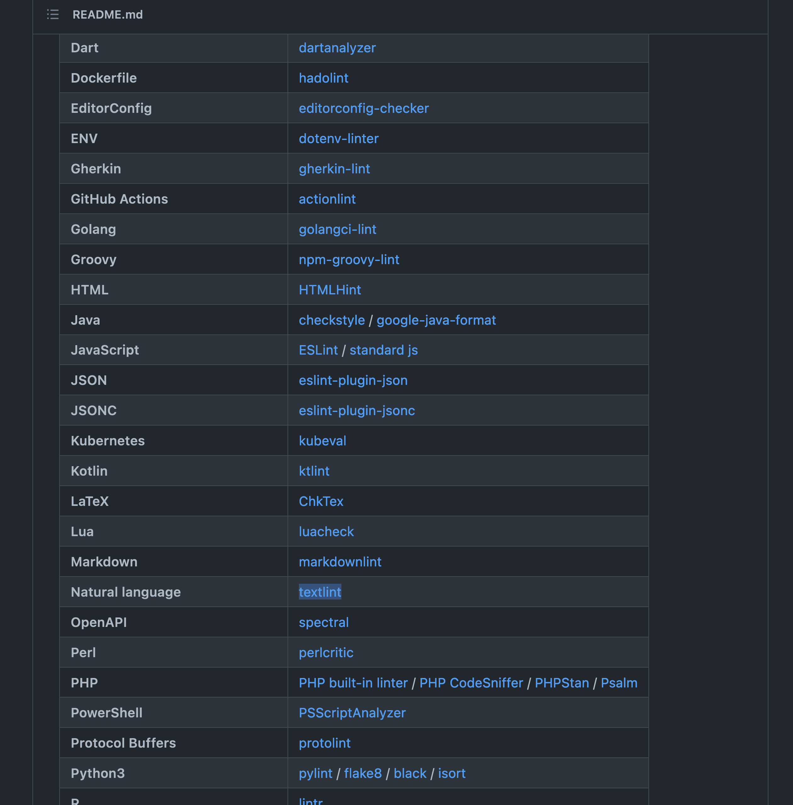

autoscale: true

# [fit]  textlint - Linterの作り方

---

# 自己紹介


- Name : **azu**
- Twitter : @[azu_re](https://twitter.com/azu_re)
- Website: [Web scratch](http://efcl.info/), [JSer.info](http://jser.info/)
- Book: [JavaScript Primer](https://jsprimer.net/)

---

# アジェンダ

- Linterを作る人向けの話
- Linterの考え方とアーキテクチャを一致させる
- 使うものを作ろう、作るために使おう

^ Lintの教養を得て、RobocopというLintの実装例を知れたので、Lintを作りたくなったと思います
^ なのでLinterの作り方の話をします。

---


----

# [textlint](https://textlint.github.io/) とは

- 自然言語(日本語や英語など)に対するLinter
- MarkdownやHTMLなどのマークアップ言語に対応している
- ビルトインのルールは0
- 利用できるルールは[100以上](https://github.com/textlint/textlint/wiki/Collection-of-textlint-rule)ある
- 多くのルールはオフラインで動くので、外部に入力してる内容を送信しない
- CI/CDに組み込める自然言語のチェッカー(表記揺れ、スペルチェック、誤用、読みやすさのチェックなど)

---



---



---

# textlint users

- Translation:
  [Angular](https://github.com/angular/angular-ja)、[React](https://github.com/reactjs/ja.reactjs.org)、[Vue](https://github.com/vuejs/jp.vuejs.org)、[Nuxt.js](https://github.com/vuejs-jp/ja.docs.nuxtjs),　[Next.js](https://github.com/Nextjs-ja-translation/Nextjs-ja-translation-docs)、[Gatsby](https://github.com/gatsbyjs/gatsby-ja)
- Book:
  [JavaScript Primer](https://github.com/asciidwango/js-primer)、[SurviveJS - Webpack](https://github.com/survivejs/webpack-book)、[Pythonクローリング&スクレイピング](https://www.amazon.co.jp/dp/4297107384/)
- Documentaion:
  [VuePress](https://github.com/vuejs/vuepress)、[Cypress](https://github.com/cypress-io/cypress-documentation)、[Microsoft Azure Identity(ja)](https://github.com/jpazureid/blog)、[OWASP Cheat Sheet Series](https://github.com/OWASP/CheatSheetSeries)
- 小説:
  [「Visual Studio Code」で執筆するSF作家　藤井太洋氏が作る物書きのための拡張機能](https://logmi.jp/tech/articles/325715)
- Company:
  [弁護士ドットコム](https://www.bengo4.com/)、[ソラコム](https://soracom.jp/)、[ヴェルク](https://www.velc.co.jp/)、[SmartHR](https://smarthr.jp/)、[Retty](https://retty.me/)
  - [textlintを使っている企業の事例・ルールをまとめてみた](https://zenn.dev/kgsi/articles/a88273d293abe07c5acb)

---

# Editorの連携

- VScode
    - [vscode-textlint](https://github.com/taichi/vscode-textlint)
    - [テキスト校正くん - Visual Studio Marketplace](https://marketplace.visualstudio.com/items?itemName=ICS.japanese-proofreading)
- Vim
- 秀丸エディタ
    - [秀まるおのホームページ(サイトー企画)－textlintを処理するマクロサンプル](https://hide.maruo.co.jp/lib/macro/textlint001.html)

---


# textlintをなぜ作ったか

- [JavaScript Promiseの本](https://azu.github.io/promises-book/)や[JSer.info](https://jser.info/)などを書いていて表記ゆれが気になることがあった
- 汎用的な自然言語をチェックできるものが欲しくなった
- CIで走らせることが前提の自然言語のLinterがなかった
- 詳細:
  [Maintainer Month: なぜtextlintを作ったか | Web Scratch](https://efcl.info/2022/06/29/why-create-textlint/)

---

# 自然言語は常に変化する言語

- 言語の違い、文章のフォーマット、コンテキストで文章は変わる
- 日本語と英語でそもそも文法のルールが異なる
- 自然言語は、毎日新しい単語が増えるし[^1]、文法も変わることあるし[^2]、同じ文の意味がコンテキストや時間で変わることもある[^3]
- そのため、あらゆる自然言語を包含するAST(抽象構文木)を作ることは難しい
- 自然言語はバージョン管理されていない

[^1]: [mecab-ipadic-NEologd](https://github.com/neologd/mecab-ipadic-neologd)、[SudachiDict](https://github.com/WorksApplications/SudachiDict)

[^2]: [変化する日本語 - 日本語ジャーナル](https://nj.alc-nihongo.jp/entry/20210606-nihongo-henka)

[^3]: [日本語における差別語概念の変遷](https://core.ac.uk/download/pdf/236078037.pdf)、[ドメインにより意味が変化する単語の抽出](https://hatenablog-parts.com/embed?url=https%3A%2F%2Fgithub.com%2FGINK03%2FDomainDependencyMemeJsai2017)

^ 新しい単語は本当によく増えるし、それをメンテできてる辞書はあんまりない。
^ ら抜き言葉とか、感覚的に通じるものは、通じるようになってそれが間違いとは言わなくなったりしている。特に書き文字は変化がある
^ <https://tug.org/tug2013/jp/followup/tug13fur-ebook.pdf>
^ 言葉の意味の上書きというのは結構起きる。WhiteやBlackがAllowやDenyに変化したり、逆にクィアとか、全然大丈夫とか肯定的な意味に変化した言葉もある
^ 全然 ~ は元々は、「全然 ~ ない」という否定の使われ方。けど最近は肯定でも使われる。

---

# [fit] 文字列のチェックでは、誤検知を避けられない

- 多くの場合、MarkdownやLaTexやWordといった装飾をしながら書いている
- 何もパースせずにそのまま文字列として扱うと誤検知が生まれる
  - “文字数” をみるのもMarkdownとプレーンテキストでは異なる
  - `@` とか特定の記号が特別な意味を持つことがある
  - 文章の中でも、コードと引用文とは異なる扱いにしたい
- マークアップはパースして扱わないと、それ自体が誤検知となる
  - マークアップはパースするが、その中のテキスト(自然言語)はパースできない
- Grep以上、人間未満のツールが必要だった

^ 文字列検索ではマークアップ言語を扱うには限界がある
^ マークアップ言語は仕様がある程度決まっているのでパースできる
^ なのでそこはパースする。これによってGrep以上人間未満(自然言語は扱えない)が作れそう

---

# textlintの目標とアーキテクチャ

- あらゆるマークアップ、あらゆる自然言語を扱えることを目標にした
- そのために、次のようなアーキテクチャを選択した
  - すべてがプラガブル → マークアップ言語が増えても対応できる
  - ビルトインルールは持たない →　ルールはオプトイン
- コアはどのマークアップ、自然言語でも動く

---

# textlintのアーキテクチャ


<!-- https://excalidraw.com/#json=T1PRMrzH5rLEf4qIgfPU6,PASBN1yoXOJ5FUsmrb_Gyg -->

^ ESLintと大体同じです。

---



---

# Input

```markdown
# Header

THIS IS TODO.
```

---

# AST[^TxtAST]

```json
{
  "type": "Document",
  "children": [
    {
      "type": "Header",
      "depth": 1,
      "children": [
        {
          "type": "Str",
          "value": "Header",
        }
      ],
    ...
    }
  ]
}
```

[^TxtAST]: https://textlint.github.io/astexplorer/

---

# Rule

```js
export deafult (context, options = {}) => {
    const { Syntax, RuleError, report, getSource, fixer } = context;
    return {
        [Syntax.Code](node) {
            const text = getSource(node);
            const match = text.match(/TODO/);
            if(match){
               report(node, new RuleError("Found TODO")); // ⇨ Messsage
            }
        }
    };
};
```

---

# Message

```json
[
  {
    "messages": [
      {
        "type": "lint",
        "ruleId": "example",
        "message": "Found TODO",
        "range": [19, 24],
        "severity": 2
      }
    ],
    "filePath": "/path/to/A.md"
  }
]

```

---

# Output

```
Found TODO

 (at 3:1)
   THIS IS TODO
|          ^^^^
```

---


<!-- https://excalidraw.com/#json=xn9rmR-AW3MvXAk65la_o,yJHkDIOrzE3fc97GJCzpzg-->
---

# [fit] プラガブルアーキテクチャのメリット

- コアがマークアップ言語や自然言語の依存から切り離せる
    - 新しいマークアップ言語に対応する → Parserプラグインを実装する
    - 検出するルールを増やしたい →　ルールを実装する
    - 新しい自然言語を扱いたい → ルール内で扱えば問題ない
    - 新しい出力に対応したい → Formatterを実装する
- ParserとRuleとFormatterは全部プラグインとしてかける
  - textlintが決めているのはASTとMessageのフォーマットだけ
- これによって、マークアップ/自然言語が増えても対応できる
  - 🚀🌟絵文字言語が登場しても対応できるように作るというのが目的

---

# [fit] プラガブルアーキテクチャのデメリット

- アーキテクチャ視点
  - レイヤーが増える分、パフォーマンスは良くない
  - 実装が分散するため、まとめてアップデートはしにくい
- ユーザー視点
  - セットアップに手間がかかる
  - 何を使えばいいのかわからない問題
  - textlintもpresetは提供してる
  - がそのpresetもコンテキストが多いので、これ使えばいいというのは難しい

^ 小説と技術書で必要なルールは違うし、翻訳の文章の場合も異なる。
日本語でもいろんな文章の形式があるのでルールが違う。
同じ人でも読む対象が違えば違う文章を書く。ブログと書籍では別だし、Twitterなら別。

---

# [fit] プラガブルなアーキテクチャで生まれる余白

- 自由度が高めで作ると想定してない使い方も増える
    - プロダクトの表記揺れ統一
    - [textlintを導入してみて / Usage status and effects of the textlint - Speaker Deck](https://speakerdeck.com/kuny/usage-status-and-effects-of-the-textlint)
    - UX ライティング
    - [入力支援ツール・textlintを導入したら、テキストコミュニケーションを磨く時間をたくさんかけられるようになった話｜BASE DESIGNER｜note](https://note.com/base_designteam/n/n12f9b3a0d0e1)
    - コミュニケーションの補助ツールとして
    - [boardのカスタマーサポート返信時にtextlintでチェックする - ヴェルク - IT起業の記録](https://tamukai.blog.velc.jp/entry/2021/07/27/114510)

^ 元々は自分が欲しくて作ったので技術書とかブログとかのチェック用。
けど、さいきんはプロダクトの表記揺れ(RubyとかJSXとかのソースコードに対してチェックしてる)だったり、プロダクトに組み込んだしてるケースもある。

---

# ブラウザで動くtextlint

- textlintは、ブラウザでも動かせるように意識はしてる
- これはクライアントサイドで動かして、サーバサイドにテキストデータを送らなくても動くようにするため
- [textlint editor - ブラウザでも動くPrivacy Firstの文章校正ツールを作る話](https://azu.github.io/slide/2020/textlint-editor/textlint-editor.html)
- 既に[@textlint/script-compiler](https://github.com/textlint/editor/tree/master/packages/%40textlint/script-compiler)を使うと、ブラウザで動くようにtextlint+ルールをコンパイルできる
- ESM + Import Mapsへネイティブ対応すれば、コンパイルなしでもルールが動く未来は見えてきた
- かなり大掛かりなことやらないと互換性が保てないし大変なので、Contributing Welcome！
- <https://github.com/textlint/textlint/issues/902> 

---

# プラグインと責務の分離

---

# 責務の分離

- あらゆる点をプラグインにすることは責務の分離にもつながる
- textlintはコアにルールを持たないのがルール
- そのため、ルールはコアとは別のOrganizationで公開してる
- ルールの要望への対応は時間を使うので、コアに来ても単純にIssueを閉じられるというメリットがある

---

# コアとルールの分離

- [ESLint](https://eslint.org/)などはコアにpresetが紐づいているため、コアの時間がそこに使われる問題がある
- [Rome](https://github.com/rome/tools)とか[Deno](https://github.com/denoland/deno_lint)とかもコアにLintを持ってるので、それぞれ同じものを労力かけて開発
- これはパフォーマンスを最適化するには必要だけど、時間は最適化できない
- 自然言語のLintがbuilt-inされたものは前例があったけど、この辺をプラグインでやりきってるものはない。textlintはパフォーマンスより時間を最適化を意識してる
- コアではやらないことをはっきりさせることで、責務が分離できる

---

# 責務の分離とメンテナンスの分離

- 責務が分散すると、メンテナンスも分散される
- これはトレードオフ
  - コアから切り離せると、ルールの追加とかはやりやすくなる
  - 一方で、ルールが個人に紐づくとメンテナンスが止まる確率は高くなる
- →　ルールをorganizationに集めるなど、緩いまとまりを持ったコミュニティを作ることでバランスをとっている

---

# コミュニティと責務の統合

- textlintのコミュニティと責務
- プラグイン = パーサはコアに近い(新しいマークアップ言語の対応)なので、[textlint organization](https://github.com/textlint)内でプラグインコミュニティを作ってメンテナンスをサポートしてる
  - [textlint plugin ownership · Discussion #1 · textlint](https://github.com/orgs/textlint/discussions/1)
  - プラグインはコアに近いものなので、コアの近くに置いている(権限は工夫すればなんとかなる)
  - コアにあることによって、プラグインの開発メンバーもコアメンバーと同じ恩恵を受けられる
  - `textlint` memebrは 1password🔑 を無料で利用できるなど[^opensource]

[^opensource]: [1Password for Open Source Projectsの申請をした | Web Scratch](https://efcl.info/2022/09/23/1password-teams-open-source/)

---

# textlintルールのコミュニティ

- [textlint-rule](https://github.com/textlint-rule)と[textlint-ja](https://github.com/textlint-ja)
  - 自然言語を扱うルールはかなり言語に依存してるので、Universalなものと日本語で分けている
  - 日本語じゃないとIssueが書きにくい問題も多いというのもあるため
  - コミュニティを作って、メンテナンスできる人を増やす意図がある
  - ルールを開発する時間がなくなったら権限を委譲することで、アップデートは継続できるようにする

---

# Linter開発のコツ

---

# 開発を続けるコツ

- 使うものを作ろう
- 作るために使おう
- 使わないものは使われない
- 自分が使ってないものはそこまで時間を使えない
  - HTMLのパーサは最初コアにあったけど、自分は使うユースケースを持ってなかった切り離してプラグインにした
- [Maintainer Month: オープンソースをメンテナンスするコツ | Web Scratch](https://efcl.info/2022/06/27/maintenance-open-source/)

---

# 使うと開発は進む

- ユースケースがないと、なかなか進まない
- ユースケースを作ったり持ってきたりする
    - [JavaScript Primer](https://jsprimer.net/)を書いてる時はtextlintの開発も進む
    - [JavaScript Primer](https://jsprimer.net/)の第2版を書いているが、textlintがなかったら文章のリファクタリングは難しかった

---

# [Secretlint](https://secretlint.github.io/)🔑🛡️の事例

- [Secretlint](https://secretlint.github.io/)はファイルに含まれてる機密情報をチェックするLintルール
- 構造はtextlintとかなり似ていて全部プラグインになってる
- 機密情報は共通知識があるので、presetは別途用意してる
- 開発するために、常に使う状況を作る
  - [global pre-commit hooks](https://github.com/secretlint/secretlint#pre-commit-hook-globally)でどのリポジトリのコミットでも使ってる
  - 常にLintを使うようにすることで、新しいルールを追加するモチベーションになる
- すぐ使える状況を作る
    - [https://secretlint.github.io/](https://secretlint.github.io/)
- 使うものじゃないとクオリティが上がらない

---

# リアルなデータでLintをチェックする

- 新しいルールを書いたときに、想定してないケースに遭遇することはよくある
- 実際のリアルデータを使って、誤検知していないかを確認する
- textlintで技術文書向けのルールを書くときは、技術書を集めたコーパスを使ってチェックできる
    - [textlint-ja/technological-book-corpus-ja: 日本語で書かれた技術書を収集した生コーパス/ツール](https://github.com/textlint-ja/technological-book-corpus-ja)
- プログラミング言語なら、GitHubなどでコーパスを作って持っておくとチェックの負荷が下がる

^ コーパスには[JavaScript Primer](https://jsprimer.net/)も入ってる。

---

# まとめ 1

- textlintは自然言語を扱うLint
  - 自然言語の解釈はとても変化しやすいので、”公式のルール”は作るのが難しい
  - textlintでは、この考えを反映してプラガブルなアーキテクチャを選んだ

---

# まとめ 2


- プラガブルを基本とすることで、責務の分離や想定外の使い方も生まれる
  - 責務を分離するとコードも分離し、メンテナンス性が悪くなることもある
  - textlintでは、コードは分離するがコミュニティで集める方式をとっている
  - pluginはコアに近いコミュニティとして管理、ruleは言語ごとにコミュニティを作って管理

---

# まとめ 3

- 人間が作るものにはモチベーションの問題がある
  - 長く続けるには、使うものを作ること/使うために作ること
  - 積極的に使うパターンを増やすと、開発は継続しやすい

---

# 参考

- [Reflections on ESLint's success - Human Who Codes](https://humanwhocodes.com/blog/2016/02/reflections-on-eslints-success/)
- [The inception of ESLint - ESLint - Pluggable JavaScript Linter](https://eslint.org/blog/2021/11/the-inception-of-eslint/)
- [r2c blog — Semgrep: a static analysis journey](https://r2c.dev/blog/2021/semgrep-a-static-analysis-journey/)
- [Maintainer Month: なぜtextlintを作ったか | Web Scratch](https://efcl.info/2022/06/29/why-create-textlint/)

---

# 余り

---

# 分散と集約はどちらか良いのか

- どちらもいい時がある
- ESLintは分散で、Deno/RSLint/Romeなどは集約してる
- 集約することでパフォーマンスのメリットはあるけど、どちらかという機能じゃなくて組織的/マーケティング的な方向も入ってくる
- 集約して勢いがあるうちは早くていいが、量が増えると問題ができてきて分散/Forkに向かっていく
- また分散すると維持コストは高くなり、労力的な問題が出てくるため、集約していくというのを繰り返す
- バランスの問題
- 維持コストをみて、常に方向を決めている


---

# 世の中のLint

[https://github.com/github/super-linter](https://github.com/github/super-linter)



----

# Lintの幅


- 動的な言語などは、LintがType Checkなども扱ってることがある
- Style(Formatter)とLinterの役割分担は曖昧になりやすい(実装的に仕組みが違うので本当は別)
  - [Technical Details · Prettier](https://prettier.io/docs/en/technical-details.html)

---

# false positiveはopt-in

- 過剰なエラーを出すツールは、過剰に終わって避けられる
  - 怪しいものを全部Warnで表示すれば、デフォルトを増やせるという考え方もある
  - これは、全てが無視される
    - 回避方法として常にユーザーに選択させるという方法がある。スペルチェッカーやgrammerlyはこれを選んでいる
    - ただし、CIで回すツールとは相性が悪い(インタラティブにして回避できないため)
  - textlintやSecretlintがopt-inを選択したのはこれが理由
  - 一方でopt-inはonionatedとは逆になる
    - ルールはたくさんあるけど、あくまでユーザーが選択して入れる
  - 使えるセキュリティツールがかなり少ないのもこれが理由
  - CodeQLとかCode Scannningレベルのことやらないと担保できない
