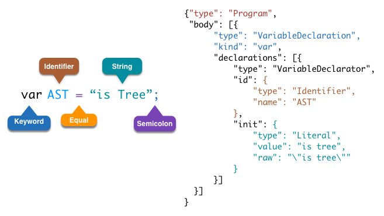
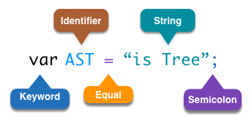
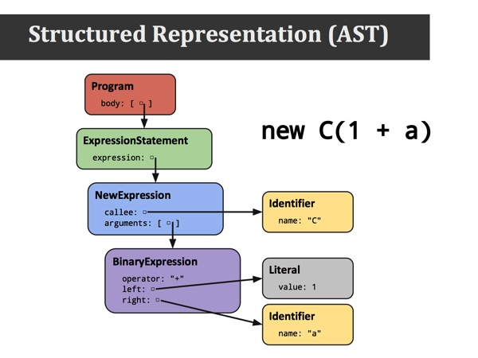
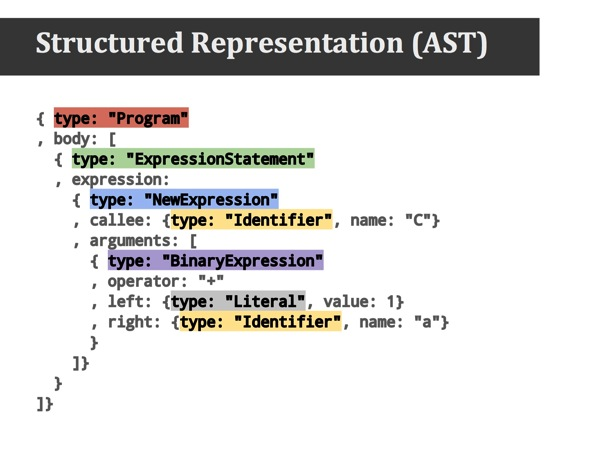

title: カジュアルJS AST
author:
  name: azu
  twitter: azu_re
  url: http://efcl.info/
theme: azu/cleaver-ribbon
output: index.html
--


# カジュアルJavaScript AST



--

# 実は使われてるJavaScript AST

- JavaScript AST(Abstract Syntax Tree)とは?
- 既に日常的にJavaScriptのツールやエディタなどで使ってるよ
- 恐れずに使うだけじゃなくて書いてみよう

--


# [browserify](https://github.com/substack/node-browserify "browserify")

- Node.jsで書かれたものをブラウザ向けに変換するツール
- 本体の色々な部分、transform pluginなど


--

# [JSDoc 3](https://github.com/jsdoc3/jsdoc "JSDoc 3")

- JSDocのアノテーションからHTMLリファレンスを作成する標準ツール
- Node版の実装にesprimaが使われてる

--

# [Tern](http://ternjs.net/ "Tern")

- [Tern for Vim](https://github.com/marijnh/tern_for_vim "Tern for Vim")や[Tern for Sublime Text](https://github.com/marijnh/tern_for_sublime " Tern for Sublime Text")の他エンジン
- パーサーには[ acorn.js ](http://marijnhaverbeke.nl/acorn/ " acorn.js ")が使われてる

--


# [UglifyJS 2](https://github.com/mishoo/UglifyJS2 "UglifyJS 2")

- JavaScriptコード圧縮ツール(minifier)
- 1までは独自のASTのみ
- 2からは一般的な[SpiderMonkey AST](https://github.com/mishoo/UglifyJS2#support-for-the-spidermonkey-ast "SpiderMonkey AST")をサポート

--

# [plato](https://github.com/es-analysis/plato "plato")

- コードのメトリクス計測のビジュアライズ

--

# What is JavaScript AST?

--

## JavaScript ASTって何?



* AST(Abstract Syntax Tree)はコードをパースした構文木
* Mozilla JavaScript AST([Parser API](https://developer.mozilla.org/en-US/docs/SpiderMonkey/Parser_API "Parser API")) がデファクト
* Code -> Token(図) -> AST(tokenの関係を構造化したもの)
* 端的に言えばコードをJSON/JavaScriptオブジェクトで表現したもの


--

## JavaScript AST

``` javascript
new C(1 + a);
```

このコードには、以下のような要素(node)が存在する

* `NewExpression` - `new`演算子
* `BinaryExpression` の `+`
* `1` というvalueをもつ `Literal`
* `C` と `a` という変数は `Identifier`

--

### JS AST Structure



--

### JS AST as JSON




> [SpiderMonkey Parser API: A Standard For Structured JS Representations // Speaker Deck](https://speakerdeck.com/michaelficarra/spidermonkey-parser-api-a-standard-for-structured-js-representations "SpiderMonkey Parser API: A Standard For Structured JS Representations // Speaker Deck") からの引用

--

## JS AST as HTML

<style>
Keyword {
    color: #445588;
    font-weight: bold;
}
Identifier {
    color: #009999;
}
Literal {
    color: #E67A00;
}
VariableDeclaration {
    color: purple;
}
ThrowStatement {
    color: red;
}
</style>

<pre><code>
<Program><ExpressionStatement><NewExpression>new <Identifier>C</Identifier>(<BinaryExpression><Literal>1</Literal> + <Identifier>a</Identifier></BinaryExpression>)</NewExpression>;</ExpressionStatement>
</Program>
</code></pre>

- **↑ Inspect Here ↑**
- JavaScript ASTからHTMLタグを生成したもの
- [azu/syntax-highlighted-js-ast](https://github.com/azu/syntax-highlighted-js-ast "azu/syntax-highlighted-js-ast")

--

## 習うより慣れろ

* [Esprima: Parser](http://esprima.org/demo/parse.html "Esprima: Parser")
* コードを入力してどういうASTが出力されるかをみて理解する
* JavaScript ASTはECMAScriptの仕様を尊重してる
* JavaScriptの基本的な文法がわかってれば問題ない

--

## [CoffeeScriptRedux](https://github.com/michaelficarra/CoffeeScriptRedux "CoffeeScriptRedux")

- [Rewrite the CoffeeScript compiler](https://www.kickstarter.com/projects/michaelficarra/make-a-better-coffeescript-compiler "Rewrite the CoffeeScript compiler")
- CoffeeScriptコンパイラをCoffeeScript AST -> JS ASTという形で実装
- *AST is IR(中間表現)*
- LLVM みたいな雰囲気の使い方
- More Info
  - [Escodegen and Esmangle: Using Mozilla JavaScript AST as an IR](http://aosd.net/2013/escodegen.html "Escodegen and Esmangle: Using Mozilla JavaScript AST as an IR")
  - [Redesigning the CoffeeScript Compiler // Speaker Deck](https://speakerdeck.com/michaelficarra/redesigning-the-coffeescript-compiler "Redesigning the CoffeeScript Compiler // Speaker Deck")

--

# [power-assert](https://github.com/twada/power-assert "power-assert")

- `assert()` を実行前にASTを変換して、失敗した時に有利な情報を埋め込む
- assertionはシンプル、だけど失敗しても分かりやすくなる
- http://take.ms/KeYEC

--

# [JSCS](https://github.com/mdevils/node-jscs "JSCS")
 

- JavaScript Code Style
- JSHintと併用してコーディングのスタイルをチェックするツール
- tokensまでもみて **スタイル** をチェックする
- プログラム的に正しければホワイトスペースや`;`などはASTでは扱わなくてもいいことが多い

--

# [JSX](http://jsx.github.io/ "JSX")言語のminifier

- minify処理の一部で[esmangle](https://github.com/Constellation/esmangle "esmangle")を利用
- ASTレベルでminifyをして、安全にコードを圧縮できるように設計されてる

--

# [Grasp](http://graspjs.com/ "Grasp")

- ASTを元にGrep/Sedのような検索/置換するツール
- コードベースやAST Query Selectorでの検索方法が用意されている
- [Graspを使ったJavaScriptのリファクタリング | JSer.info](http://jser.info/post/73202282881/grasp-javascript "Graspを使ったJavaScriptのリファクタリング | JSer.info")
- [JavaScriptライブラリの気になる実装をどうやって見ていくか | Web scratch](http://efcl.info/2014/0209/res3658/ "JavaScriptライブラリの気になる実装をどうやって見ていくか | Web scratch")

--

# [ESLint](http://eslint.org/ "ESLint")

* ASTを元にコードのLintをするツール
* JSHintと役割は被る部分が多い。
* プラグインで独自のルールを追加しやすいのが特徴

--

# [ESLint](http://eslint.org/ "ESLint")で局所的Lint

- プラグインでルールを追加すれば、プロジェクト固有のLintが簡単に実現できる
- [Avoid &#34;push&#34; with multiple arguments due to performance issue. · 48bfe19 · Constellation/escodegen](https://github.com/Constellation/escodegen/commit/48bfe1947f6cd09cf539de350859dba14431b255 "Avoid &#34;push&#34; with multiple arguments due to performance issue. · 48bfe19 · Constellation/escodegen")

--

# 局所的Lintの例

- ブログサイトのJSコメントで特定のコメントをチェックする
- [hatena-blog-js-lint](https://github.com/azu/hatena-blog-js-lint "hatena-blog-js-lint")

--

# 書いてみよう - Mochaのテストをパース

- [MechaMocha](https://github.com/azu/MechaMocha "MechaMocha")
- Mochaのテスト構造をテキストとして吐き出す

--

## Example


``` javascript
var assert = require("power-assert");
describe('Array', function () {
    describe('#indexOf()', function () {
        it('should return -1 when the value is not present', function () {
            assert.equal([1, 2, 3].indexOf(5), -1);
            assert.equal([1, 2, 3].indexOf(0), -1);
        });
        it('should return -1 when the value is not present', function () {
            assert.equal([1, 2, 3].indexOf(5), -1);
            assert.equal([1, 2, 3].indexOf(0), -1);
        })
    });
});
describe('IsNaN', function () {
    context("when value is NaN", function () {
        it('should return true', function () {
            assert(isNaN(NaN));
        });
    });
});
```

--

## Output

テストコードから以下のようなテキストを出力

```
Array
   #indexOf()
     should return -1 when the value is not present
       [1, 2, 3].indexOf(5) equal -1
       [1, 2, 3].indexOf(0) equal -1
IsNaN
   when value is NaN
     should return true
       assert isNaN(NaN)
```

--

## MechaMocha

* [Estraverse](https://github.com/Constellation/estraverse "Estraverse")を使ったシンプルな走査
* ASTは木構造だがプロパティの種類が多いので、traverseライブラリを使うのが一般的

--

* **enter**
	* `"describe", "context", "it"` の `CallExpression` ならindentレベルを+1
		* `["describe", "context", "it"]` なら print
			* `assert` ならprint
* **leave**
	* `"describe", "context", "it"` の `CallExpression` ならindentレベルを-1


--

## [azu/inlining-node-require][] 

* node.jsの`require`をインライン化してつなげる
* [falafel](https://github.com/substack/node-falafel "falafel")を使いASTを編集

## [azu/remove-use-strict]

* 無意味な`"use strict"`を取り除く
* 関数スコープを意識した作り

## 参考

* [JavaScript AST Walker](http://azu.github.io/slide/tkbjs/js-ast-walker.html "JavaScript AST Walker")
* [JavaScript Parser Infrastructure for Code Quality Analysis](http://www.slideshare.net/ariyahidayat/javascript-parser-infrastructure-for-code-quality-analysis# "JavaScript Parser Infrastructure for Code Quality Analysis")
* [SpiderMonkey Parser API: A Standard For Structured JS Representations // Speaker Deck](https://speakerdeck.com/michaelficarra/spidermonkey-parser-api-a-standard-for-structured-js-representations "SpiderMonkey Parser API: A Standard For Structured JS Representations // Speaker Deck")


[azu/inlining-node-require]: https://github.com/azu/inlining-node-require  "azu/inlining-node-require"
[azu/remove-use-strict]: https://github.com/azu/remove-use-strict  "azu/remove-use-strict"
[Grasp]: http://graspjs.com/  "Grasp - JavaScript structural search, replace, and refactor"
[ESLint]: http://eslint.org/  "ESLint"

