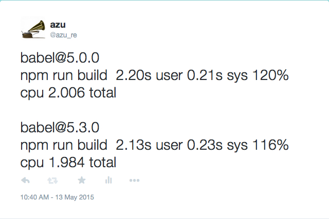
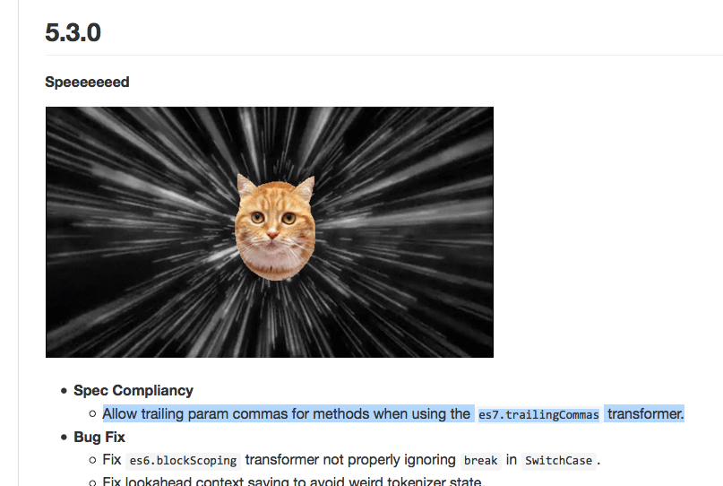
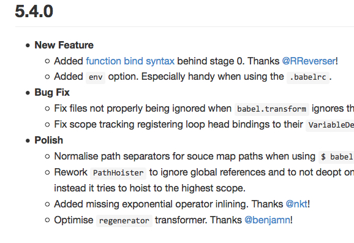
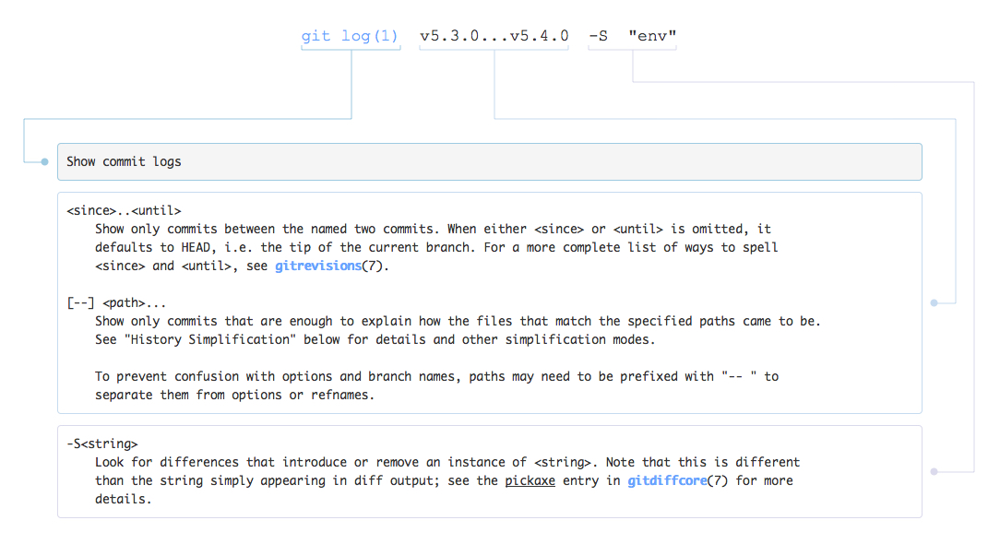

#  われわれは、いかにして変更点を追うか

## ChangeLog/Issueを追う技術

-----

# 自己紹介


## azu
## @[azu_re](https://twitter.com/azu_re)
###  [Web scratch], [JSer.info]


[Web scratch]: http://efcl.info/ "Web scratch"
[JSer.info]: http://jser.info/ "JSer.info"

-----

# アジェンダ


- 変更点を
	- ChangeLogで知る
	- Issue/Pull Requestで知る
	- Commitで知る


-------

# アジェンダ


- 変更点を
	- Commitに書く
	- Issue/Pull Requestを扱う
	- ChangeLogにまとめる

-----

# 変更点を追う :mouse:

-----

# ChangeLogの追い方

- ChangeLogを追うにはまずChangeLogの更新に気づく事が必要
- [GitHubでライブラリのリリースを見ていくためのツールや方法](http://efcl.info/2014/07/30/find-github-release/ "GitHubでライブラリのリリースを見ていくためのツールや方法 | Web Scratch")に書いた
- 更新検知の仕組みや補助ツールについて

-----

- リポジトリのWatch => [azu/github-reader](https://github.com/azu/github-reader "azu/github-reader")
- タイムライン => [azu/github-reader](https://github.com/azu/github-reader "azu/github-reader")
- Star => [starseeker](http://starseeker.so/ "starseeker")
- GitHub ReleaseのRSS => [azu/github-releases-to-feedly](https://github.com/azu/github-releases-to-feedly "azu/github-releases-to-feedly")
- GitHub Releaseの閲覧補助
	* [azu/check_changelog_from_release](https://github.com/azu/check_changelog_from_release "azu/check_changelog_from_release")
	* [azu/show-diff-from-release](https://github.com/azu/show-diff-from-release "azu/show-diff-from-release")


-----

# ChangeLogの問題

- 全ての変更がChangeLogからわかるわけじゃない
- そもそも多くの人は面倒なのでChangeLogを書かない
- ChangeLogがあってもそれはサマリだと、細かい内容が分からない
- ChangeLogより更に細かく見たい場合はまずは**Issue/Pull Request**を探す

-----

# Issue/Pull Request

- 大きなライブラリほどIssueやPull Requestと関連付けてコミットされる
- ChangeLogにも該当Issueが書いてあることが多い
- => ChangeLogからIssue/PRを探すとより細かい情報が見られる
- ChangeLogにIssue/PRが書いてない場合は? 

-----

# Issue/PRの探し方 - 検索

-----

# [Babel 5.3.0](https://github.com/babel/babel/blob/master/CHANGELOG.md#530 "5.3.0")の例


-----

#  [Babel 5.3.0](https://github.com/babel/babel/blob/master/CHANGELOG.md#530 "5.3.0")の変更点


- 変更内容については書いてある
-  **[New Feature]**、**[Bug Fix]**、**[Spec Compliancy]**などジャンル分けされている
- "Speeeeed" とあるがどれくらい変わったのか書いてない
- IssueやPR、該当コミットへのリンクはない

-----

# Speeeeed??

## 具体的な速度の向上内容を知りたい!

------

# Speeeeed - 何がどう変わったのか

##  Twitterで検索

- https://github.com/babel/babel/blob/master/CHANGELOG.md#530 への言及から探す
- "Speeeeed Babel"で検索する
- [公式アカウント](https://twitter.com/babeljs)から探す

-----

# Speeeeed - 見つかった

- 20-40% ぐらい速度が上がったとのこと(公式アカウントより)


-----

# Speeeeed - Depth


- パフォーマンスの向上は鵜呑みにしない :warning:
- 何が変更して、どういう計測方法で変わったのかを調べる
- 該当IssueやPRを見つけたい :seedling:
- :bulb: 公式アカウントへのレスで発見 ！ 

-----

# Speeeeed - 結果

- 以下のIssueを見ていけばいいことがわかった
- [Speeeeed · Issue #1486 · babel/babel](https://github.com/babel/babel/issues/1486)
- [Merge internal transformers into single traversal pass by sebmck · Pull Request #1472 · babel/babel](https://github.com/babel/babel/pull/1472)
	- 6.3.0でマージされたPR
	- 内部のtransformerを最適化する変更が入った

-----

# Speeeeed - 結果



- tsserver.js、Traceur、Ember等を対象にして大体20-40%ぐらいコンパイル速度が上がった
- [Tweet](https://twitter.com/babeljs/status/598303570824421376)の根拠が分かった
- 根拠や理論は分かった => 実際に自分で計測する
- プロジェクトによっては誤差レベルだった

-----

# Speeeeed - 結論

- ChangelogからTwitter、GitHub Issueを探せた
- [Merge internal transformers into single traversal pass by sebmck · Pull Request #1472 · babel/babel](https://github.com/babel/babel/pull/1472 "Merge internal transformers into single traversal pass by sebmck · Pull Request #1472 · babel/babel")
	- 複数のtransformerを1 passで通す変更が入った
- transformerを使うプロジェクトでは変換速度が上がった
- transformerを使ってないプロジェクトでは影響が少ない

-----

# Next: ファイルから探す

-----

## es7.trailingCommasの仕様への追従



>     Allow trailing param commas for methods when using the es7.trailingCommas transformer.

どういう変更だったのか詳細を知りたい :thought_balloon:

-----

# es7.trailingCommasの仕様への追従


- Babelでは`es7.trailingCommas`の変換するためのtransformerはファイルを分けて実装されてる
- GitHubでは"T"でファイル検索ができる
- [github のプロジェクトのページでファイルのインクリメンタル検索 - わからん](http://d.hatena.ne.jp/kitokitoki/20110212/p1 "github のプロジェクトのページでファイルのインクリメンタル検索 - わからん")

-----

# ファイルからコミットを探す


------
# コミットからIssueを探す


- [該当コミット](https://github.com/babel/babel/commit/6834cc5b468f4f76f0f03c2f103c5535e0a2b93f)からIssueへのリンクがあるかを見る
- GitHubではPull Requestでマージされたコミットに自動的にリンクが付く
- [Linking merged pull requests from commits](https://github.com/blog/1905-linking-merged-pull-requests-from-commits "Linking merged pull requests from commits")

-----

# ファイルから探す - 結論

-  変更履歴から関連するファイルを検索
- そのファイルについてのコミットを見る
- 該当コミットからPull Requestを発見出来た :bulb:
- [[es7.trailingFunctionCommas] Allow in new expressions by amasad · Pull Request #1487 · babel/babel](https://github.com/babel/babel/pull/1487 "[es7.trailingFunctionCommas] Allow in new expressions by amasad · Pull Request #1487 · babel/babel")

-----

# ここまでのまとめ


## [fit] 追う時に何を見つけたら詳細が分かるか?

-----

- GitHubのリポジトリ検索
	- Issueも検索できるのでキーワードから探す
- 関連ファイルからの検索
	- 関連ファイルから変更されたコミットを探す
- Twitter検索
	- その変更に関係することを書いてるを探す
- 公式サイト/ドキュメント
	- リリース時にドキュメントが更新されてるかも

-----


# ここまでのまとめ

- Issueを見つければ勝ち :thumbsup:
- Pull Requestを見つければ勝ち :thumbsup:
- Commitを見つければ勝ち :thumbsup:
- もしコミットすら見つからなかったら :question:
- ここまではブラウザだけでできるので比較的気軽

------

# コミットを検索する

## ここからはコマンドラインが必要

-----

# GitHubの問題

- コミットメッセージを検索する手段がない
	- [Add support for search in commit messages · Issue #352 · isaacs/github](https://github.com/isaacs/github/issues/352 "Add support for search in commit messages · Issue #352 · isaacs/github")
- repositories、code、Issue、userしか検索できない
	- [Search | GitHub API](https://developer.github.com/v3/search/ "Search | GitHub API")

-----

# ノイズが多い場合



> Added "env" option. Especially handy when using the .babelrc.

- 上記の変更の詳細を知りたい！
- Issue検索だとノイズが多くて探せない時
- 直接該当する変更のコミットを探す

-----

# 該当コミットを探す




```sh
git clone https://github.com/babel/babel.git
git log v5.3.0...v5.4.0 --grep "env"
# v5.3.0からv5.4.0の中で"env"というコミットメッセージを探す
commit 41b5607ef374945b0e4ca771644d94d3b849ed58
Author: Sebastian McKenzie <sebmck@gmail.com>
Date:   Fri May 15 00:11:28 2015 +0100

    fix env option tests

commit 024e4454a1e3778b0f9b6d081d5f4e792f6035db
Author: Sebastian McKenzie <sebmck@gmail.com>
Date:   Thu May 14 23:47:56 2015 +0100

    add env option - closes #1531
```

----
# コミットメッセージの検索

- [explainshell.com - git log v5.3.0...v5.4.0 -S "env"](http://explainshell.com/explain?cmd=git+log+v5.3.0...v5.4.0+-S+%22env%22 "explainshell.com - git log v5.3.0...v5.4.0 -S &#34;env&#34;")
- _024e4454a..._が該当コミットっぽい
- [motemen/git-browse-remote](https://github.com/motemen/git-browse-remote "motemen/git-browse-remote")でGitHubのコミットページを開く
- 関連するIssueが見つかった！ :bulb:

```
git-browse-remote 024e4454a1e3778b0f9b6d081d5f4e792f6035db
```


-----


# コミットのDiff検索方法色々

- コミットメッセージのみで検索
	- `git log --grep "word"` 
- コミットの中身の差分から検索
	- `git log -s "word"`
- [git logでコミットの差分の中身で絞り込む - Qiita](http://qiita.com/yuichielectric/items/cce64b5b5e0eacc02e64 "git logでコミットの差分の中身で絞り込む - Qiita")

-----

# コミットの検索する必要性?

- できればそこまで行く前に解決してた方が嬉しい

> Added "env" option. Especially handy when using the .babelrc.

- この例もドキュメントを見るのが正解！
- [Options · Babel](https://babeljs.io/docs/usage/options/ "Options · Babel")
- しかし、どういうユースケースなのかはIssueに残ってる場合が多い

------

# GUIでコミット検索


- [azu/git-scriptable-search](https://github.com/azu/git-scriptable-search "azu/git-scriptable-search")
- 作った
- JavaScriptでフィルターを書いてコミットの絞込出来るアプリ
- フィルターの処理コストが大きい問題がまだ未解決…

-----

# Breaking Change検索

-----

# Breaking Changeの検索


- ある機能があるバージョンで壊れてた
- 具体的に壊れた/壊した理由を知りたい！
- どこで壊れたのかコミットをみつける
	- コミットが見つかったIssueを探す

-----


# git bisectを使った検索

- 任意のテストスクリプトをコミット毎に走らせて、テストが失敗するコミットをみつける
- [AdventCalendar - git bisect で問題箇所を特定する - Qiita](http://qiita.com/usamik26/items/cce867b3b139ea5568a6 "AdventCalendar - git bisect で問題箇所を特定する - Qiita")
- [git bisectでメソッドが削除されたコミットを探す - しんふぉにゃん](http://d.hatena.ne.jp/innx_hidenori/20110124/1295870463 "git bisectでメソッドが削除されたコミットを探す - しんふぉにゃん")
- さすがにここまで行くとやり過ぎ感…

------


------


# 探すから作るへ


-----

# 変更点の追い方≒変更点の作り方

- 変更点が追いやすい == いい変更点
- 変更点の追い方を知ってる ≒ いい変更点を作れるのでは?


-----

# 追いやすい変更点って?

- 良いコミット
- 良いIssue/Pull Request
- 良いChangeLog

-----

# 変更点を作る :construction_worker:

-----

# 良いコミット

------

# コミットメッセージを書く

- 今更感があるけど、要約と本文で書くのが基本
- [How to Write a Git Commit Message](http://chris.beams.io/posts/git-commit/ "How to Write a Git Commit Message")
- [見えないチカラ: 【翻訳】Gitのコミットメッセージに関する注意点](http://keijinsonyaban.blogspot.jp/2011/01/git.html "見えないチカラ: 【翻訳】Gitのコミットメッセージに関する注意点")

------

# 良いコミットメッセージ?

- 追いやすい変更点からの良いコミットメッセージとは? :thought_balloon:
	- サマリと本文がある
	- 検索しやすいキーワードが存在する
	- 関連するIssue/Pull Requestが書かれてる
- 実現するための規約の一種として**conventional changelog**

------

# conventional changelog

- ChangeLog自動生成のためのコミットメッセージ規約のこと
- [ajoslin/conventional-changelog](https://github.com/ajoslin/conventional-changelog "ajoslin/conventional-changelog")

```
feat(ngInclude): add template url parameter to events

The `src` (i.e. the url of the template to load) is now provided to the
`$includeContentRequested`, `$includeContentLoaded` and `$includeContentError`
events.

Closes #8453
Closes #8454
```

-----

# conventional changelog

- 規約の形は何でも良い = ツールとの相性
- コミット検索向けのキーワードとしてtypeとcomponentの利用

```
                       component        commit title
        commit type       /                /      
                \        |                |
                 feat(ngInclude): add template url parameter to events
            
        body ->  The 'src` (i.e. the url of the template to load) is now provided to the
                 `$includeContentRequested`, `$includeContentLoaded` and `$includeContentError`
                 events.

 referenced  ->  Closes #8453
 issues          Closes #8454
```

-----

# コミットメッセージへの追加情報

- コミットの種類 : feat?、fix?、Breaking Change?
- コミットの対象: (スコープ)
	- 多分コミット書くときに悩む
	- コミットメッセージを検索しやすくするための**キーワード**として考えるといいのかも

-----


# コミットメッセージへの追加情報

- 関連するIssueの場所
	- GitHubはIssueの`#42`的なIDをコミットメッセージに書くと連動する
	- IssueのURLでも問題ない
	- [Closing issues via commit messages - User Documentation](https://help.github.com/articles/closing-issues-via-commit-messages/ "Closing issues via commit messages - User Documentation")

-----
# conventional changelogのメリット

- コミットから自動的にChangeLogを生成出来る
	- ChangeLogに該当Issueへのリンクが生成できる事が大事
- [ajoslin/conventional-changelog](https://github.com/ajoslin/conventional-changelog "ajoslin/conventional-changelog")
	- Rust: [clog - A conventional changelog generator for the rest of us](http://blog.thoughtram.io/announcements/tools/2014/09/18/announcing-clog-a-conventional-changelog-generator-for-the-rest-of-us.html "clog - A conventional changelog generator for the rest of us")
- [rvagg/changelog-maker](https://github.com/rvagg/changelog-maker "rvagg/changelog-maker")

-----

# コミットメッセージを書くの面倒問題

- 特に関連するIssueを書くのが大変(補完の問題)
- GitHubではPull Requestでマージされたコミットに自動的にリンクが付く
- つまり、常にPull Requestで開発すれば自動的にIssueと紐づく！

-----

#  Pull Request駆動

-----

# Pull Request駆動


- Pull Requstで取り込まれたコミットは自動的にIssueと紐づく
- [Linking merged pull requests from commits](https://github.com/blog/1905-linking-merged-pull-requests-from-commits "Linking merged pull requests from commits")
- Pull Requestに詳細を書くことで、自動的に情報が集約される + コミットからのリンク

-----

# Pull Request駆動の副作用(感想)

- コミットが常にサーバにあるので、複数端末での開発がしやすい
- 開発時のメモ欄がある感覚
- Watchしてる人へ通知が行って、他の人が参加するチャンスがある

-----

# ChangeLog


-----

# ChangeLogは人が読むもの

- ChangeLogは人が読むものなので、無意味な自動生成は無意味
- 自動生成はできるが、自動生成のソースがダメだとChangeLogもダメ
- 良いコミットの副産物として良いChangeLogが作れる
- 良いコミットではない場合は、手動で書いたほうがマシ

-----

# ChangeLogにあると良いもの

- 日付
- バージョン
- 変更内容
	- グルーピングされてるとより良い
- 関連するIssue/Pull Request
- [Keep a Changelog](http://keepachangelog.com/ "Keep a Changelog")

-----


# GitHub ReleaseとCHANGELOG

- [GitHub Release](https://help.github.com/articles/creating-releases/ "Creating Releases - User Documentation")
- [CHANGELOG](http://keepachangelog.com/ "CHANGELOG")ファイル
- どっちに書く? 

-----

# GItHub Release

- Pros
	- 日付、バージョン、パーマネントリンク、RSSを得られる
	- git tagと連動できる
- Cons
	- メッセージの自動化がイマイチ難しい
	- [Git tagとGitHub ReleasesとCHANGELOG.mdの自動化について](http://efcl.info/2014/07/20/git-tag-to-release-github/ "Git tagとGitHub ReleasesとCHANGELOG.mdの自動化について | Web Scratch")


------

# CHANGELOG

- Pros
	- 伝統的なやり方なのでツール等が多い
	- 自動化がしやすい
- Cons
	- パーマネントリンクが微妙になりやすい(Markdownじゃないとリンクができない、ハッシュ)

-----

# まとめ

- ChangeLogの追い方を知ることは、いいChangeLogを書くことに繋がる
- GitHub上だけでも情報の詳細度が異なる
	- ChangeLog > Issue/Pull Request -> Commits
- この3つが繋がるような変更点をできるのが理想的

-----


# おわり

- This presentation is also Pull Request Driven
- [われわれは、いかにして変更点を追うか - Issueを追う技術 by azu · Pull Request #10 · azu/slide](https://github.com/azu/slide/pull/10 "われわれは、いかにして変更点を追うか - Issueを追う技術 by azu · Pull Request #10 · azu/slide")