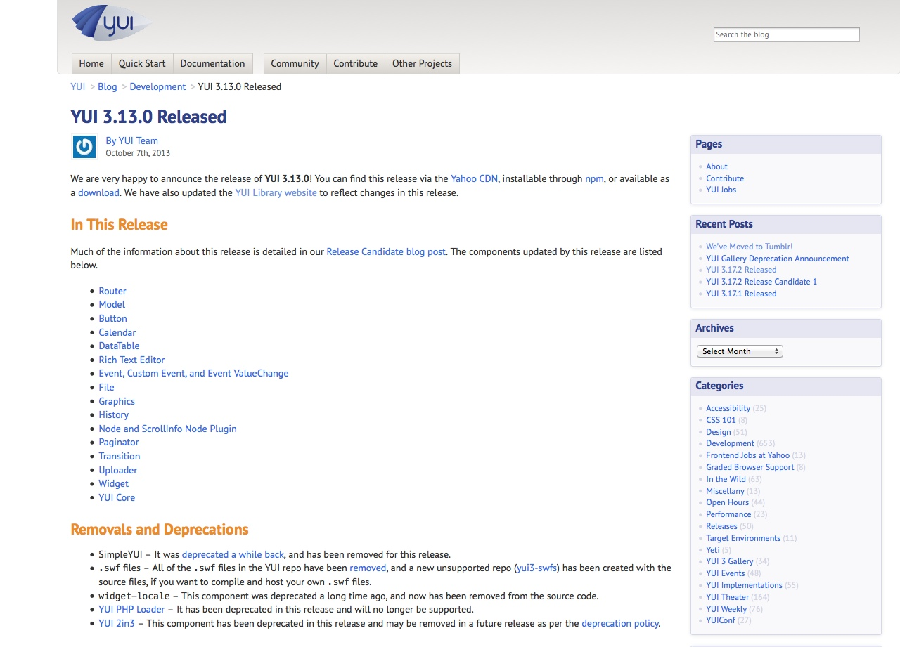
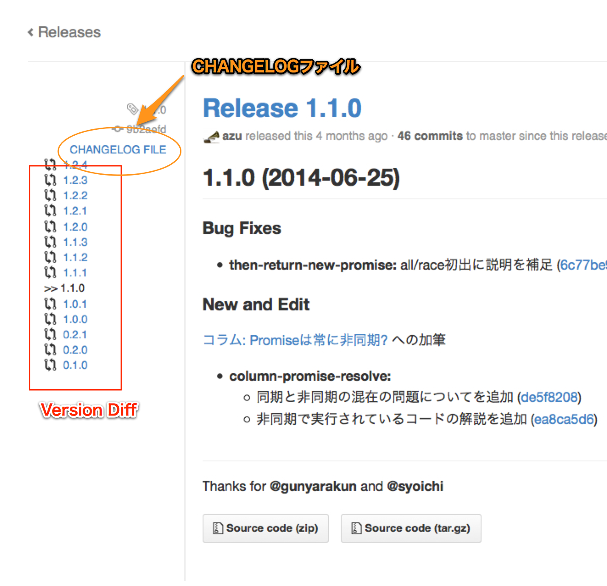

# 世界のJavaScriptを読もう @ 2014

^目的: ウェブの世界は絶対変化するもの
変化する前提の行動が求める
それをどうやって見ていくか、それを知ってどうするか

^ JavaScriptやブラウザ周りのリリースの状況はウェブの変化にあわせるように変化してきている。
どのように変化してきたか知り、どうやって変化を見ていくのか、そしてわたしたちはどう変化していくのかを考えよう。

----

# [fit] 世界のJavaScriptを見る話

### [fit] JSer.info 開始 2011年〜

^ JSer.infoを始めた2011年を一つの基準として考えて、
そこからブラウザやJavaScript等にどういう変化があったのかを振り替えつつ、"今"どういう変化が起きてるのかを見て行きたいと思います。

----
# [fit] Browser

----

# [fit] Browser Version @ 2011

### JSer.info が開始した2011年ごろのブラウザバージョン

---

# [fit] ![inline][ie] Internet Explorer 9

# [fit] ![inline][firefox] Mozilla Firefox 4

# [fit] ![inline][chrome] Google Chrome 8 

---
# [fit] ![inline][ie] Internet Explorer 9

- 正常になってくるIE9がリリースされたころ
- [IE9 RTW Due Date, A Big Thank You, MIX11, and a Unicorn Named Frank | Charles | Channel 9](http://channel9.msdn.com/Blogs/Charles/IE9-RTW-Due-Date-A-Big-Thank-You-MIX11-and-a-Unicorn-Named-Frank "IE9 RTW Due Date, A Big Thank You, MIX11, and a Unicorn Named Frank | Charles | Channel 9")
- 日本だけ東北地方太平洋沖地震の影響で延期

----

# [fit] ![inline][firefox] Mozilla Firefox 4

- Rapid Releaseが開始前のメジャーバージョン
- Chromeを先頭にリリース速度が加速してきた頃

----

# [fit] ![inline][chrome] Google Chrome 8

- いつものChromeです

----

# [fit] Browser Version @ 2014

### 2014-11-01 現在のブラウザ

---

# [fit] ![inline][ie] Internet Explorer 12

# [fit] ![inline][firefox] Mozilla Firefox 33

# [fit] ![inline][chrome] Google Chrome 38

---

# Internet Explorerの開発方針も変わってきた

- IE 12のDeveloperバージョンが先行公開
- 今後開発予定の公開
	-  [status.modern.IE](https://status.modern.ie/ "Internet Explorer Web Platform Status and Roadmap - status.modern.IE") [![][github]](https://github.com/internetexplorer/status.ie "InternetExplorer/Status.IE")
- UserVoiceでの開発優先度の意見募集
- IEのサポートバージョンをOSで使える最新版だけに

---

# バージョンニングの意味の変化

---

- 機能ベースのリリース
- リリースの速度自体の加速
- semverの発達
- 言語とライブラリは適切なリリーススケジュールが違う
- しかしどちらも早くなってきてる
- @todo node の stable/unstableモデルの弊害

---

# [fit] ヘッドレスブラウザの登場

---
# PhantomJS

2011年 [WebkitベースのJavaScriptコマンドラインツール「PhantomJS」 - JSer.info](http://jser.info/post/2888913234/ "WebkitベースのJavaScriptコマンドラインツール「PhantomJS」 - JSer.info")

# [SlimerJS](http://slimerjs.org/index.html "SlimerJS")

- Firefox(Gecko)のヘッドレスブラウザ

# [sdesalas/trifleJS](https://github.com/sdesalas/trifleJS "sdesalas/trifleJS")

- IEのヘッドレスブラウザ

----

- PhantomJSが先行し広く普及した
- PhantomJSのAPIがデファクトとなった
	- [CasperJS](http://casperjs.org/ "CasperJS, a navigation scripting and testing utility for PhantomJS and SlimerJS")
	- [Nightmare](http://www.nightmarejs.org/ "Nightmare")

----

# WebDriver

- 一方ブラウザを操作するAPIとしてWebDriver APIがある
- 本物のブラウザを操作するためのAPI
- WebDriver APIはW3Cで標準化された
- Internet Explorer 11 でWebDriverが[サポート](http://blogs.msdn.com/b/ie/archive/2014/08/13/august-updates-for-internet-explorer.aspx "August updates for Internet Explorer - IEBlog - Site Home - MSDN Blogs")された

---

# WebDriver を利用するフレームワークの発達

   * [Protractor - end to end testing for AngularJS](http://angular.github.io/protractor/#/ "Protractor - end to end testing for AngularJS")
   * [Leadfoot](http://theintern.github.io/leadfoot/ "Leadfoot docs: Index")
   * [Nightwatch.js | Node.js powered End-to-End testing framework](http://nightwatchjs.org/ "Nightwatch.js | Node.js powered End-to-End testing framework")

----

# :memo: リリースノートの変化

----

# ブログでのリリースノート

^ 今も多くあるが、ブログでのリリースノートを書くスタイルが中心だった。
しかし、今はある程度の規模のライブラリでないとブログにリリースノートを書く人は少なくなってきた。

----

# GitHubでのリリースノート

^ 最近ではGitHubにリリースノートを書くだけのケースが増えてきた
あるいは、CHANGELOGを自動生成したもの(またはそれを両立したもの)

----

^ JSer.infoで紹介したリリースノートからの抜粋
GitHub上のReleseまたはCHANGELOGを紹介したものと
それ以外の数を並べたもの。

^ JSer.infoで紹介するものはある程度規模のあるものが中心なので、
ブログスタイルもそこまで減っているという訳ではない。

----

# 最近のリリースノートの変化

- 小さいものほどGitHubのみにしかリリースノートを書かない
	- ブログに書いても初回のみ
- Node moduleはsemverを採用するケースが増えリリース回数自体も多い
- ブログとGitHubでのリリース(自動生成)を併用するパターンも多い

----

# リリースノートを見ていく方法も変化する

- リリース方法が変化するので、見る方も変化する
- まずリリースに気づけない問題が発生する
	- お世辞にもGitHubは追いやすい形式になってない
- CHANGELOGを直接見る必要(diffのみ)が出てくる
- 対策は[GitHubでライブラリのリリースを見ていくためのツールや方法](http://efcl.info/2014/07/30/find-github-release/ "GitHubでライブラリのリリースを見ていくためのツールや方法 | Web Scratch") にてまとめた

----

# [GitHubでライブラリのリリースを見ていくためのツールや方法](http://efcl.info/2014/07/30/find-github-release/ "GitHubでライブラリのリリースを見ていくためのツールや方法") 概要

* リポジトリのWatch
    * [azu/github-reader](https://github.com/azu/github-reader "azu/github-reader")
* タイムライン
    * [azu/github-reader](https://github.com/azu/github-reader "azu/github-reader")
* Star
    * [starseeker](http://starseeker.so/ "starseeker")

----

# リリースノートを購読

* GitHub ReleaseのFeedlyでRSS購読
    * [azu/github-releases-to-feedly](https://github.com/azu/github-releases-to-feedly "azu/github-releases-to-feedly")
* Feedlyをバックエンドにして -> any
    * [IFTTT](https://ifttt.com/myrecipes/personal "My Recipes - IFTTT")
* GitHub Release -> CHANGELOG
    * [azu/check_changelog_from_release](https://github.com/azu/check_changelog_from_release "azu/check_changelog_from_release")
* GitHub Release -> Compare tags
    * [azu/show-diff-from-release](https://github.com/azu/show-diff-from-release "azu/show-diff-from-release")

----

# リリースノートまとめ

- リリースノートの出し方も変化してる
- MLやブログ以外にもGitHubが増えてきた
- リリース速度の変化も関係してそう
- リリースはしやすくなった、リリースはまだ見やすくない
	- まだバランスが悪い
- リリースを見る側も変化が必要になる

^GitHubにtagをつけてpushするだけというスタイル速度が取れるようになったので、リリース速度は上がっている。
しかし、必然的にリリース回数があがりリリースノートが軽視されてる傾向がある。
もっとリリースノートを書こう。そのためにはリリースノートを書きやすい仕組みが必要だと考えてる。

----

# :star: リリース傾向の変化

^ 先ほど、リリース回数が増えてると紹介したが、
そもそものリリースするバージョンニングの形態が変化してきていると感じる。
特にNode.jsではsemverがデフォルトのバージョンニングとなっているため、sermverを意識するとリリース回数が増える傾向がある(minor fix)

---

# [高速リリースサイクルに関するよくある質問 | 次世代ブラウザ Firefox](http://www.mozilla.jp/firefox/preview/faq/ "高速リリースサイクルに関するよくある質問 | 次世代ブラウザ Firefox")

> Web ブラウザは、他のアプリケーションと異なり、Web という「生き物」を相手にしています。HTML5 や CSS3 など新たな標準技術が次々に考案され、ソーシャルメディアなどのトレンドも目まぐるしく変わっています。Web の進化するスピードが速くなっているので、これまでのように半年から 1 年周期のアップデートでは間に合わなくなっているのです。

----

# ウェブの変化の早さ

- ウェブの変化に対応するためにブラウザのリリース速度は上がった
- ライブラリも変化/トレンドに対応するためリリース速度は上がってる
- 速度が全てではないが、仕様や言語に近い部分にも変化がある

----

# ライブラリとsemver

- semver だとminorリリースを顕著

----

# Node.js

- node-forward @todo
- Node.js本体のstable/unstableモデルの問題
- 一定期間でリリースされないので停滞しやすい

----

# ECMAScript

- JavaScriptの元となる標準仕様
- [ES Discuss](https://esdiscuss.org/ "ES Discuss")で議論される
- [tc39/tc39-notes](https://github.com/tc39/tc39-notes "tc39/tc39-notes")に定期MTGのNoteがある
- ES6の機能策定はだいたい完了、ES7の機能提案の段階
- feature-model releaseへ

----

# :watch: WATCH

^ では私達はどのようにその変化を見ていくのか?

----

# Watcher

- 人が集まる専門分野には必ずWatcherがいる!
- ME too! @todo

----

# 各Watch Pointを見て行こう

-----

![IE, inline][ie]  ![firefox,inline][firefox]  ![chrome,inline][chrome]  ![opera,inline][opera] ![inline][webkit]

# [fit] Browser Watcher

-----

# ![inline][ie] Internet Explorer

- [IEBlog](http://blogs.msdn.com/b/ie/ "IEBlog - Site Home - MSDN Blogs") （[日本語版](http://blogs.msdn.com/b/ie_jp/ "(日本語版)")）
	- 公式ブログ
- [status.modern.IE](https://status.modern.ie/ "Internet Explorer Web Platform Status and Roadmap - status.modern.IE") [![][github]](https://github.com/internetexplorer/status.ie "InternetExplorer/Status.IE")
	- IEのロードマップや開発状態が機能別に公開されている
- [Hebikuzure's Tech Memo | 技術的覚書と情報](http://hebikuzure.wordpress.com/ "Hebikuzure&#39;s Tech Memo | 技術的覚書と情報") by [@hebikuzure](https://twitter.com/hebikuzure "hebikuzure ")
	- IEBlogの翻訳やWindowsやIEの細かい挙動について書かれてる

-----
# ![inline][ie]  [status.modern.IE](https://status.modern.ie/ "Internet Explorer Web Platform Status and Roadmap - status.modern.IE") [![][github]](https://github.com/internetexplorer/status.ie "InternetExplorer/Status.IE")

- `Not currently planned` : 今のところ予定なし
- `Under Consideration` : 実装を検討、調査中
- `In Development` : 開発中
- `Preview Release` : プレビューリリース版に実装済み
- `IExx+`: IEのバージョンxxから利用可能

-- [status.modern.IEの見方 | Web Scratch](http://efcl.info/2014/10/19/modern-ie/ "status.modern.IEの見方 | Web Scratch")

-----

# ![inline][firefox] Firefox

- [Firefox Nightly News](http://firefoxnightly.tumblr.com/ "Firefox Nightly News") [![inline][twitter]](https://twitter.com/firefoxnightly)
	- FirefoxのNightlyに入った機能などについての紹介
- [Mozilla Hacks – the Web developer blog](https://hacks.mozilla.org/ "Mozilla Hacks – the Web developer blog") [![inline][twitter]](https://twitter.com/mozhacks)
	- FirefoxやWebなど色々 - [HTML5 Rocks](http://www.html5rocks.com/ "HTML5 Rocks - A resource for open web HTML5 developers")もそれに近い
- [Mozilla Developer Street (modest)](https://dev.mozilla.jp/ "Mozilla Developer Street (modest)")
	- Mozilla Hacksの日本語訳やリリース情報が多い

----

#  ![inline][firefox] [Planet Mozilla](http://planet.mozilla.org/ "Planet Mozilla")

![right fit, firefox][firefox]

[The Mozilla Blog](https://blog.mozilla.org/)
[Future Releases](https://blog.mozilla.org/futurereleases/)
[Mozilla Research](https://blog.mozilla.org/research/)
[Mozilla Security Blog](https://blog.mozilla.org/security/)
[Mozilla Privacy Blog](https://blog.mozilla.org/privacy/)
[Mozilla UX](https://blog.mozilla.org/ux/)
[Mozilla Cloud Services](https://blog.mozilla.org/services/)
[JavaScript](https://blog.mozilla.org/javascript/)

^ 公式ブログがそれぞれジャンルごとに存在する。
`Planet *` というのは一時期流行った感じの関連するRSSをまとめたものを配信するアグリゲートの事。
[Planet Feed Reader](http://www.planetplanet.org/ "Planet Feed Reader")

----

# ![inline][chrome] Google Chrome

- [HTML5 Rocks](http://www.html5rocks.com/ "HTML5 Rocks - A resource for open web HTML5 developers")
	- 大きめな新しい機能は大体ここで紹介される
- [Google Chrome Developers - Google+](https://plus.google.com/+GoogleChromeDevelopers/posts "Google Chrome Developers - Google+")
	- Google+にGoogleの人がいる
- [JS.next](http://js-next.hatenablog.com/ "JS.next")
	-  V8に実装された新しい機能について書かれてる

-----

# ![inline][chrome] [Planet Chrome](http://planet.chromium.org/ "Planet Chromium")

![right,fit chrome][chrome]

- [Google Chrome Blog](http://chrome.blogspot.jp/)
- [Chromium Blog](http://blog.chromium.org/)
- [Chrome Releases](http://googlechromereleases.blogspot.jp/)
- [developer.chrome.com](https://developer.chrome.com/home "Mobile DevTools: Remote Debugging for Android with Screencast - Google Chrome")
- [DevTools Tips](http://devtoolstips.com/ "DevTools Tips")

^ V8やBlinkといったJavaScriptについてだと、公式のブログはそこまで読みやすくない。
後述する[Dev.Opera](https://dev.opera.com/blog/ "Dev.Opera — Blog")も見ることを薦めている。

----
#![inline][chromium] [Chromium](http://www.chromium.org/ "The Chromium Projects")

> Chromium is an open-source browser.
-- http://www.chromium.org/

^ Google Chromeのオープンソース版というところ。
Chromeに入る機能の大体はここへコミットされる。(一部ChromeにあってChromiumないものもある。翻訳機能とか)
[V8](https://code.google.com/p/v8/ "V8") や[ Blink ](http://dev.chromium.org/blink " Blink ")なども含まれているプロジェクトの総称。

-----

#![inline][chromium] [Chromium](http://www.chromium.org/ "The Chromium Projects")

- [Chromium Dashboard](https://www.chromestatus.com/features "Chromium Dashboard")
	-  ![IE, inline][ie]  ![firefox,inline][firefox]  ![chrome,inline][chrome] Chromiumを中心にブラウザの実装ステータス
- [Highlights from recent Chromium, Blink, Skia and v8 commits](http://commits.peter.sh/ "Highlights from recent Chromium, Blink, Skia and v8 commits") [![inline][twitter]](https://twitter.com/beverloo)
	- Chromium等のコミットサマリ + [Chromium DevTools](https://feeds.peter.sh/chrome-devtools/ "Chromium DevTools") [![inline][twitter]](https://twitter.com/ChromeDevTools) 
- [blink-dev - Google グループ](https://groups.google.com/a/chromium.org/forum/#!forum/blink-dev "blink-dev - Google グループ")
	- **Intent to 〜** にBlinkに入る予定の機能が載る

^ Chromeを自力で追うとかんがえると何故かコミットやChromiumの開発者向けのところまで見ないといけない事がある。
Chromeは"リリース"という部分が分かりにくく感じる。

----

#  ![inline][opera] Opera

- [Dev.Opera](https://dev.opera.com/blog/ "Dev.Opera — Blog") [![inline][github]](https://github.com/operasoftware/devopera) [![inline][twitter]](https://twitter.com/odevrel)
	- 現在のOperaはChromiumベースになってる
	- [Chromium Blog](http://blog.chromium.org/ "Chromium Blog")より分かりやすい解説が載ってる
	- :heart: [@mathias](https://twitter.com/mathias "@mathias")
- [Opera Desktop Team's blog - Opera Software](http://blogs.opera.com/desktop/ "Opera Desktop Team&#39;s blog - Opera Software")
- [Upstreamed commits – Opera](https://operasoftware.github.io/upstreamtools/ "Upstreamed commits – Opera")

----

# ![inline][webkit] [WebKit](https://www.webkit.org/ "WebKit")

> WebKit is an open source web browser engine.
-- https://www.webkit.org/

^ SafariやiOS、[Qt WebKit](http://qt-project.org/doc/qt-5/qtwebkit-index.html "Qt WebKit")(PhantomJS)、[WebKitGTK+](http://webkitgtk.org/ "WebKitGTK+")等で使われるブラウザエンジンです。

----

# ![inline][webkit] [WebKit](https://www.webkit.org/ "WebKit")

- [Surfin' Safari - The WebKit Blog](https://www.webkit.org/blog/ "Surfin&#39; Safari - The WebKit Blog")
	- 公式のブログ - 内部実装の話が多い
- [News and Updates - Apple Developer](https://developer.apple.com/news/ "News and Updates - Apple Developer")
	- AppleのNews - まれにSafariについてがある
- [Planet Igalia](http://planet.igalia.com/ "Planet Igalia") [![inline][twitter]](https://twitter.com/igalia/)
	- [Igalia](http://www.igalia.com/ "Igalia")社はWebKitやChromiumに[コミット](http://www.igalia.com/webkit/)してるコンサル企業

^ WebKitはChromiumと同様に実装よりの話が中心となる。
WebKitを使ったメジャーなブラウザはSafariぐらいで、Safariはあんまりそういうリリース書かないのでコミットを追っている人を見ていくのが中心になりやすい。

----

# ![inline][webkit] Webkit Watch

- [trac.webkit.org](http://trac.webkit.org/ "ChangeSet – WebKit")
	- WebKitのリポジトリ
- [WebKit Changesets · uupaa/Spec.js Wiki](https://github.com/uupaa/Spec.js/wiki/WebKit-Changesets "WebKit Changesets · uupaa/Spec.js Wiki") by [@uupaa](https://twitter.com/uupaa "@uupaa")
	- iOSバージョン間のコミット差分がまとめられている
- [mobilexweb.com](http://www.mobilexweb.com/ "Mobile Web &amp; HTML5 for mobile devices analysis, news and source code") と [sencha.com/blog/](http://www.sencha.com/blog/ "Blog | Sencha")
	- iOSのアップデート時にWebKitのレポートを書いてる

----

# Other Vendor

- [Web Platform Team Blog](http://blogs.adobe.com/webplatform/ "Web Platform Team Blog")
	- Adobeのブログ - 主に[CSS周り](http://webplatform.adobe.com/ "Adobe Web Platform Team")のコミットをしてる

----

# Other

- [Can I use... Support tables for HTML5, CSS3, etc](http://caniuse.com/ "Can I use... Support tables for HTML5, CSS3, etc") [![inline, github][github]](https://github.com/fyrd/caniuse)
	- ![IE, inline][ie]  ![firefox,inline][firefox]  ![chrome,inline][chrome]  ![opera,inline][opera] ブラウザの実装状況がまとまってる  
- [Browser Platform Status Tracker](http://platformstatustracker.azurewebsites.net/ "Browser Platform Status Tracker") by [@mayuki](https://twitter.com/mayuki "@mayuki")
	-  ![inline][ie] [status.modern.IE](https://status.modern.ie/ "Internet Explorer Web Platform Status and Roadmap - status.modern.IE") と![inline][chromium] [Chromium Dashboard](https://www.chromestatus.com/features "Chromium Dashboard")の差分
- [Echo JS - JavaScript News](http://www.echojs.com/ "Echo JS - JavaScript News") [![inline][twitter]](https://twitter.com/echojs)
	- HNスタイルのJavaScript特化ニュースサイト

^ **Can I use...**は多くの人が使ったことがあると思うサイトで、著名な機能については大体載っているのでまず最初に見ると把握がし易いです。
載っていない機能は[Support table suggestions](http://www.google.com/moderator/#15/e=ae425&t=ae425.40&f=ae425.6f6689 "Support table suggestions")からVoteしたりPull Requestで追加したりも出来ます。
ベンダーに依存してるわけではなく、[Autoprefixer](https://github.com/postcss/autoprefixer "Autoprefixer")や[Compass](http://compass-style.org/ "Compass")など幅広く利用されている。

^ **Echo JS**は結構いい感じの情報が流れてくるのでオススメ。
また体感的にはHNにただPostされるより、Echo JSにただPostされたほうが反応がある感じがする。

----

# [Meta Weekly](http://azu.github.io/Meta-Weekly/ "Meta Weekly")

Daily/Weekly/Monthlyで更新されてるサイトをまとめてるサイト

- [JavaScript Weekly](http://javascriptweekly.com/ "JavaScript Weekly")  [![inline][twitter]](https://twitter.com/JavaScriptDaily)
- [JSer.info](http://jser.info/ "JSer.info") [![inline][twitter]](https://twitter.com/jser_info)

----

# Person

- [@rockridge07](https://twitter.com/rockridge07 "@rockridge07")
	- ![inline][firefox] Mozilla関係のWatch
- [@myakura](https://twitter.com/myakura "@myakura") 
	- ![inline][chromium] ![inline][webkit] [はてなブックマーク](http://b.hatena.ne.jp/vantguarde/ "はてなブックマーク - vantguarde") + [Google+](https://plus.google.com/115203843155141445032/posts "Masataka Yakura - Google+")

----

# Meta-Meta

 

### 今は更新されててもいずれは死ぬ[^1]

[^1]:https://flic.kr/p/4zBvWg

----

# そして、私達はどう変化する?

----

- ブラウザ、言語側は変化してきた
- リリースサイクル、リリースの意味、バージョニング
- 変化を通知するプラットフォーム化
- フィードバックのし易さの改善
- 開発者にもっとコアに参加したほしいとした

- 今は過渡期だからという言葉片付けるのは簡単
- じゃ何が無くなったら過渡期ではないのかは考えないと意味ない

@todo

- Webはずっと変化してる
- 今はよくても次は良いとは限らない

----

[ie]: icon/internet-explorer_512x512.png "Internet Explorer"
[firefox]: icon/firefox_512x512.png "Firefox"
[chrome]: icon/chrome_512x512.png "Google Chrome"
[chromium]: icon/chromium_512x512.png "Chromium"
[opera]: icon/opera_512x512.png "Opera"
[webkit]: icon/webkit_512x512.png "Webkit"
[github]: icon/github.png "GitHub"
[twitter]: icon/twitter.png "Twitter"
