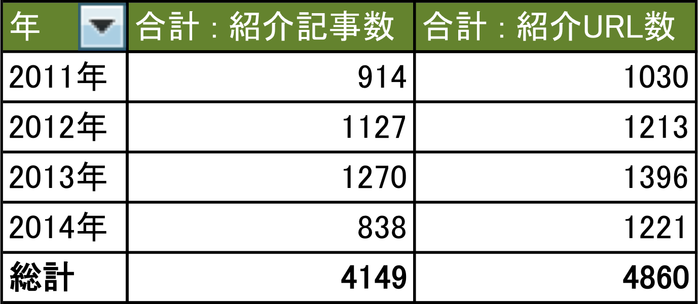
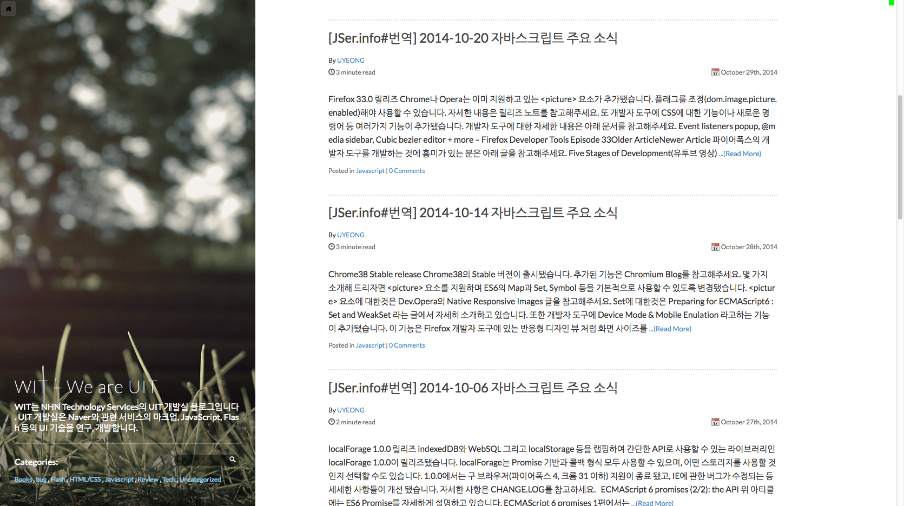
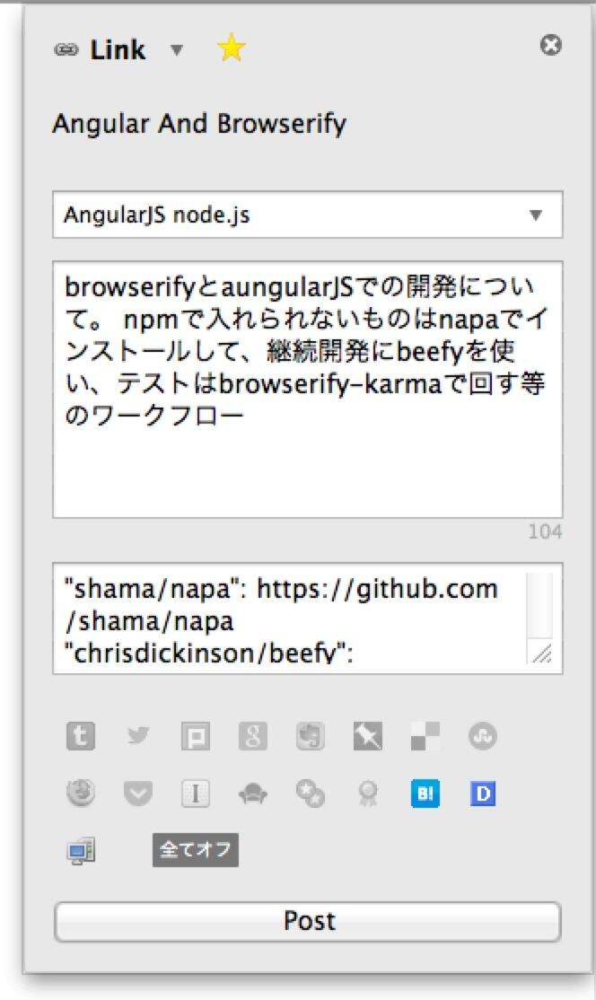
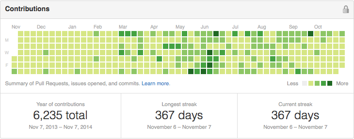

# JSer.info 200 回目記念イベント

----

# 自己紹介


## azu
## @[azu_re](https://twitter.com/azu_re)

----


# 改めてJSer.infoって何?

- 世界のJavaScriptについて週一で書くブログ
- 2011年1月16日 開始　


----

# 始めた目的

- Webの流れが早くなってる、情報量が膨大
- 海外には[JavaScript Weekly](http://javascriptweekly.com/ "JavaScript Weekly: A Free, Weekly Email Newsletter")や[DailyJS](http://dailyjs.com/ "DailyJS: A JavaScript Blog")があった
- 日本にも週間でJS情報をまとめてくれるサイトが欲しい
- => ないので作る

----

# これまでのJSer.info

### 紹介してきた記事数とURL数

----

# 記事数とURL数


^ 紹介してきた記事数 = それぞれの記事の数
^ 紹介してきたURL数 =  記事の数 + 関連リンクの数

----

# 2011年から2014年(10月)まで



----

# 記事数とURL数の遷移


---


---

# 記事数とURL数の遷移


- [2013年12月31日](http://jser.info/post/71734160602/2013-12-31-js-jshint-2-4-0-koa-selenium-builder/ "2013-12-31")から記事毎に関連URLを追加しだした
- 関連URLを入れてから記事数自体は少し減ってる
- 代わりに関連するURLの記載が増えてる
- 一つの記事についての情報量を増やす目的

----

# 最近のできごと



- GitHub Pagesに移行した
	- [JSer.infoをTumblrからGitHub Pagesに移行しました - JSer.info](http://jser.info/2014/08/03/renewal/ "JSer.infoをTumblrからGitHub Pagesに移行しました - JSer.info")
- [韓国語訳](http://wit.nts-corp.com/ "WIT - We are UIT")ができた
	- Thanks [Ju U-Yeong](https://twitter.com/coderifleman)

----

# 継続性について

^ 今日の本題。
大体200回記念イベントなので、どうやって継続してきたかについて考えてきました。

----

# Weeklyサイトの廃り流行り

- [Meta Weekly](http://azu.github.io/Meta-Weekly/ "Meta Weekly")
- 週間等で更新してるブログをまとめたサイト
- 一時流行ったけど継続してるサイト、してないサイトがある
- ここに載せたサイトの1割ぐらいは更新が止まった
	- [一定期間載せるか検討](https://github.com/azu/Meta-Weekly/issues/13 "Stack list · Issue #13 · azu/Meta-Weekly")してから載せてるので以外と少ない

^以前、[定期更新されるJavaScript等の情報サイトをまとめたMeta-Weeklyというサイト](http://efcl.info/2013/0825/res3409/ "定期更新されるJavaScript等の情報サイトをまとめたMeta-Weeklyというサイト")を作っていて、
JSer.infoのように定期的に更新されるブログやメールマガジンをまとめています。

^しかし、ここの載った1-2割ぐらいは更新が止まってる。
メールマガジン系([Cooper Press](https://cooperpress.com/ "Cooper Press")は商業)は以外と継続率高い。
コミットをまとめる感じのWeekly系は結構消失しやすい傾向がある。

-----

# 継続性

> 更新コストを小さくして、継続できる形を作る
> 開始するときにまず2年間は続けると決めた
-- [JSer.info 1年を迎えて](http://azu.github.io/slide/offline_study/jser_info.html#slide5 "JSer.info 1年を迎えて")

----

# 継続性とコスト

- (前提) 元から情報を集めるのは趣味
- これに 加える形で JSer.info を更新している
- どれだけ加えるコスト = 更新コスト を小さくするか
- 更新コストが小さいほど、継続しやすい
	- コストをコストと感じないように小さくする

^ 情報を集めるコストが一番高いけど、
それは元々なのであまり考えない。
重要なのは心理的にコストが大きくならないように、
一度に作業しないで作業を小さく分けてコストを感じない程度の大きさで処理していく事が大事だと思ってる。
そのために次のようなワークフローを取ってる

----

# 更新ワークフロー

1. 記事を読む
2. [TombfixBuild](https://github.com/tombfix/core "TombfixBuild")でメモ付きでブックマーク
3. 一週間ぐらい1,2を繰り返しで**紹介記事のデータ**を貯める
4. 貯めたアーカイブを整形
5. 整形した記事をコピペ(微修正、ピックアップを選ぶ)
6. 1へ戻る

----

# 更新ワークフロー

## [2年前](http://azu.github.io/slide/offline_study/jser_info.html#slide8)と基本は変わってない

----

# 1. 記事を読む

- 3000弱のRSSフィードを読む簡単なお仕事です
- 800個ほどのGitHubリポジトリをWatchする簡単なお仕事です
- 続きは次のスライドで

^ RSSで購読してるのは今までどおり。
LDRが終了の撤回してよかった。
去年あたりからGitHubのリリースをどう追うべきかを色々考えて、色々Watchする仕組みを作ってきた。
詳細は[次のスライド](http://azu.github.io/slide/jser200/javascript-2014.html)ではなします。

-----

# 2. Tombfixでメモ+ブックマーク



## はてブするのと同じ

----

# 3. 一週間ぐらい1,2を繰り返し

## **紹介記事のデータ**を貯める

----

# 紹介記事データ

- ブクマしたデータはJSONに変換してGitHubにpushされる
- [jser/jser.info](https://github.com/jser/jser.info/ "jser/jser.info")にpushされたデータをTravis CIでLintする
- 副作用 = GitHubが芝ができやすい



----

# 記事の更新


- 貯めた記事をコピペするだけの簡単なお仕事です

```
4. 貯めたアーカイブを整形
5. 整形した記事をコピペ(微修正、ピックアップを選ぶ)
6. 1へ戻る
```


-----

# 記事の更新

- 紹介記事データは[JSer.infoビューア](http://jser.info/jser.info/ "JSer.infoのアーカイブ")で見られる
- [JSer.infoビューア](http://jser.info/jser.info/ "JSer.infoのアーカイブ")で紹介したい記事を選ぶ
- Markdownを作ってくれるので、コピペ!
- ピックアップの紹介を書いたらPublish!
- 実質的な更新コスト = ピックアップ紹介を書く

----

# 更新フローの穴

----

# 更新フローの穴

- 更新までにまともなチェック機構が入ってない!
- 誤字脱字が多い!
	- 更新後に毎回 `fix typos` というPull Requestをマージ!
	- Thanks @[syoichi](https://github.com/jser/jser.github.io/commits?author=syoichi "Commits · jser/jser.github.io")

----

# 今後改善していきたい

- Travis CIのチェックに構文だけじゃなくて日本語をチェック
- 事前編集をもっと楽にして、typoを減らしたい

^ このスライドを書いたのは10月の初めで、
この時はまだなかったのですが、最近JSer.info用のエディタアプリを作った

----
# 今後改善していきたい

- Travis CIのチェックに構文だけじゃなくて日本語をチェック
- ~~事前編集をもっと楽にして、typoを減らしたい~~
	- => エディタアプリを作った


----

# [JSer.info Editor](https://github.com/jser/jser.info-editor "jser/jser.info-editor")


- [WEB+DB PRESS表記ルール](https://gist.github.com/inao/f55e8232e150aee918b9 "WEB+DB PRESS表記ルール")を使った用語統一
	- そのままだと不便なルールがあるので[独自辞書](https://github.com/azu/technical-word-rules "辞書")
- [node-webkit](https://github.com/rogerwang/node-webkit "node-webkit")を使ったアプリ
- 詳細は[WEB+DB PRESS用語統一ルール等を使った技術用語のLintをするCodeMirrorアドオンを書いた](http://efcl.info/2014/10/20/lint-tech-word/ "WEB+DB PRESS用語統一ルール等を使った技術用語のLintをするCodeMirrorアドオンを書いた | Web Scratch")

----

# まとめ

- マイナーチェンジはありつつ JSer.info は続いています
- 2011年01月16日から3年半以上 = 1,385日!
	- 1週も欠けることなく毎週投稿中 :recycle:
- 継続には更新コストについて常に考えることが大事！


----

# 質問

-----

# つづく

## [世界のJavaScriptを読もう @ 2014](http://azu.github.io/slide/jser200/javascript-2014.html "世界のJavaScriptを読もう @ 2014")