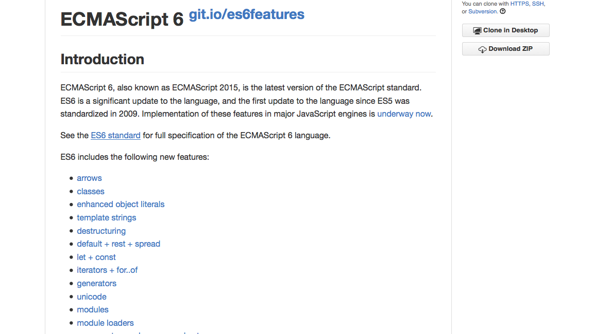
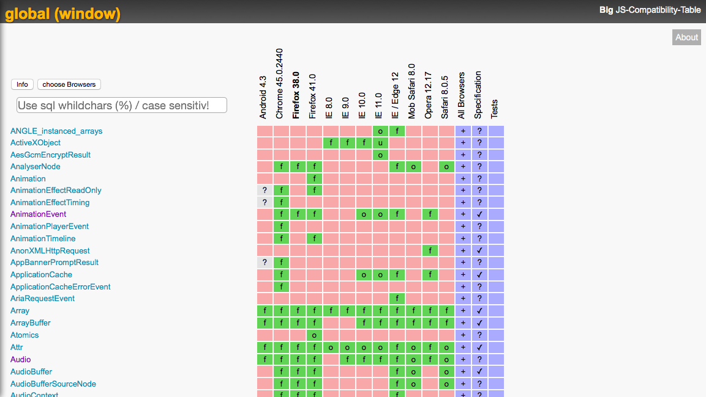
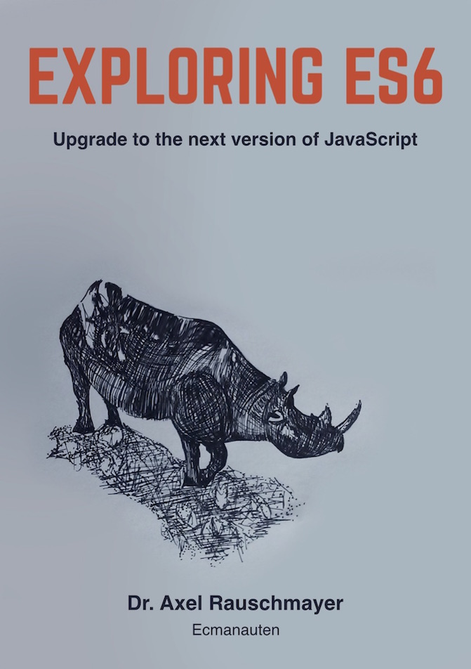
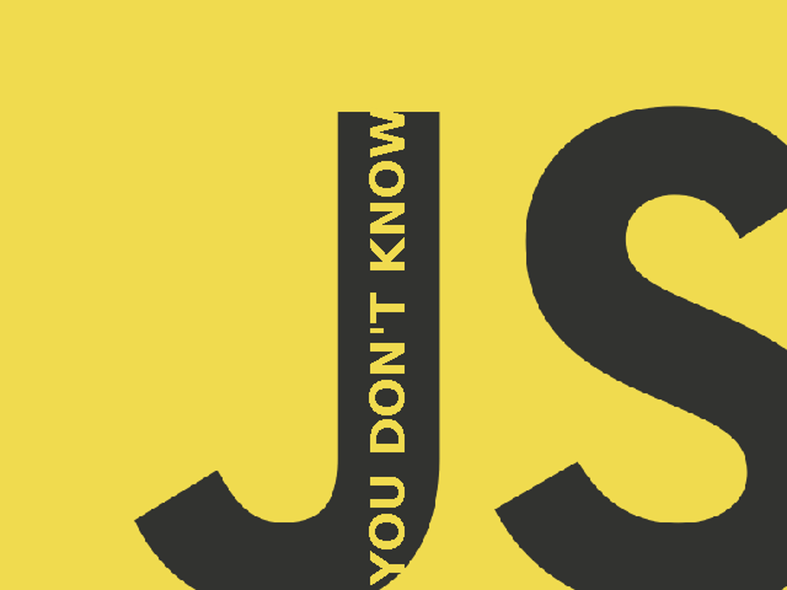

# どうやってECMAScript 6を学び始めるか

^ 自分でちゃんと見て読んで大丈夫というものしか出してないので、かなり最小限の紹介です。

-----


^ azuです。JSer.infoなどをやっています。
ES6的にはPromise本を書いたり、日本のISO/IEC JTC 1 SC22でES6のレビューに参加してます。

----

# ECMAScript 5を知る

^ ES6の話をする前にES5の話です。

-----

# ES6 の前に ES5 大丈夫?

- Property Descriptor
- Object.create()
- Strict Mode
- [Thinking About ECMAScript 5 Parts - Tech.pro](http://tech.pro/tutorial/1671/thinking-about-ecmascript-5-parts "Thinking About ECMAScript 5 Parts - Tech.pro")

^ ES5はマイナーアップデート的な感じなので増えた機能としてはそこまで多くはありませんが、`Object.defineProperty`などかなり重要な機能が増えています。

-----


# [Speaking JavaScript](http://speakingjs.com/ "Speaking JavaScript")


^ Dr.Axelが書いたES5についての書籍。
オンライン版は無料で読めて、とても良くまとまっている。

-----

# なぜ ES5 が大事か?

- (恐らく)学ぶ過程で[Babel](http://babeljs.io/ "Babel")のようなTranspilerに手を出してしまう
- TranspilerはES5の機能を使いきって実装されている
- [JavaScript Transformation - JSConf 2015 // Speaker Deck](https://speakerdeck.com/sebmck/javascript-transformation-jsconf-2015 "JavaScript Transformation - JSConf 2015 // Speaker Deck")

^ ES5の機能が分かってないとTranspilerを使うときに誤解する可能性があります。
TranspilerはES6の機能をES5の機能で実現するために変換しているので、ES5で実現不可能だったり、ただの似たような機能であるため、まずはベースとなるES5が重要であると言えます。


-----

# ES6の概要を知る

^ やっとES6 を学ぶフェーズに入ります。


-----

# [WEB+DB PRESS Vol.87](http://developer.cybozu.co.jp/tech/?p=9081 "WEB+DB PRESS Vol.87")


^ まずは @teppeis さんが書いてるES6特集。
まだ日本語でのES6全体についてまとまってる文章は少ない印象です。

-----

# [git.io/es6features](https://github.com/lukehoban/es6features "git.io/es6features")



^サクッとES6の機能の概要を見たい場合はes6festuresというリポジトリを見るのが簡単です。

----

# 実行環境

^ 文章を読んだけで理解するのはまず無理です。
ES6はまだ承認されたばかりですが、大部分は既に動かす手段が用意されています。

----

# 実行環境を揃える

- Browser(JavaScriptエンジン)
	- MSEdge、Firefox、Chrome、Safari(Webkit JSC)
- Babel(Transpiler)

^ 実行環境としてブラウザを始めとしたJavaScriptエンジンがネイティブに実装している場合はそちらを利用して学ぶことを推奨します。
もう一つはまだ実装してないブラウザでも動くようにBabelのようなTranspilerを使うことです。

----

# Browserへの実装状況

^現在のブラウザの実装状況はどこで見られるか?という話です

----

# [ECMAScript 6 compatibility table](http://kangax.github.io/compat-table/es6/ "ECMAScript 6 compatibility table")


^ 定番: ある機能のブラウザやTranspilerで実装されているかを一覧できるサイトです

----

# [Big JS-Compatibility-Table](http://compatibility.shwups-cms.ch/en/home? "Big JS-Compatibility-Table")



^ 補足: DOMオブジェクトにあるプロパティがあるかどうか、またそのプロパティのtypeof何かを一覧できます。

----

# Status Page

- それぞれのブラウザ持ってる実装ステータスページ
- [The WebKit Open Source Project - Web Platform Status](http://www.webkit.org/status.html)
- [Developer Resources : MSEdge Dev](http://dev.modern.ie/platform/status/)
- [Chromium Dashboard](https://www.chromestatus.com/features)


----

# Transpilerを使う前に

^ 先ほどTranspilerを使うことで実行環境の補完ができると言いましたが、ひとつ気をつけることがあります。

----


[JavaScript Transformation - JSConf 2015](https://speakerdeck.com/sebmck/javascript-transformation-jsconf-2015 "JavaScript Transformation - JSConf 2015 // Speaker Deck")

^ Babelの作者であるsebmckもTranspilerは完全に再現できないケースがあるので、Transpiler**のみ**で言語機能を学ぶのはやめようといっています。

----


# Transpiler is not Learning Tool


- 次の分類が何を基準にしてるか分からない場合はTranspilerで学ぶのは危険が伴う


-----

```
╔═══════════════════════╤═════════════════════╗
║           A           │          B          ║
╠═══════════════════════╪═════════════════════╣
║ Math Extension        │ SubClassing         ║
╟───────────────────────┼─────────────────────╢
║ spread (...) operator │ Proxy               ║
╟───────────────────────┼─────────────────────╢
║ Map                   │ WeakMap             ║
╟───────────────────────┼─────────────────────╢
║ Set                   │ WeakSet             ║
╟───────────────────────┼─────────────────────╢
║ Promise               │ Symbol              ║
╟───────────────────────┼─────────────────────╢
║ Template Strings      │ Temporary Dead Zone ║
╟───────────────────────┼─────────────────────╢
║ .......               │     .....           ║
╚═══════════════════════╧═════════════════════╝
```	


^ 結構適当に並べていますが、AはTranspilerやPolyfillで再現できる機能できそうな機能で、Bはどうやっても無理という機能で分けたものです。

-----

# :beginner: ES6を学ぶ前に

- ES5がわからない
	- => ES5を学ぶ
- Transpilerの動作原理がわからない
	- => ブラウザが対応してる機能を優先して学ぶ
- Transpilerがではできないことも理解してる
	- => 容量用法を持って正しく使いましょう

^ Transpilerでは実現が不可能な機能もあります。
そのため、まずはその下地となるES5について学ぶべきです。
Tranpilerの動作原理、実現不可能な機能をあやふやな状態でTranspilerを使って学んでしまうと間違ったことを覚えてしまう危険性があります。
その場合はまずはブラウザがネイティブで実装している機能を優先して見るといいと思います。

-----

# ES6を学ぶ

^ ES6 と一言にいっても結構幅広いです。
そのため全体を眺めてみて、気になるところから学んで見るのがいいと思います。まだ使うことができない(実装がない)機能もあるので全てを網羅するには仕様を読んで理解する必要や、ブラウザへコミットする必要があるでしょう。

----


# [es6-features.org](http://es6-features.org/)


^ 簡単に機能を一覧できます。
Transpilerでできるかどうか = ES5でも可能かどうかなので、そういうことを把握するのに便利です。

----

# [Exploring ES6](http://exploringjs.com/ "Exploring ES6")



^ Dr.AxelによるES6についての書籍です。
2015-06-26現在もっと良いES6の書籍だと思います。

----

# [getify/You-Dont-Know-JS](https://github.com/getify/You-Dont-Know-JS "getify/You-Dont-Know-JS")



^ getify氏のYou Don't Know JSシリーズ
^ 仕様や議論についても拾っているので、読んでいて発見がある

----

# ES6を書く

----

# [tower-of-babel](https://github.com/yosuke-furukawa/tower-of-babel "yosuke-furukawa/tower-of-babel")


^ @yosuke_furukawa によるBabelを使ったES6エクササイズツールです。
とりあえず書いてみるのにいいと思います。


----

# 書く

- [Learn ES2015 · Babel](http://babeljs.io/docs/learn-es2015/ "Learn ES2015 · Babel")
- [ライブラリをES6で書いて公開する所から始めよう](http://efcl.info/2015/01/09/write-es6/ "ライブラリをES6で書いて公開する所から始めよう")
- [NW.js](http://nwjs.io/ "NW.js")や[Electron](http://electron.atom.io/ "Electron")で動くアプリを書く
	- io.js(V8)が入ってる

^ 現在ブラウザは実装中なので、全てのブラウザで動かすように書くのは面倒です(Transpilerを使う必要があります)
NW.jsやElectronといったJavaScriptでアプリを書ける仕組みを使えば、特定の環境だけで動かせるので学ぶために書くのには簡単で便利です。

----

# 仕様を読む


----

# [Standard ECMA-262](http://www.ecma-international.org/publications/standards/Ecma-262.htm "Standard ECMA-262")

^ ECMAScriptの仕様書です。PDFとHTMLで読むことができます。

----

# [ECMAScript仕様書を読む · Issue #47 · azu/azu](https://github.com/azu/azu/issues/47 "ECMAScript仕様書を読む · Issue #47 · azu/azu")

^ 自分も今読んでいるので、このIssueに関連する情報を投げています。

----

# [ECMAScript 6ドラフトのDiff検索用リポジトリを作った | Web Scratch](http://efcl.info/2015/05/07/es6-draft-search/ "ECMAScript 6ドラフトのDiff検索用リポジトリを作った | Web Scratch")

^ ES6は出るまでにRev38(39がリリース)もバージョンがあります。
それらの途中での変更点を追う方法について書いた記事です。

-----

# :arrow_forward: ECMAScript Next 

^ ES6は既に承認されました。次のECMAScriptについても平行して話しあわせています。ここではES Nextと呼びます。

----

# プロポーサル一覧

- [tc39/ecma262](https://github.com/tc39/ecma262 "tc39/ecma262")
- [Stage 0 Proposals](https://github.com/tc39/ecma262/blob/master/stage0.md "Stage 0 Proposals")
- [ecmarkup](https://github.com/bterlson/ecmarkup "ecmarkup")でプロポーサルを書き、GitHubに置く
	- + [ES Discuss](https://esdiscuss.org/ "ES Discuss")
	- 議論の場所を議論中: [Move es-discuss to discuss.webplatform.org?](https://esdiscuss.org/topic/move-es-discuss-to-discuss-webplatform-org "Move es-discuss to discuss.webplatform.org?")

^ ES Nextに関連するプロポーサル(仕様への提案)はGitHubでまとめられています。
4段階のStageがあり、どのプロポーサルがどのStageにいるかなどが書かれています。
これらのプロポーサルへPull Requestをすることも可能です。

----

# [tc39/tc39-notes](https://github.com/tc39/tc39-notes/ "tc39/tc39-notes")

- ECMAScriptを作成する委員会(TC39)のミーティングノート
- 大体3ヶ月に1度開催
- [#TC39MTG](https://tc39-mtg.doorkeeper.jp/ "TC39 MTG Notes MTG | Doorkeeper")で一人読書会をやってます
- ミーティングに参加してないけどコミットしてる 


----

# [明日には使えなくなるES7トーク](http://azu.github.io/slide/es6talks/ "明日には使えなくなるES7トーク")

- 賞味期限 まで 後
- ES7以降の仕様策定の流れ
- Stageって何か?

-----


# まとめ

- [WEB+DB PRESS Vol.87](http://developer.cybozu.co.jp/tech/?p=9081 "WEB+DB PRESS Vol.87")で概要を把握
- [es6-features.org](http://es6-features.org/)で簡単にどんな機能が増えたのかを見る
- [tower-of-babel](https://github.com/yosuke-furukawa/tower-of-babel "tower-of-babel")で実際に書いてみる
- もっと深く知りたい場合は[Exploring ES6](http://exploringjs.com/ "Exploring ES6")を読む
