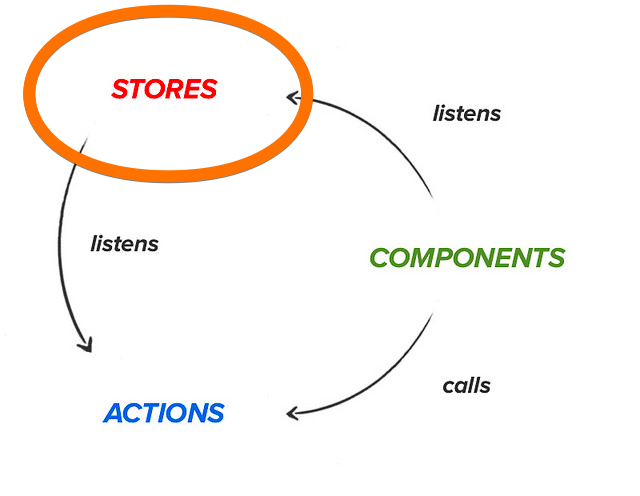
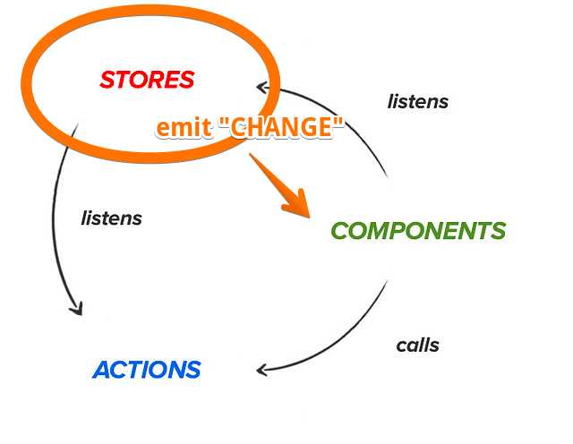
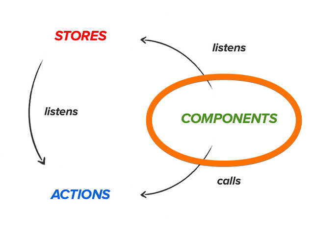
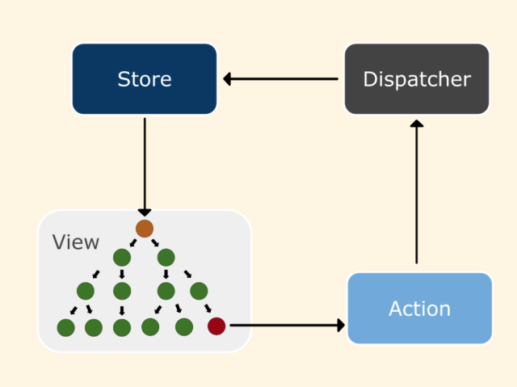

# 10分で実装するFlux

----

# 自己紹介


## azu
## @[azu_re](https://twitter.com/azu_re)
###  [Web scratch], [JSer.info]


[Web scratch]: http://efcl.info/ "Web scratch"
[JSer.info]: http://jser.info/ "JSer.info"


----


# [Flux](http://facebook.github.io/flux/ "Flux")

## /flˈʌks/

----

# Fluxとは

- Facebookが提唱したSmalltalk MVCの焼き直し
- CQRS(Command Query Responsibility Segregation)と類似
- データが一方通行へ流れるようにするアーキテクチャ
- ウェブUIについてそれを適応する

----


# 今日の目的

- 小さなFluxの実装を作りながらFluxついて学ぶ
- Fluxの特徴: Unidirectional data flow
	- 本当にデータが一方通行に流れるのかを確認する


-----


----
# Fluxでよく見る図


----

# 登場人物

- 何か色々いる
	- Action Creators, Dispatcher, Store, React Views...
	- Dispatcher = EventEmitterと今回は考える
- もっと実装的な視点から見てみる


----


----

# 実装イメージ

- Action、Store、Component(React)の3つが存在
- それを繋ぐのが**EventEmitter**(or Dispatcher)


----

# 実装イメージ


 - **Store**は**Action**をlisten
	 - -> Actionが持つEventEmitterを監視
 - **Component**は**Action**をcall
	 - -> ActionがEventを発行
 - **Component**は**Store**の変更をlisten
	 - -> Store自身がEventEmitter


----

# Fluxを実装してみよう

- Fluxを実装しながら小さなアプリを作ってみる
- クリックしたら、カウントが増えるだけのアプリ


----

# EventEmitter


-----

# EventEmitter

- イベントリスナの登録/処理ができるモジュールを作る
- `#on` : イベント`type`に対してコールバックの登録
- `#emit`: イベント`type`に登録されたコールバックの実装
- `#off` : イベント`type`に対してコールバックの登録解除

-----

# EventEmitter.js

```js
export default class EventEmitter {
    constructor() {
        this._handlers = {};
    }
    on(type, handler) {
        if (typeof this._handlers[type] === 'undefined') {
            this._handlers[type] = [];
        }
        this._handlers[type].push(handler);
    }
    emit(type, data) {
        var handlers = this._handlers[type] || [];
        for (var i = 0; i < handlers.length; i++) {
            var handler = handlers[i];
            handler.call(this, data);
        }
    }
}
```

----

# EventEmitter

- EventEmitterでStoreとAction、StoreとComponentを繋ぐ
- いわゆるオブザーブパターンに使う
- [facebook/flux](https://github.com/facebook/flux "facebook/flux")ではDispatcherが一部この役割を持ってる
	- EventEmitter自体も合わせて使ってる


----

# Dispatcher?

- Facebookの[flux](http://facebook.github.io/flux/ "Flux")モジュールが唯一提供してる機能
- EventEmitterに順序制御をつけたもの と理解
- 基本的にシングルトンで利用する事を意図したデザイン
- 今回は単純にしたかったのでEventEmitterだけで

----

# Store



----

# Store

- モデルみたいなもの
- あるイベントがやってきたら、State(内部の状態)を更新する
	- イベントを経由しない書き込みを制限する
- `get*`的なメソッドで外からStateを取れるようにする
- StoreはEventEmitterを継承する

-----

```js
import Emitter from "./EventEmitter"
export default class Store extends Emitter {
    constructor(dispatcher) { // dispatcherを受け取る
        super();
        this.count = 0;
        // <--- observe event.
        dispatcher.on("countUp", this.onCountUp.bind(this));
    }
    getCount() { // stateを取り出すメソッド
        return this.count;
    }
    onCountUp(count) {
         // dispatcherがemitされると呼ばれる
    }
}
```

----

# Store

- 内部Stateを更新したら"CHANGE"イベントを発行する
	- 自分自身がEventEmitterのインスタンスなので
	- self emit "CHANGE"  -> Storeに対して`#on`してるものが呼ばれる
	- ComponentからStoreに`#on`することで、ComponentはStoreの変更を監視できる


----




----

```js
import Emitter from "./EventEmitter"
export default class Store extends Emitter {
    constructor(dispatcher) {
        super();
        this.count = 0;
        dispatcher.on("countUp", this.onCountUp.bind(this));
    }
    getCount() {
        return this.count;
    }
    onCountUp(count) {
        this.count = count;
        // emit "CHANGE" ---> self
        this.emit("CHANGE");
    }
}
```


----

# Action(Creator)


----

# Action(Creator)

- あるイベントを発行する関数
	- emit "<ANY EVENT>"
- ユーザーアクションから始まる非同期通信とかもここに

----

```js
export default class ActionCreator {
    constructor(dispatcher) {
        this.dispatcher = dispatcher;
    }
    // "Emit" event ----> Store
    countUp(data) {
        this.dispatcher.emit("countUp", data);
    }
}
```

----

# Component



----

# Componentの役割

- Viewの更新
	- **Store**の変更を監視する(Listen)
	- Storeが自身の変更を"CAHNGE"イベントで伝えてくれる
	- 後はStoreからデータを取ってきて描画すればいいだけ

----

# Componentの役割

- ユーザーイベントの受付 
	- clickされた◯◯するといった動作
	- イベントハンドラで対応する**Action**を呼べば良い

Component -> _(call)_ -> Action -> _(emit)_ ->  Store#onHandler

----




[Introduction To React─ Frontrend Conference](https://html5experts.jp/hokaccha/13301/ "今話題のReact.jsはどのようなWebアプリケーションに適しているか？ Introduction To React─ Frontrend Conference | HTML5Experts.jp") から引用


----

```js
import React from "react"
import ActionCreator from "./ActionCreator"
import Store from "./Store"
import EventEmitter from "./EventEmitter"
// EventEmitterのインスタンスをそれぞれ渡す
var dispatcher = new EventEmitter();
var action = new ActionCreator(dispatcher);
var store = new Store(dispatcher);
export default class Component extends React.Component {
    constructor(props) {
        super(props);
        this.state = {count: store.getCount()};
        // <---- Observe store's change
        store.on("CHANGE", () => {
            this._onChange();
        });
    }
    _onChange() {
        this.setState({count: store.getCount()});
    }
    tick() {
        action.countUp(this.state.count + 1);
    }
    render(){ /* ... */ }
}
```


----

# ボタンをクリックしたらカウントする


----

# Fluxの特徴

- 一方通行のデータフローが形成できること
- ホントに先の実装は一方通行にデータが流れている?
- 実際に検証してみよう :eyes:

----

# プログラムの動作フローを見るには

- コードの動きを見る
- 簡単に見るにはスタックトレースを見れば良い
- スタックトレースには関数が呼び出された順が入ってる
- **`console.trace`** OR デバッガーでブレークポイントを貼る

----

# スタックトレースを見てみる

- スタックトレースは呼ばれた順で積み上がる
- 最後に呼ばれた関数が1番目、その前の関数が2番目 ....
- 一周したところからコールスタックを見るとわかる
- ユーザーアクションをスタートとすると、Componentのアップデートがループの終わり
- => Componentの`_onChange`で取れば良さそう


-----


----

# コールスタックをconsoleへ出力

```js
    _onChange() {
        console.trace();// <= onChangeまでのコールスタックを吐く
        this.setState({count: store.getCount()});
    }

    tick() {
        action.countUp(this.state.count + 1);
    }
```


----


----

# スタックトレース

動画: [demo.mp4](img/demo.mp4)

```
// 上に行くほど新しい
_onChange	@	Component.js:23
(anonymous function)	@	Component.js:18
emit	@	EventEmitter.js:23
onCountUp	@	Store.js:22
emit	@	EventEmitter.js:23
countUp	@	ActionCreator.js:10
tick	@	Component.js:28
// Start
```


-----

# 呼び出しの流れ


```
Component#tick -> Action#CountUp -> Store#onCountUp -> Component#_onChange
```

- Component -> Action -> Store -> Componentへとデータが流れている
- つまり一方通行のデータフローが作成できた！


----

# 今回実装したもの

## [azu/mini-flux](https://github.com/azu/mini-flux "azu/mini-flux")

----


# もっと実装してみる?

- [azu/material-flux](https://github.com/azu/material-flux "azu/material-flux") - 今回mini-fluxをもう少し突き詰めたもの
- [voronianski/flux-comparison](https://github.com/voronianski/flux-comparison "voronianski/flux-comparison")を実装みるのをオススメ
- [flux-comparison app spec( unofficial )](https://gist.github.com/azu/3c69f8521584feed79da "flux-comparison app spec( unofficial )")


----

# まとめ

- 特別なライブラリや複雑な実装がなくてもFluxはできた
- 確かにデータは一方行に流れているのが確認できた
- オブザーブパターンに役割と名前が付いたもの = Flux
- Fluxを理解するにはFluxを実装してみるのが手っ取り早い

-----

# おまけ

-----


# Facebook flux

- Facebookの[Flux](http://facebook.github.io/flux/ "Flux")モジュールはDispatcherという機能のみを提供
- 今回のEventEmitterに順序制御などを加えたもの
	- `waitFor([id])` というメソッドを持ち、発行されたイベントの依存関係を記述できる(Store依存関係に使われる)

----

# なぜシングルトン?

- 確かにシングルトンだと実装は簡単
- けどテストがとても難しくなる = Jestじゃないとつらそう
- mini-fluxも途中までシングルトンで書いてた
- テストが書きにくかったのでシングルトンではなくなった
- [mini-flux/test at master · azu/mini-flux](https://github.com/azu/mini-flux/tree/master/test "mini-flux/test at master · azu/mini-flux")

----

# 非同期処理はどこへ

- ユーザがボタンを押すなどの操作により通信が発生する場合はAction

例)

- FacebookのFlux Chat Example
- https://github.com/voronianski/flux-comparison

----

# 非同期処理はどこへ

逆にユーザーインタラクションを経由しなかったり、通信開始のトリガーが別である場合は、Store内から通信してStoreで完結しても良い

例)

> 1分ごとにサーバに問い合わせて最新のデータを取得して表示したい。
> (StoreからXHRで取得して、Storeが変更されたことを通知する -> Viewの書き換え)


----

# オススメFluxライブラリ

- 決定版はない
- 機能は大差ないので、インターフェースの好みによる
	- デバッグのしやすさとかを考慮すると良さそう
- [kenwheeler/mcfly](https://github.com/kenwheeler/mcfly "kenwheeler/mcfly")
	- [Flux](http://facebook.github.io/flux/ "Flux")の薄いラッパー
- [acdlite/flummox](https://github.com/acdlite/flummox "acdlite/flummox")