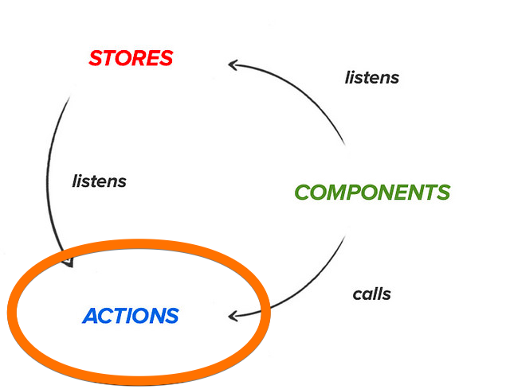

# 10分で実装するFlux

----

# [Flux](http://facebook.github.io/flux/ "Flux")

## /flˈʌks/

----

# Fluxとは

- Facebookが提唱したSmalltalk MVCの焼き直し
- CQRS(Command Query Responsibility Segregation)と類似
- データが一方通行へ流れるようにするアーキテクチャ


| Model | View | Controller |
| Store | Component | ActionCreator(Actions) |

----

# Fluxでよく見る図


----

# 目的

- 小さなFluxの実装を作りながらFluxついて学ぶ
- Fluxの特徴: Unidirectional data flow
	- 本当にデータが一方通行に流れるのかを確認する

----

# 登場人物

- 何か色々いる
	- Action Creators, Dispatcher, Store, React Views...
	- Dispatcher = EventEmitterと今回は考える
- もっと内部的な実装から見てみる


----

# 実装イメージ

- Actions、Store、Component(React)の3つが存在
- それを繋ぐのが**EventEmitter**(or Dispatcher)


----

# EventEmitter


-----

# EventEmitter

- 最低限以下のような実装が存在すればいい
- `#on` : イベント`type`に対してコールバックの登録
- `#emit`: イベント`type`に登録されたコールバックの実装
- `#off` : イベント`type`に対してコールバックの登録解除

-----

# Emitter.js

```js
class EventEmitter {
    constructor() {
        this._handlers = {};
    }
    // イベントの登録
    on(type, handler) {
        if (typeof this._handlers[type] === 'undefined') {
            this._handlers[type] = [];
        }

        this._handlers[type].push(handler);
    }
    // イベントの発火
    emit(type, data) {
        var handlers = this._handlers[type] || [];
        for (var i = 0; i < handlers.length; i++) {
            var handler = handlers[i];
            handler.call(this, data);
        }
    }
}
```

----

# Dispatcher?

- Facebookの`flux`モジュールが唯一提供してる機能
- EventEmitterに優先順序をつけたもの と理解
- 基本的にシングルトンとして利用することを意図したデザイン
- 今回は単純なイベント駆動なのでEventEmitterで

----

# Store


----

# Store

- モデルみたいなもの
- あるイベントがやってきたら、内部データを更新する
	- イベントを経由しない書き込みを制限する
- `get*`的なメソッドで外から取れるようにする
- StoreはEventEmitterを継承する
- 内部データを更新したら"CHANGE"イベントを発行する

----


----

# ActionCreator



----

# ActionCreator

- あるイベントを発行するだけ
	- emit "<ANY EVENT>"
- ユーザーアクションから始まる非同期通信とかもここに

----

# Component


----

# Component

- Viewの更新
	- Storeの変更を監視する(Listen)
	- Storeが自身の変更を"CAHNGE"イベントで伝えてくれる
	- 後はStoreからデータを取ってきて描画すればいいだけ
- ユーザーイベントの受付
	- clickされた◯◯するといった動作
	- DOMイベントを付けて、それに対してActionを呼べばいいだけ！

----

----

# Fluxの特徴

- 一方通行のデータフローが形成できること
- ホントに先ほどのプログラムは一方通行にデータが流れている?
- 実際に検証してみよう :see:

----

# プログラムの動作フローを見る

- コードの動きを見る
- 簡単に見るにはコールスタックを見れば良い
- デバッガーでブレークポイント OR `console.trace`

----

# コールスタックを見てみる

```
// console.traceからさかのぼる
_onChange	@	Component.js:23
(anonymous function)	@	Component.js:18
emit	@	EventEmitter.js:23
onCountUp	@	Store.js:22
emit	@	EventEmitter.js:23
countUp	@	ActionCreator.js:10
tick	@	Component.js:28
// Start
```


-----

# 呼び出しの流れ


```
Component#tick -> Action#CountUp -> Store#onCountUp -> Component#_onChange
```

- Component -> Action -> Store -> Componentへとデータが流れている
- つまり一方通行のデータフローが作成できた！


----

# Facebook flux

- Facebookの[Flux](http://facebook.github.io/flux/ "Flux")モジュールはDispatcherという機能のみを提供
- 今回のEventEmitterに順序制御などを加えたもの
	- `waitFor([id])` というメソッドを持ち、発行されたイベントの依存関係を記述できる(Store依存関係に使われる)


---
---

# 非同期処理はどこへ

- ユーザがボタンを押すなどの操作により通信が発生する場合Action

例)

- FacebookのFlux Chat Example
- https://github.com/voronianski/flux-comparison
 
逆にユーザーインタラクションを経由しなかったり、通信開始のトリガーが別である場合は、Store内から通信してStoreで完結しても良い

例)

> 1分ごとにサーバに問い合わせて最新のデータを取得して表示したい。
> (StoreからXHRで取得して、Storeが変更されたことを通知する -> Viewの書き換え)
