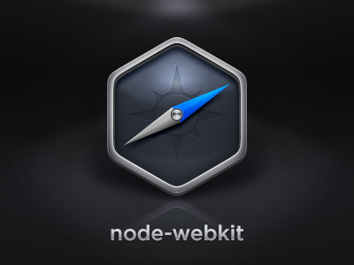

title: node-webkit
author:
  name: azu
  twitter: azu_re
  url: http://efcl.info/
theme: azu/cleaver-ribbon
output: node-webkit.html

--

# node-webkitとは

--

# [node-webkit](https://github.com/rogerwang/node-webkit "node-webkit")

- [zcbenz](https://github.com/zcbenz "zcbenz") (Github)
	- 元々の開発者
	- 今はatom-shellのメンテナー
- [rogerwang](https://github.com/rogerwang "rogerwang") (Intel)
	- 現在[node-webkit](https://github.com/rogerwang/node-webkit "node-webkit")のメンテナー

--

# 何が作れるのか

- HTMLとNode.jsを使ったデスクトップアプリ
- Chromium
    - Webアプリの技術をそのままローカルに持ってこれる
- Node.js
    - nodeのプロセスがそのまま動く
- 何でも入り感

--

# さっと書いてさっと動く

- index.htmlとpackage.jsonがあればとりあえず動かせる
- ロジカルな処理はnode.jsで書く
- 見た目は普通のウェブサイト同じ作り方
- デバッグはChrome DevToolsがそのまま使える

-- 

# OSネイティブの機能

* OSネイティブの機能にも一部触れる
* メニュー、GUI、クリップボード
	* [Native UI API Manual · rogerwang/node-webkit Wiki](https://github.com/rogerwang/node-webkit/wiki/Native-UI-API-Manual "Native UI API Manual · rogerwang/node-webkit Wiki")
* 通知APIがなかったり足りない部分もある

--

# WebViewとして使う

* 既存のウェブサイトをnode-webkitアプリ内に表示する
* 普通にiframeを使って表示できる
	* 普通のiframeだと`X-Frame-Options`で制限されてると表示できない
* `nwdisable`と`nwfaketop`でセキュリティ的な制限を無視出来る
* [Mini browser in iframe · rogerwang/node-webkit Wiki](https://github.com/rogerwang/node-webkit/wiki/Mini-browser-in-iframe "Mini browser in iframe · rogerwang/node-webkit Wiki")

--

# ChromiumとNodeのContext

- ChromiumとNode.js 2つのContextが存在
- Chromium <-> Node.js の行き来は簡単
- ブラウザ拡張の世界に似てる
    - Chrome(特権) <-> Content(通常)

--

# ブラウザ拡張の世界

- Contextの境界は厳密
- Messagingを使った非同期的なやり取りに限定される
- セキュリティのため、Content -> Chromeは触ったりできない
- 逆も普通は制限されてる

--

# node-webkitのContextは緩い

- ChromiumとNode.jsのContextは実行時に決まる
- ChromiumのContextから呼ばれたコードはChromium Context
- Node.jsのContextから呼ばれたコードはNode.js Context
- Context同士に値の受け渡しが出来る(両方共ある意味特権)

--

# ややこしいContext

- ChromiumのContextから`require`されたコードはChromium Context
	- さらにそこから`require`されたコードはNode Context!!
- `<script>`(C) -> `require`(C) -> コード(Node Context)
- => Contextは呼び出し元に依存する `this` に似てる?

--

# node-webkitのcontextの例

--

# Contextによる違い

- `require` による解決パスの違い
	- htmlからか、js(node style)からなのかが変わる…
- 触れるグローバルオブジェクトの違い
    - `document`、`__dirname` の有無

--

# Contextの違いを意識する

- 簡単にContextが混ざってしまいがち
- index.js のパターン
	- 見た目以外は極力Node.jsのContextで処理させる
	- [azu/node-webkit-index-pattern](https://github.com/azu/node-webkit-index-pattern "azu/node-webkit-index-pattern")
- `node-main` で最初からnode.jsのContextで実行する

--

# Contextの違いを利用する

- ブラウザ向けライブラリはChromium Contextに読み込む
- Node.js向けライブラリはNode.js Contextで読み込む
- 特別な変換なしにあらゆるJavaScriptライブラリが使える
- グローバルに足りないものは[ワークアラウンド](https://github.com/azu/github-reader/blob/master/app/node-webkit/workaround.js " workaround.js")でごまかせる豪快さ

--

# node-webkitからウェブへ

- Contextを分けて書く
- Chromium + Node.jsにコード分ける
- Chromiumはブラウザ向けに実装し直す
- Node.jsのコードをBrowserifyで変換する
- コードが再利用できそう

-- 

# まとめ

* ホビー用途にはものすごく向いてる
	* フロントエンドの知識がそのまま持ってこれる
	* npmがそのまま使える
	* クロスプラットフォーム対応が簡単
* Contextの違いを理解するのが大切
* 大きいアプリを作る場合は[atom-shell](https://github.com/atom/atom-shell "atom-shell")など別のアプローチも考える
	* atom-shellはContextはNodeだけ
	* [Technical differences to Node-Webkit](https://github.com/atom/atom-shell/blob/master/docs/development/atom-shell-vs-node-webkit.md "Technical differences to Node-Webkit")